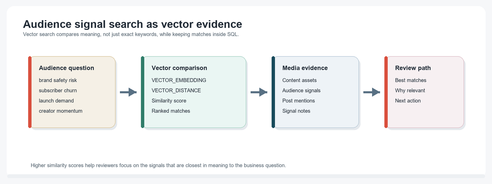
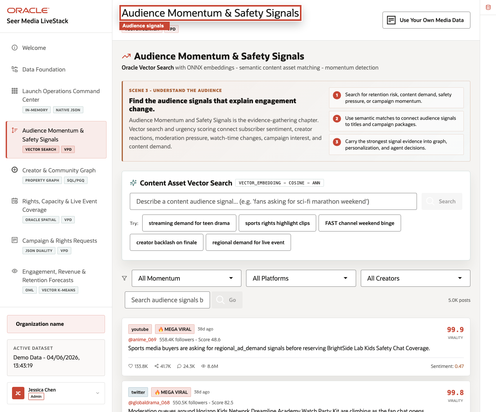

# Audience Signal Intelligence with AI Vector Search

## Introduction

Audience analysts often search in business language: "sports rights highlight clips," "creator backlash on finale," or "regional demand for live event." Exact keyword search can miss useful matches when the audience language and the content catalog use different words.

This lab uses **AI Vector Search** to compare meaning inside Oracle Database. The same content assets, audience signals, and embeddings remain connected to governed media records, so search results can be reviewed with SQL instead of treated as hidden prompt output.

<details>
<summary><strong>Key terms: embedding, vector, vector distance, and similarity score</strong></summary>

> - An **embedding** is a numeric representation of text meaning. Content descriptions and audience-signal text can be embedded so similar ideas are near each other in vector space.
>
> - A **vector** is the stored numeric value produced by an embedding model. In this workshop, PRODUCT_EMBEDDINGS and POST_EMBEDDINGS hold vectors tied to source media rows.
>
> - **Vector distance** measures how far two vectors are from each other. Lower distance means closer meaning.
>
> - A **similarity score** is often calculated as 1 - VECTOR_DISTANCE(...). Higher similarity is better, but decimal values may vary slightly by environment and model.

</details>


The image below is the Audience Momentum & Safety Signals screen from the Seer Media application. It shows how audience signals are grouped, searched, and reviewed when content demand or brand-safety pressure changes. The SQL in this lab uses vector search to explain how semantic matches can support that same review path.



### Objectives

- Explain how vectors support meaning-based media search.
- Search content assets with an embedded business phrase.
- Review the audience signals tied to high-momentum content.

Estimated Time: **10 minutes**

### Business Scenario

| Step | Media focus |
| --- | --- |
| Business Problem | Audience teams need to find content assets by intent, not only exact catalog keywords. |
| Technical Challenge | Embeddings and search results must stay connected to source content and audience records. |
| Persona Focus | Audience analysts search by meaning; database developers show the SQL evidence behind the match. |
| What You Will See | Vector search ranks content assets related to an audience phrase. |
| Database Capability | VECTOR_EMBEDDING, VECTOR_DISTANCE, and vector columns run inside Oracle Database. |
| Outcome | Analysts can use semantic search while keeping results reviewable and governed. |

Persona focus: You are the audience analyst looking for content and signals that match a business intent, and you need results that can be explained with database evidence.

## Task 1: Search content assets by meaning

Start with a phrase a media analyst might type into the application.

1. Run this vector search query:

    > **SQL Worksheet reminder:** Need a reminder on how to open and use the SQL Worksheet? Return to [Getting Started Task 2: Open SQL Worksheet](/workshops/sandbox/index.html?lab=getting-started#Task2:OpenSQLWorksheet) for the step-by-step graphic showing where to paste and run SQL statements.

    You are asking the database to compare the meaning of a search phrase with content-asset descriptions. VECTOR_EMBEDDING turns the phrase into a vector. VECTOR_DISTANCE compares that query vector with stored vectors in PRODUCT_EMBEDDINGS. The expression 1 - VECTOR_DISTANCE(...) turns distance into a similarity score where higher is better.

    ```sql
    <copy>
    SELECT p.product_name AS content_asset,
           b.brand_name AS studio_or_label,
           p.category AS content_category,
           ROUND(1 - VECTOR_DISTANCE(
             pe.embedding,
             VECTOR_EMBEDDING(ADMIN.ALL_MINILM_L12_V2 USING 'sports rights highlight clips' AS DATA),
             COSINE
           ), 4) AS similarity_score
    FROM product_embeddings pe
    JOIN products p ON p.product_id = pe.product_id
    JOIN brands b ON b.brand_id = p.brand_id
    ORDER BY VECTOR_DISTANCE(
      pe.embedding,
      VECTOR_EMBEDDING(ADMIN.ALL_MINILM_L12_V2 USING 'sports rights highlight clips' AS DATA),
      COSINE
    )
    FETCH FIRST 3 ROWS ONLY;
    </copy>
    ```

    **Expected output: Content Semantic Matches**

    | Content Asset | Studio Or Label | Content Category | Similarity Score |
    | --- | --- | --- | --- |
    | Championship Highlights Rights | SportsCast Plus | Sports Rights | 0.6725 |
    | The Last Laugh Track Sports Highlights Rights | EchoVerse Audio | Sports Rights | 0.6176 |
    | Midnight Harbor Sports Highlights Rights | Civic Stream | Sports Rights | 0.5752 |

2. Interpret the match.
    The match is not limited to exact words in the search phrase. It ranks content descriptions by meaning while preserving the link to the source content asset, studio or label, and category.

## Task 2: Review audience signals connected to content

Now inspect signals behind content momentum.

1. Run this signal review query:

    You are joining vector-search context back to audience signals. A bridge table, POST_PRODUCT_MENTIONS, connects an audience signal to the content asset it mentions. A bridge table connects an event, signal, document, order, claim, case, or asset to the business object it mentions.

    ```sql
    <copy>
    SELECT mas.audience_signal_id,
           mas.platform,
           mas.creator_handle,
           mca.content_asset,
           mas.momentum_flag,
           mas.virality_score,
           SUBSTR(mas.audience_signal_text, 1, 90) AS signal_excerpt
    FROM media_audience_signals_v mas
    JOIN post_product_mentions ppm
      ON ppm.post_id = mas.audience_signal_id
    JOIN media_content_assets_v mca
      ON mca.product_id = ppm.product_id
    WHERE mas.momentum_flag IN ('viral','mega_viral')
    ORDER BY mas.virality_score DESC
    FETCH FIRST 3 ROWS ONLY;
    </copy>
    ```

    **Expected output: Audience Signal Review**

    | Audience Signal Id | Platform | Creator Handle | Content Asset | Momentum Flag | Virality Score | Signal Excerpt |
    | --- | --- | --- | --- | --- | --- | --- |
    | 69 | youtube | @anime\_069 | BrightSide Lab Kids Safety Chat Coverage | mega\_viral | 99.9 | Sports media buyers are asking for regional\_ad\_demand signals... |
    | 68 | twitter | @globaldrama\_068 | Dreamline Academy Watch Party Kit | mega\_viral | 99.8 | Moderation queues around Horizon Kids Network... |
    | 67 | tiktok | @family\_067 | Festival Social Amplification | mega\_viral | 99.7 | Premium bundle demand for Festival Social Amplification... |

2. Explain the business value.
    Vector search helps the analyst find related content by meaning. The drill-through query shows why the result matters: it points to creator, platform, signal language, virality, and content context that a media team can review.

## Acknowledgements

* **Author** - Oracle LiveLabs Team
* **Contributor** - Oracle Database Product Management
* **Last Updated By/Date** - Oracle Database Product Management, July 2026

