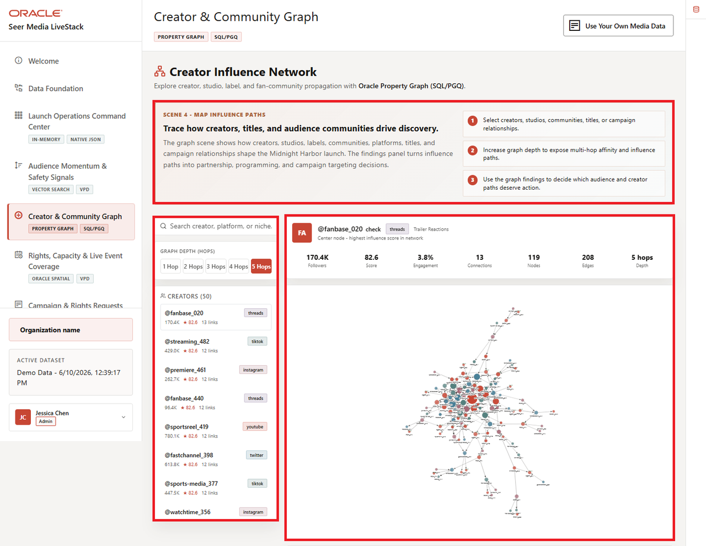
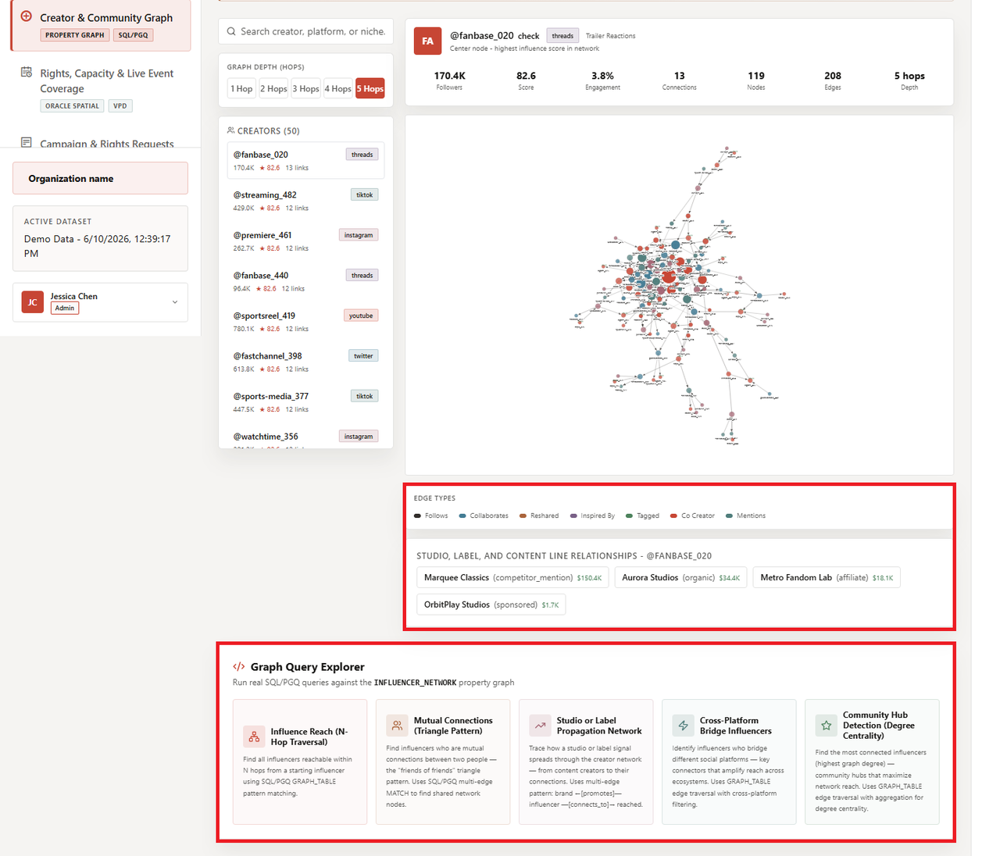
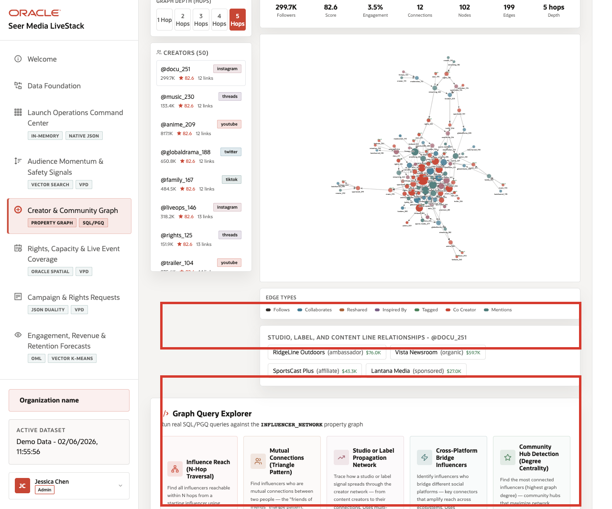

# Lab 5: Creator and Community Graph with Property Graph

## Introduction

Launch teams do not only care about one creator score. They care about connected reach: who bridges audiences, who amplifies a campaign, and which communities can move attention across platforms. This lab shows how **Media LiveStack** treats those relationships as graph evidence instead of isolated metrics.

### Operating Story

| Step | Creator-network focus |
| --- | --- |
| Business Problem | Media teams need to see connected influence paths, not just isolated creator metrics. |
| Technical Challenge | The stack must expose multi-hop relationship context without copying creator and community data into a separate graph database. |
| Persona Focus | Creator strategy lead, community analyst, data architect, or platform engineer. |
| What You Will Prove | Oracle Property Graph can surface creator hubs and influence paths from the same governed Media schema. |
| Database Capability | Property Graph, graph tables, and `GRAPH_TABLE` SQL/PGQ queries. |
| Outcome | You prove that connected creator influence is easier to reason about when graph traversal stays inside Oracle Database. |
{: title="Creator Network Operating Story Table"}

Persona focus: this lab is for the team that needs influence-path evidence, not only dashboard-level creator scores.

### Objectives

In this lab, you will:

- Identify the highest-degree creator hubs in the current graph.
- Review one creator's connected studio and label relationships.

Estimated Time: **10 minutes**



*Figure 1: The graph workspace shows the creator list, graph canvas, and relationship explorer backed by Oracle Property Graph.*



*Figure 2: Oracle Property Graph keeps creator, campaign, and studio evidence connected for launch decisions.*

## Task 1: Find the current creator hubs with SQL/PGQ

Perform the following set of steps to identify the current creator hubs with SQL/PGQ and compare that view to the graph explorer:

1. Run this SQL/PGQ query:

    ```sql
    <copy>
    SELECT src_handle, src_platform, src_niche,
           src_score, src_followers,
           COUNT(*) AS degree,
           COUNT(DISTINCT connection_type) AS edge_types,
           ROUND(AVG(strength), 3) AS avg_strength
    FROM GRAPH_TABLE ( influencer_network
        MATCH (v1 IS influencer) -[e IS connects_to]-> (v2 IS influencer)
        COLUMNS (
            v1.handle AS src_handle,
            v1.platform AS src_platform,
            v1.niche AS src_niche,
            v1.influence_score AS src_score,
            v1.follower_count AS src_followers,
            e.connection_type,
            e.strength
        )
    )
    GROUP BY src_handle, src_platform, src_niche, src_score, src_followers
    ORDER BY degree DESC, src_score DESC, src_handle ASC
    FETCH FIRST 8 ROWS ONLY;
    </copy>
    ```

    **Expected output:**

    | SRC_HANDLE | SRC_PLATFORM | SRC_NICHE | SRC_SCORE | SRC_FOLLOWERS | DEGREE | EDGE_TYPES | AVG_STRENGTH |
    | --- | --- | --- | ---: | ---: | ---: | ---: | ---: |
    | @fanbase\_020 | threads | Trailer Reactions | 82.6 | 170380 | 7 | 1 | 0.634 |
    | @fandom\_083 | twitter | Fan Communities | 82.6 | 669277 | 7 | 1 | 0.621 |
    | @premiere\_041 | instagram | Anime Culture | 82.6 | 336679 | 7 | 1 | 0.630 |
    | @streaming\_062 | tiktok | Subscriber Retention | 82.6 | 502978 | 7 | 1 | 0.626 |
    | @trailer\_104 | youtube | International Fandom | 82.6 | 835576 | 7 | 1 | 0.617 |
    | @anime\_089 | youtube | Anime Culture | 82.5 | 716791 | 7 | 1 | 0.647 |
    | @family\_047 | tiktok | Premium Economy | 82.5 | 384193 | 7 | 1 | 0.656 |
    | @globaldrama\_068 | twitter | Trailer Reactions | 82.5 | 550492 | 7 | 1 | 0.651 |
    {: title="Highest-Degree Creator Hubs Table"}

2. The point is not that seven is a magic number. The point is that the database can expose creator hubs and connected reach without exporting the network elsewhere.

**Note:** Sample values may change after data refreshes or rebuilds. Focus on the expected result pattern and the business takeaway, not the exact values.

## Task 2: Review one creator's studio and label relationships

Perform the following set of steps to inspect one creator's connected studio and label relationships in business terms:

1. Run this query:

    ```sql
    <copy>
    SELECT
      creator_handle,
      studio_or_label,
      relationship_type,
      post_count,
      ROUND(content_revenue_attributed, 0) AS content_revenue_attributed,
      creator_edge_count
    FROM media_creator_relationships_v
    WHERE creator_handle = '@retention_314'
    ORDER BY content_revenue_attributed DESC
    FETCH FIRST 3 ROWS ONLY;
    </copy>
    ```

    **Expected output:**

    | CREATOR_HANDLE | STUDIO_OR_LABEL | RELATIONSHIP_TYPE | POST_COUNT | CONTENT_REVENUE_ATTRIBUTED | CREATOR_EDGE_COUNT |
    | --- | --- | --- | ---: | ---: | ---: |
    | @retention\_314 | LatinStream | affiliate | 34 | 139943 | 6 |
    | @retention\_314 | Helix Reality League | sponsored | 13 | 123596 | 6 |
    | @retention\_314 | BlueWave Podcasts | competitor\_mention | 34 | 107249 | 6 |
    {: title="Creator Studio and Label Relationship Table"}

2. This is the graph lab's business value: the team can move from one creator handle to the connected studios, labels, and influence paths that matter operationally.

    

    *Figure 3: The runbook highlights the same graph canvas and SQL/PGQ explainer that the SQL lab validates.*

**Note:** Sample values may change after data refreshes or rebuilds. Focus on the expected result pattern and the business takeaway, not the exact values.

## Acknowledgements

* **Author** - Oracle LiveLabs Team
* **Last Updated By/Date** - Oracle Database Product Management, June 2026
