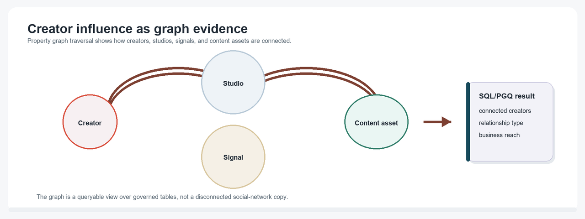
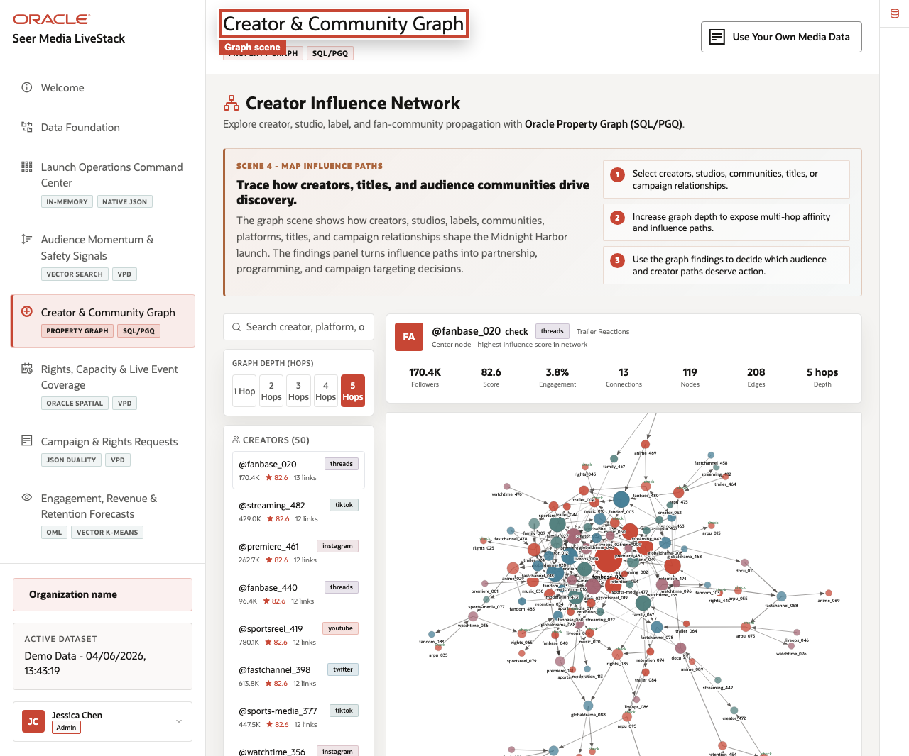

# Creator Influence Network with Property Graph

## Introduction

Creator influence is rarely visible in one flat table. A creator may promote a studio, follow another creator, amplify a content signal, or connect several communities that shape audience demand.

This lab uses **Property Graph** and SQL/PGQ to inspect creator relationships without moving sensitive campaign and audience data into a separate graph database. The graph is defined over governed relational tables in Oracle Database.

<details>
<summary><strong>Key terms: property graph, vertex, edge, hop, and SQL/PGQ</strong></summary>

> - A **property graph** represents business entities and their relationships. In this workshop, creators, studios, products, and social posts can be graph vertices.
>
> - A **vertex** is an entity in the graph, such as a creator or studio.
>
> - An **edge** is a relationship between vertices, such as CONNECTS_TO, PROMOTES, or MENTIONS_PRODUCT.
>
> - A **hop** is one relationship step from one vertex to another. Two hops means the query follows two relationship steps.
>
> - **SQL/PGQ** is SQL Property Graph Query syntax. It lets you query graph patterns from SQL.

</details>


The image below is the Creator & Community Graph screen from the Seer Media application. It shows creator relationships as a network so teams can see who may influence a campaign, content launch, or audience conversation. The SQL in this lab follows the same idea with property graph traversal over governed media entities.



### Objectives

- Inspect the current media property graph.
- Query creator connections with SQL/PGQ.
- Explain why relationship evidence matters for audience and campaign decisions.

Estimated Time: **10 minutes**

### Business Scenario

| Step | Media focus |
| --- | --- |
| Business Problem | Media teams need to understand influence pathways instead of reviewing isolated creator metrics. |
| Technical Challenge | Creator, studio, content, and signal relationships should stay connected to governed operational data. |
| Persona Focus | Audience analysts and partnership teams inspect creator reach; database developers explain the graph evidence. |
| What You Will See | SQL/PGQ returns creator relationship evidence from a property graph. |
| Database Capability | Oracle Property Graph runs graph queries over relational media tables. |
| Outcome | Teams can explain creator influence and campaign propagation without exporting data to another graph store. |

Persona focus: You are the audience analyst identifying which creators and relationships deserve campaign or partnership review.

## Task 1: Inspect the creator graph definition

Start by confirming the graph object exists.

1. Run this graph inventory query:

    > **SQL Worksheet reminder:** Need a reminder on how to open and use the SQL Worksheet? Return to [Getting Started Task 2: Open SQL Worksheet](/workshops/sandbox/index.html?lab=getting-started#Task2:OpenSQLWorksheet) for the step-by-step graphic showing where to paste and run SQL statements.

    You are checking that the workshop has the graph definition used by the application. The graph object INFLUENCER_NETWORK maps relational tables into graph vertices and edges.

    ```sql
    <copy>
    SELECT graph_name
    FROM user_property_graphs
    WHERE graph_name = 'INFLUENCER_NETWORK';
    </copy>
    ```

    **Expected output: Graph Inventory**

    | Graph Name |
    | --- |
    | INFLUENCER\_NETWORK |

2. Review why the object matters.
    The graph definition lets SQL follow relationships directly. You do not need to export creator data to a separate graph system to ask relationship-aware media questions.

## Task 2: Find connected creators

Now follow one-hop creator relationships.

1. Run this SQL/PGQ query:

    You are starting from one creator and following CONNECTS_TO edges to related creators. The MATCH clause describes the graph pattern. The COLUMNS clause returns the source creator, reached creator, relationship type, and relationship strength.

    ```sql
    <copy>
    SELECT source_creator,
           reached_creator,
           connection_type,
           relationship_strength,
           reached_influence_score
    FROM GRAPH_TABLE ( influencer_network
      MATCH (a IS influencer) -[e IS connects_to]-> (b IS influencer)
      WHERE a.handle = '@premiere_001'
      COLUMNS (
        a.handle AS source_creator,
        b.handle AS reached_creator,
        e.connection_type AS connection_type,
        TO_CHAR(e.strength, 'FM0.00') AS relationship_strength,
        TO_CHAR(b.influence_score, 'FM990.0') AS reached_influence_score
      )
    )
    ORDER BY TO_NUMBER(relationship_strength) DESC, reached_creator
    FETCH FIRST 3 ROWS ONLY;
    </copy>
    ```

    **Expected output: Connected Creator Neighborhood**

    | Source Creator | Reached Creator | Connection Type | Relationship Strength | Reached Influence Score |
    | --- | --- | --- | --- | --- |
    | @premiere\_001 | @music\_030 | follows | 0.89 | 48.2 |
    | @premiere\_001 | @fastchannel\_018 | follows | 0.80 | 48.4 |
    | @premiere\_001 | @creator\_012 | follows | 0.71 | 48.5 |

2. Interpret the relationship.
    The row shows a creator relationship that can affect how a signal travels. A high-influence reached creator can make a campaign or audience signal more important, especially when the content asset has high launch demand.

## Task 3: Connect creator relationships to studio or label evidence

Finally, connect relationships to media business context.

1. Run this creator relationship query:

    MEDIA_CREATOR_RELATIONSHIPS_V is a semantic view over creators, studio or label links, and relationship counts. It gives analysts a business-ready view of graph-adjacent evidence without requiring every user to write SQL/PGQ.

    ```sql
    <copy>
    SELECT creator_handle,
           creator_name,
           platform,
           studio_or_label,
           relationship_type,
           creator_edge_count,
           avg_relationship_strength
    FROM media_creator_relationships_v
    WHERE creator_edge_count > 0
    ORDER BY creator_edge_count DESC, avg_relationship_strength DESC
    FETCH FIRST 3 ROWS ONLY;
    </copy>
    ```

    **Expected output: Creator Business Context**

    | Creator Handle | Creator Name | Platform | Studio Or Label | Relationship Type | Creator Edge Count | Avg Relationship Strength |
    | --- | --- | --- | --- | --- | --- | --- |
    | @docu\_011 | Documentary Forums 011 | instagram | BetaRealm Studios | ambassador | 7 | 0.69 |
    | @sports-media\_077 | Trust and Safety 077 | tiktok | OrbitPlay Studios | sponsored | 7 | 0.69 |
    | @sports-media\_077 | Trust and Safety 077 | tiktok | Metro Fandom Lab | affiliate | 7 | 0.69 |

2. Use the result for campaign planning.
    The result connects graph relationship evidence to campaign planning context: creator, platform, studio or label, and relationship strength. That connection helps media teams act on influence evidence without losing governance.

## Acknowledgements

* **Author** - Oracle LiveLabs Team
* **Contributor** - Oracle Database Product Management
* **Last Updated By/Date** - Oracle Database Product Management, July 2026

