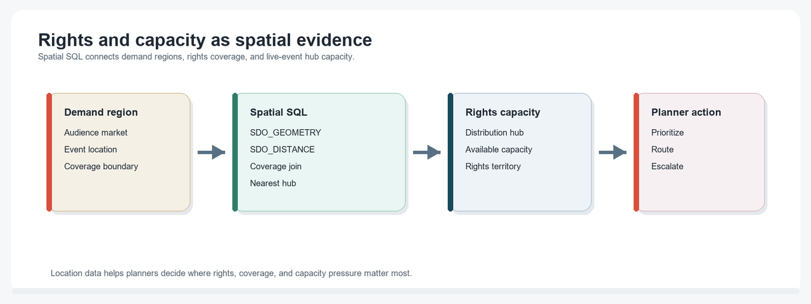
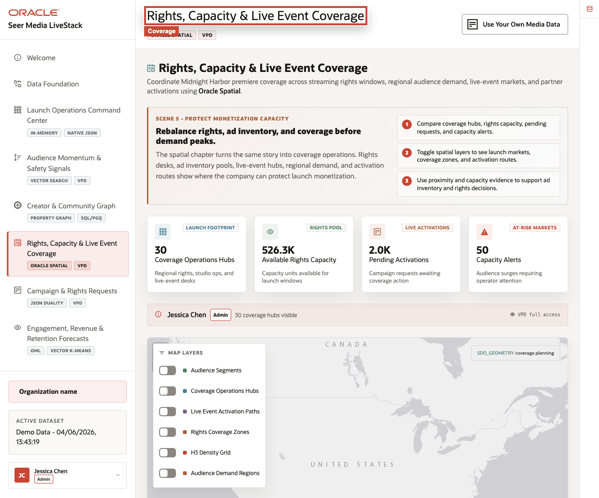

# Rights and Distribution Coverage with Oracle Spatial

## Introduction

Rights and distribution planning depends on location. Media teams need to know where audience demand is rising, which operations hubs have available capacity, and how far a hub is from the audience account or activation region.

This lab uses **Oracle Spatial** to connect location data to governed campaign and capacity records. Points, boundaries, and distance calculations stay in Oracle Database, so the map and the SQL evidence come from the same foundation.

<details>
<summary><strong>Key terms: spatial data, SDO_GEOMETRY, point, boundary, and distance</strong></summary>

> - **Spatial data** describes location or shape. A hub can be a point, and a demand region can be a boundary.
>
> - **SDO_GEOMETRY** is the Oracle Spatial data type for storing points, lines, and polygons.
>
> - A **point** represents one location, such as a distribution hub or audience account.
>
> - A **boundary** represents an area, such as a demand region or coverage zone.
>
> - **Distance** lets teams compare where capacity exists against where demand or activation work is located.

</details>


The image below is the Rights, Capacity & Live Event Coverage screen from the Seer Media application. It combines event demand, rights regions, live-event hubs, and distribution capacity so planners can spot coverage risks. The SQL in this lab recreates the spatial evidence behind those decisions.



### Objectives

- Inspect spatial objects used by the media application.
- Calculate distance between audience accounts and distribution hubs.
- Explain how spatial evidence supports rights and capacity decisions.

Estimated Time: **10 minutes**

### Business Scenario

| Step | Media focus |
| --- | --- |
| Business Problem | Rights and distribution teams need to match audience demand with coverage and capacity. |
| Technical Challenge | Location, capacity, content, and campaign data must remain connected for review. |
| Persona Focus | Rights planners and distribution operations leaders inspect coverage evidence; database developers show the SQL behind it. |
| What You Will See | Oracle Spatial calculates distance and coverage context from governed data. |
| Database Capability | SDO_GEOMETRY, spatial metadata, spatial indexes, and SDO_GEOM.SDO_DISTANCE support location-aware SQL. |
| Outcome | Teams can explain coverage decisions without exporting sensitive location and campaign data. |

Persona focus: You are the rights planner deciding where audience demand and coverage capacity need attention.

## Task 1: Inventory spatial objects

Start by checking the spatial tables and indexes.

1. Run this spatial inventory query:

    > **SQL Worksheet reminder:** Need a reminder on how to open and use the SQL Worksheet? Return to [Getting Started Task 2: Open SQL Worksheet](/workshops/sandbox/index.html?lab=getting-started#Task2:OpenSQLWorksheet) for the step-by-step graphic showing where to paste and run SQL statements.

    You are confirming that location-aware tables have spatial metadata and indexes. Spatial metadata tells Oracle Database the coordinate bounds and Spatial Reference Identifier (SRID). Spatial indexes make repeated location searches practical.

    ```sql
    <copy>
    SELECT table_name,
           column_name,
           srid
    FROM user_sdo_geom_metadata
    WHERE table_name IN ('FULFILLMENT_CENTERS','CUSTOMERS','FULFILLMENT_ZONES','DEMAND_REGIONS')
    ORDER BY table_name, column_name;
    </copy>
    ```

    **Expected output: Spatial Metadata**

    | Table Name | Column Name | SRID |
    | --- | --- | --- |
    | CUSTOMERS | LOCATION | 4326 |
    | DEMAND\_REGIONS | BOUNDARY | 4326 |
    | FULFILLMENT\_CENTERS | LOCATION | 4326 |
    | FULFILLMENT\_ZONES | ZONE\_BOUNDARY | 4326 |

2. Interpret the inventory.
    The result shows that audience accounts, distribution hubs, demand regions, and coverage zones are all available to SQL as spatial objects. That makes the map explainable from the database.

## Task 2: Find nearest distribution hubs

Now calculate distance from an audience account to active hubs with available capacity.

1. Run this coverage query:

    The query joins a campaign order to its audience account, compares the account location to active distribution hubs, and returns the nearest hubs. SDO_GEOM.SDO_DISTANCE calculates distance between two SDO_GEOMETRY points.

    ```sql
    <copy>
    SELECT c.email AS audience_account,
           fc.center_name AS distribution_hub,
           fc.city,
           fc.state_province,
           ROUND(SDO_GEOM.SDO_DISTANCE(
             c.location,
             fc.location,
             0.005,
             'unit=MILE'
           ), 2) AS distance_miles,
           fc.current_load_pct
    FROM customers c
    CROSS JOIN fulfillment_centers fc
    WHERE c.location IS NOT NULL
      AND fc.location IS NOT NULL
      AND fc.is_active = 1
    ORDER BY distance_miles, audience_account, distribution_hub
    FETCH FIRST 3 ROWS ONLY;
    </copy>
    ```

    **Expected output: Nearest Distribution Hubs**

    | Audience Account | Distribution Hub | City | State Province | Distance Miles | Current Load Pct |
    | --- | --- | --- | --- | --- | --- |
    | audience.account.0161@example.com | Boston Premium Originals Hub | Boston | Massachusetts | 0 | 50.25 |
    | audience.account.0484@example.com | Raleigh Sports Media Community Hub | Raleigh | North Carolina | 0 | 69.0 |
    | audience.account.0807@example.com | Chicago Midwest Ad Ops Hub | Joliet | Illinois | 0 | 64.5 |

2. Explain the coverage decision.
    Distance alone is not the whole decision. It becomes useful when joined to capacity, demand, and content records. The same database can hold the geography and the operating data, which reduces handoffs between mapping tools and operational systems.

## Task 3: Review capacity risk by region

Finally, connect demand forecasts to distribution capacity.

1. Run this capacity query:

    This query joins forecasted content demand to active distribution hubs and inventory. It gives the rights planner a direct review queue for demand that may outpace available capacity.

    ```sql
    <copy>
    SELECT fc.center_name AS distribution_hub,
           fc.city,
           fc.state_province,
           p.product_name AS content_asset,
           p.category AS content_category,
           (i.quantity_on_hand - i.quantity_reserved) AS capacity_units_available,
           df.predicted_demand,
           df.social_factor AS audience_signal_factor
    FROM demand_forecasts df
    JOIN products p ON p.product_id = df.product_id
    JOIN inventory i ON i.product_id = p.product_id
    JOIN fulfillment_centers fc ON fc.center_id = i.center_id
    WHERE fc.is_active = 1
    ORDER BY df.predicted_demand DESC, df.social_factor DESC, capacity_units_available ASC
    FETCH FIRST 3 ROWS ONLY;
    </copy>
    ```

    **Expected output: Capacity Risk Review**

    | Distribution Hub | City | State Province | Content Asset | Content Category | Capacity Units Available | Predicted Demand | Audience Signal Factor |
    | --- | --- | --- | --- | --- | --- | --- | --- |
    | Boston Premium Originals Hub | Boston | Massachusetts | Trust and Safety Moderation Burst | Trust and Safety | 76 | 541 | 1.34 |
    | Minneapolis Sports Replay Desk | Minneapolis | Minnesota | Trust and Safety Moderation Burst | Trust and Safety | 90 | 541 | 1.34 |
    | Honolulu International Drama Desk | Honolulu | Hawaii | Trust and Safety Moderation Burst | Trust and Safety | 104 | 541 | 1.34 |

2. Connect the result to rights planning.
    The result ties a place, a content asset, available capacity, predicted demand, and audience signal factor together. That is the evidence a rights planner needs before deciding where to adjust coverage or activation plans.

## Acknowledgements

* **Author** - Oracle LiveLabs Team
* **Contributor** - Oracle Database Product Management
* **Last Updated By/Date** - Oracle Database Product Management, July 2026


