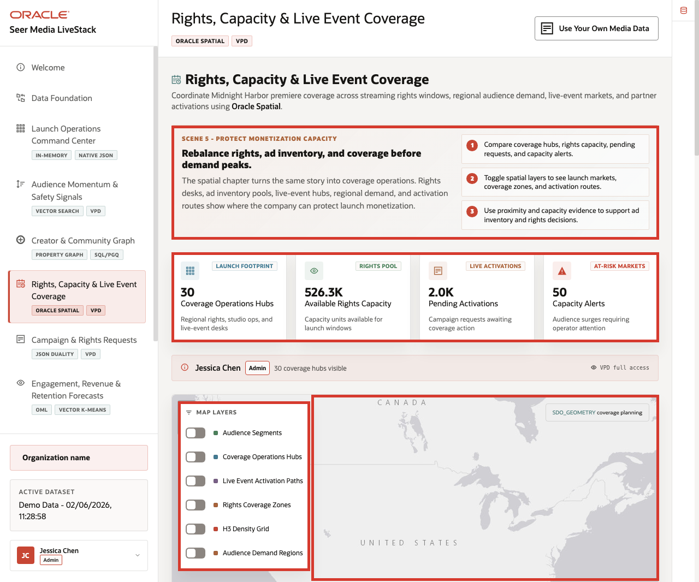
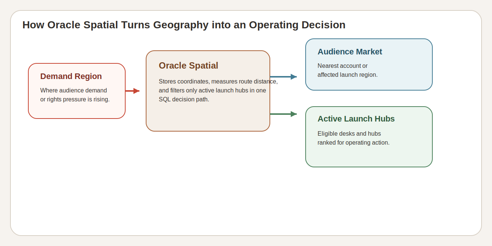

# Lab 6: Rights, Capacity, and Live Event Coverage with Oracle Spatial

## Introduction

Rights readiness is geographic. The Media LiveStack has to connect coverage hubs, launch markets, audience regions, and activation capacity so the team can explain why one location needs attention before another. This lab shows the spatial evidence behind that launch-coverage decision.

### Operating Story

| Step | Coverage-and-capacity focus |
| --- | --- |
| Business Problem | Media teams need rights and live-event decisions that combine geography with live operational capacity. |
| Technical Challenge | The stack must keep site geometry, demand regions, and launch-capacity records queryable inside the database. |
| Persona Focus | Rights planner, live-event operations lead, launch analyst, or spatially-aware application developer. |
| What You Will Prove | Oracle Spatial supports location-aware launch decisions without separating map logic from the governed Media dataset. |
| Database Capability | `SDO_GEOMETRY`, spatial metadata, demand-region tables, and hub-capacity analysis in one schema. |
| Outcome | You can explain where audience demand, rights coverage, and launch capacity intersect and why that matters operationally. |
{: title="Coverage and Capacity Operating Story Table"}

Persona focus: this lab is for the team that needs a defendable coverage decision, not just a map screenshot.

### Objectives

In this lab, you will:

- Confirm the main spatial surfaces in the Media schema.
- Review the current launch-capacity summary across hubs and demand regions.
- Identify the hubs and assets carrying the strongest launch-capacity pressure.

Estimated Time: **10 minutes**



*Figure 1: The rights and live-event coverage page connects map layers to the hub and capacity records behind them.*



*Figure 2: Oracle Spatial keeps launch geography, active hubs, and demand regions in one SQL decision path.*

## Task 1: Confirm the spatial surfaces

Perform the following set of steps to confirm the spatial surfaces that support rights, capacity, and live-event coverage decisions:

1. Run this query:

    ```sql
    <copy>
    SELECT table_name, column_name
    FROM user_sdo_geom_metadata
    WHERE table_name IN ('CUSTOMERS', 'FULFILLMENT_CENTERS', 'DEMAND_REGIONS', 'FULFILLMENT_ZONES')
    ORDER BY table_name, column_name;
    </copy>
    ```

    **Expected output:**

    | TABLE_NAME | COLUMN_NAME |
    | --- | --- |
    | CUSTOMERS | LOCATION |
    | DEMAND_REGIONS | BOUNDARY |
    | FULFILLMENT_CENTERS | LOCATION |
    | FULFILLMENT_ZONES | ZONE_BOUNDARY |
    {: title="Spatial Metadata Surface Table"}

2. These are the same spatial surfaces the map layers depend on.

**Note:** Sample values may change after data refreshes or rebuilds. Focus on the expected result pattern and the business takeaway, not the exact values.

## Task 2: Review the current launch-capacity summary

Perform the following set of steps to review the current launch-capacity summary across hubs and demand regions:

1. Run this query:

    ```sql
    <copy>
    SELECT
      (SELECT COUNT(*) FROM fulfillment_centers) AS distribution_hubs,
      (SELECT SUM(quantity_on_hand) FROM inventory) AS available_rights_capacity_units,
      (SELECT SUM(quantity_reserved) FROM inventory) AS reserved_capacity_units,
      (SELECT COUNT(*) FROM demand_regions) AS demand_regions
    FROM dual;
    </copy>
    ```

    **Expected output:**

    | DISTRIBUTION_HUBS | AVAILABLE_RIGHTS_CAPACITY_UNITS | RESERVED_CAPACITY_UNITS | DEMAND_REGIONS |
    | ---: | ---: | ---: | ---: |
    | 30 | 526256 | 49241 | 20 |
    {: title="Launch Capacity Summary Table"}

2. This is why the page matters: the launch team is balancing capacity and rights readiness across a real operating footprint, not one national average.

**Note:** Sample values may change after data refreshes or rebuilds. Focus on the expected result pattern and the business takeaway, not the exact values.

## Task 3: Identify the hubs carrying the most capacity

Perform the following set of steps to identify the hubs carrying the strongest current capacity pressure:

1. Run this query:

    ```sql
    <copy>
    SELECT
      fc.center_name AS distribution_hub,
      fc.city,
      fc.state_province,
      SUM(i.quantity_on_hand) AS capacity_units_available,
      SUM(i.quantity_reserved) AS capacity_units_reserved,
      SUM(i.quantity_incoming) AS capacity_units_incoming
    FROM fulfillment_centers fc
    JOIN inventory i
      ON i.center_id = fc.center_id
    GROUP BY fc.center_name, fc.city, fc.state_province
    ORDER BY capacity_units_available DESC, distribution_hub
    FETCH FIRST 8 ROWS ONLY;
    </copy>
    ```

    **Expected output:**

    | DISTRIBUTION_HUB | CITY | STATE_PROVINCE | CAPACITY_UNITS_AVAILABLE | CAPACITY_UNITS_RESERVED | CAPACITY_UNITS_INCOMING |
    | --- | --- | --- | ---: | ---: | ---: |
    | Las Vegas Live Event Hub | Las Vegas | Nevada | 18256 | 1638 | 6620 |
    | San Antonio Spanish-Language Desk | San Antonio | Texas | 18231 | 1655 | 6884 |
    | Austin Creator Monetization Hub | Austin | Texas | 18206 | 1629 | 6296 |
    | Minneapolis Sports Replay Desk | Minneapolis | Minnesota | 18169 | 1695 | 6192 |
    | Atlanta Theatrical Launch Desk | Atlanta | Georgia | 18095 | 1624 | 6292 |
    | Kansas City Rights Capacity Desk | Kansas City | Missouri | 18060 | 1637 | 6680 |
    | Dallas Sports Rights Desk | Dallas | Texas | 18005 | 1682 | 6724 |
    | Philadelphia Documentary Forum Desk | Philadelphia | Pennsylvania | 17938 | 1615 | 6596 |
    {: title="Highest-Capacity Distribution Hubs Table"}

2. These rows explain the map in operational terms. Oracle Spatial provides the launch geometry, but the business still needs the hub-level capacity evidence tied to it.

**Note:** Sample values may change after data refreshes or rebuilds. Focus on the expected result pattern and the business takeaway, not the exact values.

## Acknowledgements

* **Author** - Oracle LiveLabs Team
* **Last Updated By/Date** - Oracle Database Product Management, June 2026
