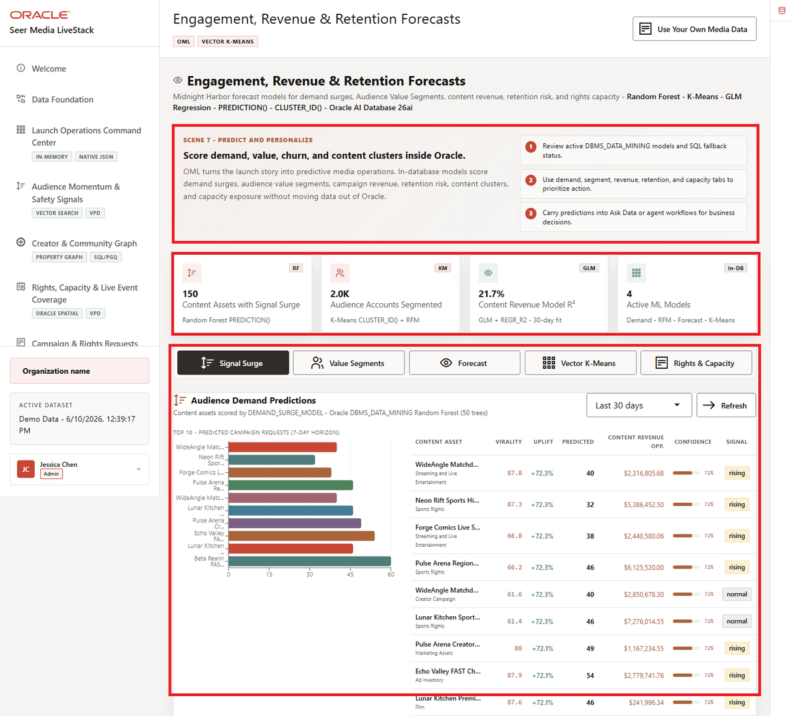
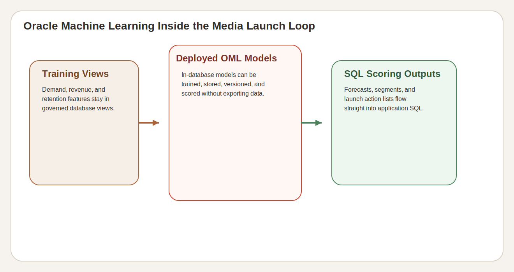

# Lab 7: Engagement, Revenue, and Retention Forecasts with Oracle Machine Learning

## Introduction

Launch teams do not need abstract ML talking points. They need forecast evidence that stays close to audience demand, content revenue, retention pressure, and capacity risk. This lab shows how the Media LiveStack uses in-database OML artifacts to keep those forecasts tied to operational launch decisions.

### Operating Story

| Step | OML analytics focus |
| --- | --- |
| Business Problem | Media teams need model-backed prioritization that stays close to the live launch data they already trust. |
| Technical Challenge | Training artifacts, scoring logic, forecast rows, and capacity-risk evidence must stay inspectable in Oracle SQL. |
| Persona Focus | Analytics lead, streaming growth manager, data scientist, or ML-aware database developer. |
| What You Will Prove | OML models and deterministic forecast rows can support launch decisions without breaking the governed data path. |
| Database Capability | `DBMS_DATA_MINING` models, demand forecasts, clustering outputs, and SQL scoring patterns. |
| Outcome | You can explain how Oracle Machine Learning turns launch demand into a ranked action path instead of a disconnected analytics export. |
{: title="OML Analytics Operating Story Table"}

Persona focus: this lab is for the builder or reviewer who needs ML outputs that can still be defended in SQL.

### Objectives

In this lab, you will:

- Confirm the key Media OML models.
- Review the highest-demand forecast rows.
- Compare predicted demand with available capacity.

Estimated Time: **10 minutes**



*Figure 1: The OML analytics page ties demand, revenue, retention, and capacity forecasts to one launch workflow.*



*Figure 2: Oracle Machine Learning keeps forecast training, scoring, and launch output review inside the same governed stack.*

## Task 1: Confirm the current Media OML models

Perform the following set of steps to confirm the current Media OML models before you interpret forecast output:

1. Run this query:

    ```sql
    <copy>
    SELECT model_name, mining_function, algorithm
    FROM user_mining_models
    WHERE model_name IN (
      'DEMAND_SURGE_MODEL',
      'CUSTOMER_SEGMENT_MODEL',
      'REVENUE_PREDICT_MODEL',
      'PRODUCT_CLUSTER_MODEL'
    )
    ORDER BY model_name;
    </copy>
    ```

    **Expected output:**

    | MODEL_NAME | MINING_FUNCTION | ALGORITHM |
    | --- | --- | --- |
    | CUSTOMER\_SEGMENT\_MODEL | CLUSTERING | KMEANS |
    | DEMAND\_SURGE\_MODEL | CLASSIFICATION | RANDOM\_FOREST |
    | PRODUCT\_CLUSTER\_MODEL | CLUSTERING | KMEANS |
    | REVENUE\_PREDICT\_MODEL | REGRESSION | GENERALIZED\_LINEAR\_MODEL |
    {: title="Active Media OML Models Table"}

2. The workshop does not ask the learner to retrain these models. It asks the learner to inspect how their outputs drive launch decisions.

**Note:** Sample values may change after data refreshes or rebuilds. Focus on the expected result pattern and the business takeaway, not the exact values.

## Task 2: Review the highest-demand forecast rows

Perform the following set of steps to inspect the highest-demand forecast rows in the current launch dataset:

1. Run this query:

    ```sql
    <copy>
    SELECT
      p.product_name AS content_asset,
      df.region,
      TO_CHAR(df.forecast_date, 'YYYY-MM-DD') AS forecast_date,
      df.predicted_demand,
      ROUND(df.social_factor, 2) AS audience_signal_factor
    FROM demand_forecasts df
    JOIN products p
      ON p.product_id = df.product_id
    ORDER BY df.predicted_demand DESC, df.social_factor DESC, p.product_name
    FETCH FIRST 8 ROWS ONLY;
    </copy>
    ```

    **Expected output:**

    | CONTENT_ASSET | REGION | FORECAST_DATE | PREDICTED_DEMAND | AUDIENCE_SIGNAL_FACTOR |
    | --- | --- | --- | ---: | ---: |
    | Trust and Safety Moderation Burst | Phoenix FAST Channel Region | 2026-06-02 | 541 | 1.34 |
    | Subscription Save Offer | Portland Indie Festival Market | 2026-06-02 | 528 | 1.67 |
    | Trust and Safety Moderation Burst | Philadelphia Documentary Forum Market | 2026-06-01 | 523 | 1.31 |
    | Subscription Save Offer | Charlotte Matchday Belt | 2026-06-01 | 513 | 1.64 |
    | Trust and Safety Moderation Burst | Portland Indie Festival Market | 2026-05-31 | 504 | 1.28 |
    | Subscription Save Offer | Honolulu International Drama Market | 2026-05-31 | 499 | 1.61 |
    | Trust and Safety Moderation Burst | Washington Trust and Safety Region | 2026-05-26 | 494 | 1.34 |
    | Subscription Save Offer | Las Vegas Live Event Market | 2026-05-26 | 493 | 1.67 |
    {: title="Highest-Demand Forecast Rows Table"}

2. These rows show why OML matters in the Media stack: the forecast is still tied to a named content asset, region, and audience signal factor.

**Note:** Sample values may change after data refreshes or rebuilds. Focus on the expected result pattern and the business takeaway, not the exact values.

## Task 3: Compare predicted demand with available capacity

Perform the following set of steps to compare predicted demand with available capacity so the forecast can support an operational decision:

1. Run this query :

    ```sql
    <copy>
    WITH max_product_forecast AS (
      SELECT product_id, MAX(predicted_demand) AS predicted_demand
      FROM demand_forecasts
      GROUP BY product_id
    ),
    product_capacity AS (
      SELECT product_id, SUM(quantity_on_hand) AS capacity_units_available
      FROM inventory
      GROUP BY product_id
    )
    SELECT
      p.product_name AS content_asset,
      p.category AS content_category,
      f.predicted_demand,
      c.capacity_units_available,
      ROUND(f.predicted_demand / c.capacity_units_available, 4) AS demand_to_capacity_ratio
    FROM max_product_forecast f
    JOIN product_capacity c
      ON c.product_id = f.product_id
    JOIN products p
      ON p.product_id = f.product_id
    ORDER BY demand_to_capacity_ratio DESC, f.predicted_demand DESC
    FETCH FIRST 8 ROWS ONLY;
    </copy>
    ```

    **Expected output:**

    | CONTENT_ASSET | CONTENT_CATEGORY | PREDICTED_DEMAND | CAPACITY_UNITS_AVAILABLE | DEMAND_TO_CAPACITY_RATIO |
    | --- | --- | ---: | ---: | ---: |
    | Sports Docuseries Season Access Bundle | Streaming and Live Entertainment | 305 | 1370 | 0.2226 |
    | Subscriber Churn Winback Offer | Streaming and Live Entertainment | 487 | 2211 | 0.2203 |
    | Trust and Safety Moderation Burst | Trust and Safety | 541 | 2940 | 0.1840 |
    | Sports Media Finals Watch Party | Streaming and Live Entertainment | 325 | 1777 | 0.1829 |
    | Audience Rewards Calendar | Streaming and Live Entertainment | 391 | 2260 | 0.1730 |
    | Premium Storefront Creator Bundle | Streaming and Live Entertainment | 424 | 2552 | 0.1661 |
    | Subscription Save Offer | Audience Activation | 528 | 3575 | 0.1477 |
    | Championship Highlights Rights | Sports Rights | 418 | 3032 | 0.1379 |
    {: title="Demand to Capacity Comparison Table"}

2. This is the OML hand-off back to operations: forecast demand becomes useful when the team can compare it to real available capacity in the same governed database.

**Note:** Sample values may change after data refreshes or rebuilds. Focus on the expected result pattern and the business takeaway, not the exact values.

## Acknowledgements

* **Author** - Oracle LiveLabs Team
* **Last Updated By/Date** - Oracle Database Product Management, June 2026
