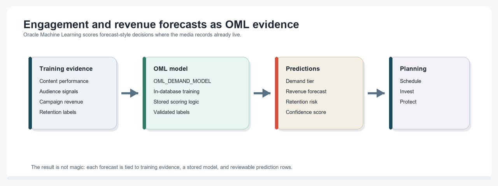
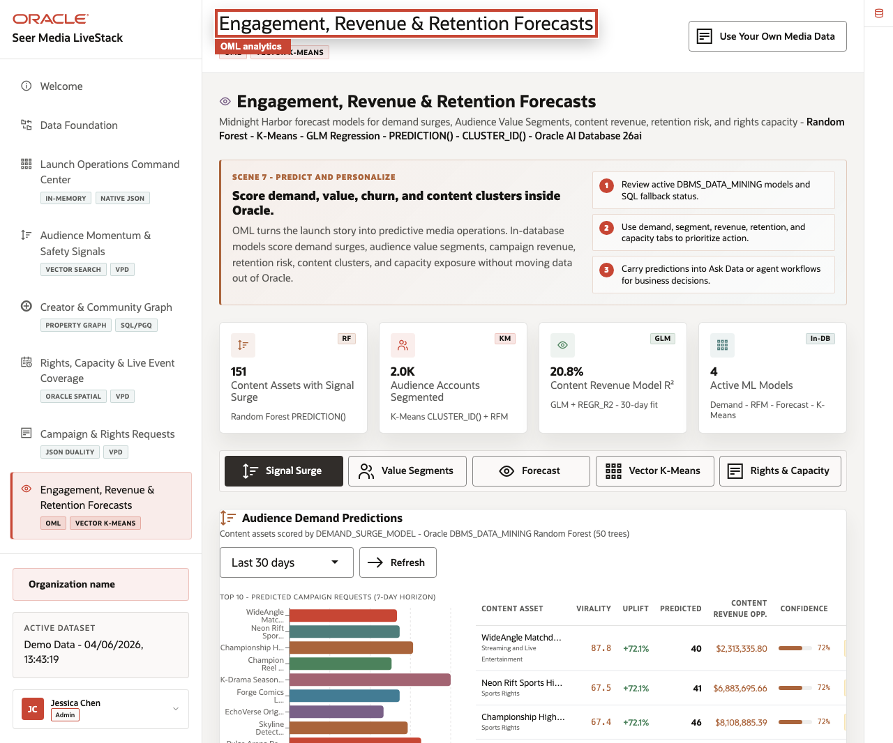

# Predictive Demand and Revenue with Oracle Machine Learning

## Introduction

Media planners need forecasts, but predictions are only useful when teams understand what data produced them and where the result should be used. This lab inspects predictive demand, revenue, and content affinity outputs inside Oracle Database.

Oracle Machine Learning (OML) keeps model inputs, model metadata, and scoring output close to governed media data. That matters because predictions should support launch and rights decisions without becoming disconnected analytics artifacts.

<details>
<summary><strong>Key terms: Oracle Machine Learning, model, prediction, confidence, and feature view</strong></summary>

> - **Oracle Machine Learning (OML)** lets teams build, store, and score models in Oracle Database.
>
> - A **model** is a trained object that maps input data to an output, such as a demand-surge label, customer segment, revenue forecast, or cluster.
>
> - A **prediction** is the model output for a row or case. It is a score or label, not a guarantee.
>
> - **Confidence** is model probability or score strength. It is useful context, but it is not certainty.
>
> - A **feature view** is a repeatable SQL shape that packages model inputs consistently.

</details>


The image below is the Engagement, Revenue & Retention Forecasts screen from the Seer Media application. It shows how forecasted revenue, demand, retention risk, and capacity signals are combined for planning. The SQL in this lab explains the Oracle Machine Learning evidence behind those forecast-style decisions.



### Objectives

- Inventory the OML models available in the schema.
- Score demand surge and revenue models with SQL.
- Connect predictive scores to rights and capacity decisions.

Estimated Time: **10 minutes**

### Business Scenario

| Step | Media focus |
| --- | --- |
| Business Problem | Media planners need demand, revenue, and retention predictions they can explain. |
| Technical Challenge | Model output must stay tied to content, audience, order, and capacity data. |
| Persona Focus | Planning analysts inspect predictive output; database developers show where model evidence lives. |
| What You Will See | OML model metadata, classifications, probabilities, and regression scores are queryable with SQL. |
| Database Capability | OML models, `PREDICTION`, `PREDICTION_PROBABILITY`, and model-ready views run inside Oracle Database. |
| Outcome | Predictive decisions can be reviewed close to the governed data that produced them. |

Persona focus: You are the media planning analyst deciding which content assets and regions deserve attention before demand outpaces capacity.

## Task 1: Inventory OML models

Start by listing the in-database models.

1. Run this model inventory query:

    > **SQL Worksheet reminder:** Need a reminder on how to open and use the SQL Worksheet? Return to [Getting Started Task 2: Open SQL Worksheet](/workshops/sandbox/index.html?lab=getting-started#Task2:OpenSQLWorksheet) for the step-by-step graphic showing where to paste and run SQL statements.

    You are checking which OML models are available for this media scenario. USER_MINING_MODELS lists mining models owned by the current schema.

    ```sql
    <copy>
    SELECT model_name,
           mining_function,
           algorithm
    FROM user_mining_models
    WHERE model_name IN (
      'DEMAND_SURGE_MODEL','CUSTOMER_SEGMENT_MODEL',
      'REVENUE_PREDICT_MODEL','PRODUCT_CLUSTER_MODEL'
    )
    ORDER BY model_name;
    </copy>
    ```

    **Expected output: OML Model Inventory**

    | Model Name | Mining Function | Algorithm |
    | --- | --- | --- |
    | CUSTOMER\_SEGMENT\_MODEL | CLUSTERING | KMEANS |
    | DEMAND\_SURGE\_MODEL | CLASSIFICATION | RANDOM\_FOREST |
    | PRODUCT\_CLUSTER\_MODEL | CLUSTERING | KMEANS |
    | REVENUE\_PREDICT\_MODEL | REGRESSION | GENERALIZED\_LINEAR\_MODEL |

2. Interpret the inventory.
    The model names show which predictive surfaces can be backed by database evidence: demand surge, audience segmentation, revenue prediction, and content clustering.

## Task 2: Score demand and revenue models

Next, score persisted models directly in SQL so the prediction stays close to the governed media data.

1. Run this demand surge classification query:

    You are scoring content assets for demand-surge pressure. The query reads `OML_DEMAND_TRAINING_V`, which is a repeatable feature view over content, audience signal, engagement, and order evidence. `PREDICTION` returns the model label, and `PREDICTION_PROBABILITY` returns the model confidence for that label.

    The subquery scores each model input row first. The outer query then joins to `PRODUCTS` and `BRANDS` so the result is useful to a media planner instead of only showing internal IDs.

    ```sql
    <copy>
    SELECT p.product_name AS content_asset,
           b.brand_name AS studio_or_label,
           s.surge_label AS training_label,
           s.predicted_surge,
           s.confidence,
           s.avg_virality,
           s.total_views
    FROM (
      SELECT product_id,
             surge_label,
             avg_virality,
             total_views,
             PREDICTION(DEMAND_SURGE_MODEL USING *) AS predicted_surge,
             ROUND(PREDICTION_PROBABILITY(DEMAND_SURGE_MODEL USING *), 4) AS confidence
      FROM oml_demand_training_v
    ) s
    JOIN products p ON p.product_id = s.product_id
    JOIN brands b ON b.brand_id = p.brand_id
    ORDER BY s.confidence DESC, s.avg_virality DESC
    FETCH FIRST 3 ROWS ONLY;
    </copy>
    ```

    **Expected output: Demand Surge Scoring**

    | Content Asset | Studio Or Label | Training Label | Predicted Surge | Confidence | Avg Virality | Total Views |
    | --- | --- | --- | --- | --- | --- | --- |
    | Final Whistle Live Superfan Loyalty Pack | Luma FAST | STABLE | STABLE | 1 | 47.54210526315789 | 1848343 |
    | Premium Storefront Creator Bundle | Marquee Media Network | STABLE | STABLE | 1 | 47.44210526315789 | 1801174 |
    | Marquee Mystery Premium Purchase Offer | NeonKids | STABLE | STABLE | 1 | 47.373684210526314 | 1754216 |

2. Run this revenue regression query:

    You are estimating campaign value from the persisted regression model. The query scores rows from `OML_REVENUE_TRAINING_V` with `REVENUE_PREDICT_MODEL`, rounds the predicted value, and returns it next to the known target revenue so you can compare model output with actual media order value.

    ```sql
    <copy>
    SELECT order_id AS campaign_order_id,
           target_revenue,
           ROUND(PREDICTION(REVENUE_PREDICT_MODEL USING *), 2) AS predicted_revenue,
           item_count,
           distinct_products
    FROM oml_revenue_training_v
    ORDER BY order_id
    FETCH FIRST 3 ROWS ONLY;
    </copy>
    ```

    **Expected output: Revenue Prediction Review**

    | Campaign Order Id | Target Revenue | Predicted Revenue | Item Count | Distinct Products |
    | --- | --- | --- | --- | --- |
    | 1 | 348250 | 351784.19 | 6 | 3 |
    | 2 | 391000 | 433698.88 | 6 | 3 |
    | 3 | 237500 | 210585.11 | 6 | 3 |

3. Compare the scores.
    The demand query returns predicted surge labels and confidence scores for content assets. The revenue query returns a numeric estimate for campaign value. Neither result is a guarantee. The value is that planners can compare model output with governed media records and then decide which launch, campaign, or capacity question deserves review.

## Task 3: Connect scoring output to capacity

Finally, connect model output to operational capacity.

1. Run this model-to-action query:

    This query connects forecast rows to inventory capacity and distribution hubs. The scored subquery uses `PREDICTION` and `PREDICTION_PROBABILITY` so the capacity review queue includes the model label, confidence, forecast demand, and available capacity.

    ```sql
    <copy>
    SELECT p.product_name AS content_asset,
           fc.center_name AS distribution_hub,
           fc.state_province,
           scored.predicted_surge,
           scored.confidence,
           (i.quantity_on_hand - i.quantity_reserved) AS capacity_units_available,
           df.predicted_demand,
           df.social_factor AS audience_signal_factor,
           CASE
             WHEN scored.predicted_surge = 'SURGE'
                  AND df.predicted_demand > (i.quantity_on_hand - i.quantity_reserved) THEN 'capacity review'
             WHEN scored.predicted_surge = 'SURGE' THEN 'watch demand'
             ELSE 'monitor'
           END AS planning_action
    FROM demand_forecasts df
    JOIN products p ON p.product_id = df.product_id
    JOIN inventory i ON i.product_id = p.product_id
    JOIN fulfillment_centers fc ON fc.center_id = i.center_id
    JOIN (
      SELECT product_id,
             PREDICTION(DEMAND_SURGE_MODEL USING *) AS predicted_surge,
             ROUND(PREDICTION_PROBABILITY(DEMAND_SURGE_MODEL USING *), 4) AS confidence
      FROM oml_demand_training_v
    ) scored ON scored.product_id = p.product_id
    WHERE fc.is_active = 1
    ORDER BY scored.confidence DESC, df.predicted_demand DESC, capacity_units_available ASC
    FETCH FIRST 3 ROWS ONLY;
    </copy>
    ```

    **Expected output: Predictive Capacity Action**

    | Content Asset | Distribution Hub | State Province | Predicted Surge | Confidence | Capacity Units Available | Predicted Demand | Audience Signal Factor | Planning Action |
    | --- | --- | --- | --- | --- | --- | --- | --- | --- |
    | Trust and Safety Moderation Burst | Boston Premium Originals Hub | Massachusetts | STABLE | 1 | 76 | 541 | 1.34 | monitor |
    | Trust and Safety Moderation Burst | Minneapolis Sports Replay Desk | Minnesota | STABLE | 1 | 90 | 541 | 1.34 | monitor |
    | Trust and Safety Moderation Burst | Honolulu International Drama Desk | Hawaii | STABLE | 1 | 104 | 541 | 1.34 | monitor |

2. Explain the action.
    This query shows why in-database prediction matters. The model output is not stranded in a notebook. It joins to operational capacity and content evidence so planners can decide what to review next.

    A `capacity review` row means the model predicts demand pressure and the forecast exceeds the available capacity shown in the media capacity view. A `watch demand` row means the model predicts surge pressure, but the capacity row has not crossed that threshold. `monitor` means the model does not currently classify that asset as a surge case. Confidence helps planners compare rows, but business users should still review the content asset, hub, and demand context before acting.

## Acknowledgements

* **Author** - Oracle LiveLabs Team
* **Contributor** - Oracle Database Product Management
* **Last Updated By/Date** - Oracle Database Product Management, July 2026

