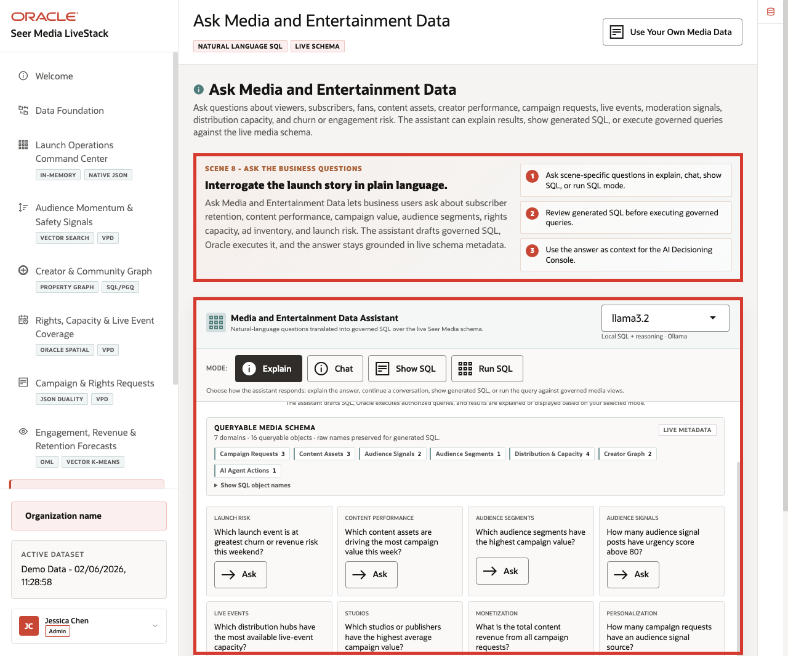

# Lab 8: Ask Seer Media Data: Trusted Answers

## Introduction

The **Media LiveStack** does not treat trusted answers as a black box. Business users need fast answers, but reviewers still need to see which governed views and columns support those answers. This lab focuses on the metadata and SQL path that make the answer trustworthy.

### Operating Story

| Step | Trusted-answer focus |
| --- | --- |
| Business Problem | Media users need fast launch answers without waiting for a custom report or reverse-engineering hidden SQL. |
| Technical Challenge | Natural-language answers must stay grounded in approved views, readable metadata, and visible query paths. |
| Persona Focus | Media analyst, launch leader, data steward, or NL2SQL reviewer. |
| What You Will Prove | Trusted answers are explainable because the Media schema exposes the right views, comments, and SQL path. |
| Database Capability | Semantic views, table comments, approved object lists, and inspectable SQL. |
| Outcome | You show that the answer path stays visible and governed even when the business question is phrased in plain language. |
{: title="Trusted Answer Operating Story Table"}

Persona focus: this lab is for the reviewer who needs to trust the answer path, not just the answer text.

### Objectives

In this lab, you will:

- Review the approved Media semantic views.
- Answer one launch question with visible SQL over those views.

Estimated Time: **10 minutes**



*Figure 1: The Ask Data workspace keeps the business question, the SQL path, and the result in one reviewable flow.*

## Task 1: Review the approved Media semantic views

Perform the following set of steps to review the approved Media semantic views that the trusted-answer flow should rely on:

1. Run this query:

    ```sql
    <copy>
    SELECT
      table_name,
      CASE
        WHEN LENGTH(comments) > 72 THEN SUBSTR(comments, 1, 72) || '...'
        ELSE comments
      END AS comment_excerpt
    FROM user_tab_comments
    WHERE table_name IN (
      'MEDIA_AUDIENCE_SIGNALS_V',
      'MEDIA_CAMPAIGN_ORDERS_V',
      'MEDIA_CONTENT_ASSETS_V',
      'MEDIA_CREATOR_RELATIONSHIPS_V',
      'MEDIA_DISTRIBUTION_CAPACITY_V'
    )
    ORDER BY table_name;
    </copy>
    ```

    **Expected output:**

    | TABLE_NAME | COMMENT_EXCERPT |
    | --- | --- |
    | MEDIA_AUDIENCE_SIGNALS_V | Media semantic view over social_posts and creators. Use this for audienc... |
    | MEDIA_CAMPAIGN_ORDERS_V | Media semantic view over orders, customers, order_items, and fulfillment... |
    | MEDIA_CONTENT_ASSETS_V | Media semantic view over products, brands, inventory, and audience signa... |
    | MEDIA_CREATOR_RELATIONSHIPS_V | Media semantic view over influencers, creator graph edges, and studio or... |
    | MEDIA_DISTRIBUTION_CAPACITY_V | Media semantic view over fulfillment_centers, inventory, products, and d... |
    {: title="Approved Media Semantic Views Table"}

2. This is the governance checkpoint. Trusted answers should begin from objects that already explain their business meaning.

**Note:** Sample values may change after data refreshes or rebuilds. Focus on the expected result pattern and the business takeaway, not the exact values.

## Task 2: Answer one launch question with visible SQL

Perform the following set of steps to answer one launch question with visible SQL over an approved Media semantic view:

1. Use this question: which content assets currently carry the strongest audience-signal load?
2. Run this SQL over the approved Media semantic view.

    ```sql
    <copy>
    SELECT
      content_asset,
      studio_or_label,
      content_category,
      audience_signal_count,
      ROUND(avg_virality_score, 2) AS avg_virality_score
    FROM media_content_assets_v
    ORDER BY audience_signal_count DESC, avg_virality_score DESC, content_asset
    FETCH FIRST 5 ROWS ONLY;
    </copy>
    ```

    **Expected output:**

    | CONTENT_ASSET | STUDIO_OR_LABEL | CONTENT_CATEGORY | AUDIENCE_SIGNAL_COUNT | AVG_VIRALITY_SCORE |
    | --- | --- | --- | ---: | ---: |
    | Pulse Arena Regional Rights Window | Global Drama House | Sports Rights | 19 | 50.77 |
    | Superfan Loyalty Bonus Content Track | Marquee Media Network | Streaming and Live Entertainment | 19 | 50.68 |
    | Echo Valley Watch Time Personalization Test | AnimeForge | Streaming Placement | 19 | 50.67 |
    | Forge Comics Live Premium Bundle Upsell | Forge Comics Studio | Audience Activation | 19 | 50.58 |
    | WideAngle Matchday Creator Sponsored Journey | StreamWave Network | Creator Campaign | 19 | 50.57 |
    {: title="Top Audience-Signal Content Assets Table"}

2. This is the trusted-answer lesson: the business question is simple, but the answer still stays on governed views with a visible SQL path.

**Note:** Sample values may change after data refreshes or rebuilds. Focus on the expected result pattern and the business takeaway, not the exact values.

## Acknowledgements

* **Author** - Oracle LiveLabs Team
* **Last Updated By/Date** - Oracle Database Product Management, June 2026
