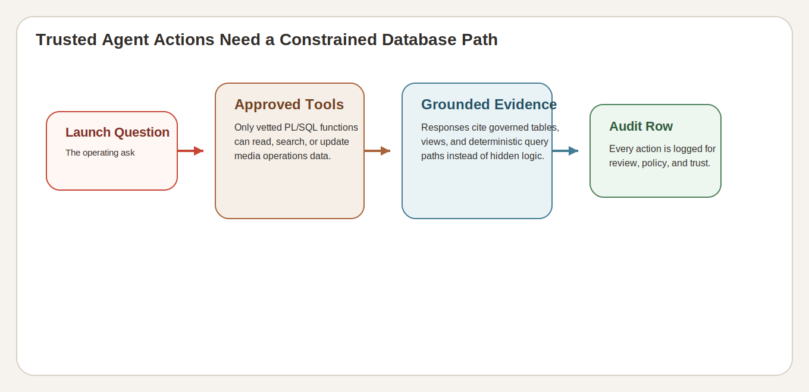

# Lab 9: Seer Media Agent Console: Trusted Actions

## Introduction

The **Media LiveStack** does not ask the learner to trust a free-form AI answer. A trusted action has to run approved tools, return grounded evidence, and leave an audit row behind. This lab creates one rerunnable audit example so the action path stays inspectable after the chat ends.

### Operating Story

| Step | Trusted-action focus |
| --- | --- |
| Business Problem | Media teams want assisted decisions, but they still need to know which tools ran and what evidence came back. |
| Technical Challenge | The stack must constrain agent actions to approved PL/SQL tools and record them durably. |
| Persona Focus | Media operations leader, AI platform owner, launch engineer, or application developer. |
| What You Will Prove | One trusted action is more than a chat response because it uses approved tools and leaves reviewable evidence. |
| Database Capability | PL/SQL tools, deterministic action logging, and the `AGENT_ACTIONS` audit trail. |
| Outcome | You can explain the difference between grounded agent actions and untracked AI output. |
{: title="Trusted Action Operating Story Table"}

Persona focus: this lab is for the reviewer who needs a durable action record, not only an answer in a chat bubble.

### Objectives

In this lab, you will:

- Review the approved Media agent functions.
- Create one rerunnable workshop audit row.
- Query the resulting audit evidence.

Estimated Time: **10 minutes**


*Figure 1: The agent console ties launch questions to approved tools and a visible audit trail.*



*Figure 2: Trusted agent actions stay bounded by approved functions, grounded evidence, and durable audit history.*

## Task 1: Review the approved agent functions

Perform the following set of steps to confirm that the core Media agent functions are present and approved for use:

1. Run this query:

    ```sql
    <copy>
    SELECT object_name
    FROM user_objects
    WHERE object_type = 'FUNCTION'
      AND object_name IN (
        'CHECK_PRODUCT_INVENTORY',
        'DETECT_TRENDING_PRODUCTS',
        'FIND_BEST_FULFILLMENT',
        'GET_INFLUENCER_NETWORK',
        'LOG_AGENT_DECISION'
      )
    ORDER BY object_name;
    </copy>
    ```

    **Expected output:**

    | OBJECT_NAME |
    | --- |
    | CHECK_PRODUCT_INVENTORY |
    | DETECT_TRENDING_PRODUCTS |
    | FIND_BEST_FULFILLMENT |
    | GET_INFLUENCER_NETWORK |
    | LOG_AGENT_DECISION |
    {: title="Approved Agent Functions Table"}

2. These functions form the trusted tool surface. They define what the agent is allowed to do.

**Note:** Sample values may change after data refreshes or rebuilds. Focus on the expected result pattern and the business takeaway, not the exact values.

## Task 2: Create one rerunnable workshop audit row

Perform the following set of steps to create one rerunnable workshop audit row that demonstrates the trusted-action pattern:

1. Remove any prior workshop demo row.

    ```sql
    <copy>
    DELETE FROM agent_actions
    WHERE agent_name = 'workshop_agent_demo'
      AND action_type = 'rights_capacity_review';
    </copy>
    ```

2. Commit the cleanup.

    ```sql
    <copy>
    COMMIT;
    </copy>
    ```

3. Log one trusted workshop action.

    ```sql
    <copy>
    SELECT log_agent_decision(
             'workshop_agent_demo',
             'rights_capacity_review',
             'campaign_order',
             '{"contentAsset":"Championship Highlights Rights","reason":"Launch planner requested a capacity review before the next rights release wave."}'
           ) AS log_result
    FROM dual;
    </copy>
    ```

**Expected output:**

| LOG_RESULT |
| --- |
| Decision logged: rights_capacity_review by workshop_agent_demo |
{: title="Trusted Action Logging Result Table"}

**Note:** Sample values may change after data refreshes or rebuilds. Focus on the expected result pattern and the business takeaway, not the exact values.

## Task 3: Review the resulting audit evidence

Perform the following set of steps to review the resulting audit evidence and confirm that the action is durable:

1. Run this query to confirm the action is now durable.

    ```sql
    <copy>
    SELECT
      agent_name,
      action_type,
      entity_type,
      execution_status,
      confidence
    FROM agent_actions
    WHERE agent_name = 'workshop_agent_demo'
      AND action_type = 'rights_capacity_review'
    ORDER BY created_at DESC
    FETCH FIRST 1 ROW ONLY;
    </copy>
    ```

    **Expected output:**

    | AGENT_NAME | ACTION_TYPE | ENTITY_TYPE | EXECUTION_STATUS | CONFIDENCE |
    | --- | --- | --- | --- | ---: |
    | workshop_agent_demo | rights_capacity_review | campaign_order | completed | 0.9 |
    {: title="Agent Audit Evidence Table"}

2. This is the trusted-action pattern the workshop wants the learner to remember: approved tool, grounded reason, durable audit row.

**Note:** Sample values may change after data refreshes or rebuilds. Focus on the expected result pattern and the business takeaway, not the exact values.

## Acknowledgements

* **Author** - Oracle LiveLabs Team
* **Last Updated By/Date** - Oracle Database Product Management, June 2026
