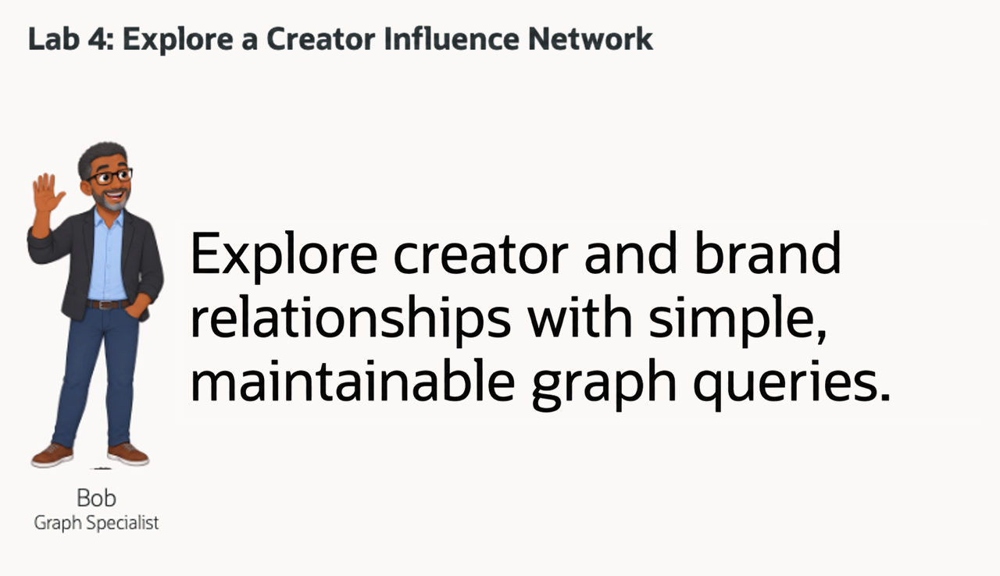
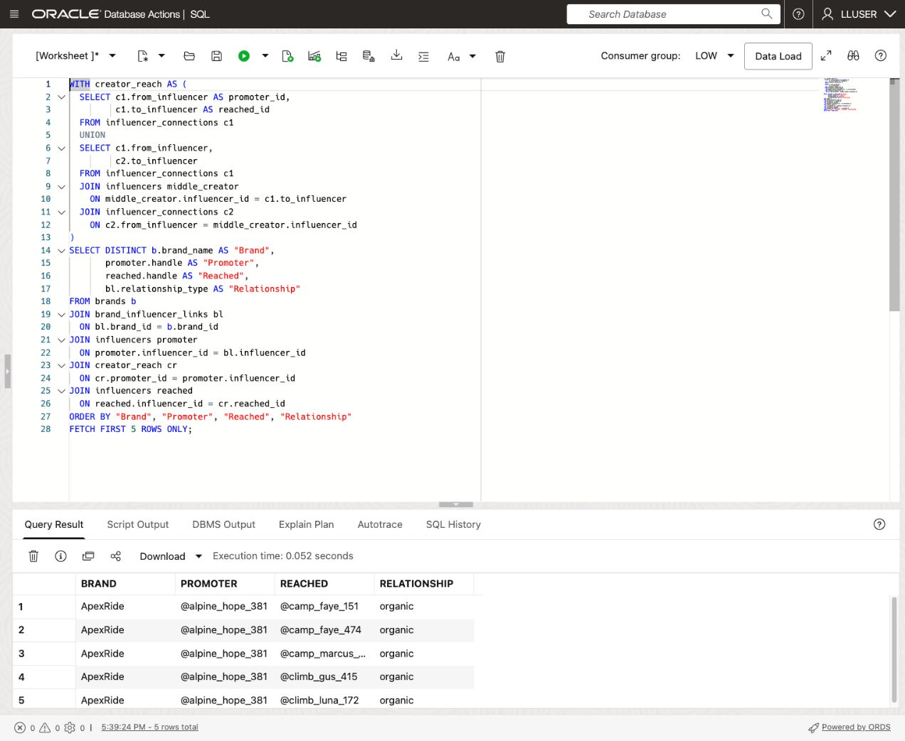
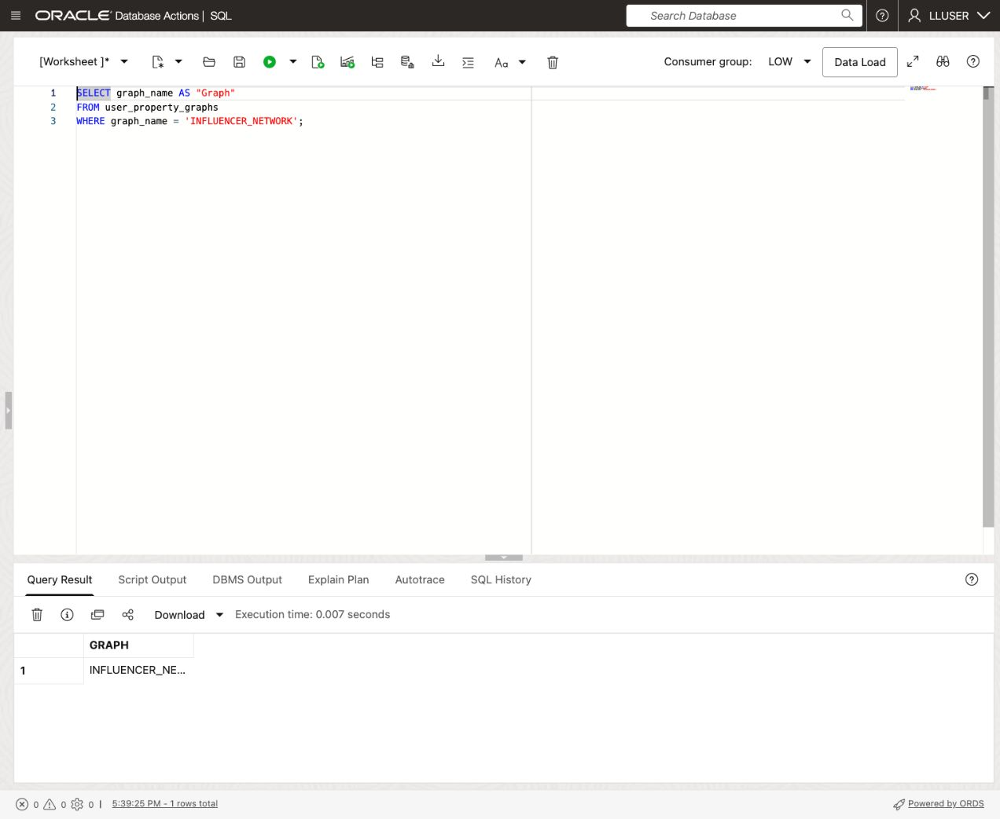
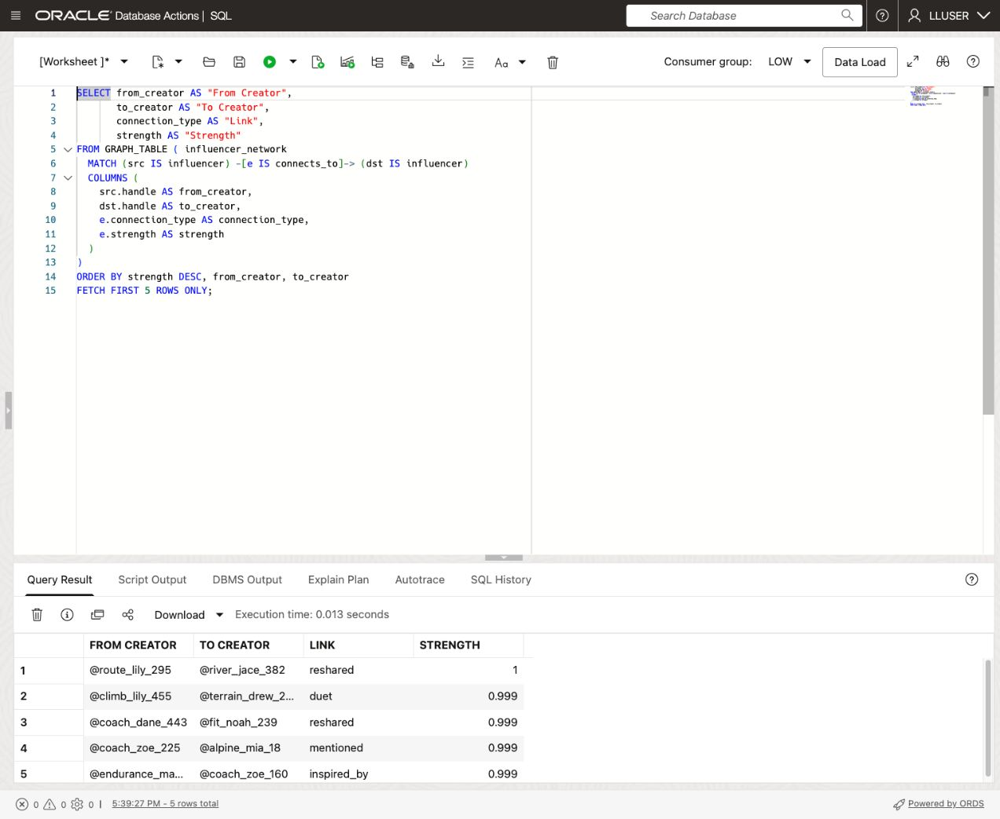
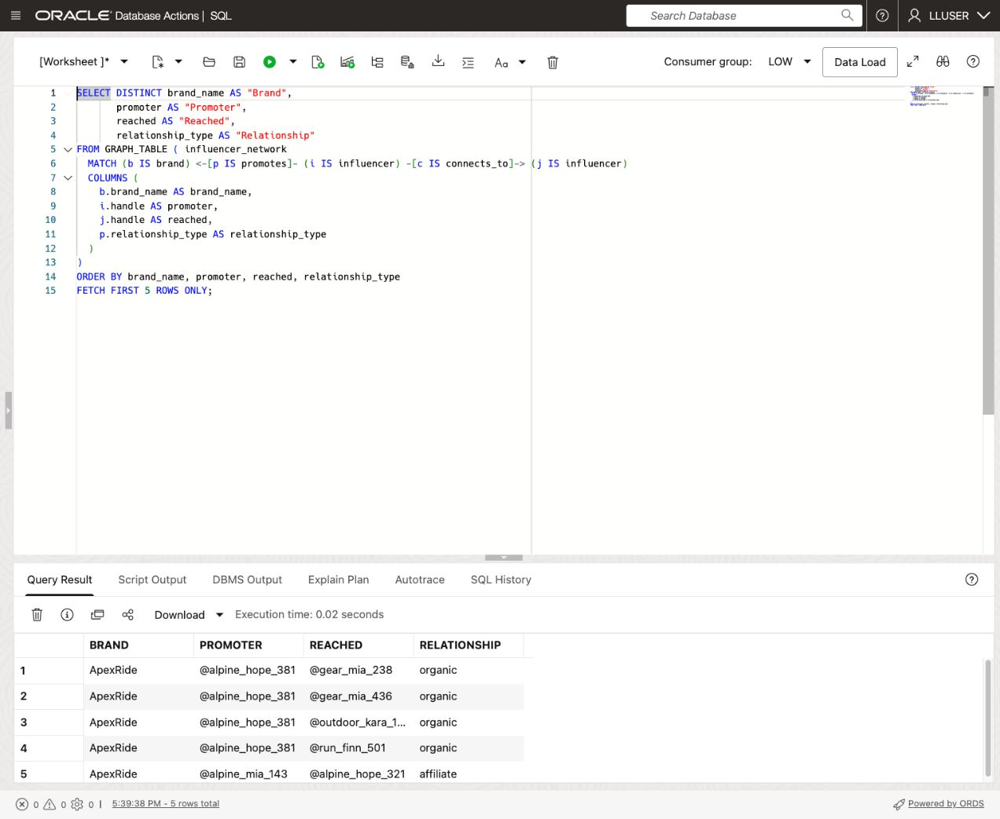
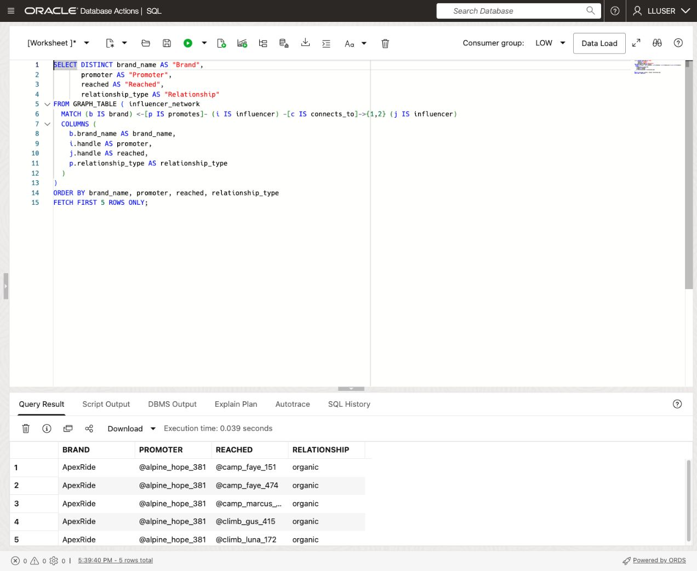
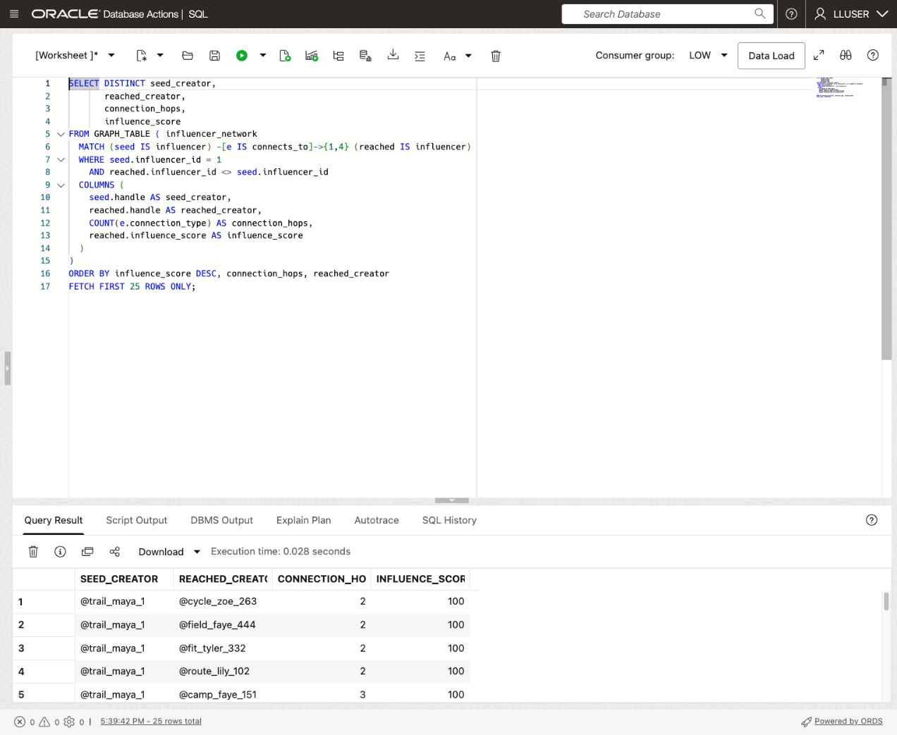
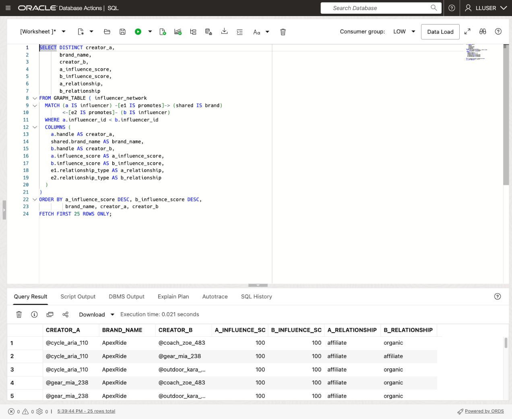
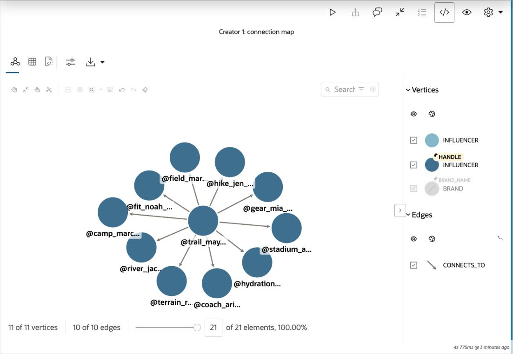
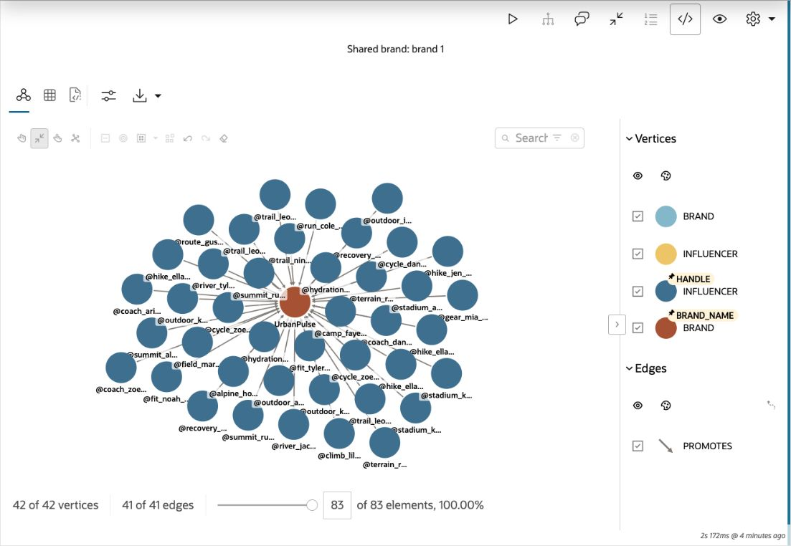

# Investigate a Creator Influence Network

## Introduction

Bob Green is a seasoned graph specialist at Seer Sporting Goods. The Monday demand review has already connected product searches with customer and order data. Bob now wants to understand the creator relationships behind the social signals.

His starting point is simple: one post does not show the whole network. A creator can promote a brand, connect to another creator, or share a brand relationship with someone the team already follows. Bob needs to make those recorded relationships easy to inspect before the team decides where to focus its attention.

In this lab, you will use Bob's approach in two views. Start with ordinary SQL, then use SQL Property Graph Queries (SQL/PGQ) to express the same relationships as paths. Finally, open Graph Studio and explore the connections as an interactive network. SQL supplies a repeatable evidence table; Graph Studio helps a reviewer follow the relationships visually.



<details>
<summary><strong>Key terms: property graph, vertex, edge, hop, and SQL/PGQ</strong></summary>

> - A **property graph** represents things and the connections between them. This graph includes creators, brands, products, and social posts.
>
> - A **vertex** is a node. Creator vertices carry the `INFLUENCER` label and properties such as a handle and influence score; brand vertices carry the `BRAND` label.
>
> - An **edge** connects vertices. `CONNECTS_TO` joins a creator to another creator. `PROMOTES` runs from a creator to a brand and records a relationship such as sponsored, affiliate, or organic.
>
> - A **hop** is one edge along a path. Two creator hops mean following two `CONNECTS_TO` edges; the brand-promotion edge is a separate step.
>
> - **SQL/PGQ** describes graph patterns inside SQL with `GRAPH_TABLE`. The graph definition maps the existing relational rows to vertices and edges.

</details>

### Objectives

- Identify the vertices, edges, and directions in the creator network.
- Compare relational joins with SQL/PGQ results.
- Follow creator connections over a bounded number of hops.
- Find creator pairs that share a brand relationship.
- Import the Retail notebook into Graph Studio and interpret its visual results.

Estimated Time: **20 minutes**

### Hands-on Scenario

| Step | Retail focus |
| --- | --- |
| Business Problem | The retail team needs context for creator signals before prioritizing a campaign or product review. |
| Technical Challenge | Bob needs to follow relationships several steps away without extending a chain of joins for every path length. |
| Persona Focus | You review Bob's creator network with a retail analyst. |
| What You Will See | Relational queries and graph patterns reveal direct links, longer paths, and shared brands. |
| Database Capability | INFLUENCER\_NETWORK and GRAPH\_TABLE provide SQL/PGQ over Retail tables; Graph Studio displays the relationships. |
| Outcome | A reviewer can identify connected creators and explain the recorded links behind a recommendation. |

Persona focus: You are reviewing Bob's graph solution for the Monday demand review.

> **SQL Worksheet reminder:** Need a reminder on how to open and use the SQL Worksheet? Return to [Getting Started Task 2: Open SQL Worksheet](?lab=getting-started#Task2:OpenSQLWorksheet) for the step-by-step graphic showing where to paste and run SQL statements.

## Task 1: Follow creator connections with SQL

Jessica has written a query that ranks direct creator connections by their stored strength. It works well for one hop. Bob wants to show what changes when the team follows a creator's connections through another creator.

1. Run Jessica's ordinary SQL query:

    ```sql
    <copy>
    SELECT src.handle AS "From Creator",
           dst.handle AS "To Creator",
           e.connection_type AS "Link",
           e.strength AS "Strength"
    FROM influencers src
    JOIN influencer_connections e
      ON e.from_influencer = src.influencer_id
    JOIN influencers dst
      ON dst.influencer_id = e.to_influencer
    ORDER BY e.strength DESC, src.handle, dst.handle
    FETCH FIRST 5 ROWS ONLY;
    </copy>
    ```

    

    The query joins `INFLUENCERS` twice: once for the source creator and once for the destination. `INFLUENCER_CONNECTIONS` supplies the edge and its properties.

    **Expected output: Direct creator connections**

    | From Creator | To Creator | Link | Strength |
    | --- | --- | --- | --- |
    | @route\_lily\_295 | @river\_jace\_382 | reshared | 1 |
    | @climb\_lily\_455 | @terrain\_drew\_202 | duet | 0.999 |
    | @coach\_dane\_443 | @fit\_noah\_239 | reshared | 0.999 |
    | @coach\_zoe\_225 | @alpine\_mia\_18 | mentioned | 0.999 |
    | @endurance\_maya\_221 | @coach\_zoe\_160 | inspired\_by | 0.999 |

    Strength is a stored property of the relationship. It does not measure sales caused by that creator.

2. Extend the question to brands and one or two creator hops:

    ```sql
    <copy>
    WITH creator_reach AS (
      SELECT c1.from_influencer AS promoter_id,
             c1.to_influencer AS reached_id
      FROM influencer_connections c1
      UNION
      SELECT c1.from_influencer,
             c2.to_influencer
      FROM influencer_connections c1
      JOIN influencers middle_creator
        ON middle_creator.influencer_id = c1.to_influencer
      JOIN influencer_connections c2
        ON c2.from_influencer = middle_creator.influencer_id
    )
    SELECT DISTINCT b.brand_name AS "Brand",
           promoter.handle AS "Promoter",
           reached.handle AS "Reached",
           bl.relationship_type AS "Relationship"
    FROM brands b
    JOIN brand_influencer_links bl
      ON bl.brand_id = b.brand_id
    JOIN influencers promoter
      ON promoter.influencer_id = bl.influencer_id
    JOIN creator_reach cr
      ON cr.promoter_id = promoter.influencer_id
    JOIN influencers reached
      ON reached.influencer_id = cr.reached_id
    ORDER BY "Brand", "Promoter", "Reached", "Relationship"
    FETCH FIRST 5 ROWS ONLY;
    </copy>
    ```

    

    The first branch follows one creator link; the second follows two. `UNION` combines those alternatives. The outer joins attach the brand and promoter to each reached creator. The intermediate creator join keeps the path subject to the same row visibility as the graph query you will run later.

    **Expected output: Brand relationships and reached creators**

    | Brand | Promoter | Reached | Relationship |
    | --- | --- | --- | --- |
    | ApexRide | @alpine\_hope\_381 | @camp\_faye\_151 | organic |
    | ApexRide | @alpine\_hope\_381 | @camp\_faye\_474 | organic |
    | ApexRide | @alpine\_hope\_381 | @camp\_marcus\_131 | organic |
    | ApexRide | @alpine\_hope\_381 | @climb\_gus\_415 | organic |
    | ApexRide | @alpine\_hope\_381 | @climb\_luna\_172 | organic |

3. Review how the SQL changes with the path length.

    Another hop requires another connection join. Bob can express the same variable path length directly in a graph pattern, while keeping these relational tables as the source of the evidence.

## Task 2: Read the same connections as a graph

Bob has already defined the `INFLUENCER_NETWORK` property graph over the Retail tables. The graph definition adds labels and relationship structure; it does not create a second copy of the source rows.

1. Inspect the graph available to your workshop user:

    ```sql
    <copy>
    SELECT graph_name AS "Graph"
    FROM user_property_graphs
    WHERE graph_name = 'INFLUENCER_NETWORK';
    </copy>
    ```

    

    **Expected output: Graph name**

    | Graph |
    | --- |
    | INFLUENCER\_NETWORK |

2. Run Bob's SQL/PGQ version of the direct-connections query:

    ```sql
    <copy>
    SELECT from_creator AS "From Creator",
           to_creator AS "To Creator",
           connection_type AS "Link",
           strength AS "Strength"
    FROM GRAPH_TABLE ( influencer_network
      MATCH (src IS influencer) -[e IS connects_to]-> (dst IS influencer)
      COLUMNS (
        src.handle AS from_creator,
        dst.handle AS to_creator,
        e.connection_type AS connection_type,
        e.strength AS strength
      )
    )
    ORDER BY strength DESC, from_creator, to_creator
    FETCH FIRST 5 ROWS ONLY;
    </copy>
    ```

    

    In the pattern, `src` and `dst` are creator vertices and `e` is the directed connection between them. `IS influencer` and `IS connects_to` refer to graph labels, while the `COLUMNS` clause returns properties as ordinary SQL columns.

    **Expected output: The same five direct connections as Task 1**

    | Compare | What should match |
    | --- | --- |
    | From Creator and To Creator | The same creator handles in the same order |
    | Link and Strength | The same relationship type and stored strength |

    The question and evidence stay the same. Bob changes how the query expresses the relationship.

## Task 3: Trace brand relationships through the network

Bob now asks which creators are connected to a brand's promoters. A path can help the team choose a relationship to review, but it does not prove that an audience saw a campaign or bought a product.

1. Follow a promotion relationship and one creator connection:

    ```sql
    <copy>
    SELECT DISTINCT brand_name AS "Brand",
           promoter AS "Promoter",
           reached AS "Reached",
           relationship_type AS "Relationship"
    FROM GRAPH_TABLE ( influencer_network
      MATCH (b IS brand) <-[p IS promotes]- (i IS influencer) -[c IS connects_to]-> (j IS influencer)
      COLUMNS (
        b.brand_name AS brand_name,
        i.handle AS promoter,
        j.handle AS reached,
        p.relationship_type AS relationship_type
      )
    )
    ORDER BY brand_name, promoter, reached, relationship_type
    FETCH FIRST 5 ROWS ONLY;
    </copy>
    ```

    

    The arrow pointing toward `b` follows the stored `PROMOTES` direction from creator to brand. The next arrow follows `CONNECTS_TO` from the promoter to another creator.

    **Expected output: One creator hop beyond a promoter**

    | Brand | Promoter | Reached | Relationship |
    | --- | --- | --- | --- |
    | ApexRide | @alpine\_hope\_381 | @gear\_mia\_238 | organic |
    | ApexRide | @alpine\_hope\_381 | @gear\_mia\_436 | organic |
    | ApexRide | @alpine\_hope\_381 | @outdoor\_kara\_155 | organic |
    | ApexRide | @alpine\_hope\_381 | @run\_finn\_501 | organic |
    | ApexRide | @alpine\_mia\_143 | @alpine\_hope\_321 | affiliate |

2. Expand the creator path to one or two hops:

    ```sql
    <copy>
    SELECT DISTINCT brand_name AS "Brand",
           promoter AS "Promoter",
           reached AS "Reached",
           relationship_type AS "Relationship"
    FROM GRAPH_TABLE ( influencer_network
      MATCH (b IS brand) <-[p IS promotes]- (i IS influencer) -[c IS connects_to]->{1,2} (j IS influencer)
      COLUMNS (
        b.brand_name AS brand_name,
        i.handle AS promoter,
        j.handle AS reached,
        p.relationship_type AS relationship_type
      )
    )
    ORDER BY brand_name, promoter, reached, relationship_type
    FETCH FIRST 5 ROWS ONLY;
    </copy>
    ```

    

    `->{1,2}` permits either one or two creator connections. The promotion relationship is unchanged. `DISTINCT` removes duplicate output rows when different paths reach the same combination.

    **Expected output: The same five rows as the extended SQL query in Task 1**

    | Brand | Promoter | Reached | Relationship |
    | --- | --- | --- | --- |
    | ApexRide | @alpine\_hope\_381 | @camp\_faye\_151 | organic |
    | ApexRide | @alpine\_hope\_381 | @camp\_faye\_474 | organic |
    | ApexRide | @alpine\_hope\_381 | @camp\_marcus\_131 | organic |
    | ApexRide | @alpine\_hope\_381 | @climb\_gus\_415 | organic |
    | ApexRide | @alpine\_hope\_381 | @climb\_luna\_172 | organic |

    Compare the result with Jessica's two-branch query. The graph pattern states the allowed path lengths in one place.

3. Explore up to four creator hops from creator `1`, `@trail_maya_1`:

    ```sql
    <copy>
    SELECT DISTINCT seed_creator,
           reached_creator,
           connection_hops,
           influence_score
    FROM GRAPH_TABLE ( influencer_network
      MATCH (seed IS influencer) -[e IS connects_to]->{1,4} (reached IS influencer)
      WHERE seed.influencer_id = 1
        AND reached.influencer_id <> seed.influencer_id
      COLUMNS (
        seed.handle AS seed_creator,
        reached.handle AS reached_creator,
        COUNT(e.connection_type) AS connection_hops,
        reached.influence_score AS influence_score
      )
    )
    ORDER BY influence_score DESC, connection_hops, reached_creator
    FETCH FIRST 25 ROWS ONLY;
    </copy>
    ```

    

    **Expected output: Up to 25 reached-creator rows**

    | Column | Interpretation |
    | --- | --- |
    | SEED\_CREATOR | The starting handle, @trail\_maya\_1 |
    | REACHED\_CREATOR | A different creator connected by a permitted path |
    | CONNECTION\_HOPS | One through four creator connections |
    | INFLUENCE\_SCORE | The reached creator's stored score |

    A creator may appear at more than one depth. This query orders by influence score and path length; it does not claim to return each creator's shortest path or a measured campaign audience.

## Task 4: Find creators who share a brand relationship

Two creators can be relevant to the same review even when they have no direct connection to each other. Bob uses a shared brand as the link between them.

1. Run the shared-brand pattern:

    ```sql
    <copy>
    SELECT DISTINCT creator_a,
           brand_name,
           creator_b,
           a_influence_score,
           b_influence_score,
           a_relationship,
           b_relationship
    FROM GRAPH_TABLE ( influencer_network
      MATCH (a IS influencer) -[e1 IS promotes]-> (shared IS brand)
            <-[e2 IS promotes]- (b IS influencer)
      WHERE a.influencer_id < b.influencer_id
      COLUMNS (
        a.handle AS creator_a,
        shared.brand_name AS brand_name,
        b.handle AS creator_b,
        a.influence_score AS a_influence_score,
        b.influence_score AS b_influence_score,
        e1.relationship_type AS a_relationship,
        e2.relationship_type AS b_relationship
      )
    )
    ORDER BY a_influence_score DESC, b_influence_score DESC,
             brand_name, creator_a, creator_b
    FETCH FIRST 25 ROWS ONLY;
    </copy>
    ```

    

    The pattern goes from creator `a` to a shared brand and back to creator `b`. The ID comparison keeps each creator pair in one direction instead of repeating it in reverse.

    **Expected output: Up to 25 creator pairs with a shared brand**

    | CREATOR\_A | BRAND\_NAME | CREATOR\_B | A\_RELATIONSHIP | B\_RELATIONSHIP |
    | --- | --- | --- | --- | --- |
    | @cycle\_aria\_110 | ApexRide | @coach\_zoe\_483 | affiliate | organic |
    | @cycle\_aria\_110 | ApexRide | @gear\_mia\_238 | affiliate | affiliate |
    | @cycle\_aria\_110 | ApexRide | @outdoor\_kara\_478 | affiliate | organic |

2. Read one row as a business reviewer.

    Identify the shared brand and the relationship on each side. A sponsored link and an organic link describe different connections. A shared brand gives the team a reason to examine the creators together; it does not establish overlapping audiences or attributable revenue.

## Task 5: Open Graph Studio and import the Retail notebook

The SQL results answer precise questions. Bob now wants a visual map that lets the team select a creator, inspect a link, and explain a shared brand without reconstructing the path from several rows.

1. Return to the Database Actions launchpad and confirm that the workshop user is `LLUSER`.

2. On **Development**, select **Graph Studio** and click **Open**. If prompted, sign in with the workshop username and password from **View Login Info**.

3. Open **Notebooks**. Download [retail-creator-network-graph-studio.dsnb](files/retail-creator-network-graph-studio.dsnb). If your browser displays the file, use **Save Link As** to save it locally.

4. Click **Import**, select or drag the downloaded file into the import window, and click **Import**. Open **Retail Creator Network**.

5. Read the opening paragraph. The main notebook uses `%sql` paragraphs against `LLUSER.INFLUENCER_NETWORK`, the same database graph used in SQL Worksheet. The optional final section explains the separate in-memory PGX workflow.

    **Expected output: A Retail notebook with SQL tables and graph visualizations**

    | Notebook section | Purpose |
    | --- | --- |
    | Direct creator connections | Reproduce Task 2 as a table |
    | Brand relationships over two creator hops | Reproduce Task 3 as a table |
    | Creator 1: connection evidence and connection map | Compare the connection properties with the directed links around @trail\_maya\_1 |
    | Brand 1: promotion evidence and Shared brand: brand 1 | Compare promotion relationships with the creators connected to UrbanPulse |

## Task 6: Run and interpret the Graph Studio notebook

1. Run **Direct creator connections** and compare the five rows with Task 2. Run **Brand relationships over two creator hops** and compare its table with Task 3.

2. Run **Creator 1: connection evidence**, then **Creator 1: connection map**. The table returns the ten outgoing connections from @trail\_maya\_1, including the reached creator, connection type, strength, and interaction count. The map uses the same pattern and creator filter.

    **Expected output: 11 creator vertices and 10 directed connections**

    Select a node and inspect its `HANDLE`. Select an edge and compare `CONNECTION_TYPE`, `STRENGTH`, and `INTERACTION_COUNT` with the table.

    

3. Run **Brand 1: promotion evidence**, then **Shared brand: brand 1**. The table returns the 41 recorded promotion relationships for UrbanPulse. The map places the brand at the center of those relationships.

    **Expected output: 42 vertices and 41 promotion edges**

    Select the brand node and inspect `BRAND_NAME`. Follow the incoming `PROMOTES` edges and compare each creator's `HANDLE` and each edge's `RELATIONSHIP_TYPE` with the table.

    

4. Explain the picture to another reviewer.

    A creator connection is different from a promotion relationship. The graph makes that distinction visible through the vertex labels, edge labels, and direction. The layout may place nodes differently on another run; compare the stored IDs and properties when checking the evidence.

5. Optionally run **Load the SQL property graph into PGX** and its following PGQL paragraph.

    This is a separate in-memory graph session. The Python paragraph loads the database's SQL property graph with source type `pg_sql`; the PGQL paragraph uses `FROM MATCH ... ON INFLUENCER_NETWORK` and `LIMIT`. Do not paste the PGQL paragraph into SQL Worksheet. The notebook explains this syntax difference and keeps the primary SQL/PGQ investigation available without the optional step.

## Conclusion: Make Relationships Easy to Review

Bob followed direct creator connections, extended the search over several hops, and found creator pairs that share a brand. The graph patterns kept those questions readable while returning the handles, relationship types, and scores a reviewer needs.

Graph Studio presents the same recorded relationships as an interactive network. A reviewer can inspect a creator, follow a connection, and explain why two creators appear in the same brand review. These paths add context to the product signals from the previous lab.

Bob hands that context to Moon. The next question is operational: where can Seer Sporting Goods review fulfillment options for the products receiving attention?

## Appendix: How the property graph maps the Retail tables

The existing graph contains these mappings. This is a reference for reading the patterns; the workshop database already contains the graph.

| Relational table | Graph label | Role |
| --- | --- | --- |
| INFLUENCERS | INFLUENCER | Creator vertices keyed by INFLUENCER\_ID |
| BRANDS | BRAND | Brand vertices keyed by BRAND\_ID |
| PRODUCTS | PRODUCT | Product vertices keyed by PRODUCT\_ID |
| SOCIAL\_POSTS | SOCIAL\_POST | Post vertices keyed by POST\_ID |
| INFLUENCER\_CONNECTIONS | CONNECTS\_TO | FROM\_INFLUENCER to TO\_INFLUENCER |
| BRAND\_INFLUENCER\_LINKS | PROMOTES | INFLUENCER\_ID to BRAND\_ID |
| POST\_PRODUCT\_MENTIONS | MENTIONS\_PRODUCT | POST\_ID to PRODUCT\_ID |

The graph definition uses the source tables' keys and properties. It does not infer a creator-to-post edge or a sale from a connection.

<details>
<summary><strong>Reference: the existing property graph definition</strong></summary>

This is the definition already installed in your workshop. Read it as a reference; do not run it against the graph you just queried.

```sql
CREATE PROPERTY GRAPH "INFLUENCER_NETWORK"
  VERTEX TABLES (
   "BRANDS" AS "BRANDS" KEY ("BRAND_ID")
      LABEL BRAND PROPERTIES ("BRAND_ID", "BRAND_NAME", "BRAND_CATEGORY", "SOCIAL_TIER"),
   "INFLUENCERS" AS "INFLUENCERS" KEY ("INFLUENCER_ID")
      LABEL INFLUENCER PROPERTIES ("INFLUENCER_ID", "HANDLE", "DISPLAY_NAME", "PLATFORM", "FOLLOWER_COUNT", "ENGAGEMENT_RATE", "INFLUENCE_SCORE", "NICHE", "CITY", "REGION", "IS_VERIFIED"),
   "PRODUCTS" AS "PRODUCTS" KEY ("PRODUCT_ID")
      LABEL PRODUCT PROPERTIES ("PRODUCT_ID", "PRODUCT_NAME", "CATEGORY", "UNIT_PRICE"),
   "SOCIAL_POSTS" AS "SOCIAL_POSTS" KEY ("POST_ID")
      LABEL SOCIAL_POST PROPERTIES ("POST_ID", "PLATFORM", "POSTED_AT", "VIRALITY_SCORE", "MOMENTUM_FLAG") )
  EDGE TABLES (
   "BRAND_INFLUENCER_LINKS" AS "BRAND_INFLUENCER_LINKS" KEY ("LINK_ID")
      SOURCE KEY("INFLUENCER_ID") REFERENCES INFLUENCERS ("INFLUENCER_ID")
      DESTINATION KEY("BRAND_ID") REFERENCES BRANDS ("BRAND_ID")
     LABEL PROMOTES PROPERTIES ("RELATIONSHIP_TYPE", "POST_COUNT", "AVG_ENGAGEMENT", "REVENUE_ATTRIBUTED"),
   "INFLUENCER_CONNECTIONS" AS "INFLUENCER_CONNECTIONS" KEY ("CONNECTION_ID")
      SOURCE KEY("FROM_INFLUENCER") REFERENCES INFLUENCERS ("INFLUENCER_ID")
      DESTINATION KEY("TO_INFLUENCER") REFERENCES INFLUENCERS ("INFLUENCER_ID")
     LABEL CONNECTS_TO PROPERTIES ("CONNECTION_TYPE", "STRENGTH", "INTERACTION_COUNT"),
   "POST_PRODUCT_MENTIONS" AS "POST_PRODUCT_MENTIONS" KEY ("MENTION_ID")
      SOURCE KEY("POST_ID") REFERENCES SOCIAL_POSTS ("POST_ID")
      DESTINATION KEY("PRODUCT_ID") REFERENCES PRODUCTS ("PRODUCT_ID")
     LABEL MENTIONS_PRODUCT PROPERTIES ("CONFIDENCE_SCORE", "MENTION_TYPE") )
  OPTIONS (TRUSTED MODE, DISALLOW MIXED PROPERTY TYPES);
```

</details>

The notebook's optional memory load follows Oracle's [SQL property graph loading workflow](https://docs.oracle.com/en/cloud/paas/autonomous-database/csgru/load-graphs-memory-programmatically.html).

## Acknowledgements

* **Author** - Linda Foinding, Principal Database Product Manager
* **Last Updated By/Date** - Oracle Database Product Management, October 2026
