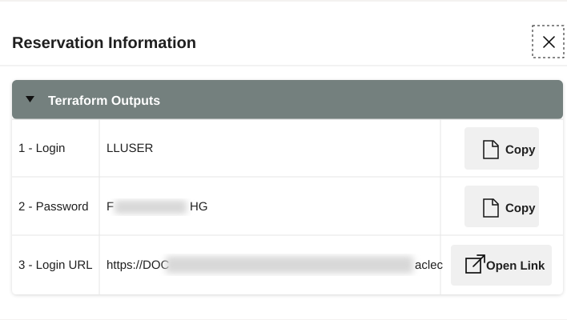
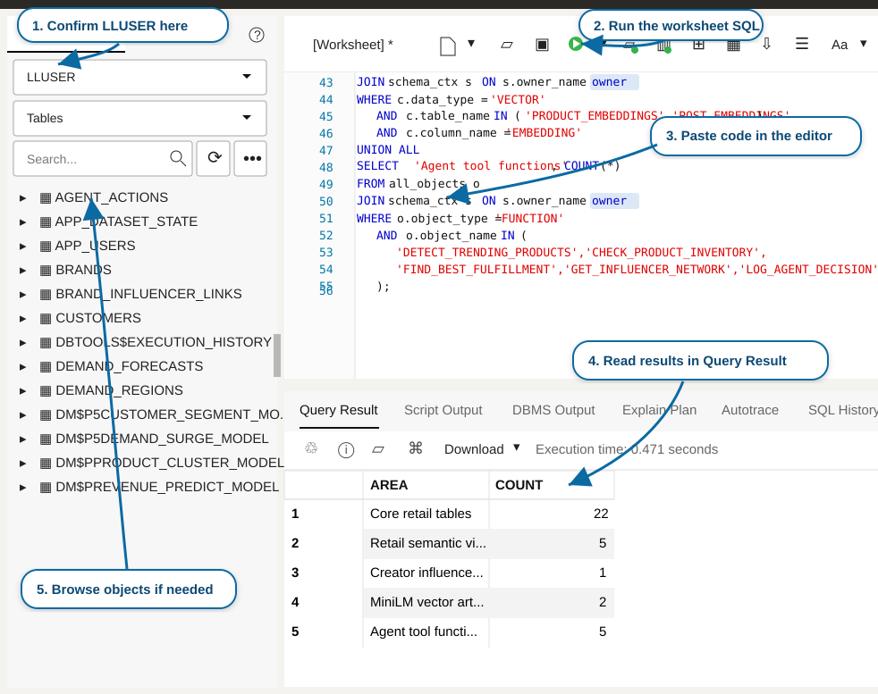
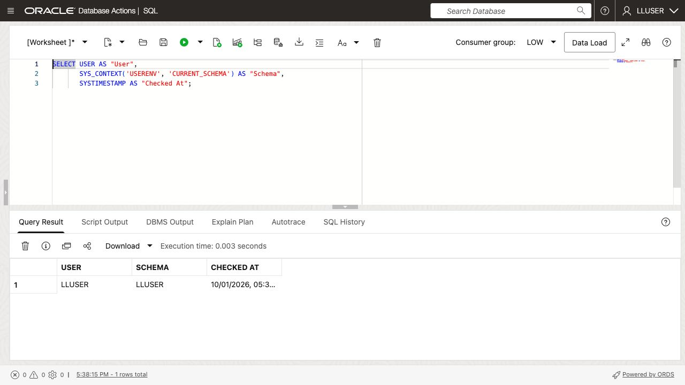
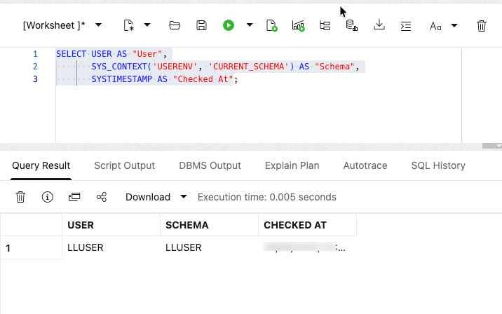

# Getting Started

## Introduction

Open your LiveLabs reservation, sign in to Autonomous Database 26ai, and prepare SQL Worksheet for the retail exercises. You will use the worksheet to examine the product, order, and customer records that Jessica’s team reviews throughout the workshop.

<details>
<summary><strong>Key terms: Database Actions, SQL Worksheet, and LLUSER</strong></summary>

> - **Database Actions** is the browser-based Oracle Database workspace you use in this workshop. It gives you access to SQL Worksheet, object browsing, and development tools without installing a desktop database client.
>
> - **SQL Worksheet** is the tool inside Database Actions where you paste and run SQL statements. It shows query results, script output, and errors, so it becomes the main place where you connect the application screens in this workshop to database evidence.
>
> - `LLUSER` is the account for the retail exercises. Sign in with this account so the tables, views, models, graph, and functions used in later labs are available to your worksheet.

</details>

Estimated Time: **5 minutes**

### Objectives

In this lab, you will:

- Launch the LiveLabs workshop environment.
- Use the reservation login information to open Database Actions.
- Confirm that SQL Worksheet is ready for the retail schema.
- Confirm that SQL Worksheet is connected as the workshop schema user.

## Task 1: Launch the LiveLabs environment

Start from the LiveLabs reservation so Database Actions opens with the correct workshop resources. The goal is simply to get into the environment that already contains the database and sign-in details for this workshop.

1. Sign in to [LiveLabs](https://livelabs.oracle.com) with your Oracle account.

2. Open this workshop, select **Start**, and select **Run on LiveLabs Sandbox**.

3. In **My Reservations**, select **Launch Workshop** for this reservation.

4. Select **View Login Info** and keep the database credentials available for the next task.

    

    *Figure 1: The Reservation Information dialog shows the `LLUSER` login, password, and Login URL for Database Actions.*

## Task 2: Open SQL Worksheet

Open SQL Worksheet as the workshop user before running the retail queries. SQL Worksheet is where you will ask the database each question and immediately see the evidence returned as a table.

1. In the **Reservation Information** dialog, confirm that **1 - Login** shows `LLUSER`.

2. Select **Copy** for **2 - Password**.

    

    *Figure 2: Copy the `LLUSER` password from the Reservation Information dialog.*

3. Select **Open Link** for **3 - Login URL**.

    

    *Figure 3: Use Open Link for the Login URL, then use the copied password to sign in as `LLUSER`.*

4. On the Database Actions sign-in page, confirm that **Username** shows `LLUSER`, paste the password from the reservation information, and select **Sign in**.

    

    *Figure 4: Sign in to Database Actions as `LLUSER` with the password from the reservation information.*

5. Before SQL Worksheet opens, select **Development**, then select **SQL** from the tools menu.

    

    *Figure 5: Open SQL from the Development tools menu.*

6. Use the same SQL Worksheet pattern throughout the workshop.

    

    *Figure 6: Use SQL Worksheet to confirm the active user, run each block as directed, and review its query result or script output.*

    - Confirm that the user dropdown shows `LLUSER`.
    - Paste each workshop SQL block into the editor.
    - For a single statement, select **Run Statement** or press **Ctrl+Enter**. When a lab specifies **Run Script**, use that control for the complete block.
    - Review the output in **Query Result** or **Script Output**, depending on the step.
    - Use **Navigator** only when you want to inspect tables, views, or other objects.

7. Run this check.

    This check makes sure SQL Worksheet is connected as the right user before you start. `USER` shows who signed in, while `SYS_CONTEXT('USERENV', 'CURRENT_SCHEMA')` shows where table names resolve. The retail labs use `LLUSER`, so both values should point to the workshop schema.

    ```sql
    <copy>
    SELECT USER AS "User",
           SYS_CONTEXT('USERENV', 'CURRENT_SCHEMA') AS "Schema",
           SYSTIMESTAMP AS "Checked At";
    </copy>
    ```

    

    

    **Expected output: Connected SQL Worksheet Session**

    | User | Schema | Checked At |
    | --- | --- | --- |
    | LLUSER | LLUSER | Current SQL Worksheet timestamp |


8. You can use this same connection check whenever you want to confirm that SQL Worksheet is still running as `LLUSER`.

With SQL Worksheet connected as `LLUSER`, continue to Lab 1 and investigate the retail dashboard query.

## Acknowledgements

* **Author** - Linda Foinding, Principal Database Product Manager
* **Last Updated By/Date** - Oracle Database Product Management, October 2026
