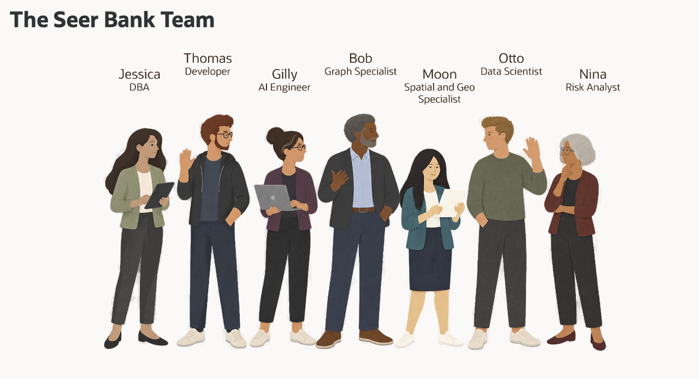

# Build Connected Retail Solutions with Oracle AI Database

## Introduction

Jessica Chan is the database administrator at Seer Sporting Goods. Monday starts with a demand spike in trail-running products. Her colleagues need order documents for the shopping application, relevant product matches, creator relationships, fulfillment options, demand scores, and answers they can take into a review meeting.

The requests look different, but they share one problem. The data is already in Oracle AI Database, and each team wants to use it in a different way:

- Thomas needs orders and their items as JSON for a web and mobile application.
- Gilly needs semantic search that finds products related to a customer's question.
- Bob needs to follow creator connections and the brands they promote.
- Moon needs to calculate distances between customers, fulfillment centers, and demand regions.
- Otto needs to train and score a product demand model.
- Nina needs to ask retail questions in ordinary language and inspect the evidence behind an answer.

Jessica helps each team use the existing records in the form its application needs. Relational tables remain the source for products and orders. JSON documents, vectors, graph relationships, spatial calculations, machine learning, and AI-assisted SQL work alongside those records.

This workshop follows Jessica and her colleagues through a connected review: notice a product signal, inspect the order, find related products, follow creator relationships, compare fulfillment options, review model scores, and ask a defined assistant for database facts. Each lab focuses on one requirement and hands the next business question to a colleague.

### What the team builds

| Team member | Requirement | What you will see |
| --- | --- | --- |
| Jessica, DBA | Build the query behind a retail review dashboard. | One SQL result combines product signals, semantic matches, JSON order activity, and regional location context. |
| Thomas, application developer | Give the application flexible order documents. | JSON columns, JSON collections, and JSON Relational Duality Views provide three ways to serve application data. |
| Gilly, AI engineer | Find products related to a shopping question. | An in-database ONNX model creates product vectors; search results connect to existing orders and customers. |
| Bob, graph specialist | Investigate creator and brand relationships. | Relational joins and a property graph expose direct connections, longer paths, and shared brands. |
| Moon, spatial expert | Compare fulfillment options for customers and regions. | Geographic calculations combine with recorded stock, while maps show the same locations. |
| Otto, data scientist | Build a product demand watchlist. | Oracle Machine Learning trains and scores a demonstration model beside product and activity data. |
| Nina, risk analyst | Ask retail questions without writing every query from scratch. | Select AI exposes generated SQL for review; Select AI Agent adds a defined SQL tool and execution history. |

Jessica's first query combines relational, JSON, vector, and spatial evidence. Later labs explore graph relationships, machine learning, and AI in their own tasks. A location is useful context, a vector score measures semantic proximity, and a model score supports review; none of these alone establishes future demand or a delivery promise.

<strong>Learn more: What does “converged database” mean?</strong>

> A converged database supports different data types and workloads on one database foundation. Here, relational rows, JSON documents, vectors, graphs, geographic data, machine learning models, and AI-assisted SQL support different requirements while keeping the business records and database privileges connected.
>
> Thomas can use an order as a document while Gilly joins its items to a search result. Bob, Moon, Otto, and Nina can add their analyses without making a separate operational copy for each capability. Where a lab creates a demonstration copy or scoring table, it explains that table's purpose.

### Objectives

- Follow Jessica's team through connected retail application and analysis requirements.
- Combine relational, JSON, vector, graph, spatial, machine-learning, and AI capabilities in practical tasks.
- Create and update an order document over the existing relational records.
- Connect product search, creator relationships, location, stock, and model scores to business questions.
- Inspect generated SQL and the actual tool history behind an AI-assisted answer.
- Relate the database results to the Seer Sporting Goods Retail LiveStack application.

Estimated Workshop Time: **130 minutes**, including Getting Started and the quiz, plus optional Studio and AutoML exploration.

## Acknowledgements

* **Author** - Kevin Lazarz
* **Contributors** - Eugenio Galiano, Pat Shepherd, Linda Foinding
* **Last Updated By/Date** - Oracle Database Product Management, September 2026
