# Build a Product Demand Watchlist with Oracle Machine Learning

## Introduction

Otto Spencer is Seer Sporting Goods' data scientist. His team supplies predictions for analytics charts and dashboards. The Monday review now has product, creator, and fulfillment evidence. Otto wants to add a demand watchlist that keeps the model's output beside the activity behind it.

A business user should be able to see which products the model flags, inspect their sales and social activity, and decide where further review is useful. Otto already has those values in Oracle AI Database. Training and scoring in the database lets SQL join a prediction directly to the product details the team recognizes.

In this lab, you inspect the training data, optionally compare algorithms with AutoML, create a named Generalized Linear Model, and score a separate demonstration snapshot. The model predicts `SURGE` or `STABLE`. The snapshot is constructed from the workshop data so you can follow the complete SQL workflow in one session.

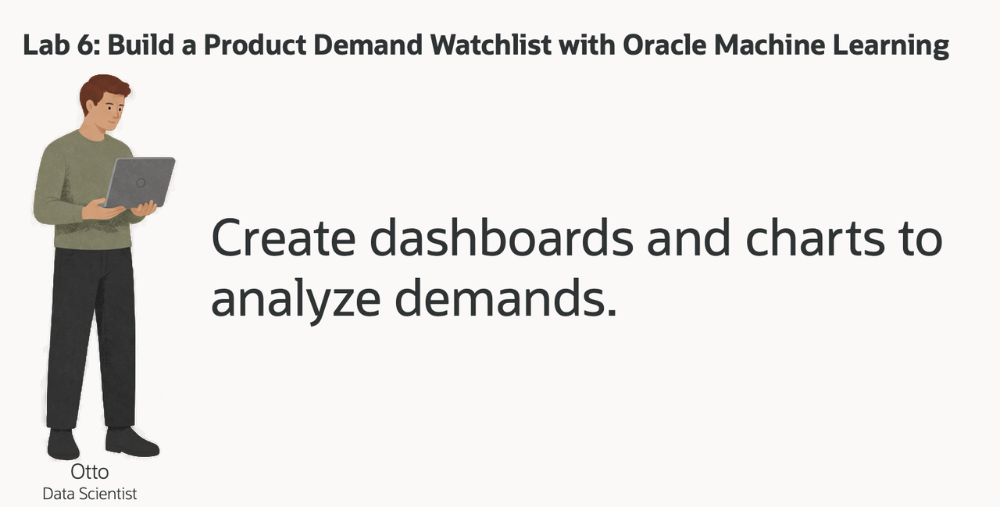

<details>
<summary><strong>Key terms: model, feature, target, classification, and probability</strong></summary>

> - A **model** learns a relationship between input values and an outcome from examples.
>
> - A **feature** is an input, such as category, price, social activity, or sales.
>
> - The **target** is the value learned during training. Here, `SURGE_LABEL` contains the derived labels `SURGE` and `STABLE`.
>
> - **Classification** predicts a label. `PREDICTION` returns the selected label; `PREDICTION_PROBABILITY` returns a model probability for a specified class.
>
> - **In-database machine learning** trains or scores where the source data lives. SQL can return a prediction with the product and activity values used to interpret it.

</details>

### Objectives

- Read the raw training view and identify its target and class distribution.
- Optionally compare classification models in AutoML.
- Create the workshop's Generalized Linear Model with SQL.
- Score a synthetic product-activity snapshot with explicit model inputs.
- Join predictions and probabilities to product details and interpret their limits.

Estimated Time: **15 minutes**, plus **5–10 minutes** for optional AutoML

### Hands-on Scenario

| Step | Retail focus |
| --- | --- |
| Business Problem | The product team wants a watchlist it can review alongside sales and social activity. |
| Technical Challenge | Otto needs to train and score without exporting the product data to another platform. |
| Persona Focus | You follow Otto as he prepares the model and inspects its output before it reaches a dashboard. |
| What You Will See | A training view, optional AutoML comparison, a named SQL model, and a twelve-product scoring result. |
| Database Capability | AutoML, DBMS\_DATA\_MINING, PREDICTION, and PREDICTION\_PROBABILITY keep modeling and scoring in the database. |
| Outcome | A business user can read the prediction and inspect the product activity behind it in one result. |

> **SQL Worksheet reminder:** Need a reminder on how to open and use the SQL Worksheet? Return to [Getting Started Task 2: Open SQL Worksheet](?lab=getting-started#Task2:OpenSQLWorksheet) for the step-by-step graphic showing where to paste and run SQL statements.

## Task 1: Read the training data

Otto first checks what the model will learn. `OML_DEMAND_TRAINING_V` combines product, social activity, and sales data into one row per active product. It is the training source, before any predictions are added.

The workshop derives `SURGE_LABEL` from activity values. These labels make the SQL workflow reproducible; they are not independently observed future demand outcomes.

1. Read the first ten training examples:

    ```sql
    <copy>
    SELECT product_id,
           category,
           unit_price,
           total_posts,
           avg_sentiment,
           viral_posts,
           rising_posts,
           units_sold,
           revenue,
           surge_label
    FROM oml_demand_training_v
    ORDER BY product_id
    FETCH FIRST 10 ROWS ONLY;
    </copy>
    ```

    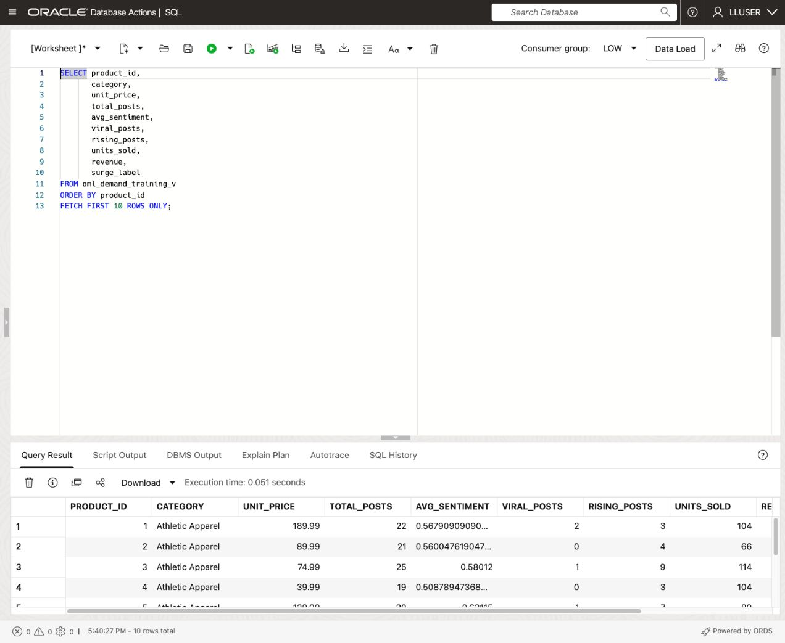

    **Expected output: Ten products with inputs and a target**

    | Column group | Role |
    | --- | --- |
    | PRODUCT\_ID | Case identifier for one product |
    | CATEGORY, UNIT\_PRICE, activity and sales columns | Candidate predictors |
    | SURGE\_LABEL | Target label: SURGE or STABLE |

2. Check how many examples belong to each class:

    ```sql
    <copy>
    SELECT surge_label,
           COUNT(*) AS product_count
    FROM oml_demand_training_v
    GROUP BY surge_label
    ORDER BY surge_label;
    </copy>
    ```

    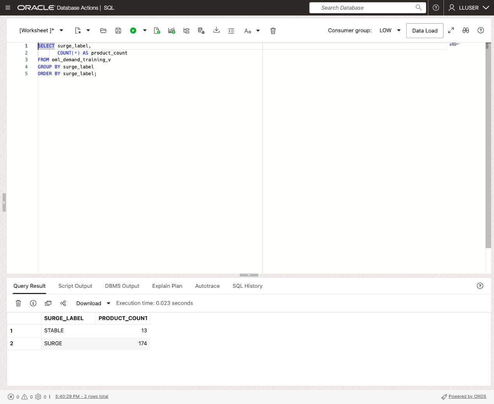

    **Expected output: Training label distribution**

    | SURGE\_LABEL | PRODUCT\_COUNT |
    | --- | --- |
    | STABLE | 13 |
    | SURGE | 174 |

    The classes are uneven: most products are labeled `SURGE`. A high overall accuracy number could therefore hide poor performance on `STABLE`. Otto must inspect how each class performs before treating a model as useful for prioritization.

3. Put the activity values beside familiar product names:

    ```sql
    <copy>
    SELECT p.product_name AS "Product",
           d.category AS "Category",
           d.total_posts AS "Posts",
           ROUND(d.avg_sentiment, 3) AS "Avg Sentiment",
           d.units_sold AS "Units Sold",
           ROUND(d.revenue, 2) AS "Revenue",
           d.surge_label AS "Label"
    FROM oml_demand_training_v d
    JOIN products p
      ON p.product_id = d.product_id
    ORDER BY d.total_posts DESC
    FETCH FIRST 5 ROWS ONLY;
    </copy>
    ```

    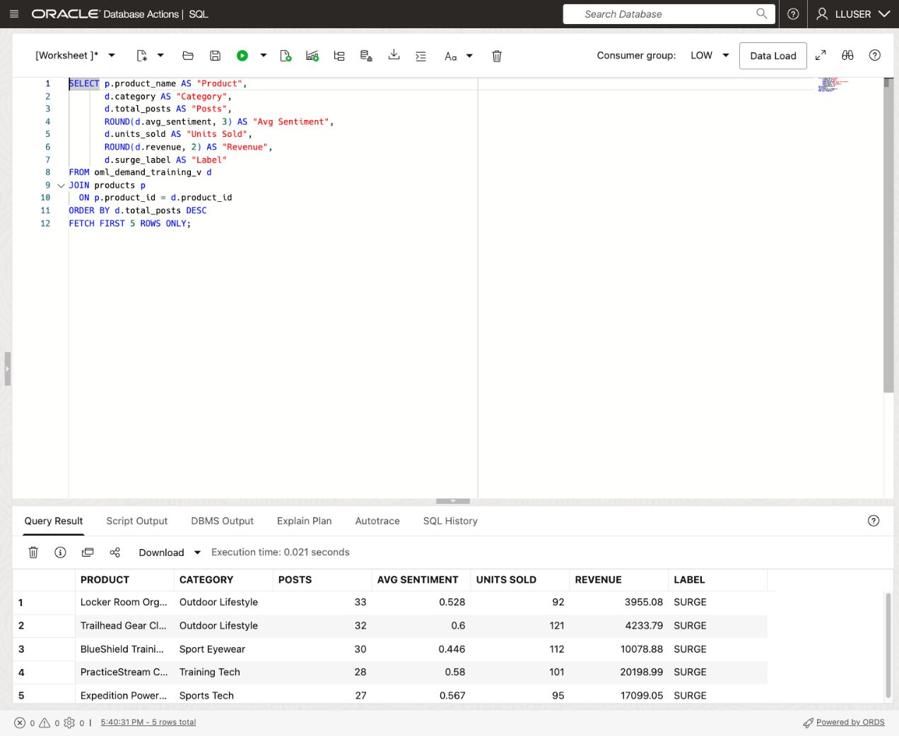

    **Expected output: Five products ordered by post count**

    | Result | What to inspect |
    | --- | --- |
    | Product and Category | Which product the row represents |
    | Posts, Avg Sentiment, Units Sold, Revenue | Activity the team can inspect alongside a model result |
    | Label | The derived training outcome |

    Otto can inspect those inputs without exporting separate product, social, and sales files.

## Task 2: Compare models with AutoML (optional)

AutoML can compare algorithms, tune models, and present evaluation results. This task is optional; continue with Task 3 to follow the reproducible SQL example.

1. Return to **Database Actions** and open **Machine Learning**. Sign in with the workshop username and password from **View Login Info** if requested.

2. Open **AutoML** and create an experiment with these settings:

    | Setting | Value |
    | --- | --- |
    | Experiment name | Retail Product Demand Surge |
    | Data source | OML\_DEMAND\_TRAINING\_V |
    | Predict / target | SURGE\_LABEL |
    | Prediction type | Classification |
    | Case ID | PRODUCT\_ID |

3. Review the predictors. Keep the category, price, social-activity, and sales columns as inputs. `PRODUCT_ID` is the case identifier and `SURGE_LABEL` is the target; neither should be an ordinary predictor. Start the experiment and wait for its leaderboard.

4. Open the leading model's details and inspect the confusion matrix. Compare the counts for both `SURGE` and `STABLE`, along with metrics such as balanced accuracy and F1. Check whether the model predicts only one class before interpreting its ranking.

5. Inspect another model, including a Generalized Linear Model if the experiment generated one. Compare its errors and predicted-class coverage. Review the feature-impact view when available, remembering that impact describes the fitted model rather than a causal effect on demand.

    **Expected output: An experiment leaderboard and model details**

    | Review | Question for Otto |
    | --- | --- |
    | Confusion matrix | Does the model identify examples from both classes? |
    | Class-sensitive metrics | How does it perform on the smaller STABLE class? |
    | Feature impact | Which inputs influence this fitted model? |

    Your experiment supplies the evidence for its own comparison. The SQL task below uses a fixed Generalized Linear Model recipe so everyone can create the same named model; it does not assume that this algorithm won the AutoML experiment.

## Task 3: Create the example model in SQL Developer Web

Otto now creates `RETAIL_DEMAND_MODEL`, a model that a dashboard query can call repeatedly. The settings specify a Generalized Linear Model, automatic data preparation, and a fixed random seed.

1. Inspect the four models already supplied with the Retail data:

    ```sql
    <copy>
    SELECT model_name AS "Model",
           mining_function AS "Function",
           algorithm AS "Algorithm"
    FROM user_mining_models
    WHERE model_name IN (
      'DEMAND_SURGE_MODEL','CUSTOMER_SEGMENT_MODEL',
      'REVENUE_PREDICT_MODEL','PRODUCT_CLUSTER_MODEL'
    )
    ORDER BY model_name;
    </copy>
    ```

    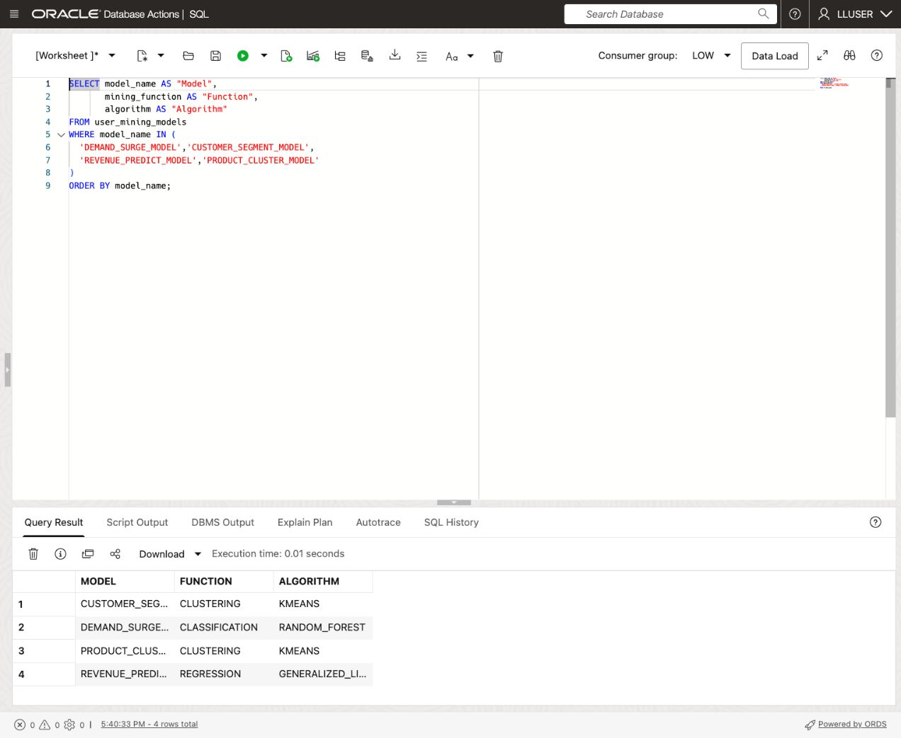

    **Expected output: Existing Retail models**

    | Model | Function | Algorithm |
    | --- | --- | --- |
    | CUSTOMER\_SEGMENT\_MODEL | CLUSTERING | KMEANS |
    | DEMAND\_SURGE\_MODEL | CLASSIFICATION | RANDOM\_FOREST |
    | PRODUCT\_CLUSTER\_MODEL | CLUSTERING | KMEANS |
    | REVENUE\_PREDICT\_MODEL | REGRESSION | GENERALIZED\_LINEAR\_MODEL |

    The existing `DEMAND_SURGE_MODEL` uses Random Forest. It remains available for the comparison in Task 4. The new `RETAIL_DEMAND_MODEL` is a separate example.

2. Run the following complete block with **Run Script**. It recreates this lab's `RETAIL_DEMAND_SETTINGS` table and `RETAIL_DEMAND_MODEL` if you repeat the task; it leaves the four supplied models intact.

    ```sql
    <copy>
    DROP TABLE IF EXISTS retail_demand_settings;

    CREATE TABLE retail_demand_settings (
      setting_name VARCHAR2(30),
      setting_value VARCHAR2(4000)
    );

    INSERT INTO retail_demand_settings (setting_name, setting_value)
    VALUES ('ALGO_NAME', 'ALGO_GENERALIZED_LINEAR_MODEL');
    INSERT INTO retail_demand_settings (setting_name, setting_value)
    VALUES ('PREP_AUTO', 'ON');
    INSERT INTO retail_demand_settings (setting_name, setting_value)
    VALUES ('ODMS_RANDOM_SEED', '20260604');
    COMMIT;

    DECLARE
      l_model_count NUMBER;
    BEGIN
      SELECT COUNT(*) INTO l_model_count
      FROM user_mining_models
      WHERE model_name = 'RETAIL_DEMAND_MODEL';
      IF l_model_count > 0 THEN
        DBMS_DATA_MINING.DROP_MODEL('RETAIL_DEMAND_MODEL');
      END IF;
    END;
    /

    BEGIN
      DBMS_DATA_MINING.CREATE_MODEL(
        model_name          => 'RETAIL_DEMAND_MODEL',
        mining_function     => DBMS_DATA_MINING.CLASSIFICATION,
        data_table_name     => 'OML_DEMAND_TRAINING_V',
        case_id_column_name => 'PRODUCT_ID',
        target_column_name  => 'SURGE_LABEL',
        settings_table_name => 'RETAIL_DEMAND_SETTINGS'
      );
    END;
    /
    </copy>
    ```

    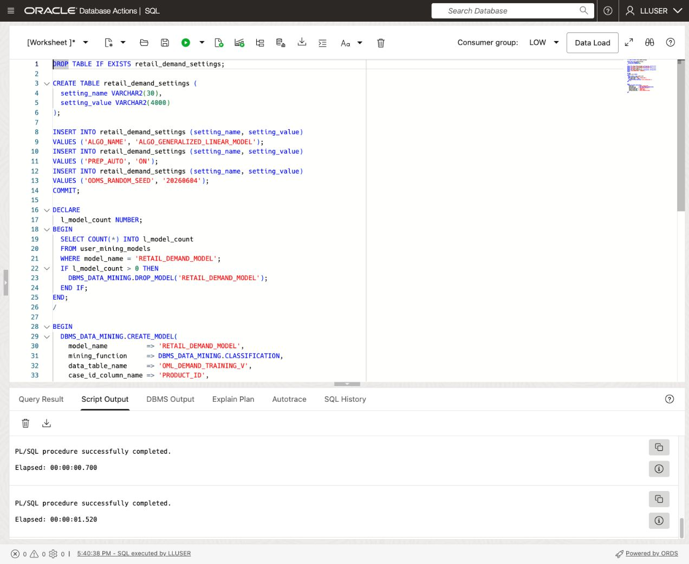

    **Expected output: Settings created and model training completed**

    The view supplies the training rows. `PRODUCT_ID` identifies each case and `SURGE_LABEL` supplies the target. The remaining training-view columns provide the predictors.

3. Confirm the new model:

    ```sql
    <copy>
    SELECT model_name,
           mining_function,
           algorithm
    FROM user_mining_models
    WHERE model_name = 'RETAIL_DEMAND_MODEL';
    </copy>
    ```

    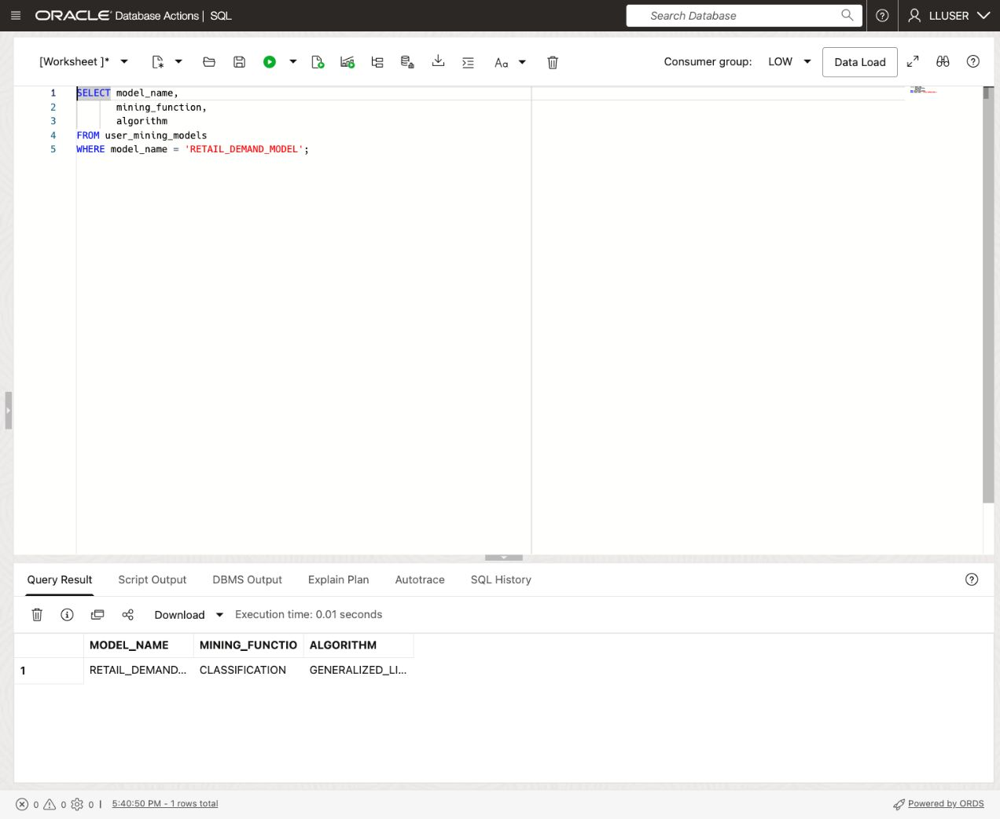

    **Expected output: The named classification model**

    | MODEL\_NAME | MINING\_FUNCTION | ALGORITHM |
    | --- | --- | --- |
    | RETAIL\_DEMAND\_MODEL | CLASSIFICATION | GENERALIZED\_LINEAR\_MODEL |

    Otto now has a database model that SQL can score without exporting the source rows.

## Task 4: Score a product-activity snapshot in SQL

Otto creates a separate scoring table for twelve products. This is a synthetic demonstration: it takes the lowest product IDs from the training view and adds fixed amounts to selected activity values. It is not an independently observed future period or a held-out accuracy test.

1. Create the scoring table and insert the demonstration snapshot with **Run Script**. Repeating this step replaces only `RETAIL_DEMAND_SCORING_DATA`.

    ```sql
    <copy>
    DROP TABLE IF EXISTS retail_demand_scoring_data;

    CREATE TABLE RETAIL_DEMAND_SCORING_DATA (
      product_id    NUMBER,
      category      VARCHAR2(100),
      unit_price    NUMBER,
      total_posts   NUMBER,
      avg_sentiment NUMBER,
      total_likes   NUMBER,
      total_shares  NUMBER,
      total_views   NUMBER,
      avg_virality  NUMBER,
      viral_posts   NUMBER,
      rising_posts  NUMBER,
      units_sold    NUMBER,
      revenue       NUMBER
    );

    INSERT INTO RETAIL_DEMAND_SCORING_DATA (
      product_id,
      category,
      unit_price,
      total_posts,
      avg_sentiment,
      total_likes,
      total_shares,
      total_views,
      avg_virality,
      viral_posts,
      rising_posts,
      units_sold,
      revenue
    )
    SELECT product_id,
           category,
           unit_price,
           total_posts + 4,
           avg_sentiment,
           total_likes + 25,
           total_shares + 10,
           total_views + 500,
           avg_virality + 0.05,
           viral_posts + 1,
           rising_posts + 1,
           units_sold + 3,
           revenue + (unit_price * 3)
    FROM (
      SELECT product_id,
             category,
             unit_price,
             total_posts,
             avg_sentiment,
             total_likes,
             total_shares,
             total_views,
             avg_virality,
             viral_posts,
             rising_posts,
             units_sold,
             revenue,
             ROW_NUMBER() OVER (ORDER BY product_id) AS row_num
      FROM oml_demand_training_v
    )
    WHERE row_num <= 12;

    COMMIT;
    </copy>
    ```

    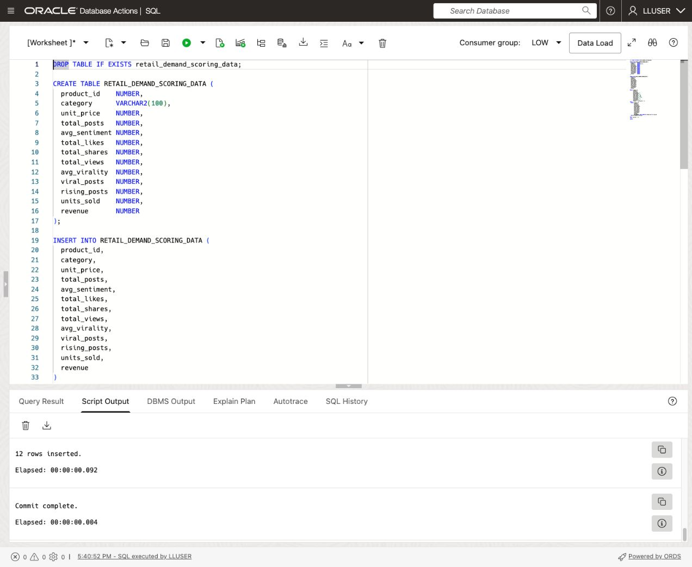

    **Expected output: Twelve scoring rows inserted**

    The scoring table contains the model inputs but omits `SURGE_LABEL`. A target used to train the model must not be supplied as a predictor when asking for a new score.

2. Run the scoring query:

    ```sql
    <copy>
    WITH scored_products AS (
      SELECT product_id,
             category,
             units_sold,
             revenue,
             total_posts,
             viral_posts,
             rising_posts,
             PREDICTION(
               RETAIL_DEMAND_MODEL USING
               category, unit_price, total_posts, avg_sentiment,
               total_likes, total_shares, total_views, avg_virality,
               viral_posts, rising_posts, units_sold, revenue
             ) AS predicted_surge,
             ROUND(
               PREDICTION_PROBABILITY(
                 RETAIL_DEMAND_MODEL,
                 'SURGE' USING
                 category, unit_price, total_posts, avg_sentiment,
                 total_likes, total_shares, total_views, avg_virality,
                 viral_posts, rising_posts, units_sold, revenue
               ), 8
             ) AS surge_score
      FROM RETAIL_DEMAND_SCORING_DATA
    )
    SELECT p.product_id,
           p.product_name,
           sp.category,
           sp.predicted_surge,
           sp.surge_score,
           ROUND(sp.surge_score * 100, 2) AS surge_pct,
           sp.units_sold,
           sp.revenue,
           sp.total_posts,
           sp.viral_posts,
           sp.rising_posts
    FROM scored_products sp
    JOIN products p
      ON p.product_id = sp.product_id
    ORDER BY sp.surge_score DESC,
             p.product_id;
    </copy>
    ```

    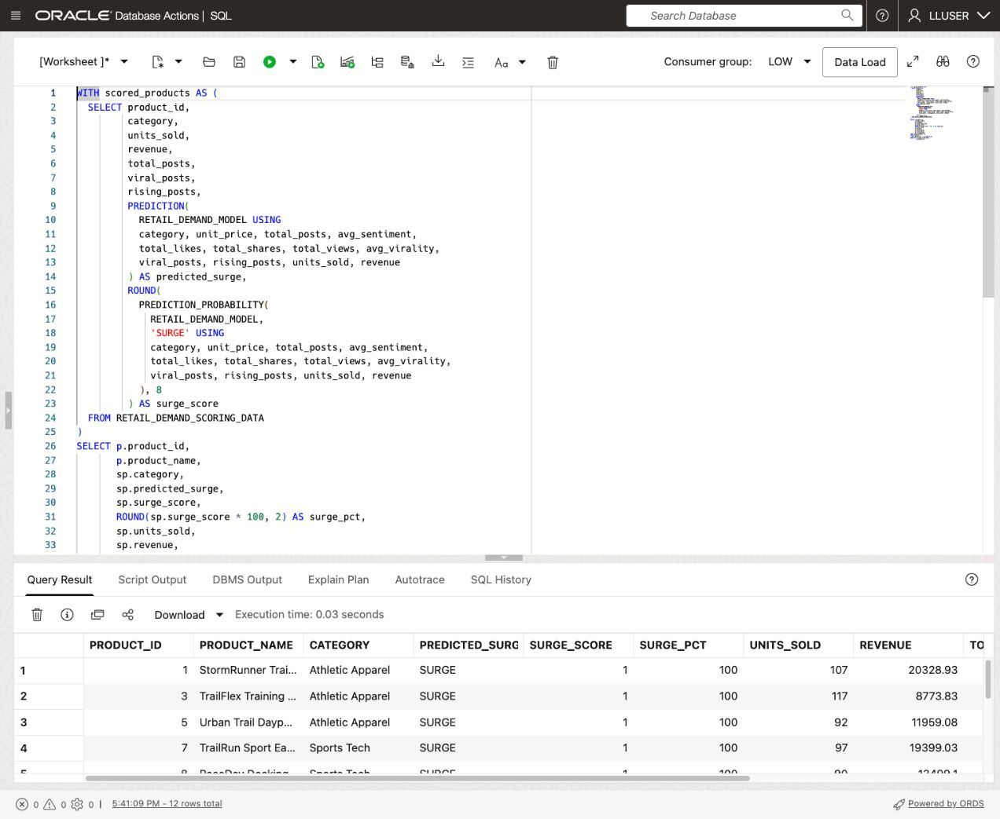

    **Expected output: Twelve products with predictions and activity**

    | Column | How to read it |
    | --- | --- |
    | PREDICTED\_SURGE | The model's selected class |
    | SURGE\_SCORE | The probability for SURGE, between 0 and 1 |
    | SURGE\_PCT | The same value shown as a percentage |
    | UNITS\_SOLD, REVENUE, TOTAL\_POSTS, VIRAL\_POSTS, RISING\_POSTS | The snapshot values for business review |

    With the sample retail data, this recipe scores all twelve rows as `SURGE`. That result demonstrates creating and calling the model; it does not demonstrate useful separation between the two classes or accurate demand forecasts. Inspect the activity values even when several products share the same high score.

3. Compare the existing Retail demand model on the original training rows:

    ```sql
    <copy>
    SELECT p.product_name AS "Product",
           d.category AS "Category",
           d.surge_label AS "Actual Label",
           PREDICTION(demand_surge_model USING *) AS "Predicted Label",
           ROUND(PREDICTION_PROBABILITY(demand_surge_model, 'SURGE' USING *), 4) AS "Surge Probability",
           d.total_posts AS "Posts",
           d.units_sold AS "Units Sold"
    FROM oml_demand_training_v d
    JOIN products p
      ON p.product_id = d.product_id
    ORDER BY "Surge Probability" DESC,
             p.product_name
    FETCH FIRST 5 ROWS ONLY;
    </copy>
    ```

    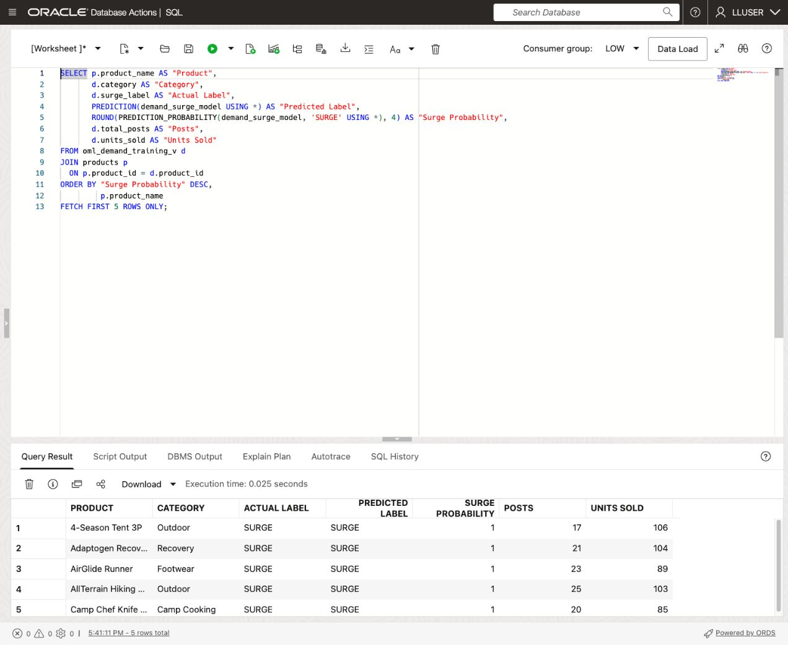

    **Expected output: Five scored products from the supplied Random Forest model**

    The result includes each product's derived label and predicted label. It uses the original training view, so agreement here is an in-sample observation rather than evidence of future accuracy. Use the probabilities returned by your environment; this exercise does not require a fixed numeric probability or a particular ordering among tied scores. `USING *` maps available columns to the model's trained input attributes; the new model query above lists its predictors explicitly.

4. **Interactive challenge: inspect disagreements.**

    Add a filter that keeps rows where the existing model's prediction differs from `SURGE_LABEL`. What would an empty result establish?

    <details>
    <summary><strong>Challenge answer: agreement is not forecast accuracy</strong></summary>

    ```sql
    <copy>
    SELECT p.product_name AS "Product",
           d.category AS "Category",
           d.surge_label AS "Actual Label",
           PREDICTION(demand_surge_model USING *) AS "Predicted Label",
           ROUND(PREDICTION_PROBABILITY(demand_surge_model, 'SURGE' USING *), 4) AS "Surge Probability",
           d.total_posts AS "Posts",
           d.units_sold AS "Units Sold"
    FROM oml_demand_training_v d
    JOIN products p
      ON p.product_id = d.product_id
    WHERE d.surge_label <> PREDICTION(demand_surge_model USING *)
    ORDER BY "Surge Probability" DESC,
             p.product_name
    FETCH FIRST 5 ROWS ONLY;
    </copy>
    ```

    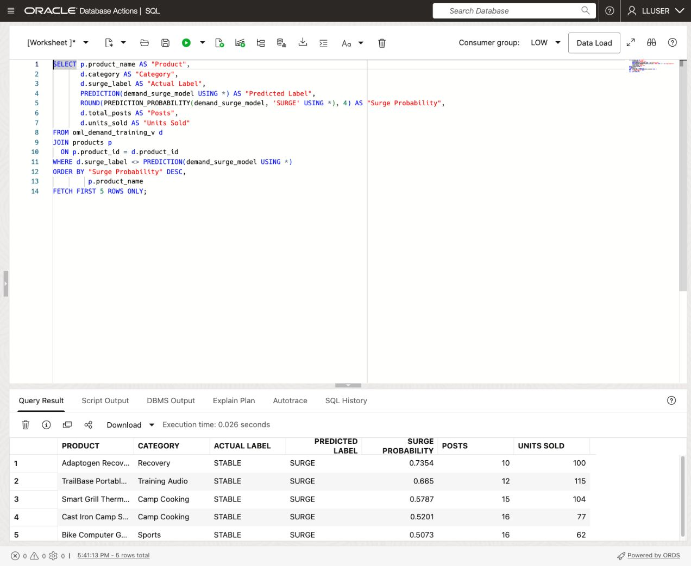

    **Expected output: Zero to five disagreement rows**

    An empty result means no disagreements were found in the rows and labels examined by this query. The model is being applied to training data with derived labels, so that does not establish its accuracy on new business outcomes. Otto would need independent evaluation data and a clear business target before deploying the score as a forecasting decision.

    </details>

## Conclusion: Put the Prediction Beside the Business Data

Otto inspected the training inputs and class distribution, created a named Generalized Linear Model, and scored a separate synthetic snapshot. If you completed the optional AutoML task, you also compared model behavior using the experiment's own evaluation results.

The SQL result puts the prediction, product name, sales, and social activity together. A dashboard can show those values in one review without fetching scores from another platform and reconciling them with the product data. The model and its source rows remain in Oracle AI Database.

The supplied examples also show why interpretation matters: all twelve snapshot rows receive `SURGE`, so the score alone does not establish a useful priority order. Otto hands the supporting facts to Nina, who will next ask product and revenue questions in plain language with Select AI.

## Acknowledgements

* **Author** - Linda Foinding, Principal Database Product Manager
* **Last Updated By/Date** - Oracle Database Product Management, October 2026
