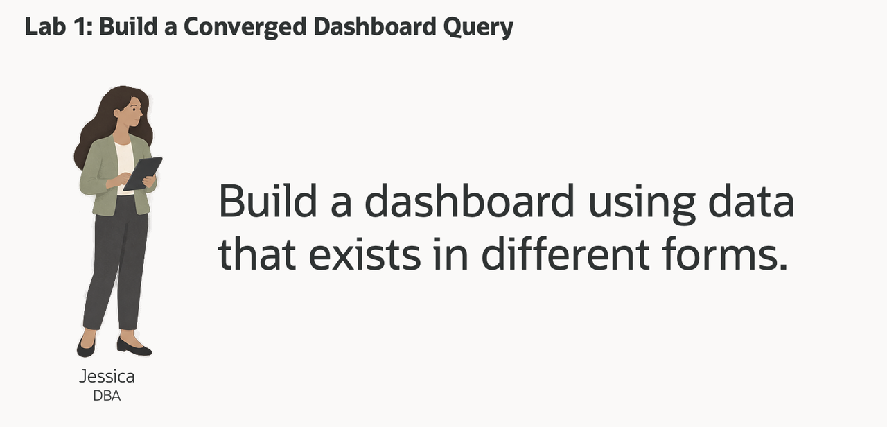

# Build a Converged Retail Dashboard Query

## Introduction

Jessica Chan is the database administrator responsible for keeping Seer Sporting Goods' retail data reliable and useful. Every morning, the operations team asks her a familiar question: **which products deserve a closer look, and what order activity and fulfillment context should the team review?**

Jessica can see the answer taking shape in the retail dashboard, but its supporting data comes in several forms. Products, brands and social signals are relational rows. Orders are also available as JSON documents. The AI engineering team has prepared vector representations of product descriptions. Fulfillment-center points and demand-region boundaries are stored as spatial geometry. The business question connects these records, but a useful dashboard needs a query that brings them together.

With separate systems, Jessica would need to reconcile a catalog, search service, document store and mapping service before presenting the result. Keeping their copies synchronized would add work whenever an order, product description or location changed. Jessica wants each dashboard row to lead back to the data the application already uses.

Oracle AI Database's converged architecture supports these data models in one database. Relational SQL can work with JSON documents, vectors and spatial geometry in the same statement. Graph and machine-learning capabilities will extend the investigation in later labs.

In this lab, you take Jessica's role as the DBA. You run the converged query behind a product review queue, then change the question to see how the same evidence supports a different investigation.



### Objectives

- Explain convergence through a retail decision that crosses several data models.
- Run one query combining relational signals, vector relevance, JSON order activity and spatial context.
- Change the product question and explain which parts of the result change.

Estimated Time: **10 minutes**

### Hands-on Scenario

| Step | Retail focus |
| --- | --- |
| Business Problem | The operations team needs a review queue connecting product attention with current order activity. |
| Technical Challenge | The answer crosses product meaning, social records, order documents and regional geography. |
| Persona Focus | Jessica Chan, the DBA, builds the query that supplies a connected dashboard result. |
| What You Will See | One SQL statement returns product signals, semantic similarity, active orders and a nearby center. |
| Database Capability | Relational SQL, AI Vector Search, JSON Relational Duality and Oracle Spatial work together. |
| Outcome | The team can inspect why a product fits the question and what operational evidence accompanies it. |

Persona focus: You are Jessica Chan, the DBA. Your job is to give the operations team one query whose result they can inspect and explain.

> **SQL Worksheet reminder:** Need a reminder on how to open and use the SQL Worksheet? Return to [Getting Started Task 2: Open SQL Worksheet](?lab=getting-started#Task2:OpenSQLWorksheet) for the step-by-step guide showing how to run SQL statements.

## Task 1: Run a converged retail investigation

The dashboard is a starting point for review. A popular post is evidence of attention; it does not by itself establish new sales or future demand. Jessica puts that signal beside product relevance and actual order activity so the team can judge it in context.

The query crosses four data models:

- **Relational:** Product mentions connect social posts to products and brands. Posts with a virality score of at least 80 contribute signal counts, views and shares.
- **Vector:** Product embeddings are compared with the investigation phrase to rank meaning rather than exact wording.
- **JSON:** `JSON_TABLE` projects nested items from `ORDERS_DV` so pending and confirmed orders can be counted by product.
- **Spatial:** `SDO_GEOM.SDO_DISTANCE` compares active fulfillment-center points with the New York Metro demand-region geometry.

1. Open SQL Worksheet as `LLUSER`.

2. Run the query. The comments identify the four parts of Jessica's investigation.

    ```sql
    <copy>
    -- RELATIONAL: combine product mentions, social activity, products, and brands.
    -- The chosen center is regional context, not a product inventory recommendation.
    WITH product_demand AS (
        SELECT p.product_id, p.product_name, b.brand_name, p.category,
               COUNT(DISTINCT sp.post_id) AS high_virality_signals,
               ROUND(AVG(sp.virality_score), 1) AS avg_virality,
               SUM(sp.views_count) AS signal_views,
               SUM(sp.shares_count) AS signal_shares
        FROM social_posts sp
        JOIN post_product_mentions ppm ON ppm.post_id = sp.post_id
        JOIN products p ON p.product_id = ppm.product_id
        JOIN brands b ON b.brand_id = p.brand_id
        WHERE sp.virality_score >= 80
        GROUP BY p.product_id, p.product_name, b.brand_name, p.category
    ),
    -- VECTOR: rank product meaning against the investigation phrase.
    semantic_match AS (
        SELECT pe.product_id,
               ROUND(MAX(1 - VECTOR_DISTANCE(
                   pe.embedding,
                   VECTOR_EMBEDDING(ADMIN.ALL_MINILM_L12_V2
                       USING 'viral customer demand for trail running footwear' AS DATA),
                   COSINE)), 4) AS semantic_similarity
        FROM product_embeddings pe
        GROUP BY pe.product_id
    ),
    -- JSON: project nested order items from the duality documents.
    order_activity AS (
        SELECT jt.product_id,
               COUNT(DISTINCT jt.order_id) AS active_orders,
               SUM(jt.quantity) AS units_in_active_orders
        FROM orders_dv od
        CROSS APPLY JSON_TABLE(od.data, '$'
            COLUMNS (
                order_id NUMBER PATH '$._id',
                order_status VARCHAR2(30) PATH '$.status',
                NESTED PATH '$.items[*]' COLUMNS (
                    product_id NUMBER PATH '$.productId',
                    quantity NUMBER PATH '$.quantity'
                )
            )
        ) jt
        WHERE jt.order_status IN ('pending', 'confirmed')
        GROUP BY jt.product_id
    ),
    -- SPATIAL: find an active center closest to the demand-region geometry.
    nearest_fulfillment_center AS (
        SELECT fc.center_name, fc.city, fc.state_province,
               dr.region_name, dr.demand_index,
               ROUND(SDO_GEOM.SDO_DISTANCE(fc.location, dr.boundary,
                         0.005, 'unit=KM'), 2) AS distance_to_demand_region_km
        FROM fulfillment_centers fc
        CROSS JOIN demand_regions dr
        WHERE dr.region_name = 'New York Metro'
          AND fc.is_active = 1
          AND fc.location IS NOT NULL
          AND dr.boundary IS NOT NULL
        ORDER BY SDO_GEOM.SDO_DISTANCE(fc.location, dr.boundary,
                     0.005, 'unit=KM'), fc.center_id
        FETCH FIRST 1 ROW ONLY
    )
    SELECT pd.product_name, pd.brand_name, pd.category,
           pd.high_virality_signals, pd.avg_virality,
           pd.signal_views, pd.signal_shares, sm.semantic_similarity,
           NVL(oa.active_orders, 0) AS active_orders,
           NVL(oa.units_in_active_orders, 0) AS active_order_units,
           nfc.center_name AS nearest_fulfillment_center,
           nfc.city || ', ' || nfc.state_province AS center_location,
           nfc.region_name AS demand_region, nfc.demand_index,
           nfc.distance_to_demand_region_km
    FROM product_demand pd
    LEFT JOIN semantic_match sm ON sm.product_id = pd.product_id
    LEFT JOIN order_activity oa ON oa.product_id = pd.product_id
    CROSS JOIN nearest_fulfillment_center nfc
    ORDER BY sm.semantic_similarity DESC NULLS LAST,
             pd.signal_views DESC, pd.product_id
    FETCH FIRST 10 ROWS ONLY;
    </copy>
    ```

3. Review the result as the product-level evidence behind Jessica's dashboard.

    **Expected output: Product review queue**

    The query returns up to ten products. These rows were observed with the supplied workshop data; the table shows selected columns from the wider result.

    | Product | Brand | High-virality signals | Similarity | Active orders | Order units |
    | --- | --- | ---: | ---: | ---: | ---: |
    | AirGlide Runner | CloudStep | 4 | 0.5772 | 13 | 30 |
    | TrailFlex Training Joggers | NeonNight | 3 | 0.4921 | 5 | 7 |
    | TrailFlex Training Joggers | UrbanPulse | 1 | 0.4864 | 14 | 25 |

    The same result supplies **NYC Metro Hub**, **Edison, New Jersey**, **New York Metro**, demand index **91**, and distance **9.48 km** as regional context. That distance is measured to the region geometry. The query does not inspect inventory at the center or calculate a delivery route.

Use the first row to explain the result: the social metrics show recorded attention, the semantic score explains why the product fits the question, and the order counts show existing activity. The location adds a place to begin a fulfillment review. No single column makes the operational decision for the team.

Jessica now has one query for the ranked table and its supporting details. The database evaluates each data model where the source data already lives, and SQL joins connect the results. Other dashboard cards can use additional queries over that same foundation.

## Task 2: Change the investigation question

Jessica meets the operations team to review the data before adding it to the dashboard. The broad trail-running question is useful, but the team now wants to investigate a particular hiking product and its fit.

1. In the query from Task 1, replace only the text inside the `USING` string with:

    ```text
    AllTerrain Hiking Boots sizing and trail grip
    ```

2. Run the complete query again.

    **Expected output: A different review order**

    With the supplied data, **AllTerrain Hiking Boots / TrailBlaze** moves to the first row, similarity **0.6816**, with **7** high-virality signals, **8** active orders and **14** active-order units. It was outside the original top ten. **WinterGrip Boot / CloudStep** moves from sixth to second.

    | Question | First product | Similarity | Active orders |
    | --- | --- | ---: | ---: |
    | Trail-running demand | AirGlide Runner / CloudStep | 0.5772 | 13 |
    | Hiking-boot sizing and grip | AllTerrain Hiking Boots / TrailBlaze | 0.6816 | 8 |

3. Compare the two result sets.

    - Which products entered or left the top ten?
    - For a product present in both, did the social and order values change, or only its relevance to the question?
    - Which product has enough existing order activity to merit a closer operational review?

The query orders semantic similarity first, then signal views and product ID. Changing the question changes the review queue while retaining the same source measures. Use both product name and brand when comparing the two TrailFlex rows; a product name alone is not a unique identifier. Orders added in later labs can change the order totals if you return to this query.

<details>
<summary><strong>Optional discovery: inspect the shared retail foundation</strong></summary>

Jessica can also explain which database objects support the team's next questions. These catalog queries make the connection visible without opening application code.

1. Inventory the named object families used throughout the workshop.

    ```sql
    <copy>
    SELECT 'Core retail tables' AS "Area", COUNT(*) AS "Count"
    FROM user_tables
    WHERE table_name IN (
      'BRANDS','PRODUCTS','FULFILLMENT_CENTERS','INVENTORY','CUSTOMERS',
      'ORDERS','ORDER_ITEMS','INFLUENCERS','SOCIAL_POSTS','POST_PRODUCT_MENTIONS',
      'DEMAND_FORECASTS','SHIPMENTS','PRODUCT_EMBEDDINGS','POST_EMBEDDINGS',
      'DEMAND_REGIONS'
    )
    UNION ALL
    SELECT 'JSON duality views', COUNT(*)
    FROM user_json_duality_views
    WHERE view_name IN ('ORDERS_DV','PRODUCTS_INVENTORY_DV')
    UNION ALL
    SELECT 'Creator influence property graph', COUNT(*)
    FROM user_property_graphs
    WHERE graph_name = 'INFLUENCER_NETWORK'
    UNION ALL
    SELECT 'MiniLM vector columns', COUNT(*)
    FROM user_tab_cols
    WHERE data_type = 'VECTOR'
      AND table_name IN ('PRODUCT_EMBEDDINGS','POST_EMBEDDINGS')
      AND column_name = 'EMBEDDING'
    UNION ALL
    SELECT 'OML models', COUNT(*)
    FROM user_mining_models
    WHERE model_name IN (
      'DEMAND_SURGE_MODEL','CUSTOMER_SEGMENT_MODEL',
      'REVENUE_PREDICT_MODEL','PRODUCT_CLUSTER_MODEL'
    );
    </copy>
    ```

    **Expected output: Object families**

    | Area | Count |
    | --- | ---: |
    | Core retail tables | 15 |
    | JSON duality views | 2 |
    | Creator influence property graph | 1 |
    | MiniLM vector columns | 2 |
    | OML models | 4 |

    Each `SELECT` reports a different family. `UNION ALL` stacks those labeled results without removing duplicate rows. The named OML models are available for later demand analysis; the graph represents creator relationships.

2. Read the actual row counts for the main retail data groups.

    ```sql
    <copy>
    SELECT 'Brands' AS "Data Group",
           COUNT(*) AS "Rows"
    FROM brands
    UNION ALL
    SELECT 'Products',
           COUNT(*)
    FROM products
    UNION ALL
    SELECT 'Customers',
           COUNT(*)
    FROM customers
    UNION ALL
    SELECT 'Orders',
           COUNT(*)
    FROM orders
    UNION ALL
    SELECT 'Order items',
           COUNT(*)
    FROM order_items
    UNION ALL
    SELECT 'Social posts',
           COUNT(*)
    FROM social_posts
    UNION ALL
    SELECT 'Influencers',
           COUNT(*)
    FROM influencers
    UNION ALL
    SELECT 'Fulfillment centers',
           COUNT(*)
    FROM fulfillment_centers
    UNION ALL
    SELECT 'Shipments',
           COUNT(*)
    FROM shipments
    UNION ALL
    SELECT 'Post embeddings',
           COUNT(*)
    FROM post_embeddings;
    </copy>
    ```

    **Expected output: Shared retail records**

    | Data group | Rows before the JSON order exercise |
    | --- | ---: |
    | Brands | 50 |
    | Products | 187 |
    | Customers | 2,000 |
    | Orders | 3,000 |
    | Order items | 8,981 |
    | Social posts | 5,000 |
    | Influencers | 483 |
    | Fulfillment centers | 30 |
    | Shipments | 1,500 |
    | Post embeddings | 5,000 |

    These are `COUNT(*)` results, not catalog statistics. Later, Thomas will add one order and one item through a JSON document. Returning to this query then shows that same relational change.

</details>

## Next Steps

Jessica has connected the product evidence. Next, Thomas uses JSON Relational Duality to expose the same order data as an application payload while keeping relational SQL available to the database team.

## Acknowledgements

* **Author** - Kevin Lazarz
* **Contributors** - Eugenio Galiano, Pat Shepherd
* **Last Updated By/Date** - Oracle Database Product Management, September 2026
