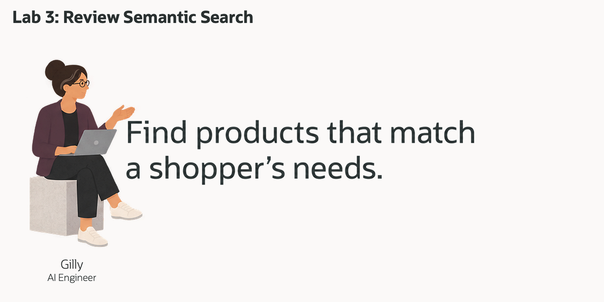

# Review a Semantic Product Search

## Introduction

Gilly Bourne is an AI engineer at Seer Sporting Goods. Her team is building a search feature for the retail operations application. A business user can ask about **viral customer demand for trail running footwear**. The application should find related products, then show the existing orders and customers connected to those products.

Gilly already has product, order and customer data in the database. Her design problem is connecting the user's words to those rows. She needs to turn product descriptions into vectors, compare them with a question, and join the closest products to exact order records. A useful result should explain both why a product matched and which orders provide context.

A separate vector service would introduce another copy of product text and a pipeline to keep its search data synchronized. Gilly wants similarity search to run beside the source rows, so the same SQL statement can rank products and join them to customer details.

In this lab, you review her implementation from the embedding model to the final customer list. Oracle AI Vector Search finds products by meaning; relational joins connect those matches to their existing orders. The search is evidence for a review, not a prediction of future sales or customer intent.



<details>
<summary><strong>Key terms: embedding, vector, vector distance, and semantic search</strong></summary>

> - An **embedding** represents text as numbers so related meanings can be compared mathematically.
> - An **ONNX embedding model** is a portable model in the Open Neural Network Exchange format. Oracle AI Database can run it inside the database to convert product text or a question into a vector.
> - A **vector** stores those numbers. The model used here produces 384 dimensions, so both product vectors and question vectors must use that compatible representation.
> - **Vector distance** measures how close two vectors are. A smaller cosine distance indicates a closer match in the model's representation.
> - **Semantic search** compares meaning rather than requiring the query's exact words to occur in a product name.

</details>

### Objectives

- Inspect the in-database embedding model available to Gilly.
- Create a product vector from its name and classification.
- Compare cosine distance and similarity for the same product question.
- Join matched product IDs to existing order and customer records.
- Explain why a similarity score and a relational order answer different parts of the review.

Estimated Time: **15 minutes**

### Hands-on Scenario

| Step | Retail focus |
| --- | --- |
| Business Problem | The team needs relevant products without knowing the catalog's exact wording. |
| Technical Challenge | Gilly must keep product meaning, vectors, order keys and customer context connected. |
| Persona Focus | You review Gilly's implementation from the model to a customer and order result. |
| What You Will See | Vector search ranks products; SQL joins add exact order and customer details. |
| Database Capability | VECTOR_EMBEDDING, vector columns and VECTOR_DISTANCE run beside relational data. |
| Outcome | The application can turn a plain-language product question into an inspectable review list. |

Persona focus: You are reviewing the search tool Gilly built for retail operations.

> **SQL Worksheet reminder:** Need a reminder on how to open and use the SQL Worksheet? Return to [Getting Started Task 2: Open SQL Worksheet](?lab=getting-started#Task2:OpenSQLWorksheet) for the step-by-step guide showing how to run SQL statements.

## Task 1: Check the embedding model

Similarity search needs a compatible representation for both the stored text and the incoming question. Jessica has made an ONNX embedding model available in the database, where Gilly can invoke it from SQL.

1. Inspect the available embedding models.

    ```sql
    <copy>
    SELECT owner,
           model_name,
           algorithm,
           mining_function
    FROM all_mining_models
    WHERE mining_function = 'EMBEDDING'
    ORDER BY owner, model_name;
    </copy>
    ```

    **Expected output: Available embedding model**

    | OWNER | MODEL_NAME | ALGORITHM | MINING_FUNCTION |
    | --- | --- | --- | --- |
    | ADMIN | ALL_MINILM_L12_V2 | ONNX | EMBEDDING |

    Other visible embedding models can also appear. This lab uses `ADMIN.ALL_MINILM_L12_V2`, which produces 384-dimensional vectors. Gilly will use the same model for the product text and the question.

2. Connect the model to the application's design.

    `VECTOR_EMBEDDING` runs the model inside the database. Jessica manages model availability; Gilly uses SQL to generate and compare vectors alongside the product rows.

    <details>
    <summary><strong>Optional: inspect the existing retail search embeddings</strong></summary>

    The existing application already has separate embedding tables for products and social posts. These support the dashboard and the signal searches later in this lab.

    ```sql
    <copy>
    SELECT 'PRODUCT_EMBEDDINGS' AS "Vector Table",
           COUNT(pe.embedding_id) AS "Embeddings",
           COUNT(DISTINCT p.product_id) AS "Source Rows",
           ROUND(100 * COUNT(DISTINCT pe.product_id) / NULLIF(COUNT(DISTINCT p.product_id), 0), 1) AS "Coverage Pct"
    FROM products p
    LEFT JOIN product_embeddings pe
      ON pe.product_id = p.product_id
    UNION ALL
    SELECT 'POST_EMBEDDINGS',
           COUNT(pse.embedding_id),
           COUNT(DISTINCT sp.post_id),
           ROUND(100 * COUNT(DISTINCT pse.post_id) / NULLIF(COUNT(DISTINCT sp.post_id), 0), 1)
    FROM social_posts sp
    LEFT JOIN post_embeddings pse
      ON pse.post_id = sp.post_id
    ORDER BY "Vector Table";
    </copy>
    ```

    **Expected output: Existing embedding coverage**

    | Vector Table | Embeddings | Source Rows | Coverage Pct |
    | --- | ---: | ---: | ---: |
    | POST_EMBEDDINGS | 5,000 | 5,000 | 100 |
    | PRODUCT_EMBEDDINGS | 187 | 187 | 100 |

    Gilly will add a new demonstration column to `PRODUCTS` to make the text-to-vector step visible. The existing embedding tables continue to serve their current queries.

    </details>

## Task 2: Create a product vector

Gilly starts with one vector per product. A name, category and subcategory form a short description of what the product is. This is different from embedding a customer's post, which describes what that customer said about a product.

1. Review the text that will be embedded.

    ```sql
    <copy>
    SELECT product_id,
           product_name,
           category,
           subcategory,
           product_name || '. Category: ' || category ||
             '. Subcategory: ' || subcategory AS embedding_text
    FROM products
    FETCH FIRST 5 ROWS ONLY;
    </copy>
    ```

    **Expected output: Product text**

    The query returns five product rows. One observed example was:

    | PRODUCT_ID | PRODUCT_NAME | EMBEDDING_TEXT |
    | ---: | --- | --- |
    | 94 | Cyber Mesh Sneakers | Cyber Mesh Sneakers. Category: Footwear. Subcategory: Sneakers |

    The query does not specify a display order, so your five rows can differ. Gilly embeds descriptive text; price and order dates do not explain the product's meaning in this example.

2. Add the vector column to `PRODUCTS`. Run this `ALTER TABLE` once; if you are revisiting the lab after creating the column, continue to the update step.

    ```sql
    <copy>
    ALTER TABLE products ADD (product_embedding VECTOR(384));
    </copy>
    ```

    **Expected output:** The table is altered to include `PRODUCT_EMBEDDING`, a 384-dimensional vector column. The separately populated `PRODUCT_EMBEDDINGS` and `POST_EMBEDDINGS` tables are unchanged.

3. Generate vectors for rows that do not yet have one.

    ```sql
    <copy>
    UPDATE products
    SET product_embedding = VECTOR_EMBEDDING(
      ADMIN.ALL_MINILM_L12_V2 USING
        product_name || '. Category: ' || category ||
        '. Subcategory: ' || subcategory AS DATA)
    WHERE product_embedding IS NULL;
    </copy>
    ```

    **Expected output:** On the first run, the model generates a vector for each of the 187 products. A later run skips vectors already present because of the `IS NULL` condition.

4. Commit the generated vectors.

    ```sql
    <copy>
    COMMIT;
    </copy>
    ```

    **Expected output:** The commit completes.

5. Inspect the new column alongside its source product.

    ```sql
    <copy>
    SELECT product_id,
           product_name,
           product_embedding
    FROM products;
    </copy>
    ```

    **Expected output: Product vectors**

    | Column | What to inspect |
    | --- | --- |
    | PRODUCT_ID | The stable relational identifier for each product |
    | PRODUCT_NAME | The catalog label associated with the vector |
    | PRODUCT_EMBEDDING | A populated vector containing 384 numbers |

    SQL Worksheet can show a shortened vector preview. Expand a value to inspect its numbers. The same product key connects the vector to the rest of the retail data.

    > **Note:** Each row describes one short product, so this example does not split the text into chunks. Chunking is useful for long documents where different passages can answer different questions.

## Task 3: Test the product vector

Gilly first tests the vector column directly. She uses the same trail-running phrase as Jessica's investigation, but here the search compares product name/category text created in Task 2. A different source text can produce a different ranking from the dashboard's existing product embeddings.

1. Rank the five closest products by cosine distance.

    ```sql
    <copy>
    SELECT p.product_id,
           p.product_name,
           p.category,
           VECTOR_DISTANCE(
             p.product_embedding,
             VECTOR_EMBEDDING(ADMIN.ALL_MINILM_L12_V2 USING 'viral customer demand for trail running footwear' AS DATA),
             COSINE) AS vector_distance
    FROM products p
    ORDER BY vector_distance, p.product_id
    FETCH FIRST 5 ROWS ONLY;
    </copy>
    ```

    **Expected output: Closest product vectors**

    | PRODUCT_ID | PRODUCT_NAME | VECTOR_DISTANCE, rounded here |
    | ---: | --- | ---: |
    | 132 | Marathon Elite Racer | 0.409041 |
    | 46 | AirGlide Runner | 0.440360 |
    | 48 | TrailGrip Hiker | 0.457246 |
    | 3 | TrailFlex Training Joggers | 0.510181 |
    | 43 | TrailFlex Training Joggers | 0.510181 |

    The SQL returns the full distance; this table rounds it for readability. Lower is closer. Product ID breaks equal-distance ties so a repeated product name does not obscure which record the query selected.

2. Review what the ranking means.

    The model embedded the question at runtime and compared it with `PRODUCTS.PRODUCT_EMBEDDING`. The query selected product records; it did not inspect their sales, inventory or customers. Those facts need relational joins.

    <details>
    <summary><strong>Why this matters to Gilly</strong></summary>

    > The vector column and product key stay in the same database. Gilly can inspect a match, join it to order records, and use the result in the application without synchronizing a separate search data store.

    </details>

3. Present the same search as a similarity score.

    ```sql
    <copy>
    SELECT p.product_id,
           p.product_name,
           p.category,
           ROUND(1 - VECTOR_DISTANCE(
             p.product_embedding,
             VECTOR_EMBEDDING(ADMIN.ALL_MINILM_L12_V2 USING 'viral customer demand for trail running footwear' AS DATA),
             COSINE), 4) AS similarity
    FROM products p
    ORDER BY similarity DESC, p.product_id
    FETCH FIRST 5 ROWS ONLY;
    </copy>
    ```

    **Expected output: Product similarities**

    | PRODUCT_ID | PRODUCT_NAME | SIMILARITY |
    | ---: | --- | ---: |
    | 132 | Marathon Elite Racer | 0.5910 |
    | 46 | AirGlide Runner | 0.5596 |
    | 48 | TrailGrip Hiker | 0.5428 |
    | 3 | TrailFlex Training Joggers | 0.4898 |
    | 43 | TrailFlex Training Joggers | 0.4898 |

    `1 - distance` changes the display so higher means closer. Rounding to four decimal places makes the score easier to read; it is not a probability that someone will buy the product. Both queries identify products explicitly, and the supplied results select the same five IDs. Rounded scores can introduce additional ties, so the customer query below uses the same similarity-and-ID ordering.

<details>
<summary><strong>Optional comparison: search the existing product and customer-signal embeddings</strong></summary>

Gilly can compare the new product column with the two search sources that already support the retail application. These queries retain their existing grouping by product name and category. They summarize matching labels rather than uniquely identifying every product row.

1. Search the existing product embeddings with a broad service-and-demand phrase.

    ```sql
    <copy>
    SELECT p.product_name AS "Product",
           p.category AS "Category",
           ROUND(MIN(VECTOR_DISTANCE(
             pe.embedding,
             VECTOR_EMBEDDING(
               ADMIN.ALL_MINILM_L12_V2
               USING 'customer demand digital service product' AS DATA
             ),
             COSINE
           )), 4) AS "Best Distance"
    FROM product_embeddings pe
    JOIN products p
      ON p.product_id = pe.product_id
    GROUP BY p.product_name,
             p.category
    ORDER BY "Best Distance",
             "Product"
    FETCH FIRST 5 ROWS ONLY;
    </copy>
    ```

    **Expected output: Existing product search**

    | Product | Best Distance |
    | --- | ---: |
    | CoachMic USB Microphone | 0.6852 |
    | Expedition Power Bank | 0.7042 |
    | CoachView Curved Display | 0.7327 |

    These are the first three observed rows. The broad phrase illustrates why wording matters: it does not ask specifically for footwear.

2. Search social-post embeddings for the trail-running question, then connect matching posts to the products they mention.

    ```sql
    <copy>
    SELECT p.product_name AS "Product",
           p.category AS "Category",
           ROUND(MIN(VECTOR_DISTANCE(
             se.embedding,
             VECTOR_EMBEDDING(
               ADMIN.ALL_MINILM_L12_V2
               USING 'viral customer demand for trail running footwear' AS DATA
             ),
             COSINE
           )), 4) AS "Best Distance"
    FROM post_embeddings se
    JOIN social_posts sp
      ON sp.post_id = se.post_id
    JOIN post_product_mentions ppm
      ON ppm.post_id = sp.post_id
    JOIN products p
      ON p.product_id = ppm.product_id
    GROUP BY p.product_name,
             p.category
    ORDER BY "Best Distance",
             "Product"
    FETCH FIRST 5 ROWS ONLY;
    </copy>
    ```

    **Expected output: Products mentioned in relevant posts**

    | Product | Best Distance |
    | --- | ---: |
    | Marathon Elite Racer | 0.3470 |
    | Barefoot Minimalist Shoe | 0.3488 |
    | Cyber Mesh Sneakers | 0.3696 |
    | TrailFlex Training Joggers | 0.3861 |
    | AllTerrain Hiking Boots | 0.3943 |

    `MIN` keeps the closest matching post for each grouped product label. This is evidence about the meaning of the associated posts, not a count of new orders.

3. Change the investigation to hiking-boot sizing and grip.

    ```sql
    <copy>
    SELECT p.product_name AS "Product",
           p.category AS "Category",
           ROUND(MIN(VECTOR_DISTANCE(
             se.embedding,
             VECTOR_EMBEDDING(
               ADMIN.ALL_MINILM_L12_V2
               USING 'AllTerrain Hiking Boots sizing and trail grip' AS DATA
             ),
             COSINE
           )), 4) AS "Best Distance"
    FROM post_embeddings se
    JOIN social_posts sp
      ON sp.post_id = se.post_id
    JOIN post_product_mentions ppm
      ON ppm.post_id = sp.post_id
    JOIN products p
      ON p.product_id = ppm.product_id
    GROUP BY p.product_name,
             p.category
    ORDER BY "Best Distance",
             "Product"
    FETCH FIRST 5 ROWS ONLY;
    </copy>
    ```

    **Expected output: A more specific signal search**

    | Product | Best Distance |
    | --- | ---: |
    | AllTerrain Hiking Boots | 0.2186 |
    | TrailGrip Hiker | 0.5050 |
    | Summit 65L Backpack | 0.5189 |

    AllTerrain moves from fifth to first in the observed result. Explain the change through the question and the text being searched. Product vectors describe the catalog; post vectors describe recorded customer or creator language. Neither result on its own establishes future demand.

</details>

## Task 4: Add customer and order context

Gilly can now turn a ranked product search into a review list. The application should show which existing orders contain the matched products, along with status, date and customer details. It should not imply that similarity proves a customer's preferences or that every listed order needs intervention.

1. Run the combined query for the same trail-running question.

    ```sql
    <copy>
    WITH matched_products AS (
        SELECT p.product_id,
               p.product_name,
               ROUND(1 - VECTOR_DISTANCE(
                 p.product_embedding,
                 VECTOR_EMBEDDING(
                   ADMIN.ALL_MINILM_L12_V2
                   USING 'viral customer demand for trail running footwear' AS DATA
                 ),
                 COSINE), 4) AS similarity
        FROM products p
        ORDER BY similarity DESC, p.product_id
        FETCH FIRST 5 ROWS ONLY
    )
    SELECT mp.product_id,
           mp.product_name,
           mp.similarity,
           c.first_name || ' ' || c.last_name AS customer_name,
           c.email,
           o.order_id,
           o.order_status,
           o.created_at,
           oi.quantity,
           oi.line_total
    FROM matched_products mp
    JOIN order_items oi ON oi.product_id = mp.product_id
    JOIN orders o ON o.order_id = oi.order_id
    JOIN customers c ON c.customer_id = o.customer_id
    WHERE o.order_status NOT IN ('cancelled', 'returned')
    ORDER BY mp.similarity DESC,
             mp.product_id,
             o.created_at DESC,
             o.order_id,
             oi.item_id;
    </copy>
    ```

    **Expected output: Product matches with exact order context**

    The first part uses the same similarity-and-ID ordering as Task 3. The remaining joins use product, order and customer keys. With the supplied data, the query returned **221 order-line rows** across product IDs **132, 46, 48, 3 and 43**. Selected columns from the first rows were:

    | PRODUCT_ID | PRODUCT_NAME | SIMILARITY | ORDER_ID | ORDER_STATUS | QUANTITY | LINE_TOTAL |
    | ---: | --- | ---: | ---: | --- | ---: | ---: |
    | 132 | Marathon Elite Racer | 0.5910 | 2758 | delivered | 1 | 219.99 |
    | 132 | Marathon Elite Racer | 0.5910 | 2828 | delivered | 3 | 659.97 |
    | 132 | Marathon Elite Racer | 0.5910 | 526 | delivered | 3 | 659.97 |

    The full result also includes customer names, email addresses and order timestamps. It excludes `cancelled` and `returned` orders; delivered orders remain valid history. The 221 rows are order lines, not 221 distinct customers or a list of future purchases.

2. Review the business result.

    Gilly vectorized the product description once, then used normal relational joins for exact order and contact details. The similarity score explains why the product entered the list. The order fields explain the existing relationship to each customer. Product IDs distinguish repeated names, and the final ordering makes the result easier to compare across runs.

## Conclusion

Gilly has connected a plain-language product question to an inspectable customer and order result. Oracle AI Vector Search supplies the semantic matches, while SQL keys keep the follow-up evidence tied to the existing retail records. Next, Bob examines the creator relationships behind the signals to add network context to the investigation.

## Acknowledgements

* **Author** - Kevin Lazarz
* **Contributors** - Eugenio Galiano, Pat Shepherd
* **Last Updated By/Date** - Oracle Database Product Management, September 2026
