# Build a Retail Agent with Select AI Agent

## Introduction

Nina Patel is a retail analyst at Seer Sporting Goods. She has used Select AI to ask one retail question at a time. That works for a quick answer, but her customer-review screen needs a repeatable assistant that can answer a request through a defined database capability.

Jessica, the DBA, gives Nina's agent one approved tool: a SQL tool that uses the `GENAI` profile and the retail tables configured in the previous lab. The profile supplies the object scope, and the database user's privileges still apply when the generated SQL runs.

In this lab, you create the agent objects, connect the agent to that SQL tool, and run a revenue question through the team. You then match the request to its team execution and tool history. Nina can inspect both the answer and the recorded work that produced it.

<details>
<summary><strong>Key terms: agent, tool, task, and team</strong></summary>

> - An **agent** is a configured role that follows instructions when handling a request.
> - A **tool** is a capability that the agent may call. This lab supplies the built-in SQL tool through GENAI.
> - A **task** describes the work and lists the tools available to it.
> - A **team** connects the agent and task into a unit an application or SQL session can run.
> - A **conversation ID** identifies the caller's request context. A team execution ID identifies the recorded run within that context.

</details>

### Objectives

- Confirm that the GENAI profile and Retail object list from Lab 7 are available.
- Register the SQL tool and create Nina's agent, task, and team.
- Run a retail question while retaining its conversation ID across worksheet requests.
- Inspect the exact team's status and all recorded tool invocations.
- Compare the answer with the direct revenue evidence from Lab 7.

Estimated Time: **15 minutes**

### Hands-on Scenario

| Step | Retail focus |
| --- | --- |
| Business Problem | Nina needs an assistant whose retail answers can support a customer-review screen. |
| Technical Challenge | The request must use an approved database capability and leave inspectable execution evidence. |
| Persona Focus | You follow Nina and Jessica as they turn a Select AI question into a defined assistant. |
| What You Will See | Agent setup, a team answer, and history correlated with the exact request. |
| Database Capability | Select AI Agent, DBMS_CLOUD_AI_AGENT, AI profiles, and a built-in SQL tool. |
| Outcome | The application can call a retail assistant whose result and tool activity Nina can review. |

Persona focus: You are Nina Patel, the retail analyst, working with Jessica to make the assistant's database work visible.

> **Prerequisite:** Complete [Lab 7: Ask Retail Questions with Select AI](?lab=selectai). This lab uses its GENAI profile, enforced four-table object list, and direct revenue reference query.

> **SQL Worksheet reminder:** Use [Getting Started Task 2](?lab=getting-started#Task2:OpenSQLWorksheet). Run each block separately. Open the full CLOB value when an answer is longer than the result cell.

## Task 1: Check the profile and table access

The tool will use the existing profile rather than create another provider connection. Before defining the assistant, Nina checks the profile, confirms its scope, and verifies that her model request can generate SQL.

1. Check the profile status.

    ```sql
    <copy>
    SELECT profile_name, status
    FROM user_cloud_ai_profiles
    WHERE profile_name = 'GENAI';
    </copy>
    ```

    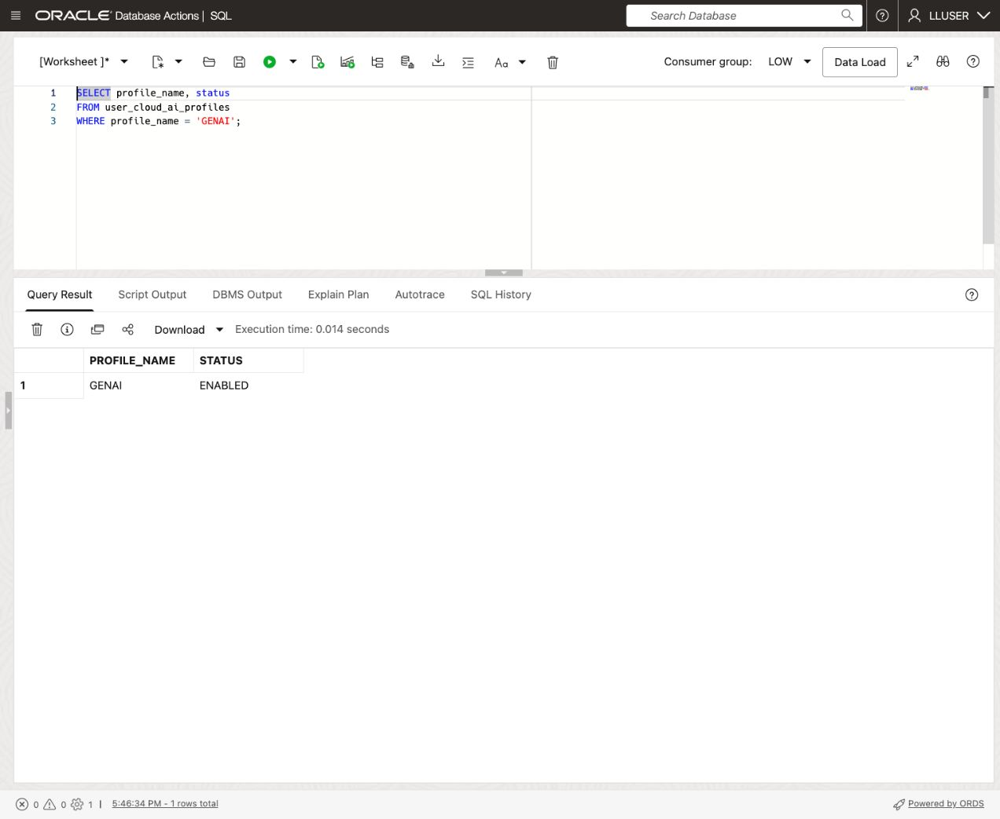

    **Expected output:** One enabled GENAI profile. Complete Lab 7 before continuing if the profile is absent or disabled.

2. Inspect its nonsecret configuration.

    ```sql
    <copy>
    SELECT profile_name, attribute_name, attribute_value
    FROM user_cloud_ai_profile_attributes
    WHERE profile_name = 'GENAI'
      AND LOWER(attribute_name) IN
          ('provider', 'model', 'object_list', 'object_list_mode', 'enforce_object_list')
    ORDER BY attribute_name;
    </copy>
    ```

    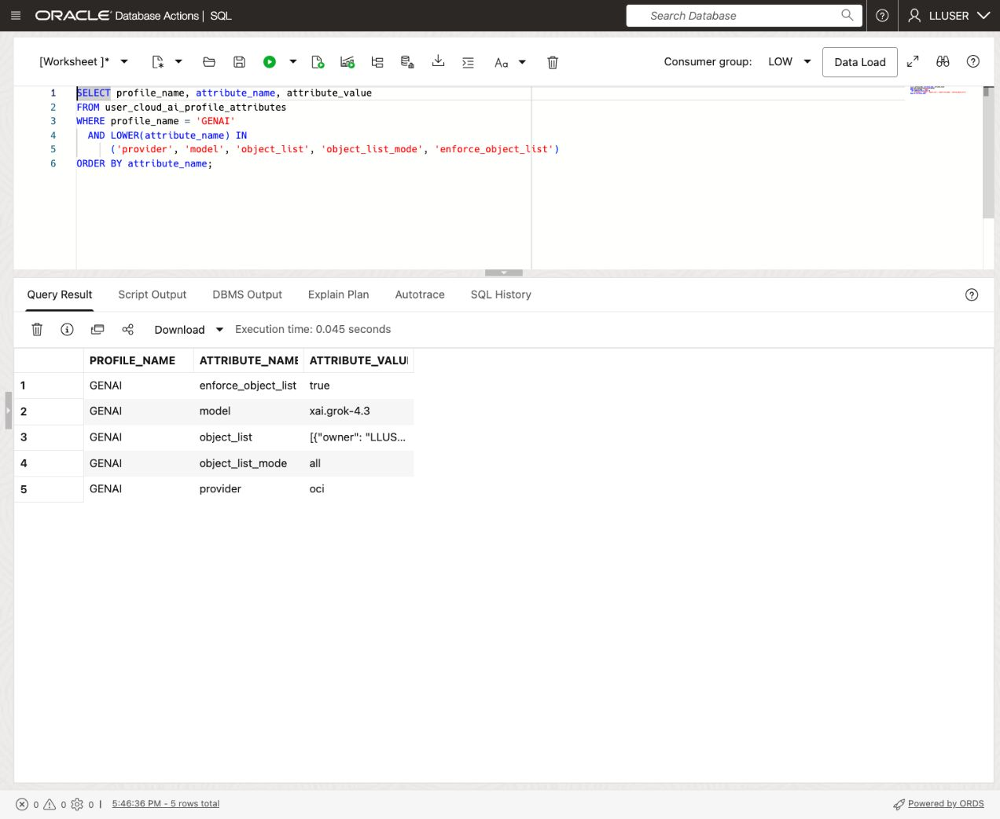

    **Expected output:** The object list contains PRODUCTS, ORDERS, ORDER_ITEMS, and CUSTOMERS in the learner schema. Lab 7 sets `object_list_mode` to `all` and `enforce_object_list` to `true`. These settings constrain SQL generation and object use; they do not grant database privileges.

3. Check for the exact names this lab will create.

    ```sql
    <copy>
    SELECT 'AGENT' AS object_type, agent_name AS object_name, status
    FROM user_ai_agents WHERE agent_name = 'NINA_RETAIL_AGENT'
    UNION ALL
    SELECT 'TOOL', tool_name, status
    FROM user_ai_agent_tools WHERE tool_name = 'NINA_RETAIL_SQL_TOOL'
    UNION ALL
    SELECT 'TASK', task_name, status
    FROM user_ai_agent_tasks WHERE task_name = 'NINA_RETAIL_TASK'
    UNION ALL
    SELECT 'TEAM', agent_team_name, status
    FROM user_ai_agent_teams WHERE agent_team_name = 'NINA_RETAIL_TEAM'
    UNION ALL
    SELECT object_type, object_name, status
    FROM user_objects WHERE object_name = 'NINA_RETAIL_REQUEST'
    ORDER BY object_type, object_name;
    </copy>
    ```

    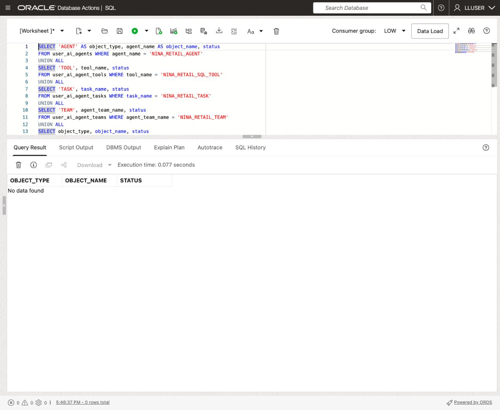

    **Expected output:** No rows for a first run. If the names belong to your previous attempt, use the appendix to reset them before recreating the lab. Do not reset objects belonging to another application.

4. Confirm the required model can generate SQL with the same question used in Lab 7.

    ```sql
    <copy>
    SELECT DBMS_CLOUD_AI.GENERATE(
             prompt       => 'Which five products have the highest revenue?',
             profile_name => 'genai',
             action       => 'showsql',
             attributes   => '{"model":"xai.grok-4.3"}'
           ) AS generated_sql
    FROM dual;
    </copy>
    ```

    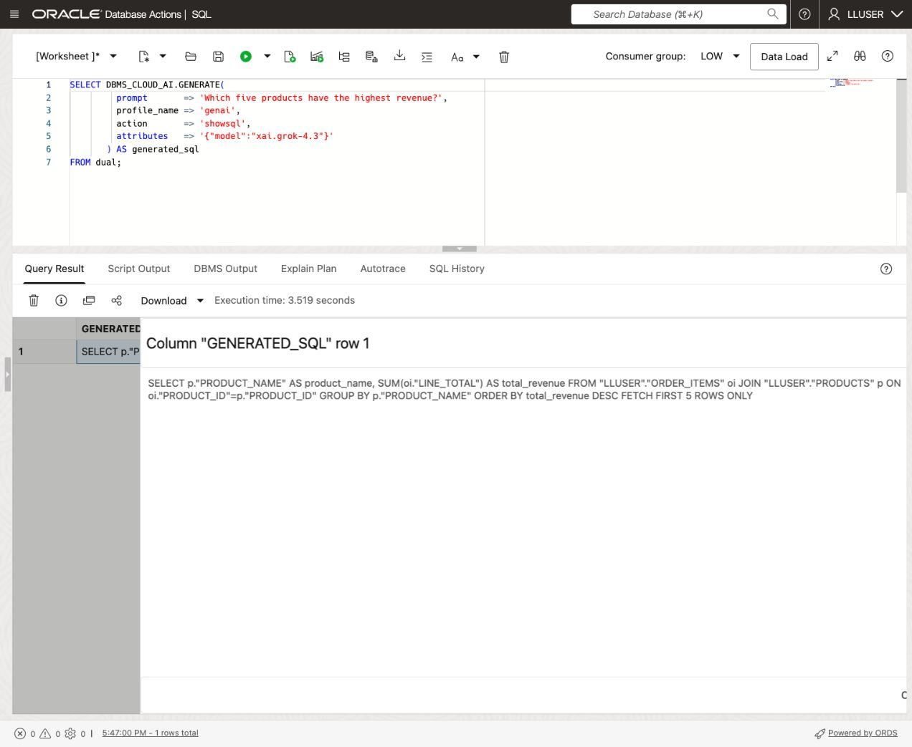

    **Expected output:** SQL text for a five-product revenue ranking. Inspect its joins, revenue calculation, and row limit as you did in Lab 7. This readiness call does not run the agent or prove that its tool has been invoked. Resolve any provider or model-access error before proceeding to the team request.

## Task 2: Register the SQL tool

Jessica registers one named SQL capability that uses `GENAI` and the four retail tables configured in Lab 7. Nina will set the model once for the profile, then register the tool against that profile.

1. Set the requested model and create the tool.

    ```sql
    <copy>
    BEGIN
      DBMS_CLOUD_AI.SET_ATTRIBUTE(
        profile_name    => 'GENAI',
        attribute_name  => 'model',
        attribute_value => 'xai.grok-4.3'
      );

      DBMS_CLOUD_AI_AGENT.CREATE_TOOL(
        tool_name   => 'NINA_RETAIL_SQL_TOOL',
        attributes  => '{"tool_type": "SQL", "tool_params": {"profile_name": "genai"}}',
        description => 'Read-only SQL access to the workshop retail tables'
      );
    END;
    /
    </copy>
    ```

    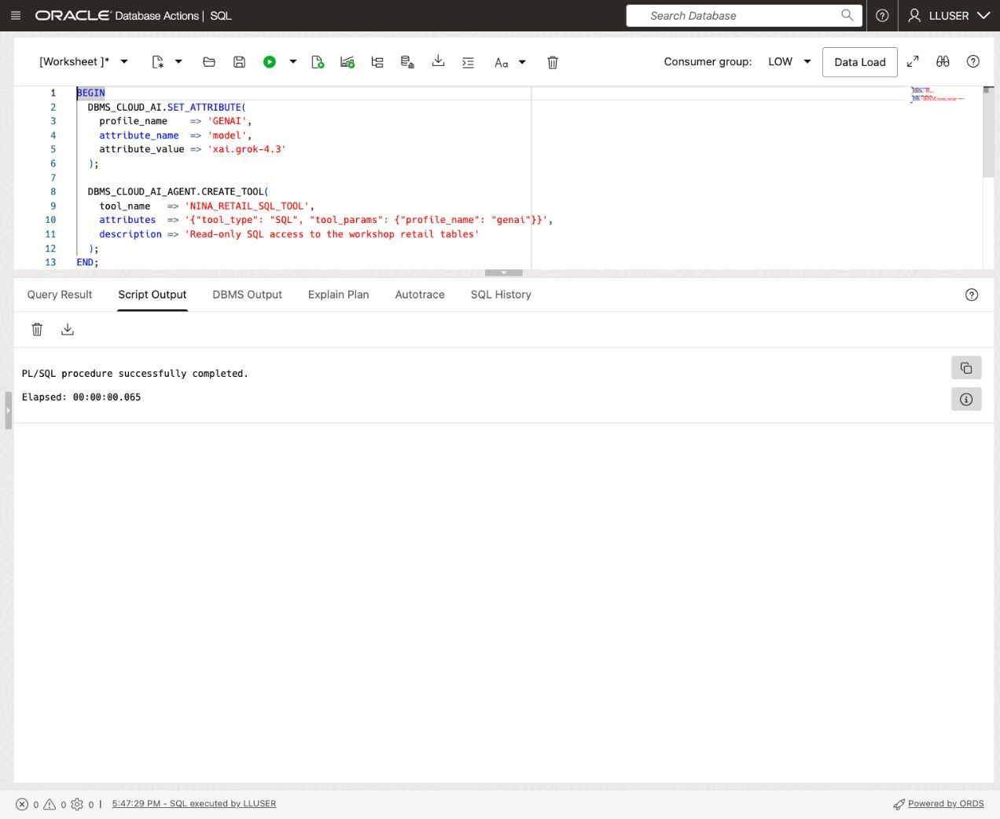

    **Expected output:** The PL/SQL block completes. GENAI now uses `xai.grok-4.3` for the agent and its SQL tool.

    The built-in tool generates and runs SQL against the existing database; it does not create another retail data store. This task gives the agent a query tool, not a custom function for changing order records. The profile settings and the current user's database privileges continue to apply.

2. Confirm the tool definition.

    ```sql
    <copy>
    SELECT tool_name, status, description
    FROM user_ai_agent_tools
    WHERE tool_name = 'NINA_RETAIL_SQL_TOOL';
    </copy>
    ```

    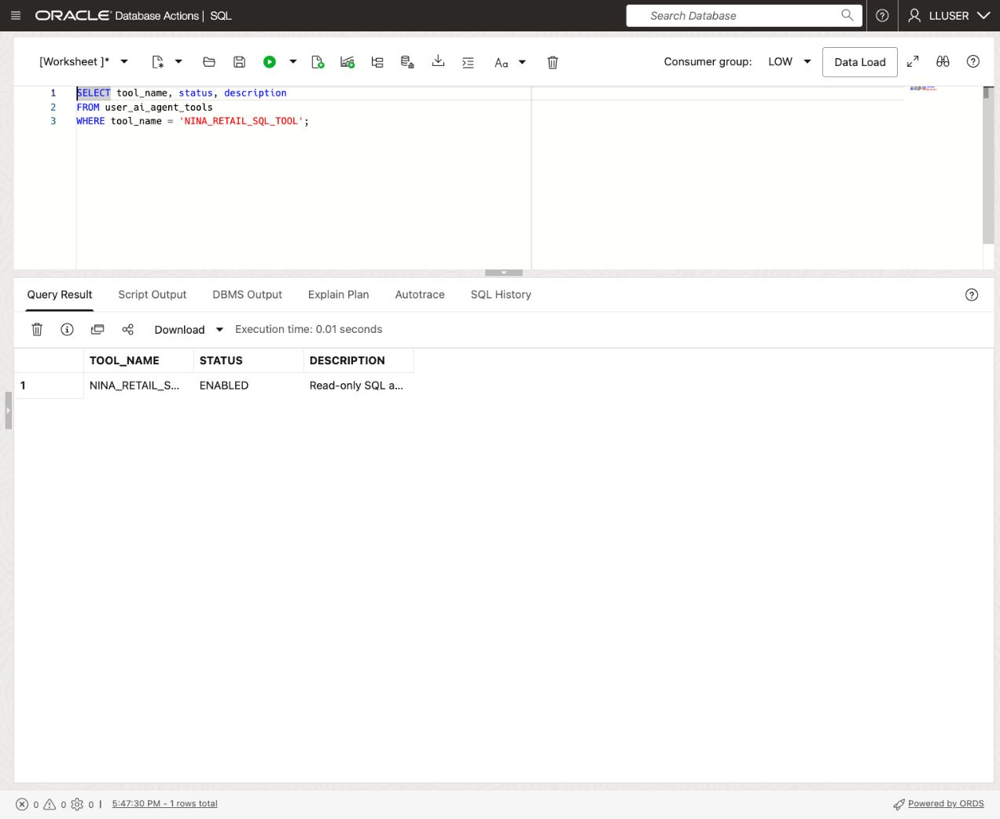

    **Expected output:** One enabled NINA_RETAIL_SQL_TOOL entry with the Retail description.

## Task 3: Create Nina's agent, task, and team

The tool needs a role and a defined task before an application can use the assistant. Nina supplies the question; the team connects that question to the role, instructions, and approved tool.

1. Create the agent's role.

    ```sql
    <copy>
    BEGIN
      DBMS_CLOUD_AI_AGENT.CREATE_AGENT(
        agent_name  => 'NINA_RETAIL_AGENT',
        attributes  => '{"profile_name": "genai", "role": "You are Nina Patel''s retail data assistant. Answer questions using the approved SQL tool. Use database results for product, order, order item, and customer facts. Do not invent values."}',
        description => 'Retail assistant for Nina Patel'
      );
    END;
    /
    </copy>
    ```

    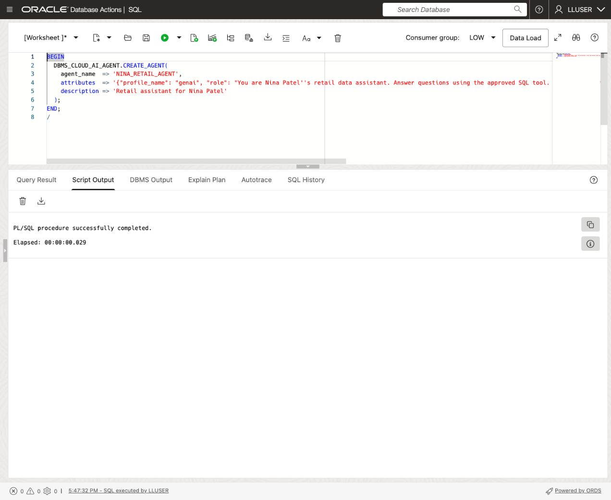

    **Expected output:** The agent is created. Its role calls for database-backed product, order, order-item, and customer facts.

2. Create the task and list its tool.

    ```sql
    <copy>
    BEGIN
      DBMS_CLOUD_AI_AGENT.CREATE_TASK(
        task_name  => 'NINA_RETAIL_TASK',
        attributes => '{"instruction": "Answer Nina''s retail question: {query}. Use NINA_RETAIL_SQL_TOOL once to retrieve the required data. Return a concise answer based on the database result. Do not repeat the same tool call and do not make changes to database records.", "tools": ["NINA_RETAIL_SQL_TOOL"], "enable_human_tool": "false"}',
        description => 'Answer read-only product and customer questions'
      );
    END;
    /
    </copy>
    ```

    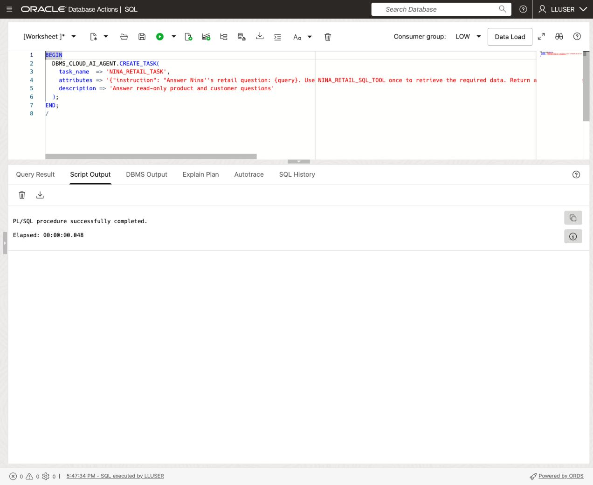

    **Expected output:** The task is created with NINA_RETAIL_SQL_TOOL as its tool. The `{query}` placeholder receives Nina's question when the team runs.

    The instructions request one tool call and prohibit changes to records. Those instructions state the intended behavior. Task 5 will show the actual invocation count; do not assume the requested count proves what happened.

3. Create the sequential team.

    ```sql
    <copy>
    BEGIN
      DBMS_CLOUD_AI_AGENT.CREATE_TEAM(
        team_name  => 'NINA_RETAIL_TEAM',
        attributes => '{"agents": [{"name": "NINA_RETAIL_AGENT", "task": "NINA_RETAIL_TASK"}], "process": "sequential"}',
        description => 'Read-only retail question team'
      );
    END;
    /
    </copy>
    ```

    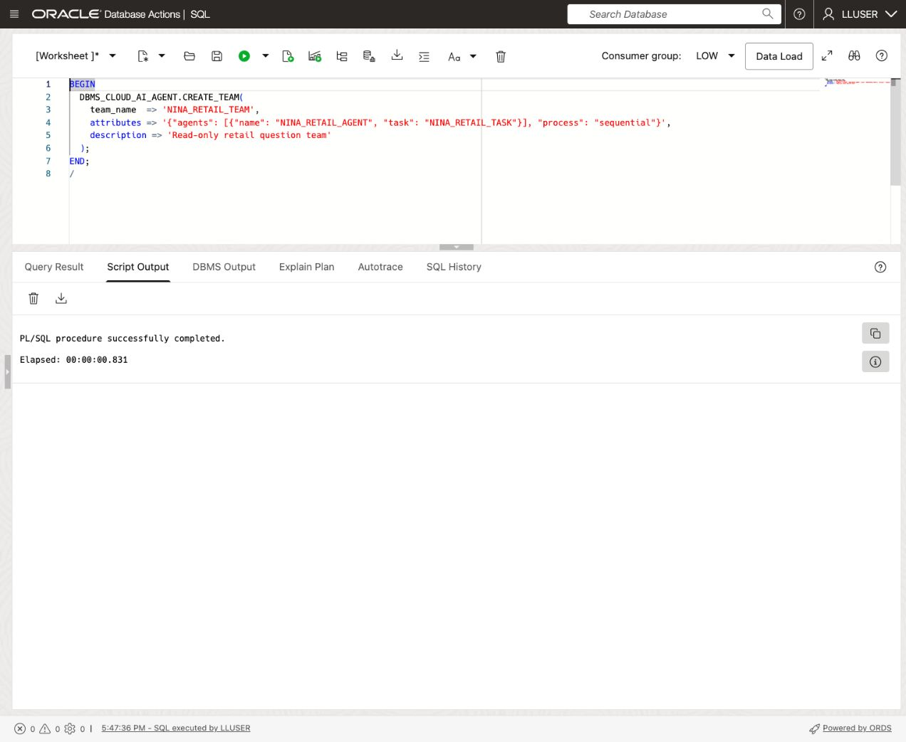

    **Expected output:** The team is created. NINA_RETAIL_TEAM connects NINA_RETAIL_AGENT with NINA_RETAIL_TASK and is the unit called by the application.

## Task 4: Run a retail question

Nina needs to recognize her request later in the history. A SQL Worksheet can issue separate requests without retaining a local variable. A one-row table stores the conversation ID so the run and the history queries can read the same value across those requests.

1. Create the request table and its conversation ID. Run this once for the lab request.

    ```sql
    <copy>
    CREATE TABLE nina_retail_request AS
    SELECT DBMS_CLOUD_AI.CREATE_CONVERSATION() AS conversation_id
    FROM dual;
    </copy>
    ```

    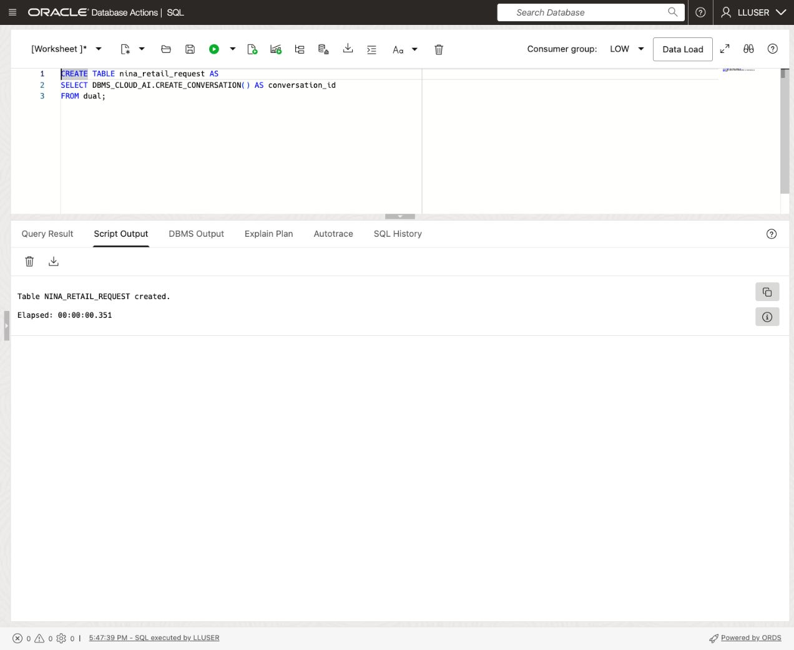

    **Expected output:** NINA_RETAIL_REQUEST is created with one row. Keep this row while reviewing the request; do not add additional IDs to the table.

2. Run the team with the saved ID and the product-revenue question.

    ```sql
    <copy>
    SELECT DBMS_CLOUD_AI_AGENT.RUN_TEAM(
             team_name   => 'NINA_RETAIL_TEAM',
             user_prompt => 'Treat each PRODUCT_ID as a separate product. Calculate revenue as SUM(ORDER_ITEMS.LINE_TOTAL) and units as SUM(ORDER_ITEMS.QUANTITY), group by PRODUCTS.PRODUCT_ID, PRODUCTS.PRODUCT_NAME, PRODUCTS.CATEGORY, order revenue descending then PRODUCT_ID, return five products across all orders. Include product_id, name, category, total revenue, and units.',
             params      => JSON_OBJECT(
                              'conversation_id' VALUE r.conversation_id
                              RETURNING CLOB
                            )
           ) AS agent_answer
    FROM nina_retail_request r;
    </copy>
    ```

    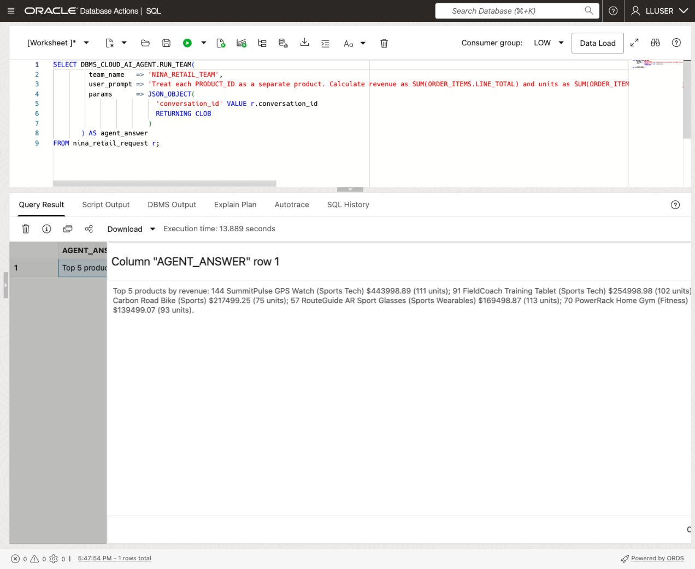

    **Expected output:** A CLOB answer containing five distinct product IDs, their names and categories, total revenue, and units sold. The provider determines the wording, so inspect the facts rather than expecting an identical sentence.

    The prompt makes product identity and calculation explicit: group by PRODUCT_ID, name, and category; sum historical LINE_TOTAL and QUANTITY; include all orders. Grouping only by a repeated product name can merge different products and produce a different answer. This is why the refined prompt asks for IDs and an explicit tie-breaker. Compare the answer with [Lab 7 Task 4's direct revenue query](?lab=selectai#Task4:Runthequestioninthedatabase). The supplied data ranks SummitPulse GPS Watch first at **443,998.89** revenue and **111** units. Compare product identities as well as labels because some names repeat.

3. Keep the answer for the history review.

    A response alone does not establish successful database work. The next task checks the team's state, completion timestamp, approved tool, and actual call count for this saved conversation. Run this initial question once before inspecting it; additional runs under the same conversation can create additional history to distinguish.

## Task 5: Inspect what the agent did

Nina needs to connect the answer to the work the team performed. Querying the most recent few runs is not enough when other requests exist. The saved caller conversation ID identifies the relevant team history, and its team execution ID identifies the tool records.

1. Read the team execution for this request.

    ```sql
    <copy>
    SELECT h.conversation_id,
           h.team_name,
           h.team_exec_id,
           h.state,
           h.start_date,
           h.end_date
    FROM user_ai_agent_team_history h
    JOIN nina_retail_request r
      ON r.conversation_id = h.conversation_id
    WHERE h.team_name = 'NINA_RETAIL_TEAM'
    ORDER BY h.start_date, h.team_exec_id;
    </copy>
    ```

    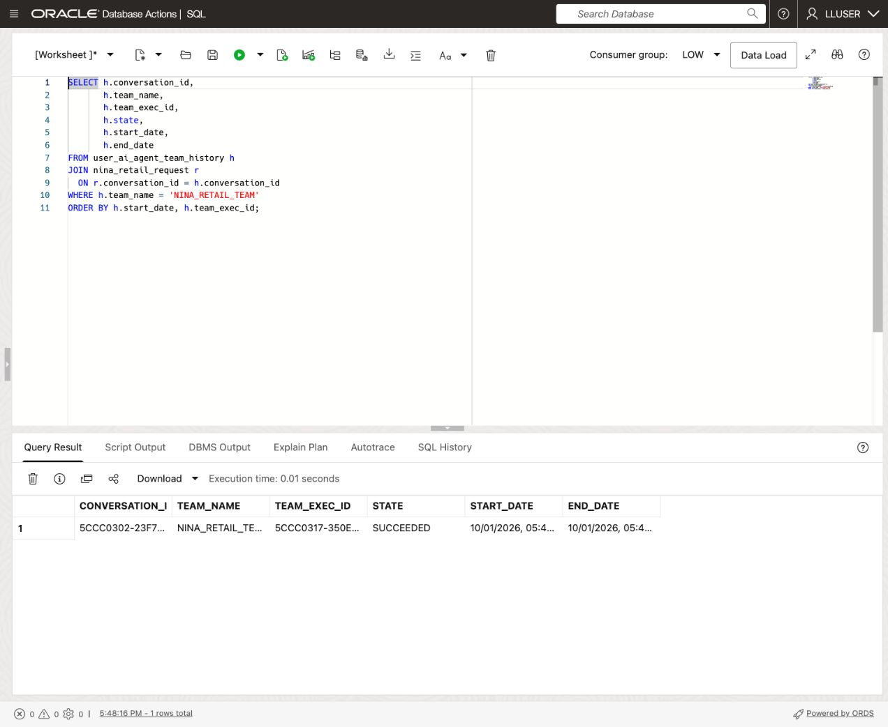

    **Expected output: Request execution**

    | Column | Successful-run evidence |
    | --- | --- |
    | CONVERSATION_ID | Matches the single saved request row |
    | TEAM_NAME | NINA_RETAIL_TEAM |
    | TEAM_EXEC_ID | Identifies this recorded team run |
    | STATE | SUCCEEDED |
    | START_DATE and END_DATE | Both populated for the completed run |

    A failed or incomplete run must be investigated before using its answer. No rows means this query has not found the matching team execution. The task's internal conversation can differ from the caller's ID; use the direct team-history match shown here.

2. Inspect every tool invocation associated with that team execution.

    ```sql
    <copy>
    SELECT t.team_exec_id,
           t.tool_name,
           t.invocation_id,
           t.agent_name,
           t.task_name,
           t.start_date,
           t.end_date
    FROM user_ai_agent_tool_history t
    WHERE EXISTS (
      SELECT 1
      FROM user_ai_agent_team_history h
      JOIN nina_retail_request r
        ON r.conversation_id = h.conversation_id
      WHERE h.team_name = 'NINA_RETAIL_TEAM'
        AND h.team_exec_id = t.team_exec_id
    )
    ORDER BY t.team_exec_id, t.start_date, t.invocation_id;
    </copy>
    ```

    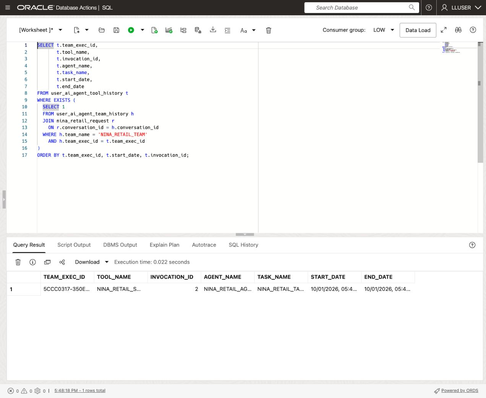

    **Expected output:** The tool history identifies NINA_RETAIL_SQL_TOOL, NINA_RETAIL_AGENT, and NINA_RETAIL_TASK for the matching team execution. Each completed call has an end timestamp. Review all returned rows, including any repeated or unexpected calls.

3. Count the calls, including the case where none were recorded.

    ```sql
    <copy>
    SELECT r.conversation_id,
           h.team_exec_id,
           h.state,
           COUNT(t.invocation_id) AS total_invocations,
           COUNT(t.end_date) AS completed_invocations,
           COUNT(CASE WHEN t.tool_name = 'NINA_RETAIL_SQL_TOOL'
                      THEN t.invocation_id END) AS approved_tool_invocations,
           COUNT(CASE WHEN t.invocation_id IS NOT NULL
                            AND (t.tool_name <> 'NINA_RETAIL_SQL_TOOL'
                                 OR t.tool_name IS NULL)
                      THEN t.invocation_id END) AS other_tool_invocations
    FROM nina_retail_request r
    LEFT JOIN user_ai_agent_team_history h
      ON h.conversation_id = r.conversation_id
     AND h.team_name = 'NINA_RETAIL_TEAM'
    LEFT JOIN user_ai_agent_tool_history t
      ON t.team_exec_id = h.team_exec_id
    GROUP BY r.conversation_id, h.team_exec_id, h.state
    ORDER BY h.team_exec_id;
    </copy>
    ```

    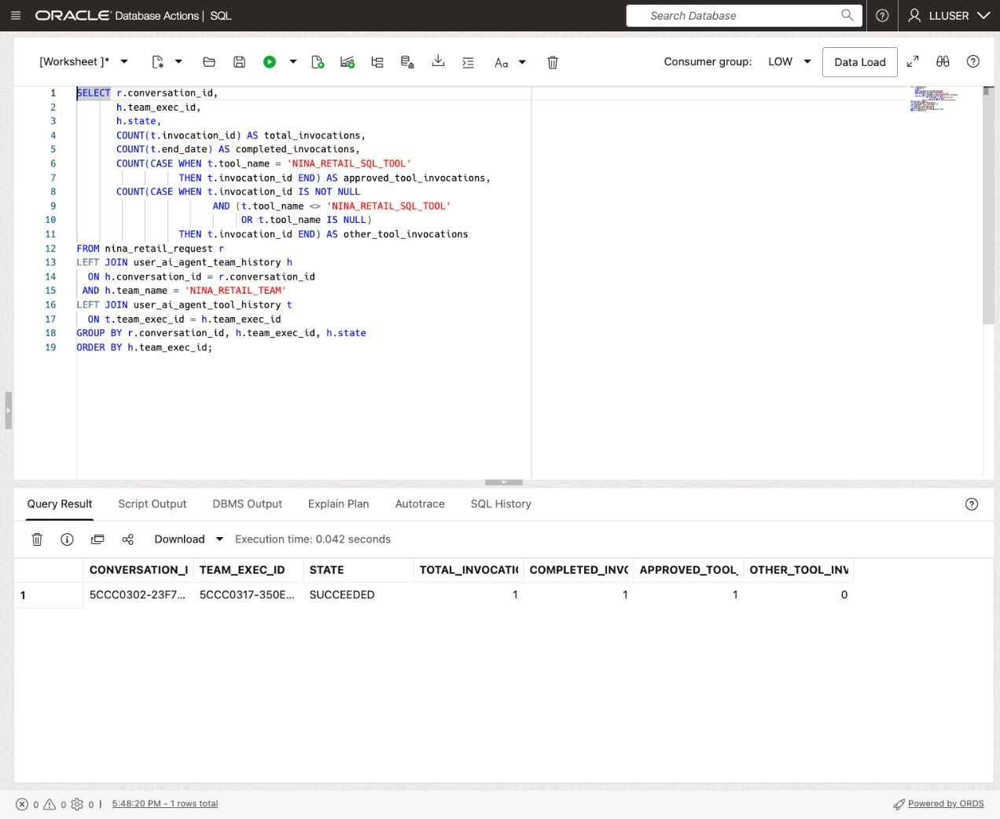

    **Expected output: Invocation evidence**

    | Column | What to check |
    | --- | --- |
    | TOTAL_INVOCATIONS | Actual calls for each matching team execution, including zero |
    | COMPLETED_INVOCATIONS | Calls with a populated end timestamp |
    | APPROVED_TOOL_INVOCATIONS | Calls to NINA_RETAIL_SQL_TOOL |
    | OTHER_TOOL_INVOCATIONS | Zero for this one-tool task |

    For the intended single-call flow, the first three counts are **1**, and other-tool invocations are **0**. Use the actual values your run records. More than one call means the agent did not follow the single-call instruction exactly; zero calls does not prove the answer used database evidence. An end timestamp records completion, so also check the team state and the answer's facts rather than treating a timestamp alone as success.

4. Decide whether the answer is ready for Nina's review screen.

    Confirm the exact team run succeeded, the approved SQL tool ran, and the product totals agree with the direct SQL evidence. The saved ID ties those checks together. A plausible answer or a successful Select AI call from another task does not establish this agent's behavior.

## Conclusion: Give the agent a controlled way to work

In Lab 7, Nina used Select AI to turn individual questions into SQL. Here she defined an assistant with a role, a task, and one SQL tool. The application can call that team, while Jessica and Nina can inspect the matching execution and tool history before relying on its answer.

The database still supplies the product and order facts. The profile determines the tool's configured object scope, database privileges control access, and the history records the activity. Instructions guide the agent; the recorded run and the reference query give the team evidence to assess the result.

The team’s retail investigation now connects Jessica’s data query, Thomas’s order document, Gilly’s product matches, Bob’s creator relationships, Moon’s fulfillment options, Otto’s model scores, and Nina’s reviewable questions and assistant activity.

## Appendix: Reset the workshop objects

Use this reset only for the objects you created in this lab. Save the answer and execution history first. Each drop is attempted independently, so a partial setup does not prevent the remaining objects from being removed. Missing objects are tolerated; other errors are reported after the reset attempts.

```sql
<copy>
DECLARE
  l_errors VARCHAR2(32767);
BEGIN
  BEGIN
    DBMS_CLOUD_AI_AGENT.DROP_TEAM('NINA_RETAIL_TEAM', TRUE);
  EXCEPTION WHEN OTHERS THEN
    l_errors := l_errors || 'DROP_TEAM: ' || SQLERRM || CHR(10);
  END;
  BEGIN
    DBMS_CLOUD_AI_AGENT.DROP_TASK('NINA_RETAIL_TASK', TRUE);
  EXCEPTION WHEN OTHERS THEN
    l_errors := l_errors || 'DROP_TASK: ' || SQLERRM || CHR(10);
  END;
  BEGIN
    DBMS_CLOUD_AI_AGENT.DROP_AGENT('NINA_RETAIL_AGENT', TRUE);
  EXCEPTION WHEN OTHERS THEN
    l_errors := l_errors || 'DROP_AGENT: ' || SQLERRM || CHR(10);
  END;
  BEGIN
    DBMS_CLOUD_AI_AGENT.DROP_TOOL('NINA_RETAIL_SQL_TOOL', TRUE);
  EXCEPTION WHEN OTHERS THEN
    l_errors := l_errors || 'DROP_TOOL: ' || SQLERRM || CHR(10);
  END;
  BEGIN
    EXECUTE IMMEDIATE 'DROP TABLE nina_retail_request PURGE';
  EXCEPTION WHEN OTHERS THEN
    IF SQLCODE <> -942 THEN
      l_errors := l_errors || 'DROP_REQUEST_TABLE: ' || SQLERRM || CHR(10);
    END IF;
  END;
  IF l_errors IS NOT NULL THEN
    RAISE_APPLICATION_ERROR(-20001, SUBSTR(l_errors, 1, 2000));
  END IF;
END;
/
</copy>
```

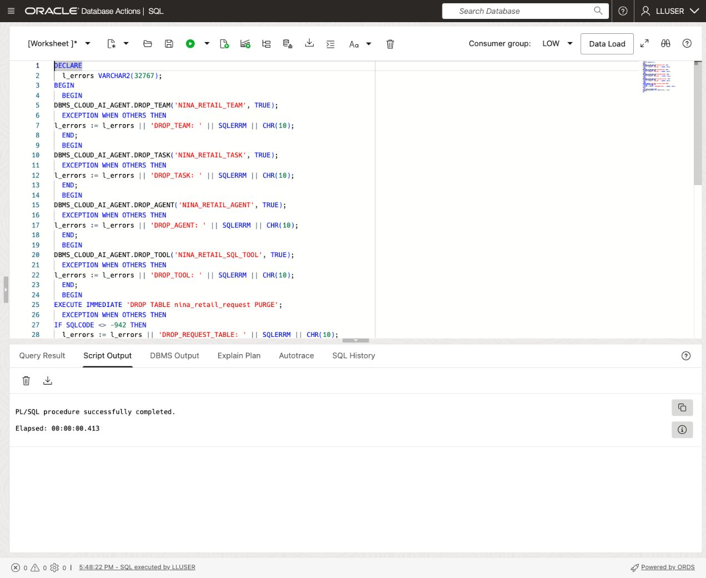

**Expected output:** The reset completes. If a drop fails for a reason other than absence, the block reports it. Run Task 1's collision query again; it should return no rows before recreating the objects.

The reset does not drop GENAI, its provider credentials, or the retail tables. GENAI retains the model and object-list settings used in the lab. The one-row request table is removed so the next attempt can create a fresh request ID.

## Next Steps

Continue to the [Final Quiz](?lab=final-quiz). For API details, see Oracle's [Select AI Agent package reference](https://docs.oracle.com/en/cloud/paas/autonomous-database/serverless/adbsb/dbms-cloud-ai-agent-package.html) and [execution-history reference](https://docs.oracle.com/en/cloud/paas/autonomous-database/serverless/adbsb/dbms-cloud-ai-agent-views-history.html).

## Acknowledgements

* **Author** - Linda Foinding, Principal Database Product Manager
* **Last Updated By/Date** - Oracle Database Product Management, October 2026
