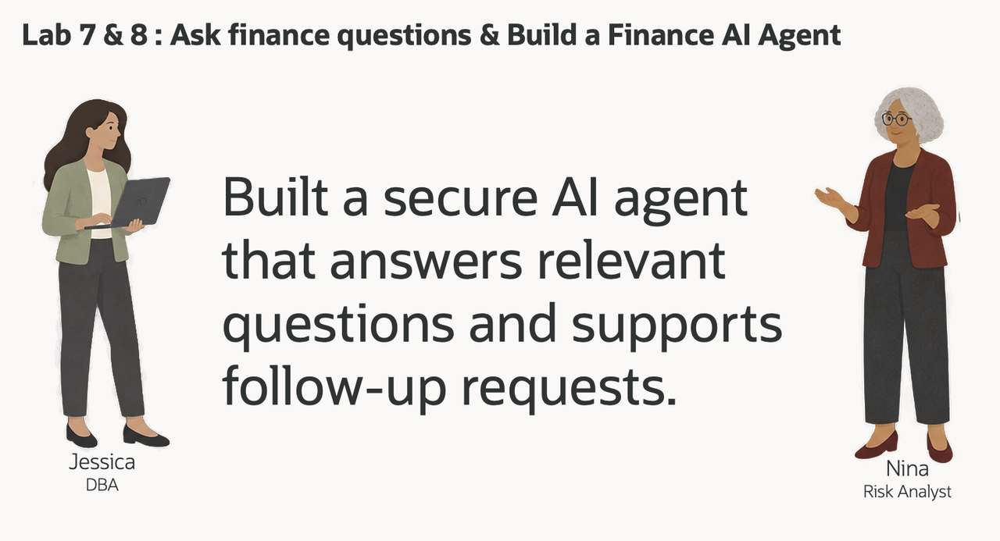

# Ask Retail Questions with Select AI

## Introduction

Nina Patel is a risk analyst at Seer Sporting Goods. She knows the business questions she wants to ask, but she does not want every answer to depend on finding the right table, column, join, and filter first.

Jessica, the DBA, has configured a Select AI profile for the retail schema. Nina can ask a question in ordinary language. Select AI uses the profile and database metadata to generate SQL, run a question, or explain the returned rows.

Nina still reviews the SQL. A model can choose an unsuitable revenue calculation or add a filter the question did not request. She asks, inspects, runs, and refines the question before using the answer in a business review.

In this lab, you connect the profile to the retail tables, inspect generated SQL, compare the answer with a direct revenue query, and improve the question for a more useful result.



<details>
<summary><strong>Key terms: Select AI, AI profile, generated SQL, and natural-language prompt</strong></summary>

> - **Select AI** works with database information through a natural-language question.
> - An **AI profile** identifies the provider and the database objects supplied as context.
> - **Generated SQL** is the statement created from the question. Review it before relying on its result.
> - A **prompt** is the business question, such as “Which five products have the highest revenue?”

</details>

### Objectives

- Inspect the available Select AI profile without displaying credential material.
- Configure the four retail tables used by Nina's questions.
- Generate and inspect SQL with the requested Grok model.
- Compare AI-assisted answers with an explicit order-line revenue calculation.
- Refine the requested fields and check the resulting narrative.

Estimated Time: **15 minutes**

### Hands-on Scenario

| Step | Retail focus |
| --- | --- |
| Business Problem | Nina needs product-revenue facts for the demand review. |
| Technical Challenge | An ordinary-language question must map to the right retail tables, joins, and calculation. |
| Persona Focus | You follow Nina as she asks, inspects, runs, and improves a question. |
| What You Will See | Generated SQL, database results, and a narrative that can be checked against those results. |
| Database Capability | Select AI, AI profiles, and DBMS\_CLOUD\_AI. |
| Outcome | Nina has a repeatable question-and-review workflow over the existing retail records. |

> **SQL Worksheet reminder:** See [Getting Started Task 2: Open SQL Worksheet](?lab=getting-started#Task2:OpenSQLWorksheet). Run each block separately and open the full CLOB value when an answer is longer than the result cell.

## Task 1: Check the Select AI profile

The workshop supplies the provider connection. You use the profile owned by your LLUSER schema.

1. Check that GENAI is enabled.

    ```sql
    <copy>
    SELECT profile_name, status, description
    FROM user_cloud_ai_profiles
    WHERE profile_name = 'GENAI';
    </copy>
    ```

    **Expected output:** One enabled GENAI profile.

2. Read the provider, model, and object-list settings. A model may be selected by the call even when no model attribute is listed here.

    ```sql
    <copy>
    SELECT profile_name, attribute_name, attribute_value
    FROM user_cloud_ai_profile_attributes
    WHERE profile_name = 'GENAI'
      AND LOWER(attribute_name) IN ('provider', 'model', 'object_list')
    ORDER BY attribute_name;
    </copy>
    ```

    **Expected output:** The available nonsecret settings. The next task supplies the Retail object list.

## Task 2: Add the retail tables to the profile

Nina's questions require products, orders, order items, and customers. Use the current schema name so the same block works in each learner reservation.

1. Set the four-table list.

    ```sql
    <copy>
    BEGIN
      DBMS_CLOUD_AI.SET_ATTRIBUTE(
        profile_name    => 'genai',
        attribute_name  => 'object_list',
        attribute_value => '[{"owner": "' || USER || '", "name": "PRODUCTS"}, {"owner": "' || USER || '", "name": "ORDERS"}, {"owner": "' || USER || '", "name": "ORDER_ITEMS"}, {"owner": "' || USER || '", "name": "CUSTOMERS"}]'
      );
    END;
    /
    </copy>
    ```

    **Expected output:** PL/SQL procedure successfully completed.

2. Supply all four tables as context and enforce the object list for generated SQL.

    ```sql
    <copy>
    BEGIN
      DBMS_CLOUD_AI.SET_ATTRIBUTE('GENAI', 'object_list_mode', 'all');
      DBMS_CLOUD_AI.SET_ATTRIBUTE('GENAI', 'enforce_object_list', 'true');
    END;
    /
    </copy>
    ```

    **Expected output:** PL/SQL procedure successfully completed. Database privileges still apply; a profile does not grant access to another schema.

3. Confirm the list.

    ```sql
    <copy>
    SELECT profile_name, attribute_name, attribute_value
    FROM user_cloud_ai_profile_attributes
    WHERE profile_name = 'GENAI'
      AND attribute_name = 'object_list';
    </copy>
    ```

    **Expected output:** PRODUCTS, ORDERS, ORDER_ITEMS, and CUSTOMERS owned by LLUSER.

## Task 3: Ask a question and inspect the SQL

Nina starts with product revenue. SHOWSQL asks for SQL text; it does not return the five product totals.

1. Run this question exactly as shown.

    ```sql
    <copy>
    SELECT DBMS_CLOUD_AI.GENERATE(
             prompt       => 'Which five products have the highest revenue?',
             profile_name => 'genai',
             action       => 'showsql',
             attributes   => '{"model":"xai.grok-4.3"}'
           ) AS generated_sql
    FROM dual;
    </copy>
    ```

    **Expected output:** A SELECT statement that joins product and order-line data, aggregates revenue by product, orders descending, and returns five rows. Generated formatting and aliases may differ.

2. Inspect the full statement. Check the product-to-item join, the aggregation, any status filters, and the five-row limit. Different product IDs can share a name, so grouping only by name can combine distinct products. Task 5 makes the product identity explicit. For this question, revenue means the historical sum of order-line quantity × line price, exposed by LINE_TOTAL. It is not the current catalog price and does not subtract refunds or cancelled orders unless the question explicitly asks for those rules.

3. After reviewing the generated SELECT, copy it into a new worksheet and run that exact statement. Keep the result for comparison with Task 4. If the generated statement does not answer the question, refine the prompt before using its answer.

## Task 4: Run the question in the database

1. Ask Select AI to run the same question.

    ```sql
    <copy>
    SELECT DBMS_CLOUD_AI.GENERATE(
             prompt       => 'Which five products have the highest revenue?',
             profile_name => 'genai',
             action       => 'runsql',
             attributes   => '{"model":"xai.grok-4.3"}'
           ) AS answer
    FROM dual;
    </copy>
    ```

    **Expected output:** Five products and their revenue totals. RUNSQL generates and executes a statement for this request; it does not execute the exact SHOWSQL text from the previous request.

2. Run the explicit reference query and compare product identities and totals.

    ```sql
    <copy>
    SELECT p.product_id,
           p.product_name,
           p.category,
           SUM(oi.line_total) AS total_revenue,
           SUM(oi.quantity) AS units_sold
    FROM products p
    JOIN order_items oi ON oi.product_id = p.product_id
    GROUP BY p.product_id, p.product_name, p.category
    ORDER BY total_revenue DESC, p.product_id
    FETCH FIRST 5 ROWS ONLY;
    </copy>
    ```

    **Expected output:** Five rows with product ID, name, category, revenue, and units sold. These values come directly from the retail order items.

    | Product | Revenue | Units |
    | --- | ---: | ---: |
    | SummitPulse GPS Watch | 443,998.89 | 111 |
    | FieldCoach Training Tablet | 254,998.98 | 102 |
    | Carbon Road Bike | 217,499.25 | 75 |
    | RouteGuide AR Sport Glasses | 169,498.87 | 113 |
    | PowerRack Home Gym | 139,499.07 | 93 |

    These examples describe the workshop seed. If you change the orders, compare against your current reference result. Product IDs distinguish repeated product names.

## Task 5: Improve the business question

Nina also wants category and units sold. She defines each product by its ID and specifies the revenue calculation so repeated names cannot merge distinct products.

1. Inspect SQL for the refined question.

    ```sql
    <copy>
    SELECT DBMS_CLOUD_AI.GENERATE(
             prompt       => 'Which five products have the highest revenue across all orders? Treat each PRODUCT_ID as a separate product. Calculate revenue as SUM(ORDER_ITEMS.LINE_TOTAL) and units as SUM(ORDER_ITEMS.QUANTITY). Group by PRODUCTS.PRODUCT_ID, PRODUCTS.PRODUCT_NAME, and PRODUCTS.CATEGORY. Order by revenue descending, then PRODUCT_ID. Include product ID, product name, category, total revenue, and units sold.',
             profile_name => 'genai',
             action       => 'showsql',
             attributes   => '{"model":"xai.grok-4.3"}'
           ) AS generated_sql
    FROM dual;
    </copy>
    ```

    **Expected output:** Generated SQL that includes the five requested business fields. Check that units use SUM(QUANTITY) and revenue uses the historical line amount.

2. Run the refined question.

    ```sql
    <copy>
    SELECT DBMS_CLOUD_AI.GENERATE(
             prompt       => 'Which five products have the highest revenue across all orders? Treat each PRODUCT_ID as a separate product. Calculate revenue as SUM(ORDER_ITEMS.LINE_TOTAL) and units as SUM(ORDER_ITEMS.QUANTITY). Group by PRODUCTS.PRODUCT_ID, PRODUCTS.PRODUCT_NAME, and PRODUCTS.CATEGORY. Order by revenue descending, then PRODUCT_ID. Include product ID, product name, category, total revenue, and units sold.',
             profile_name => 'genai',
             action       => 'runsql',
             attributes   => '{"model":"xai.grok-4.3"}'
           ) AS answer
    FROM dual;
    </copy>
    ```

    **Expected output:** The same five-product revenue ranking with category and units. Compare it with the reference query rather than assuming a different wording means different facts.

3. Identify what the refined prompt improved. Nina made the product identity, requested columns, calculation, and tie order explicit.

## Task 6: Explain the result

1. Request a short explanation of the refined result.

    ```sql
    <copy>
    SELECT DBMS_CLOUD_AI.GENERATE(
             prompt       => 'Which five products have the highest revenue across all orders? Treat each PRODUCT_ID as a separate product. Calculate revenue as SUM(ORDER_ITEMS.LINE_TOTAL) and units as SUM(ORDER_ITEMS.QUANTITY). Group by PRODUCTS.PRODUCT_ID, PRODUCTS.PRODUCT_NAME, and PRODUCTS.CATEGORY. Order by revenue descending, then PRODUCT_ID. Include product ID, product name, category, total revenue, and units sold.',
             profile_name => 'genai',
             action       => 'narrate',
             attributes   => '{"model":"xai.grok-4.3"}'
           ) AS explanation
    FROM dual;
    </copy>
    ```

    **Expected output:** A narrative based on the query result. Check each product, total, unit count, and comparison against the direct SQL evidence. Wording can vary.

2. Keep observations separate from conclusions. High historical revenue does not by itself prove a future surge, profit margin, or stock shortage.

    > NARRATE sends the query result to the provider configured in the profile. This lab uses the workshop's sample retail data.

## Conclusion: Ask, Inspect, and Refine

Nina turned a retail question into SQL, reviewed the statement, ran the question, and refined the requested fields. The direct revenue query gave her a concrete way to check the AI-assisted result and explanation.

Select AI reduces the SQL a business user must write while keeping the query, database privileges, and business calculation visible. The model helps express a question; Nina still decides whether the SQL and answer address it.

Jessica and Nina now have the ingredients for a defined assistant. In the next lab, they give an agent a role, a task, and one SQL tool, then inspect the execution history behind its answer.

## Next Steps

Continue to [Lab 8: Build a Retail Agent with Select AI Agent](?lab=selectai-agent). For profile attributes and supported actions, see the [Select AI documentation](https://docs.oracle.com/en/database/oracle/oracle-database/26/selai/).

## Acknowledgements

* **Author** - Kevin Lazarz
* **Contributors** - Eugenio Galiano, Pat Shepherd, Linda Foinding
* **Last Updated By/Date** - Oracle Database Product Management, September 2026
