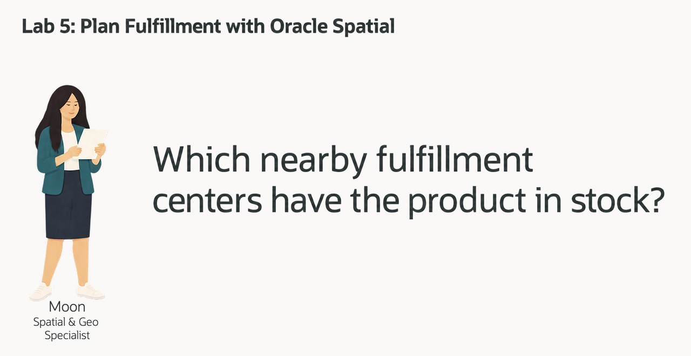
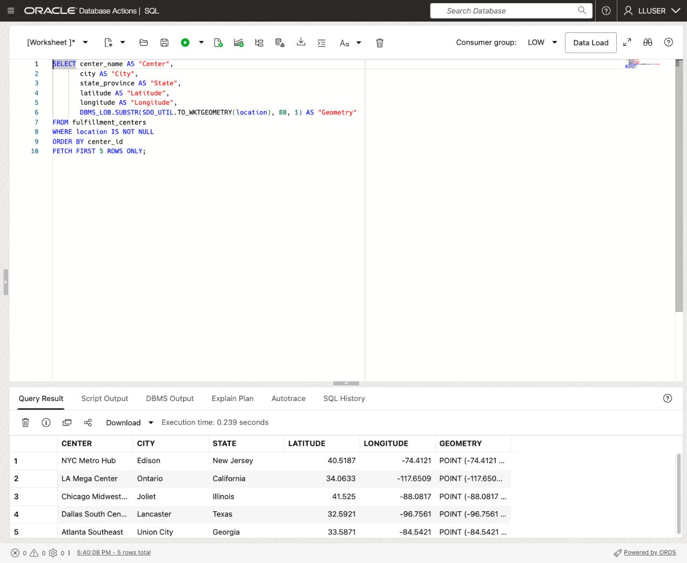
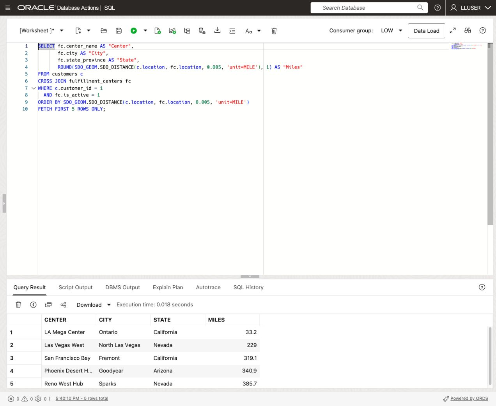
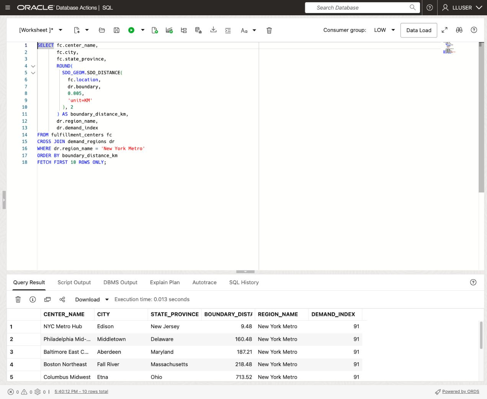
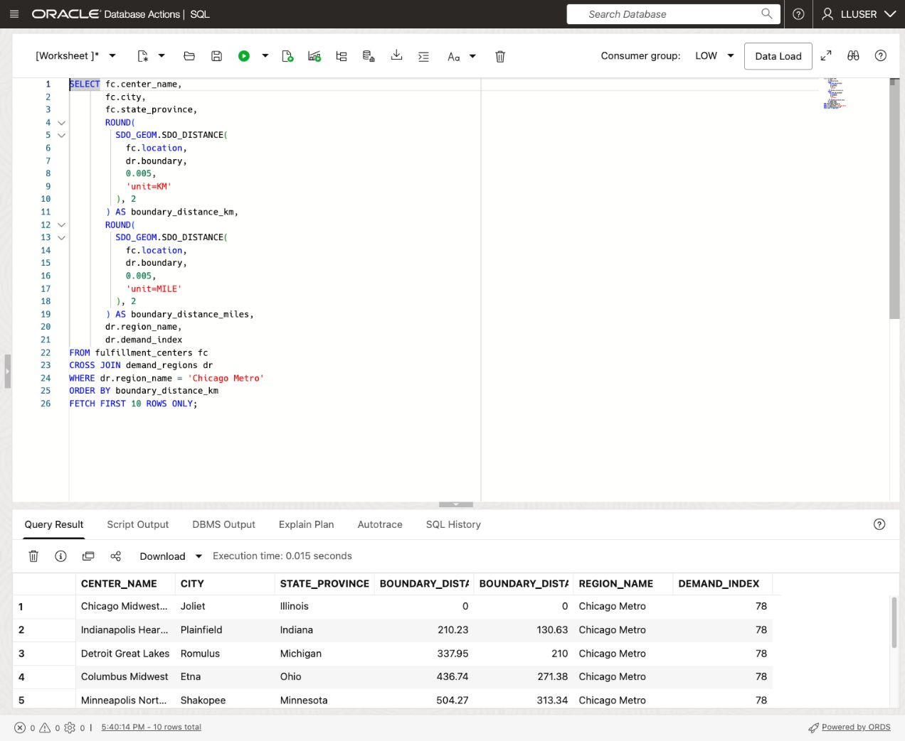
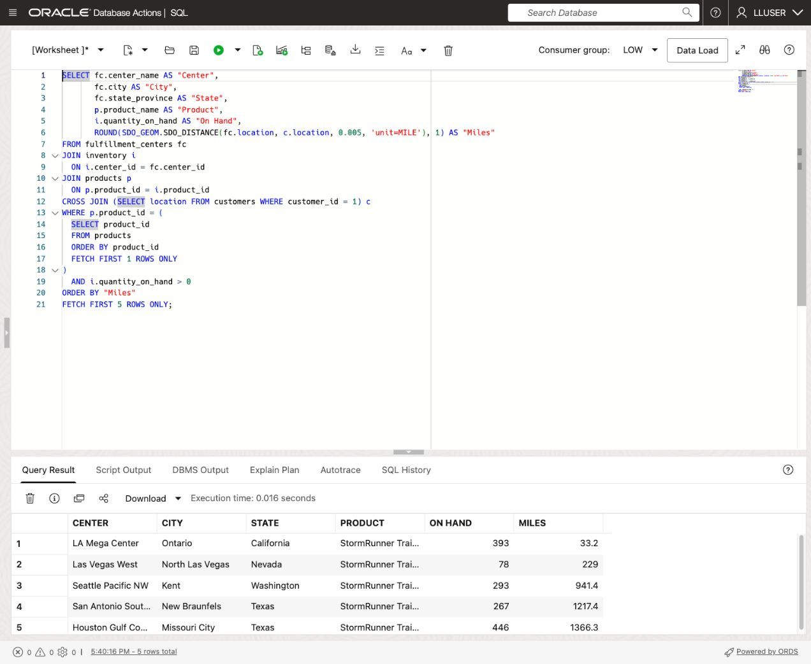
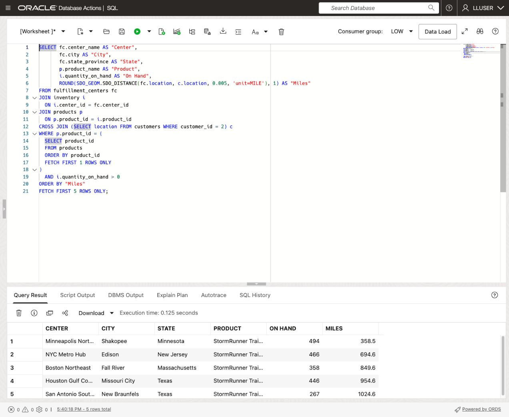

# Plan Fulfillment with Oracle Spatial

## Introduction

Moon Kai is Seer Sporting Goods' spatial specialist. Bob has shown the team which creator and brand relationships deserve review. Moon now looks at where the retail operation can respond: which fulfillment centers are close to a customer, and which of those centers have the product on hand?

Oracle AI Database already holds customer and fulfillment-center points, demand-region polygons, and the product and inventory records that give those locations business meaning.

Moon wants a business-user dashboard to answer a practical question:

> A customer needs a product. **Which nearby centers have stock worth reviewing for fulfillment?**

In this lab, you start with a stored point, compare distances, and join location to product inventory. You will also compare two demand regions using their stored geometry.



<details>
<summary><strong>Key terms: point, polygon, distance, geometry, and WKT</strong></summary>

> - A **point** represents one location. Customer and center locations use longitude and latitude in the WGS84 coordinate system.
>
> - A **polygon** represents an area. The demand-region boundary is a polygon, rather than a single city-center point.
>
> - **Geometry** is the database representation of a location or shape. Oracle stores these values as `SDO_GEOMETRY` so SQL can calculate with them.
>
> - **Distance** in this lab is the spatial separation between geometries. It is not a road route or a delivery-time estimate.
>
> - **Well-known text (WKT)** displays a geometry in readable text, such as `POINT (-74.4121 40.5187)`. Longitude appears before latitude.

</details>

### Objectives

- Read fulfillment-center points as WKT.
- Rank active centers by distance from a customer.
- Combine center distance with product and on-hand inventory.
- Compare center points with New York and Chicago demand-region polygons.

Estimated Time: **15 minutes**

### Hands-on Scenario

| Step | Retail focus |
| --- | --- |
| Business Problem | Planners need nearby fulfillment options for products receiving attention. |
| Technical Challenge | Moon needs to calculate distance and return the related customer, center, product, and stock information together. |
| Persona Focus | You review Moon's location analysis for the Monday demand and fulfillment review. |
| What You Will See | Point and polygon calculations become a ranked list of centers and stocked locations. |
| Database Capability | SDO\_GEOMETRY, WKT conversion, SDO\_GEOM.SDO\_DISTANCE, and relational joins support the analysis. |
| Outcome | A planner can see which centers to examine first and which further operating checks are needed. |

> **SQL Worksheet reminder:** Need a reminder on how to open and use the SQL Worksheet? Return to [Getting Started Task 2: Open SQL Worksheet](?lab=getting-started#Task2:OpenSQLWorksheet) for the step-by-step graphic showing where to paste and run SQL statements.

## Task 1: Look at fulfillment locations as points

Moon starts with the simplest question: **where are the centers?** The same location can support a map and a distance calculation without maintaining a separate set of coordinates in another system.

1. Run the geometry query:

    ```sql
    <copy>
    SELECT center_name AS "Center",
           city AS "City",
           state_province AS "State",
           latitude AS "Latitude",
           longitude AS "Longitude",
           DBMS_LOB.SUBSTR(SDO_UTIL.TO_WKTGEOMETRY(location), 80, 1) AS "Geometry"
    FROM fulfillment_centers
    WHERE location IS NOT NULL
    ORDER BY center_id
    FETCH FIRST 5 ROWS ONLY;
    </copy>
    ```

    

    `SDO_UTIL.TO_WKTGEOMETRY` turns the stored point into readable text. `DBMS_LOB.SUBSTR` limits the worksheet display to 80 characters; it does not change the underlying geometry.

    **Expected output: Center geometry**

    | Center | City | State | Latitude | Longitude | Geometry |
    | --- | --- | --- | --- | --- | --- |
    | NYC Metro Hub | Edison | New Jersey | 40.5187 | -74.4121 | POINT (-74.4121 40.5187) |
    | LA Mega Center | Ontario | California | 34.0633 | -117.6509 | POINT (-117.6509 34.0633) |
    | Chicago Midwest Hub | Joliet | Illinois | 41.525 | -88.0817 | POINT (-88.0817 41.525) |
    | Dallas South Central | Lancaster | Texas | 32.5921 | -96.7561 | POINT (-96.7561 32.5921) |
    | Atlanta Southeast | Union City | Georgia | 33.5871 | -84.5421 | POINT (-84.5421 33.5871) |

2. Compare the latitude and longitude with the WKT value.

    The NYC Metro Hub is in Edison, New Jersey. Its WKT point lists longitude `-74.4121` before latitude `40.5187`. Keeping the geometry beside the center name, state, and operating data lets one query return both the map location and the information a planner can use.

## Task 2: Find nearby centers and compare demand regions

Moon first ranks active centers for one customer. She then changes the question from a customer point to a regional polygon so the team can review both kinds of location evidence.

1. Find the five nearest active centers to customer `1`:

    ```sql
    <copy>
    SELECT fc.center_name AS "Center",
           fc.city AS "City",
           fc.state_province AS "State",
           ROUND(SDO_GEOM.SDO_DISTANCE(c.location, fc.location, 0.005, 'unit=MILE'), 1) AS "Miles"
    FROM customers c
    CROSS JOIN fulfillment_centers fc
    WHERE c.customer_id = 1
      AND fc.is_active = 1
    ORDER BY SDO_GEOM.SDO_DISTANCE(c.location, fc.location, 0.005, 'unit=MILE')
    FETCH FIRST 5 ROWS ONLY;
    </copy>
    ```

    

    `CROSS JOIN` pairs the selected customer with each active center. `SDO_GEOM.SDO_DISTANCE` compares their points, `0.005` supplies the geometry tolerance, and `'unit=MILE'` requests miles. The unrounded distance determines the ordering.

    **Expected output: Nearby active centers**

    | Center | City | State | Miles |
    | --- | --- | --- | --- |
    | LA Mega Center | Ontario | California | 33.2 |
    | Las Vegas West | North Las Vegas | Nevada | 229 |
    | San Francisco Bay | Fremont | California | 319.1 |
    | Phoenix Desert Hub | Goodyear | Arizona | 340.9 |
    | Reno West Hub | Sparks | Nevada | 385.7 |

    LA Mega Center ranks first at about 33.2 miles. This query has not checked product stock; that is the next task.

2. Measure center distance to the New York Metro demand-region polygon:

    ```sql
    <copy>
    SELECT fc.center_name,
           fc.city,
           fc.state_province,
           ROUND(
             SDO_GEOM.SDO_DISTANCE(
               fc.location,
               dr.boundary,
               0.005,
               'unit=KM'
             ), 2
           ) AS boundary_distance_km,
           dr.region_name,
           dr.demand_index
    FROM fulfillment_centers fc
    CROSS JOIN demand_regions dr
    WHERE dr.region_name = 'New York Metro'
    ORDER BY boundary_distance_km
    FETCH FIRST 10 ROWS ONLY;
    </copy>
    ```

    

    **Expected output: Ten centers ordered by distance to New York Metro**

    | CENTER\_NAME | BOUNDARY\_DISTANCE\_KM | REGION\_NAME | DEMAND\_INDEX |
    | --- | --- | --- | --- |
    | NYC Metro Hub | 9.48 | New York Metro | 91 |
    | Philadelphia Mid-Atlantic | 160.48 | New York Metro | 91 |
    | Baltimore East Coast | 187.21 | New York Metro | 91 |

    The query returns the shortest separation between each point and the region geometry, in kilometers. A point inside or touching the polygon has distance zero. A center outside the region has a positive distance to the polygon. This query considers all centers; it does not filter their active status.

3. Compare Chicago Metro and display both distance units:

    ```sql
    <copy>
    SELECT fc.center_name,
           fc.city,
           fc.state_province,
           ROUND(
             SDO_GEOM.SDO_DISTANCE(
               fc.location,
               dr.boundary,
               0.005,
               'unit=KM'
             ), 2
           ) AS boundary_distance_km,
           ROUND(
             SDO_GEOM.SDO_DISTANCE(
               fc.location,
               dr.boundary,
               0.005,
               'unit=MILE'
             ), 2
           ) AS boundary_distance_miles,
           dr.region_name,
           dr.demand_index
    FROM fulfillment_centers fc
    CROSS JOIN demand_regions dr
    WHERE dr.region_name = 'Chicago Metro'
    ORDER BY boundary_distance_km
    FETCH FIRST 10 ROWS ONLY;
    </copy>
    ```

    

    **Expected output: Chicago comparison**

    | CENTER\_NAME | BOUNDARY\_DISTANCE\_KM | BOUNDARY\_DISTANCE\_MILES | DEMAND\_INDEX |
    | --- | --- | --- | --- |
    | Chicago Midwest Hub | 0 | 0 | 78 |
    | Indianapolis Heartland | 210.23 | 130.63 | 78 |
    | Detroit Great Lakes | 337.95 | 210 | 78 |

    Chicago Midwest Hub has zero distance because its point intersects the Chicago region. The difference between the New York and Chicago results comes from the selected polygon. A demand index gives the team regional context; neither it nor spatial distance guarantees a delivery commitment.

## Task 3: Combine distance with inventory

Distance alone cannot tell a planner where to fulfill an order. Moon adds the product and on-hand quantity to the result so the team can examine stocked locations near the customer.

1. Find the nearest stocked locations for the first product and customer `1`:

    ```sql
    <copy>
    SELECT fc.center_name AS "Center",
           fc.city AS "City",
           fc.state_province AS "State",
           p.product_name AS "Product",
           i.quantity_on_hand AS "On Hand",
           ROUND(SDO_GEOM.SDO_DISTANCE(fc.location, c.location, 0.005, 'unit=MILE'), 1) AS "Miles"
    FROM fulfillment_centers fc
    JOIN inventory i
      ON i.center_id = fc.center_id
    JOIN products p
      ON p.product_id = i.product_id
    CROSS JOIN (SELECT location FROM customers WHERE customer_id = 1) c
    WHERE p.product_id = (
      SELECT product_id
      FROM products
      ORDER BY product_id
      FETCH FIRST 1 ROWS ONLY
    )
      AND i.quantity_on_hand > 0
    ORDER BY "Miles"
    FETCH FIRST 5 ROWS ONLY;
    </copy>
    ```

    

    **Expected output: Distance and stock**

    | Center | City | State | Product | On Hand | Miles |
    | --- | --- | --- | --- | --- | --- |
    | LA Mega Center | Ontario | California | StormRunner Trail Shell | 393 | 33.2 |
    | Las Vegas West | North Las Vegas | Nevada | StormRunner Trail Shell | 78 | 229 |
    | Seattle Pacific NW | Kent | Washington | StormRunner Trail Shell | 293 | 941.4 |
    | San Antonio South TX | New Braunfels | Texas | StormRunner Trail Shell | 267 | 1217.4 |
    | Houston Gulf Coast | Missouri City | Texas | StormRunner Trail Shell | 446 | 1366.3 |

    This query keeps positive `QUANTITY_ON_HAND` and orders the returned centers by distance. It does not subtract reserved units, filter active status, or check workload. A planner must review those conditions before assigning an order. The SQL provides stock and location evidence for that decision.

2. Compare the result with Task 2.

    San Francisco Bay appears in the nearest-active-center list but not among the first five stocked locations for this product. The inventory join changes the business question and therefore the candidate list.

3. **Interactive challenge: compare a second customer.**

    Change only `customer_id = 1` to `customer_id = 2` in the stocked-center query. Which center should the planner review first? Which operating checks remain?

    <details>
    <summary><strong>Challenge answer: distance and on-hand stock are separate signals</strong></summary>

    Minneapolis North Central ranks first for customer `2`, at 358.5 miles with 494 units of the selected product on hand. The location changes the ranking; the product stays the same. Review available-to-promise quantity, active status, workload, and the delivery promise before allocating stock.

    Run this solution to compare:

    ```sql
    <copy>
    SELECT fc.center_name AS "Center",
           fc.city AS "City",
           fc.state_province AS "State",
           p.product_name AS "Product",
           i.quantity_on_hand AS "On Hand",
           ROUND(SDO_GEOM.SDO_DISTANCE(fc.location, c.location, 0.005, 'unit=MILE'), 1) AS "Miles"
    FROM fulfillment_centers fc
    JOIN inventory i
      ON i.center_id = fc.center_id
    JOIN products p
      ON p.product_id = i.product_id
    CROSS JOIN (SELECT location FROM customers WHERE customer_id = 2) c
    WHERE p.product_id = (
      SELECT product_id
      FROM products
      ORDER BY product_id
      FETCH FIRST 1 ROWS ONLY
    )
      AND i.quantity_on_hand > 0
    ORDER BY "Miles"
    FETCH FIRST 5 ROWS ONLY;
    </copy>
    ```

    

    **Expected output: First stocked location for customer 2**

    | Center | Product | On Hand | Miles |
    | --- | --- | --- | --- |
    | Minneapolis North Central | StormRunner Trail Shell | 494 | 358.5 |

    </details>

## Conclusion: Turn Location into a Fulfillment Decision

Moon moved from stored points to ranked centers, then added product stock to the location evidence. The planner can see nearby active centers and compare them with locations holding the selected product. The two lists answer different parts of the fulfillment question.

Oracle Spatial keeps the calculation beside the customer, center, product, and inventory rows. SQL returns the geometry and operating details needed for review. The team can explain its options without reconciling a separate map database with an inventory report.

Moon hands the location and stock evidence to Otto, who will put a demand score beside product activity so the team can examine which products deserve attention.

## Next Steps

For a deeper hands-on workshop focused on Oracle Spatial, open the [Oracle Spatial LiveLabs workshop](https://livelabs.oracle.com/ords/r/dbpm/livelabs/view-workshop?clear=RR,180&wid=800).

## Acknowledgements

* **Author** - Linda Foinding, Principal Database Product Manager
* **Last Updated By/Date** - Oracle Database Product Management, October 2026
