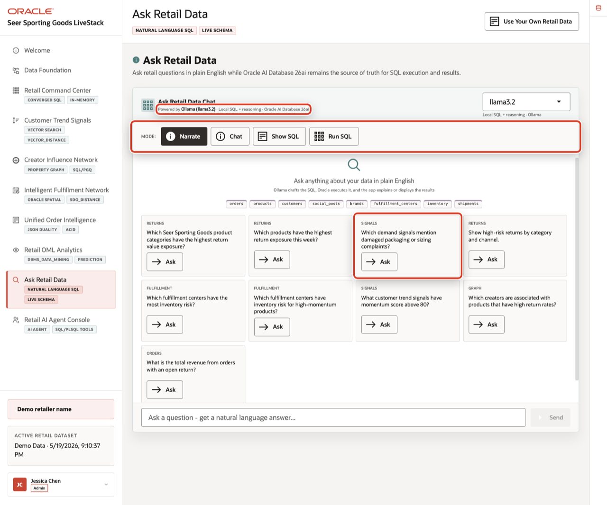

# Ask Retail Data: Trusted NL2SQL Answers

## Introduction

**Ask Retail Data** is about trusted answers. Recast the learner takeaway as a business question: *How do I ask for an answer in plain language and still trace it back to governed SQL, approved views, and visible evidence?*

This lab does not require a live **GenAI profile**. Emphasize that the real lesson is governance: even when AI helps write SQL, the business still needs approved answer paths, visible logic, and results that can be checked.

Lab 9 builds on this foundation by showing how the same governance pattern extends from trusted SQL answers to trusted agent actions and durable audit history.

### Operating Story

| Step | Retail focus |
| --- | --- |
| Business Problem | Business users want plain-English answers, but the company must still know which data and SQL produced the answer. |
| What You Will Prove | A trusted NL2SQL answer should map to approved views, readable columns, visible filters, and repeatable Oracle SQL. |
| Database Capability | Semantic views, comments, and inspectable SQL provide the governed answer path behind natural-language questions. |
| Outcome | Ask Retail Data becomes useful when the answer is not a black box; it is traceable to database evidence. |
{: title="Trusted NL2SQL Story"}

**Persona focus:** Business users want plain-English answers. Data and database teams need those answers to map back to approved views, visible filters, and SQL that can be checked.

Estimated Time: **5 minutes**

### Objectives

- Identify the approved database views that should ground plain-language business questions.
- Run a short, inspectable SQL answer for one retail question in plain English so learners can see what a trustworthy answer path looks like.
- Explain which signals make generated SQL trustworthy before a business user relies on the result.


## Task 1: Start with approved answer paths

Perform the following set of steps to see which database views should be used to answer common business questions.

1. Review the related application screen before you run SQL.

    

    *Figure 1: Ask Retail Data exposes query modes and example questions.*

2. Run this query.

    A trusted NL2SQL experience should not guess across raw tables. Keep the business point upfront: approved views narrow the answer path to governed data that is easier to explain, validate, and reuse.

    ```sql
    <copy>
    SELECT view_name AS "Approved View",
           CASE view_name
             WHEN 'RETAIL_FULFILLMENT_RISK_V' THEN 'Which fulfillment centers have inventory pressure?'
             WHEN 'RETAIL_RETURNS_WORKFLOW_V' THEN 'Which return cases need review?'
             WHEN 'RETAIL_SIGNAL_PRODUCT_V' THEN 'Which products are connected to demand signals?'
             WHEN 'RETAIL_ORDER_RETURN_V' THEN 'Which orders have return context?'
             WHEN 'RETAIL_RETURN_WORKBENCH_V' THEN 'Which returns are in the workbench queue?'
           END AS "Question It Can Answer"
    FROM all_views
    WHERE owner = SYS_CONTEXT('USERENV','CURRENT_SCHEMA')
      AND view_name IN (
        'RETAIL_FULFILLMENT_RISK_V','RETAIL_RETURNS_WORKFLOW_V',
        'RETAIL_SIGNAL_PRODUCT_V','RETAIL_ORDER_RETURN_V','RETAIL_RETURN_WORKBENCH_V'
      )
    ORDER BY view_name;
    </copy>
    ```

    **Expected output:**

    | Approved View | Question It Can Answer |
    | --- | --- |
    | `RETAIL_FULFILLMENT_RISK_V` | Which fulfillment centers have inventory pressure? |
    | `RETAIL_ORDER_RETURN_V` | Which orders have return context? |
    | `RETAIL_RETURNS_WORKFLOW_V` | Which return cases need review? |
    | `RETAIL_RETURN_WORKBENCH_V` | Which returns are in the workbench queue? |
    | `RETAIL_SIGNAL_PRODUCT_V` | Which products are connected to demand signals? |
    {: title="Approved NL2SQL Answer Paths"}

3. This is the key point: NL2SQL is more trustworthy when the database gives it good paths to follow. The approved view keeps the answer focused, explainable, and easier to validate.

**Note:** Sample values may change after data refreshes or rebuilds. Focus on the expected result pattern and the business takeaway, not the exact values.

## Task 2: Trace one question to SQL

Perform the following set of steps to answer one plain-English question with a short, inspectable SQL pattern.

1. Start with this business question:

    *Which fulfillment centers have inventory pressure?*

2. Run the trusted SQL answer.

    In a live NL2SQL workflow, a model may generate SQL for this question. In this lab, you run the expected trusted pattern directly so you can inspect what a good answer path looks like.

    ```sql
    <copy>
    SELECT center_name AS "Center",
           product_name AS "Product",
           quantity_on_hand AS "On Hand",
           reorder_point AS "Reorder At",
           inventory_risk AS "Risk"
    FROM retail_fulfillment_risk_v
    WHERE inventory_risk = 'AT_RISK'
    ORDER BY quantity_on_hand ASC, product_name
    FETCH FIRST 5 ROWS ONLY;
    </copy>
    ```

    **Expected output:**

    | Center | Product | On Hand | Reorder At | Risk |
    | --- | --- | ---: | ---: | --- |
    | Philadelphia Mid-Atlantic | OmniRing Performance Tracker | 10 | 41 | AT_RISK |
    | Charlotte Southeast | DewPoint Hydration Spray | 11 | 27 | AT_RISK |
    | Salt Lake Mountain | Matcha Endurance Starter Kit | 11 | 76 | AT_RISK |
    | Honolulu Pacific | Recovery Cooling Gel | 11 | 53 | AT_RISK |
    | Baltimore East Coast | Trekking Backpack 45L | 11 | 70 | AT_RISK |
    {: title="Trusted SQL Answer"}

3. The answer is useful because it is simple and traceable: the question maps to one approved view, the filter is visible, and the returned columns explain why each row matters.

Perform the following set of steps to evaluate whether an NL2SQL answer is grounded, explainable, and safe to use in a retail workflow.

## Task 3: Know what to trust

Perform the following set of steps to evaluate whether an NL2SQL answer is grounded, explainable, and safe to use in a retail workflow:

| Check | Why it matters |
| --- | --- |
| Uses approved views | Reduces ambiguity and avoids unsupported table guesses. |
| Shows readable business columns | Lets a business user understand the answer. |
| Includes visible filters | Makes the answer explainable and repeatable. |
| Runs against Oracle data | Keeps the answer tied to the governed source of truth. |
{: title="Trusted Answer Checklist"}

The larger lesson is that NL2SQL is not just about generating SQL. It is about generating SQL that the business can inspect, run again, and trust.

**Note:** Sample values may change after data refreshes or rebuilds. Focus on the expected result pattern and the business takeaway, not the exact values.
## Learn More: Select AI

This lab uses a short trusted SQL pattern so you can see what a good natural-language-to-SQL answer should look like: approved data paths, visible filters, and results that can be traced back to governed Oracle data.

For a deeper hands-on walkthrough of Select AI, including configuring AI profiles, asking natural-language questions, showing generated SQL, and using Select AI directly with Autonomous Database, continue with:

- [Chat with your data in Autonomous Database using generative AI](https://livelabs.oracle.com/ords/r/dbpm/livelabs/view-workshop?clear=RR,180&wid=4222)
- [Introducing Select AI - Natural Language to SQL Generation on Autonomous Database](https://blogs.oracle.com/database/post/introducing-natural-language-to-sql-generation-on-autonomous-database)
- [Building AI Apps with Select AI and Virtual Private Database](https://blogs.oracle.com/machinelearning/building-ai-apps-with-select-ai-and-virtual-private-database)

## Acknowledgements

* **Author** - Pat Shepherd, Senior Principal Database Product Manager
* **Contributor** - Linda Foinding, Principal Database Product Manager
* **Last Updated By/Date** - Oracle Database Product Management, May 2026
