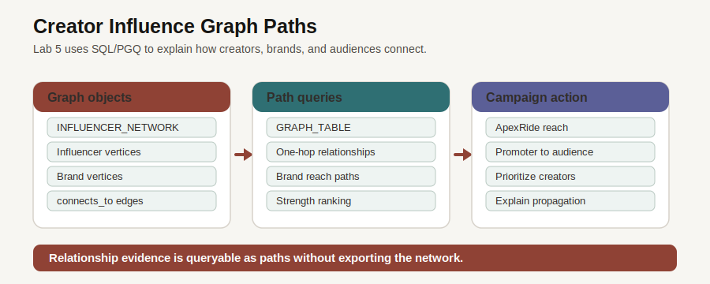

# Creator Influence Network with Property Graph

## Introduction

After you find demand signals, the next question is where those signals can travel. Creator influence is a relationship question. Follower counts and isolated posts do not show how a message can move through a network. Property Graph lets you express that question as paths while returning rows that business users can read.

### Objectives

- Confirm the `INFLUENCER\_NETWORK` property graph.
- Query direct creator-to-creator paths.
- Add brand promotion paths to explain campaign reach.

Estimated Time: **10 minutes**

### Business Scenario

| Step | Retail focus |
| --- | --- |
| Business Problem | Marketing teams need to understand connected influence, not isolated creators. |
| Technical Challenge | Multi-hop relationship questions become hard to maintain as normal joins grow. |
| Persona Focus | A campaign planner wants to see which creators can carry a product or brand story to other audiences. |
| Database Capability | Oracle Property Graph and SQL Property Graph Queries (SQL/PGQ) let `GRAPH_TABLE` query relationship paths in SQL. |
| Outcome | Relationship evidence stays in the database and can be read as a path. |

<details>
<summary><strong>Key terms: property graph</strong></summary>

> - **Vertex**: One thing in the network, such as a creator, brand, product, or post. Multiple things are vertices.
> - **Edge**: A relationship between vertices, such as a creator connection or a brand promotion.
> - **Path**: A sequence of vertices and edges that answers a relationship question.

</details>



*Figure 1: Property graph queries describe influence as paths and return table-shaped evidence.*

## Task 1: Confirm the graph object

1. Review the Creator Influence Network page.

    

    *Figure 2: The visual graph helps business users see relationship paths. The SQL below queries those paths directly.*

2. Run the graph inventory query.

    > **SQL Worksheet reminder:** Need a reminder on how to open and use the SQL Worksheet? Return to [Getting Started Task 2: Open SQL Worksheet](/workshops/sandbox/index.html?lab=getting-started#Task2:OpenSQLWorksheet) for the step-by-step graphic showing where to paste and run SQL statements.

    This query confirms that the property graph exists before you run path queries against it. `USER_PROPERTY_GRAPHS` is the catalog view for property graph objects in your schema, and the `WHERE` clause limits the check to `INFLUENCER_NETWORK`. A one-row result means the graph definition is available to query.

    ```sql
    <copy>
    SELECT graph_name AS "Graph"
    FROM user_property_graphs
    WHERE graph_name = 'INFLUENCER_NETWORK';
    </copy>
    ```

    **Expected output: Property Graph Inventory**

    | Graph |
    | --- |
    | INFLUENCER\_NETWORK |

## Task 2: Traverse direct creator relationships

1. Run the one-hop graph query.

    This task is the graph equivalent of checking the relationship table before you ask a bigger business question. A campaign planner first needs to know whether the graph has direct creator-to-creator relationships and whether those relationships have useful attributes, such as link type and strength.

    `GRAPH_TABLE` is not a stored business table. It is a SQL function that makes a property graph readable as table-shaped rows. That matters for beginners because it lets you use graph syntax to describe a path, then inspect the result with familiar SQL columns.

    The `INFLUENCER_NETWORK` graph exists to organize relationship data that would be awkward to read as isolated rows. It connects creators, brands, products, and posts as vertices and edges. In this task, you focus on the simplest edge: one creator connected directly to another creator. If this result looks reasonable, the next task can safely add brand context on top of the same graph.

    The pattern starts at one influencer, follows one `connects_to` edge, and reaches another influencer.

    Read the graph pattern from left to right: `(src IS influencer)` is the starting creator, `-[e IS connects_to]->` is the relationship, and `(dst IS influencer)` is the reached creator. The `COLUMNS` block chooses which path details become table columns.

    The aliases `AS from_creator` and `AS to_creator` make the relationship direction explicit. That prepares the result for graph pattern queries because you can see which creator starts the path and which creator is reached.

    ```sql
    <copy>
    SELECT from_creator AS "From Creator",
           to_creator AS "To Creator",
           connection_type AS "Link",
           strength AS "Strength"
    FROM GRAPH_TABLE ( influencer_network
      MATCH (src IS influencer) -[e IS connects_to]-> (dst IS influencer)
      COLUMNS (
        src.handle AS from_creator,
        dst.handle AS to_creator,
        e.connection_type AS connection_type,
        e.strength AS strength
      )
    )
    ORDER BY strength DESC, from_creator, to_creator
    FETCH FIRST 5 ROWS ONLY;
    </copy>
    ```

    **Expected output: Creator Relationships**

    | From Creator | To Creator | Link | Strength |
    | --- | --- | --- | ---: |
    | `@mountain_hope` | `@ridge_cleo` | follows | 1 |
    | `@trailhead_marcus` | `@league_ruby` | tagged | 0.999 |
    | `@ascent_hope` | `@pack_dev` | inspired_by | 0.998 |
    | `@gearhub_hope` | `@pack_beau` | collaborates | 0.998 |
    | `@recovery_tess` | `@basecamp_hope` | mentioned | 0.998 |

2. Each row is a direct relationship path. The business can use it to ask which creator relationship deserves follow-up and which audience may hear a campaign message next.

## Task 3: Add brand context to the path

1. Run the brand propagation query.

    This pattern asks which creators promote a brand and which creators they can reach through one relationship. It is a compact way to express a multi-step influence question.

    Read the graph pattern in three parts:

    1. `(b IS brand) <-[p IS promotes]- (i IS influencer)` finds creators who promote a brand.
    2. `(i IS influencer) -[c IS connects_to]-> (j IS influencer)` follows each promoter to a creator they can reach.
    3. `SELECT DISTINCT` keeps the output focused on unique brand, promoter, reached-creator, and relationship combinations.

    ```sql
    <copy>
    SELECT DISTINCT brand_name AS "Brand",
           promoter AS "Promoter",
           reached AS "Reached",
           relationship_type AS "Relationship"
    FROM GRAPH_TABLE ( influencer_network
      MATCH (b IS brand) <-[p IS promotes]- (i IS influencer) -[c IS connects_to]-> (j IS influencer)
      COLUMNS (
        b.brand_name AS brand_name,
        i.handle AS promoter,
        j.handle AS reached,
        p.relationship_type AS relationship_type
      )
    )
    ORDER BY brand_name, promoter, reached, relationship_type
    FETCH FIRST 5 ROWS ONLY;
    </copy>
    ```

    **Expected output: Brand Reach Paths**

    | Brand | Promoter | Reached | Relationship |
    | --- | --- | --- | --- |
    | ApexRide | `@camp_vince` | `@alpine_luna` | organic |
    | ApexRide | `@camp_vince` | `@boot_jen` | organic |
    | ApexRide | `@camp_vince` | `@coach_ava` | organic |
    | ApexRide | `@camp_vince` | `@matchday_tess` | organic |
    | ApexRide | `@camp_vince` | `@recovery_ella` | organic |

2. The result matters because it connects brand activity to reachable creators. In retail terms, audience movement means a campaign can start with one promoter and reach adjacent creator communities through known relationships. The graph pattern keeps that movement readable even as the business question moves beyond one table or one join.

    Next, you use location and inventory evidence to decide whether demand can be served from practical fulfillment centers.

## Acknowledgements

* **Author** - Pat Shepherd, Senior Principal Database Product Manager
* **Last Updated By/Date** - Oracle Database Product Management, July 2026
