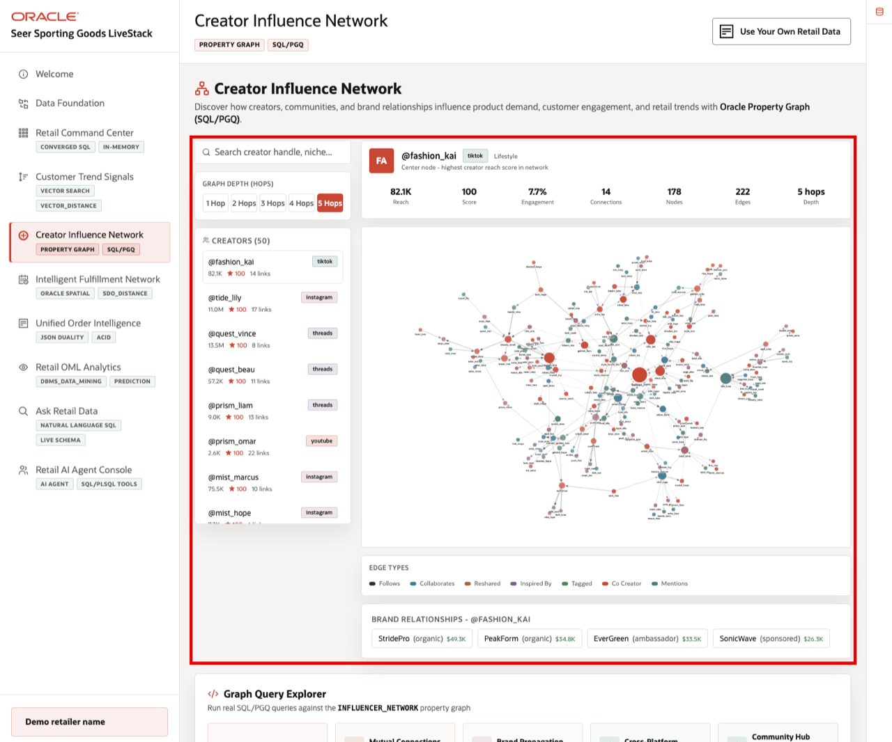
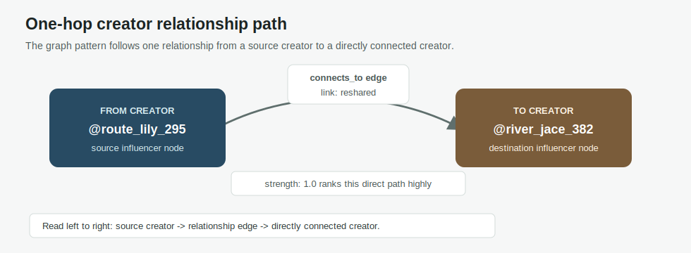
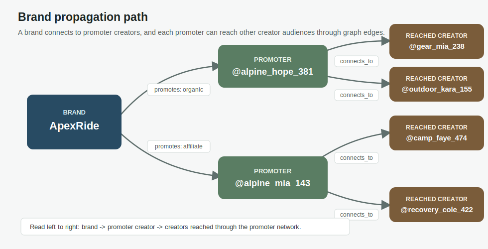

# Creator Influence Network with Property Graph

## Introduction

Creator influence is not only about follower count. In this lab, you learn how Oracle AI Database represents creators, brands, products, and posts as a property graph so you can ask relationship questions directly.

After **Lab 4** shows what customers and creators are saying, this lab shows who can amplify that signal. The key learning point is that graph pattern matching lets you describe relationship paths directly. Traditional SQL can answer the same questions, but every additional hop usually means more table aliases, more joins, and more join conditions.

### Operating Story

| Step | Retail focus |
| --- | --- |
| Business Problem | Seer Sporting Goods cannot understand creator influence by looking at isolated posts, products, or follower counts. |
| What You Will Prove | Creator, brand, product, and post relationships can be traversed as paths instead of assembled through increasingly complex joins. |
| Database Capability | Oracle Property Graph and SQL/PGQ `GRAPH_TABLE` let you query connected retail relationships as paths. |
| Outcome | Marketing teams can see how influence propagates through the creator network and identify paths worth acting on. |
{: title="Creator Influence Story"}

**Persona focus:** The marketing team wants to know which creators can amplify a product or brand story. The technical team needs a simpler way to express relationship paths than writing longer chains of self-joins.

Estimated Time: **10 minutes**

### Objectives

- Understand the source tables behind the `INFLUENCER_NETWORK` property graph.
- Compare traditional SQL joins with property graph pattern matching.
- Run `GRAPH_TABLE` traversals for direct creator relationships.
- Add a brand relationship to the path and explain how graph traversals support influence analysis.


## Task 1: Review the creator graph model

Perform the following set of steps to understand the graph model used for influence analysis.

1. Review the related application screen before you run the SQL.

    

    *Figure 1: Creator Influence Network shows how creator relationships can amplify product and brand signals.*

2. Understand the graph object.

    The workshop defines one property graph named `INFLUENCER_NETWORK`. A property graph is built from two kinds of source data:

    | Graph concept | Retail source tables | What they represent |
    | --- | --- | --- |
    | Vertices | `INFLUENCERS`, `BRANDS`, `PRODUCTS`, `SOCIAL_POSTS` | The things in the network: creators, brands, products, and posts. |
    | Edges | `INFLUENCER_CONNECTIONS`, `BRAND_INFLUENCER_LINKS`, `POST_PRODUCT_MENTIONS` | The relationships between those things. |
    {: title="Influencer Network Graph Sources"}

    In relational form, those relationships live in normal tables with keys. In graph form, the same data can be queried as paths: creator to creator, creator to brand, post to product, or combinations of those relationships.

    Conceptually, the graph definition tells Oracle which tables become vertices, which tables become edges, and which columns identify the endpoints of each edge. You do not need to recreate the graph in this short lab; the workshop seed has already created it so you can focus on the relationship question the business cares about.


## Task 2: Traverse creator relationships with PQL-style patterns

Perform the following set of steps to see why graph pattern matching is easier to read as relationship paths become longer.

1. Compare one hop in SQL and graph pattern form.

    Traditional SQL can find a direct creator-to-creator connection, but it must join the creator table twice and join through the relationship table.

    ```sql
    -- Traditional SQL shape for one hop.
    SELECT src.handle AS from_creator,
           dst.handle AS to_creator,
           c.connection_type,
           c.strength
    FROM influencers src
    JOIN influencer_connections c
      ON c.from_influencer = src.influencer_id
    JOIN influencers dst
      ON dst.influencer_id = c.to_influencer;
    ```

    The graph pattern says the same thing as a path: start at one influencer, follow one `connects_to` edge, and arrive at another influencer.

    ```sql
    -- Property graph pattern shape for one hop.
    MATCH (src IS influencer) -[e IS connects_to]-> (dst IS influencer)
    ```

2. Notice what happens when you add a hop.

    In traditional SQL, another hop means another relationship-table alias, another creator-table alias, and another join condition.

    ```sql
    -- Traditional SQL shape for two hops.
    FROM influencers src
    JOIN influencer_connections c1
      ON c1.from_influencer = src.influencer_id
    JOIN influencers mid
      ON mid.influencer_id = c1.to_influencer
    JOIN influencer_connections c2
      ON c2.from_influencer = mid.influencer_id
    JOIN influencers dst
      ON dst.influencer_id = c2.to_influencer
    ```

    In the graph pattern, the path simply grows by one relationship segment.

    ```sql
    -- Property graph pattern shape for two hops.
    MATCH (src IS influencer) -[e1 IS connects_to]-> (mid IS influencer) -[e2 IS connects_to]-> (dst IS influencer)
    ```

    That is the core advantage for this lab. The database still returns SQL rows, but the relationship logic is written as a path instead of a growing chain of self-joins. For a technical team, this can mean less query complexity as the business asks richer relationship questions. For a marketing team, it means the result is easier to explain as a path through the creator network.

3. Run this one-hop traversal.

    `GRAPH_TABLE` turns a graph pattern match into a relational result set. The `MATCH` clause describes the path. The `COLUMNS` clause chooses which properties from the matched vertices and edges should appear in the output table.

    ```sql
    <copy>
    SELECT src_handle AS "From",
           dst_handle AS "To",
           connection_type AS "Link",
           strength AS "Strength"
    FROM GRAPH_TABLE ( influencer_network
      MATCH (src IS influencer) -[e IS connects_to]-> (dst IS influencer)
      COLUMNS (
        src.handle AS src_handle,
        dst.handle AS dst_handle,
        e.connection_type AS connection_type,
        e.strength AS strength
      )
    )
    ORDER BY strength DESC, src_handle, dst_handle
    FETCH FIRST 10 ROWS ONLY;
    </copy>
    ```

    Expected output:

    | From | To | Link | Strength |
    | --- | --- | --- | ---: |
    | `@route_lily_295` | `@river_jace_382` | reshared | 1.0 |
    | `@climb_lily_455` | `@terrain_drew_202` | duet | 0.999 |
    | `@coach_dane_443` | `@fit_noah_239` | reshared | 0.999 |
    | `@coach_zoe_225` | `@alpine_mia_18` | mentioned | 0.999 |
    | `@endurance_maya_221` | `@coach_zoe_160` | `inspired_by` | 0.999 |
    | `@fit_noah_174` | `@stadium_ivy_343` | tagged | 0.999 |
    | `@hike_max_148` | `@cycle_dane_150` | `inspired_by` | 0.999 |
    | `@route_gus_122` | `@endurance_maya_289` | reshared | 0.999 |
    | `@terrain_alex_420` | `@endurance_maya_91` | `inspired_by` | 0.999 |
    | `@camp_owen_111` | `@camp_owen_369` | reshared | 0.998 |
    {: title="Creator Relationships"}

    The first row can be visualized as one creator node connected to another creator node through a single relationship edge.

    

    *Figure 2: A one-hop creator relationship path.*

4. Interpret the one-hop result.

    Each row is one direct path from a creator to another creator:

    | Column | Meaning |
    | --- | --- |
    | From | The source creator in the path. |
    | To | The creator reached by following one relationship. |
    | Link | The kind of relationship, such as `reshared`, `duet`, `tagged`, `mentioned`, or `inspired_by`. |
    | Strength | A workshop score for ranking the relationship. Higher values are stronger paths in this sample network. |
    {: title="Creator Relationship Columns"}

    A business user can read this as possible audience movement. A `reshared` link suggests amplification. A `duet` or `mentioned` link suggests content association. A strong direct link can identify creators who may carry a product or brand story into another audience.

5. Run this brand propagation query.

    Now add a brand to the path. The pattern asks: which creators promote a brand, and which other creators can they reach through one creator-to-creator relationship?

    ```sql
    <copy>
    SELECT DISTINCT brand_name AS "Brand",
           promoter AS "Promoter",
           reached AS "Reached",
           relationship_type AS "Relationship"
    FROM GRAPH_TABLE ( influencer_network
      MATCH (b IS brand) <-[p IS promotes]- (i IS influencer) -[c IS connects_to]-> (j IS influencer)
      COLUMNS (
        b.brand_name AS brand_name,
        i.handle AS promoter,
        j.handle AS reached,
        p.relationship_type AS relationship_type
      )
    )
    ORDER BY brand_name, promoter, reached, relationship_type
    FETCH FIRST 10 ROWS ONLY;
    </copy>
    ```

    Expected output:

    | Brand | Promoter | Reached | Relationship |
    | --- | --- | --- | --- |
    | ApexRide | `@alpine_hope_381` | `@gear_mia_238` | organic |
    | ApexRide | `@alpine_hope_381` | `@gear_mia_436` | organic |
    | ApexRide | `@alpine_hope_381` | `@outdoor_kara_155` | organic |
    | ApexRide | `@alpine_hope_381` | `@run_finn_501` | organic |
    | ApexRide | `@alpine_mia_143` | `@alpine_hope_321` | affiliate |
    | ApexRide | `@alpine_mia_143` | `@camp_faye_474` | affiliate |
    | ApexRide | `@alpine_mia_143` | `@field_faye_319` | affiliate |
    | ApexRide | `@alpine_mia_143` | `@field_owen_274` | affiliate |
    | ApexRide | `@alpine_mia_143` | `@recovery_cole_422` | affiliate |
    | ApexRide | `@alpine_mia_143` | `@recovery_cole_482` | affiliate |
    {: title="Brand Paths"}

6. Interpret the brand paths.

    The result shows brand-connected creators and the creators they can directly reach. This matters because a brand partnership is not isolated to the creator who posted it. If that creator has strong network paths to other creators, the brand or product story may spread into adjacent communities.

    Graph Studio, one of the tools included with Oracle Database, can visualize this kind of property graph path. This lab stays SQL-first, but the same relationship paths can also be explored visually in a graph tool. A visual view of the rows above would show the brand node connected to promoter creator nodes, and those promoter nodes connected to the creators they can reach.

    

    *Figure 3: A visualization of brand propagation paths.*

    For a merchandising or marketing team, this helps answer practical questions: which creators can amplify a product story, which brand relationships may have broader reach, and where follow-up campaigns might create the most network effect after Lab 4 identifies a product or social trend worth watching.


## Learn More

This lab gives you a retail sample of how property graphs make relationship questions easier to express and visualize. For a more complete hands-on lab, see [Build a Graph Database App with Oracle Property Graph](https://livelabs.oracle.com/ords/r/dbpm/livelabs/view-workshop?clear=RR,180&wid=3978).

For more background, review these Oracle resources:

- [Property Graphs in Oracle Database 23ai: The SQL/PGQ Standard](https://blogs.oracle.com/database/post/property-graphs-in-oracle-database-23ai-the-sql-pgq-standard)
- [New! Discover connections with SQL Property Graphs in Oracle Autonomous Database](https://blogs.oracle.com/database/post/sql-property-graphs-in-oracle-autonomous-database)
- [Graph features in Oracle AI Database 26ai](https://docs.oracle.com/en/database/oracle/oracle-database/26/nfcoa/graph.html)

## Acknowledgements

* **Author** - Pat Shepherd, Senior Principal Database Product Manager
* **Contributor** - Linda Foinding, Principal Database Product Manager
* **Last Updated By/Date** - Oracle Database Product Management, May 2026
