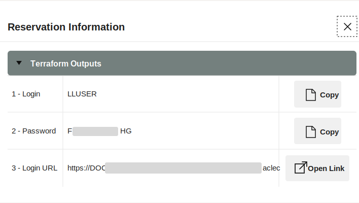
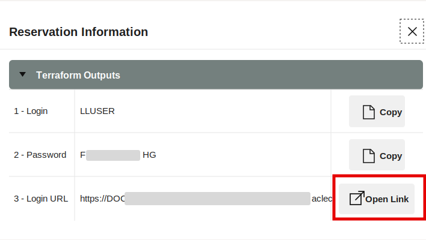
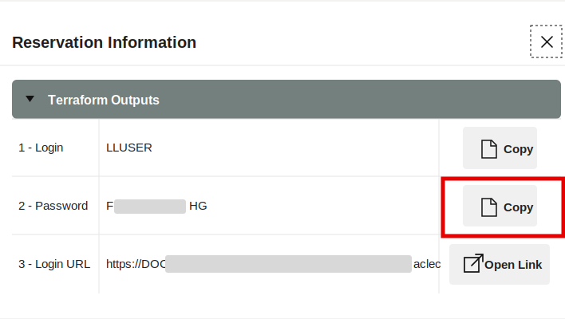
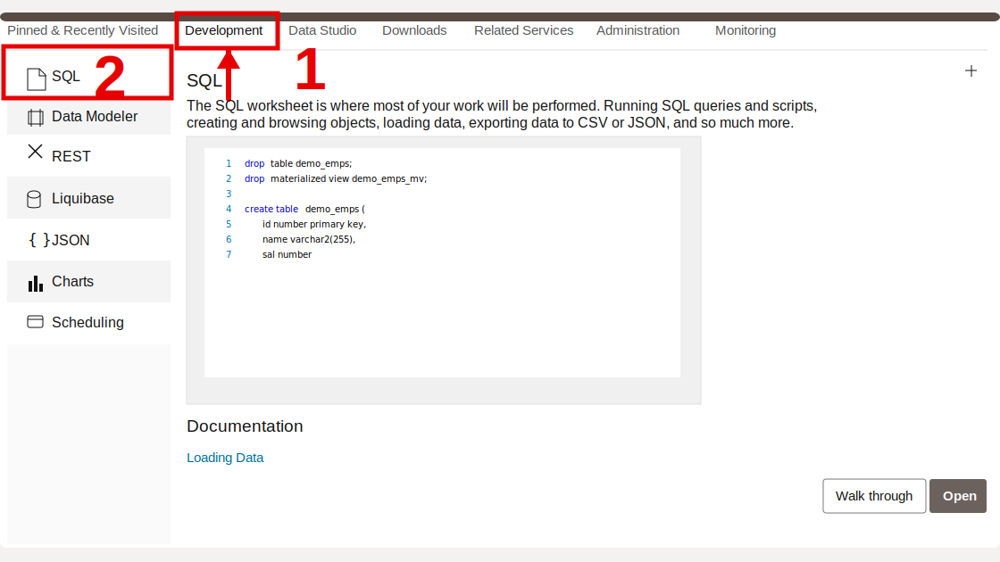

# Getting Started

## Introduction

This lab gets you into the LiveLabs environment and opens **Database Actions SQL Worksheet**. SQL Worksheet is the evidence bench for the rest of the workshop: you will use it to inspect the same governed data that supports the retail application.

### Objectives

- Open the LiveLabs reservation information.
- Launch Database Actions for the provisioned Autonomous Database.
- Open SQL Worksheet as the main workshop schema user.
- Run a short connection check.

Estimated Time: **10 minutes**

## Task 1: Open the LiveLabs environment

1. In your LiveLabs reservation, open the environment details.

    

    *Figure 1: The reservation page provides the database and application links for your environment.*

2. Open the Database Actions link from the reservation.

    

3. Copy the password for the main workshop user when the reservation page provides it.

    

## Task 2: Open SQL Worksheet

1. Sign in to Database Actions as the main workshop user, usually `LLUSER`.

    

2. Open **Development**, then open **SQL**.

    

3. Use the worksheet shown below for the rest of the workshop.

    

    *Figure 2: SQL Worksheet is where you paste each copied SQL block. Use Run Statement for normal queries and Run Script for blocks that contain DDL or formatted JSON output.*

4. Run this connection check.

    This short query confirms that SQL Worksheet is connected as the main workshop schema user, usually `LLUSER`. `USER` is an Oracle SQL expression that returns the current database username, and `FROM dual` gives the query a one-row source.

    ```sql
    <copy>
    SELECT USER AS "Connected User"
    FROM dual;
    </copy>
    ```

    **Expected output: Connection Check**

    | Connected User |
    | --- |
    | LLUSER |

## Acknowledgements

* **Author** - Pat Shepherd, Senior Principal Database Product Manager
* **Last Updated By/Date** - Oracle Database Product Management, July 2026
