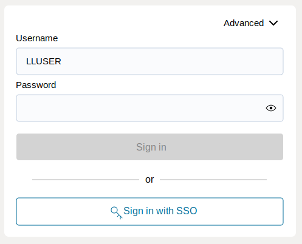
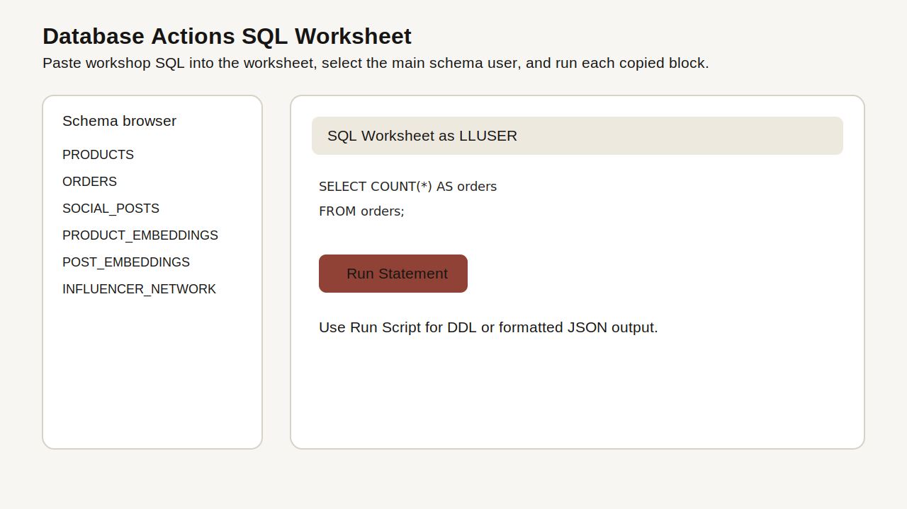

# Getting Started

## Introduction

Use this lab to open the LiveLabs reservation, access the provisioned Autonomous Database 26ai instance, and prepare SQL Worksheet for the retail exercises. The remaining labs are hands-on database exercises. You will run SQL and PL/SQL in the workshop database and connect each result to the retail application experience.

Estimated Time: 5 minutes

### Objectives

In this lab, you will:

- Launch the LiveLabs workshop environment.
- Open Database Actions for Autonomous Database 26ai.
- Confirm that SQL Worksheet is ready for the retail schema.
- Find the backend setup bundle if you need to create the schema again.

## Task 1: Launch the LiveLabs environment

1. Sign in to [LiveLabs](https://livelabs.oracle.com) with your Oracle account.

2. Open this workshop, select **Start**, and select **Run on LiveLabs Sandbox**.

3. In **My Reservations**, select **Launch Workshop** for this reservation.

4. Select **View Login Info** and keep the database credentials available for the next task.

## Task 2: Open SQL Worksheet

1. In the OCI Console, open the Autonomous Database provisioned for the workshop.

2. Select **Database Actions** and open **SQL Worksheet**.

3. At the top of the SQL Worksheet page, open the user dropdown menu and select the main workshop user, usually `LLUSER`. If the login screen appears, confirm that **Username** shows `LLUSER`.

    

    *Figure 1: Select the main workshop user, usually LLUSER, before signing in.*

4. Use the same SQL Worksheet pattern throughout the workshop.

    

    *Figure 2: Use SQL Worksheet to confirm the active user, paste each workshop SQL block, run the statement, and review the result table.*

    - Confirm the user dropdown shows the main workshop user, usually `LLUSER`.
    - Paste each workshop SQL block into the editor.
    - Select **Run Statement** or press **Ctrl+Enter** to run the current SQL statement.
    - Review the output in **Query Result** or **Script Output**, depending on the step.
    - Use **Navigator** only when you want to inspect tables, views, or other objects.

5. Run this check.

    This check reads Oracle session context directly from the database. `USER` shows the authenticated account, while `SYS_CONTEXT('USERENV', 'CURRENT_SCHEMA')` shows where unqualified table names will resolve. If the user is not `LLUSER`, use the SQL Worksheet user dropdown to switch before continuing.

    ```sql
    <copy>
    SELECT USER AS "User",
           SYS_CONTEXT('USERENV', 'CURRENT_SCHEMA') AS "Schema",
           SYSTIMESTAMP AS "Checked At"
    FROM dual;
    </copy>
    ```

    Expected output (example - user and timestamp vary):

    | User | Schema | Checked At |
    | --- | --- | --- |
    | LLUSER | LLUSER | 19-MAY-26 10.30.00.000000 AM UTC |
    {: title="Connected SQL Worksheet Session"}

6. If the schema is not present, ask the instructor to run the scripts in `backend-provisioning/database-source/` in the order described in the README.

You can now continue to the retail labs.

## Acknowledgements

* **Author** - Pat Shepherd, Senior Principal Database Product Manager
* **Contributor** - Linda Foinding, Principal Database Product Manager
* **Last Updated By/Date** - Oracle Database Product Management, May 2026
