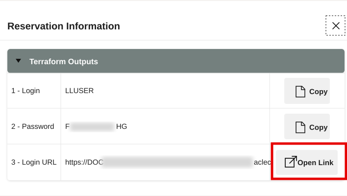
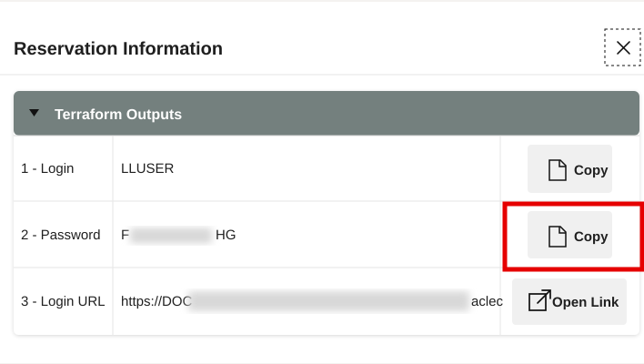
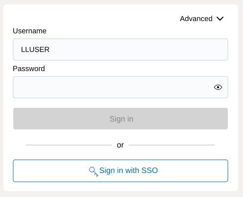
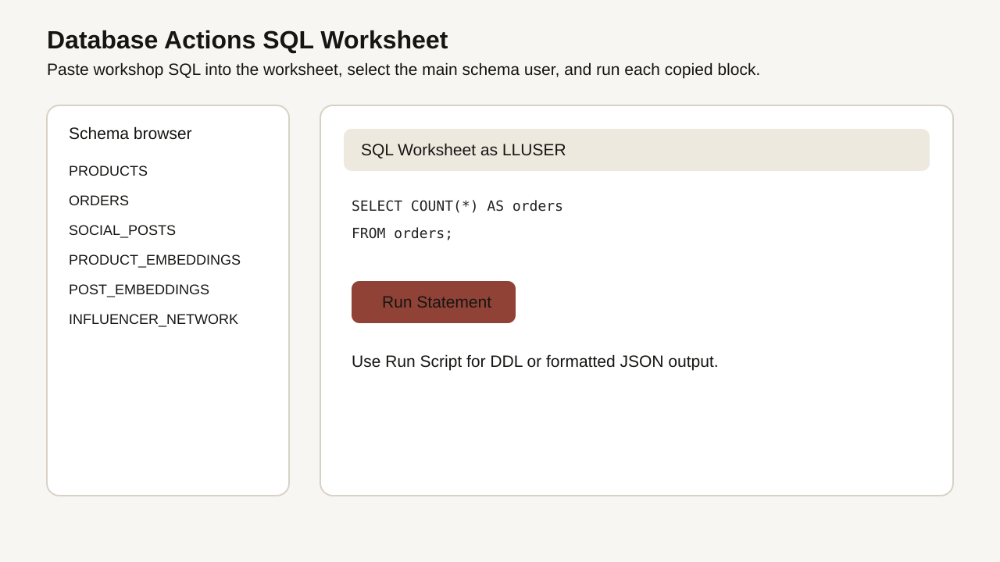

# Getting Started

## Introduction

This lab gets you into the LiveLabs environment and opens **Database Actions SQL Worksheet**. Treat SQL Worksheet as the evidence bench for the rest of the workshop: it is where you inspect the governed data behind the retail application before making dashboard, order, search, fulfillment, or prediction claims.

### Objectives

- Open the LiveLabs reservation information.
- Launch Database Actions for the provisioned Autonomous Database.
- Open SQL Worksheet as the main workshop schema user.

Estimated Time: **5 minutes**

## Task 1: Open the LiveLabs environment

Start by opening the LiveLabs environment so you can find the retail application, database link, and workshop credentials before running any SQL:

1. In your LiveLabs reservation, open the environment details.

    

    *Figure 1: The reservation page provides the database and application links for your environment.*

2. Open the Database Actions link from the reservation.

    

3. Copy the password for the main workshop user when the reservation page provides it.

    

## Task 2: Open SQL Worksheet

Next, sign in to **Database Actions** and open **SQL Worksheet** so every later query runs as the workshop user against the prepared retail schema.

1. Sign in to **Database Actions** as the main workshop user, usually `LLUSER`.

    

2. Open **Development**, then open **SQL**.

    

3. Use the worksheet shown below for the rest of the workshop.

    

    *Figure 2: SQL Worksheet is where you paste each copied SQL block. Use Run Statement for normal queries and Run Script for blocks that contain DDL or formatted JSON output.*

## Acknowledgements

* **Author** - Pat Shepherd, Senior Principal Database Product Manager
* **Last Updated By/Date** - Oracle Database Product Management, July 2026
