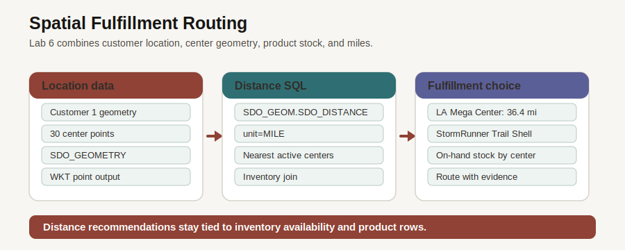

# Intelligent Fulfillment Network with Oracle Spatial

## Introduction

After demand and influence point to products, fulfillment decides whether the business can serve that demand. The closest center is only useful if it is active, stocked, and appropriate for the customer. Oracle Spatial keeps location-aware analysis inside Oracle Database next to customers, centers, products, and inventory.

### Objectives

- Inspect fulfillment-center locations stored as `SDO_GEOMETRY`.
- Produce a distance-ranked center shortlist.
- Combine distance with available inventory.

Estimated Time: **10 minutes**

### Business Scenario

| Step | Retail focus |
| --- | --- |
| Business Problem | Fulfillment planners need fast routing decisions that account for location and stock. |
| Technical Challenge | Map data often lives away from inventory and order data. |
| Persona Focus | A fulfillment planner wants an explainable center recommendation. |
| Database Capability | Oracle Spatial stores points and calculates distance directly in SQL. |
| Outcome | Routing evidence can join location, product, and inventory rows in one query. |

<details>
<summary><strong>Key terms: Oracle Spatial</strong></summary>

> - **SDO_GEOMETRY**: The Oracle spatial data type for locations and shapes. In this lab it stores customer and fulfillment-center points.
> - **Well-known text (WKT)**: A readable text format for geometry, such as `POINT (-117.6509 34.0633)`.
> - **SDO_GEOM.SDO_DISTANCE**: An Oracle Spatial function that calculates distance between two geometries.

</details>



*Figure 1: Spatial data becomes operational evidence when it joins to products and inventory.*

## Task 1: Inspect fulfillment center geometry

1. Review the fulfillment application page.

    

    *Figure 2: The application map summarizes location and fulfillment conditions. The SQL below reads the governed geometry behind that map.*

2. Run the geometry query.

    > **SQL Worksheet reminder:** Need a reminder on how to open and use the SQL Worksheet? Return to [Getting Started Task 2: Open SQL Worksheet](/workshops/sandbox/index.html?lab=getting-started#Task2:OpenSQLWorksheet) for the step-by-step graphic showing where to paste and run SQL statements.

    `SDO_UTIL.TO_WKTGEOMETRY` converts the stored point into readable text. Longitude appears before latitude in the point notation.

    The query returns both business columns and geometry columns. `center_name`, `city`, and `state_province` identify the center; `latitude` and `longitude` are easy for people to read; and the `Geometry` column shows the spatial point stored in the database.

    `SDO_UTIL.TO_WKTGEOMETRY` can return a large text value, so `DBMS_LOB.SUBSTR(..., 80, 1)` keeps the worksheet result compact. You only need the first part of the well-known text (WKT) point to confirm that longitude and latitude were stored correctly.

    ```sql
    <copy>
    SELECT center_name AS "Center",
           city AS "City",
           state_province AS "State",
           latitude AS "Latitude",
           longitude AS "Longitude",
           DBMS_LOB.SUBSTR(SDO_UTIL.TO_WKTGEOMETRY(location), 80, 1) AS "Geometry"
    FROM fulfillment_centers
    WHERE location IS NOT NULL
    ORDER BY center_id
    FETCH FIRST 5 ROWS ONLY;
    </copy>
    ```

    **Expected output: Center Geometry**

    | Center | City | State | Latitude | Longitude | Geometry |
    | --- | --- | --- | ---: | ---: | --- |
    | NYC Metro Hub | Edison | New Jersey | 40.5187 | -74.4121 | POINT (-74.4121 40.5187) |
    | LA Mega Center | Ontario | California | 34.0633 | -117.6509 | POINT (-117.6509 34.0633) |
    | Chicago Midwest Hub | Joliet | Illinois | 41.525 | -88.0817 | POINT (-88.0817 41.525) |
    | Dallas South Central | Lancaster | Texas | 32.5921 | -96.7561 | POINT (-96.7561 32.5921) |
    | Atlanta Southeast | Union City | Georgia | 33.5871 | -84.5421 | POINT (-84.5421 33.5871) |

## Task 2: Rank nearby centers

1. Run the distance query.

    This query compares customer `1` with active fulfillment centers. `SDO_GEOM.SDO_DISTANCE` returns miles so the business can read the result directly.

    `CROSS JOIN` pairs the one selected customer with each active center. The distance function compares the two location points, `0.005` is the tolerance for the spatial calculation, and `'unit=MILE'` makes the result understandable for planners.

    The expected output tells you the customer is in the Los Angeles operating area because the closest active center is `LA Mega Center` in Ontario, California, about 33 miles away. The nearby Nevada, Bay Area, Arizona, and Reno results also fit a Southern California starting point.

    ```sql
    <copy>
    SELECT fc.center_name AS "Center",
           fc.city AS "City",
           fc.state_province AS "State",
           ROUND(SDO_GEOM.SDO_DISTANCE(c.location, fc.location, 0.005, 'unit=MILE'), 1) AS "Miles"
    FROM customers c
    CROSS JOIN fulfillment_centers fc
    WHERE c.customer_id = 1
      AND fc.is_active = 1
    ORDER BY SDO_GEOM.SDO_DISTANCE(c.location, fc.location, 0.005, 'unit=MILE')
    FETCH FIRST 5 ROWS ONLY;
    </copy>
    ```

    **Expected output: Nearby Centers**

    | Center | City | State | Miles |
    | --- | --- | --- | ---: |
    | LA Mega Center | Ontario | California | 33.2 |
    | Las Vegas West | North Las Vegas | Nevada | 229 |
    | San Francisco Bay | Fremont | California | 319.1 |
    | Phoenix Desert Hub | Goodyear | Arizona | 340.9 |
    | Reno West Hub | Sparks | Nevada | 385.7 |

## Task 3: Combine distance with inventory

1. Run the stocked-center query.

    Distance alone does not decide fulfillment. This query joins the nearest centers to inventory for one product so the recommendation reflects both geography and availability.

    Read the query as a routing filter:

    1. `FULFILLMENT_CENTERS` gives the candidate center and its location.
    2. `INVENTORY` and `PRODUCTS` add the stock and product name.
    3. The customer subquery supplies the destination location for customer `1`.
    4. The `WHERE` clause keeps only stocked rows for one sample product, and `ORDER BY "Miles"` lists the closest stocked centers first.

    ```sql
    <copy>
    SELECT fc.center_name AS "Center",
           fc.city AS "City",
           fc.state_province AS "State",
           p.product_name AS "Product",
           i.quantity_on_hand AS "On Hand",
           ROUND(SDO_GEOM.SDO_DISTANCE(fc.location, c.location, 0.005, 'unit=MILE'), 1) AS "Miles"
    FROM fulfillment_centers fc
    JOIN inventory i
      ON i.center_id = fc.center_id
    JOIN products p
      ON p.product_id = i.product_id
    CROSS JOIN (SELECT location FROM customers WHERE customer_id = 1) c
    WHERE p.product_id = (
      SELECT product_id
      FROM products
      ORDER BY product_id
      FETCH FIRST 1 ROWS ONLY
    )
      AND i.quantity_on_hand > 0
    ORDER BY "Miles"
    FETCH FIRST 5 ROWS ONLY;
    </copy>
    ```

    **Expected output: Distance and Stock**

    | Center | City | State | Product | On Hand | Miles |
    | --- | --- | --- | --- | ---: | ---: |
    | LA Mega Center | Ontario | California | StormRunner Trail Shell | 393 | 33.2 |
    | Las Vegas West | North Las Vegas | Nevada | StormRunner Trail Shell | 78 | 229 |
    | Seattle Pacific NW | Kent | Washington | StormRunner Trail Shell | 293 | 941.4 |
    | San Antonio South TX | New Braunfels | Texas | StormRunner Trail Shell | 267 | 1217.4 |
    | Houston Gulf Coast | Missouri City | Texas | StormRunner Trail Shell | 446 | 1366.3 |

2. This is the practical value of spatial data in a converged database. The same query can explain location, product, and inventory evidence without copying map data into another system.

    Next, you use Oracle Machine Learning to prioritize which products deserve attention after the business has reviewed demand, influence, and fulfillment evidence.

## Acknowledgements

* **Author** - Pat Shepherd, Senior Principal Database Product Manager
* **Last Updated By/Date** - Oracle Database Product Management, July 2026
