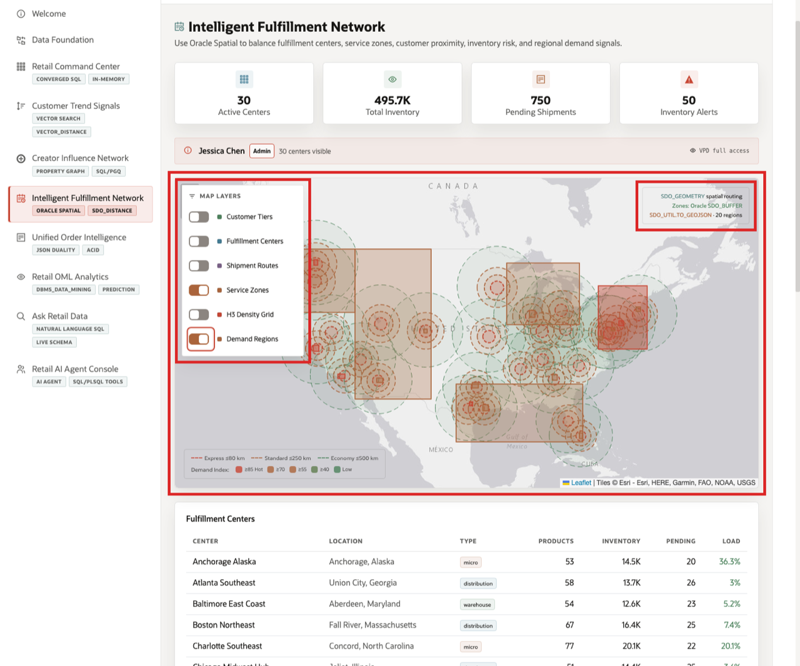

# Intelligent Fulfillment Network with Oracle Spatial

## Introduction

Fulfillment decisions depend on location, inventory, service areas, and demand geography. In this lab, learners inspect spatial metadata, produce map-ready GeoJSON, find nearby fulfillment options, and connect spatial evidence to replenishment and routing risk.

Oracle AI Database keeps spatial, relational, inventory, shipment, demand forecast, and security-governed data together. The **Intelligent Fulfillment Network** page shows centers, service zones, demand regions, inventory alerts, and route context. In SQL Worksheet, you inspect the geometry metadata, GeoJSON, distance calculations, and risk view that support that map.

Estimated Time: **10 minutes**

### Objectives

- Inspect spatial metadata for fulfillment and demand geometry.
- Produce map-ready GeoJSON from Oracle Spatial objects.
- Find nearby fulfillment options with `SDO_DISTANCE`.
- Connect inventory risk and location context to fulfillment decisions.


## Task 1: Inspect spatial metadata

Perform the following set of steps to confirm that fulfillment centers, customers, and demand regions have governed location data available for routing and proximity analysis.

1. Review the related application screen before you run the SQL.

    

    *Figure 1: Intelligent Fulfillment Network brings together inventory, centers, service areas, and demand geography.*

    

    *Figure 2: Service zones and demand regions connect the SQL geometry to the map layers in the runbook.*

2. Run this query.

    Fulfillment decisions depend on geography. Oracle Spatial stores locations and shapes in `SDO_GEOMETRY` columns. This block reads `ALL_SDO_GEOM_METADATA`, the catalog view that describes those geometry columns. The SRID value identifies the coordinate system; `4326` is the common GPS latitude/longitude system used by web maps.

    **Note:** Oracle Spatial stores customer, fulfillment, and demand locations as governed map data, with `SDO_GEOMETRY` as the implementation detail.

    ```sql
    <copy>
    SELECT owner AS "Owner", table_name AS "Table", column_name AS "Geometry", srid AS "SRID"
    FROM all_sdo_geom_metadata
    WHERE owner = SYS_CONTEXT('USERENV','CURRENT_SCHEMA')
      AND table_name IN ('FULFILLMENT_CENTERS','CUSTOMERS','FULFILLMENT_ZONES','DEMAND_REGIONS')
    ORDER BY table_name, column_name;
    </copy>
    ```

    Expected output:

    | Owner | Table | Geometry | SRID |
    | --- | --- | --- | ---: |
    | LLUSER | CUSTOMERS | LOCATION | 4326 |
    | LLUSER | `DEMAND_REGIONS` | BOUNDARY | 4326 |
    | LLUSER | `FULFILLMENT_CENTERS` | LOCATION | 4326 |
    | LLUSER | `FULFILLMENT_ZONES` | `ZONE_BOUNDARY` | 4326 |
    {: title="Spatial Metadata"}

**Note:** These are sample values from the current workshop dataset and may change after a refresh, seed update, or schema rebuild. Treat these values as an example of the current workshop result. Verify the live output before presenting, then explain the business takeaway: what the values reveal about retail scale, demand, revenue, inventory, fulfillment, order governance, prediction, or agent activity.

## Task 2: Produce map-ready GeoJSON

Performi the following set of steps to show how database location data can feed map experiences without exporting the spatial story to a separate system.

1. Use the live **Intelligent Fulfillment Network** context from **Figure 1** before you run the SQL.

2. Run this query.

    GeoJSON lets application maps display database-managed shapes. This block uses `SDO_UTIL.TO_GEOJSON` to convert `SDO_GEOMETRY` points into web-friendly JSON. The database still stores and manages the geometry, while the application receives a standard map shape with coordinates.

    ```sql
    <copy>
    SELECT center_name AS "Center",
           city AS "City",
           state_province AS "State",
           SUBSTR(SDO_UTIL.TO_GEOJSON(location), 1, 120) AS "GeoJSON"
    FROM fulfillment_centers
    WHERE location IS NOT NULL
    ORDER BY center_id
    FETCH FIRST 5 ROWS ONLY;
    </copy>
    ```

    Expected output:

    | Center | City | State | GeoJSON |
    | --- | --- | --- | --- |
    | NYC Metro Hub | Edison | New Jersey | { "type": "Point", "coordinates": [-74.4121, 40.5187] } |
    | LA Mega Center | Ontario | California | { "type": "Point", "coordinates": [-117.6509, 34.0633] } |
    | Chicago Midwest Hub | Joliet | Illinois | { "type": "Point", "coordinates": [-88.0817, 41.525] } |
    | Dallas South Central | Lancaster | Texas | { "type": "Point", "coordinates": [-96.7561, 32.5921] } |
    | Atlanta Southeast | Union City | Georgia | { "type": "Point", "coordinates": [-84.5421, 33.5871] } |
    {: title="Fulfillment GeoJSON"}

3. The application can use GeoJSON directly for mapping without moving geometry processing to a separate service.

**Note:** These are sample values from the current workshop dataset and may change after a refresh, seed update, or schema rebuild. Treat these values as an example of the current workshop result. Verify the live output before presenting, then explain the business takeaway: what the values reveal about retail scale, demand, revenue, inventory, fulfillment, order governance, prediction, or agent activity.

## Task 3: Find nearby fulfillment options

Perform the following set of steps to compare distance, location, and operating context before deciding where an order or demand point should be served.

1. Use the live **Intelligent Fulfillment Network** context from **Figure 1** before you run the SQL.

2. Run this distance query.

    The closest facility is often the fastest or lowest-cost fulfillment option. This block uses a `CROSS JOIN` to compare one customer with every active fulfillment center. `SDO_GEOM.SDO_DISTANCE` calculates the distance between the customer point and each center point. The tolerance value controls spatial calculation precision, and `unit=MILE` returns a business-friendly distance.

    ```sql
    <copy>
    SELECT fc.center_name AS "Center",
           fc.city AS "City",
           fc.state_province AS "State",
           ROUND(SDO_GEOM.SDO_DISTANCE(c.location, fc.location, 0.005, 'unit=MILE'), 1) AS "Miles"
    FROM customers c
    CROSS JOIN fulfillment_centers fc
    WHERE c.customer_id = 1
      AND fc.is_active = 1
    ORDER BY SDO_GEOM.SDO_DISTANCE(c.location, fc.location, 0.005, 'unit=MILE')
    FETCH FIRST 5 ROWS ONLY;
    </copy>
    ```

    Expected output:

    | Center | City | State | Miles |
    | --- | --- | --- | ---: |
    | LA Mega Center | Ontario | California | 33.2 |
    | Las Vegas West | North Las Vegas | Nevada | 229 |
    | San Francisco Bay | Fremont | California | 319.1 |
    | Phoenix Desert Hub | Goodyear | Arizona | 340.9 |
    | Reno West Hub | Sparks | Nevada | 385.7 |
    {: title="Nearest Fulfillment Centers"}

3. A fulfillment manager can combine this result with inventory to route orders quickly without increasing stockout risk.

**Note:** These are sample values from the current workshop dataset and may change after a refresh, seed update, or schema rebuild. Treat these values as an example of the current workshop result. Verify the live output before presenting, then explain the business takeaway: what the values reveal about retail scale, demand, revenue, inventory, fulfillment, order governance, prediction, or agent activity.

## Task 4: Inspect fulfillment risk semantics

Perform the following set of steps to connect stock levels, reorder points, demand signals, and center context to replenishment decisions.

1. Use the live **Intelligent Fulfillment Network** context from **Figure 1** before you run the SQL.

2. Run this semantic-view query.

    Routing is not only about distance; inventory pressure matters too. This block reads a governed semantic view that combines fulfillment centers, products, forecasts, and inventory quantities. A semantic view gives the application a stable business shape, so the app can ask for risk evidence without repeating every join.

    ```sql
    <copy>
    SELECT product_name AS "Product",
           center_name AS "Center",
           state_province AS "State",
           quantity_on_hand AS "On Hand",
           reorder_point AS "Reorder At",
           inventory_risk AS "Risk"
    FROM retail_fulfillment_risk_v r
    ORDER BY r.inventory_risk DESC, r.quantity_on_hand ASC, r.product_name
    FETCH FIRST 10 ROWS ONLY;
    </copy>
    ```

    Expected output:

    | Product | Center | State | On Hand | Reorder At | Risk |
    | --- | --- | --- | ---: | ---: | --- |
    | OmniRing Performance Tracker | Philadelphia Mid-Atlantic | Delaware | 10 | 41 | `AT_RISK` |
    | DewPoint Hydration Spray | Charlotte Southeast | North Carolina | 11 | 27 | `AT_RISK` |
    | Matcha Endurance Starter Kit | Salt Lake Mountain | Utah | 11 | 76 | `AT_RISK` |
    | Recovery Cooling Gel | Honolulu Pacific | Hawaii | 11 | 53 | `AT_RISK` |
    | Trekking Backpack 45L | Baltimore East Coast | Maryland | 11 | 70 | `AT_RISK` |
    | CoachMic USB Microphone | NYC Metro Hub | New Jersey | 12 | 86 | `AT_RISK` |
    | CoachView Curved Display | Memphis Logistics | Mississippi | 12 | 54 | `AT_RISK` |
    | DrillSwitch Training Controller | LA Mega Center | California | 12 | 44 | `AT_RISK` |
    | Expedition Power Bank | Detroit Great Lakes | Michigan | 12 | 37 | `AT_RISK` |
    | RidgeLine Fleece Hoodie | LA Mega Center | California | 12 | 95 | `AT_RISK` |
    {: title="Inventory Risk"}

3. The semantic view turns raw spatial, inventory, and demand data into a business-ready risk surface.

## Acknowledgements

* **Author** - Pat Shepherd, Senior Principal Database Product Manager
* **Contributor** - Linda Foinding, Principal Database Product Manager
* **Last Updated By/Date** - Oracle Database Product Management, May 2026
