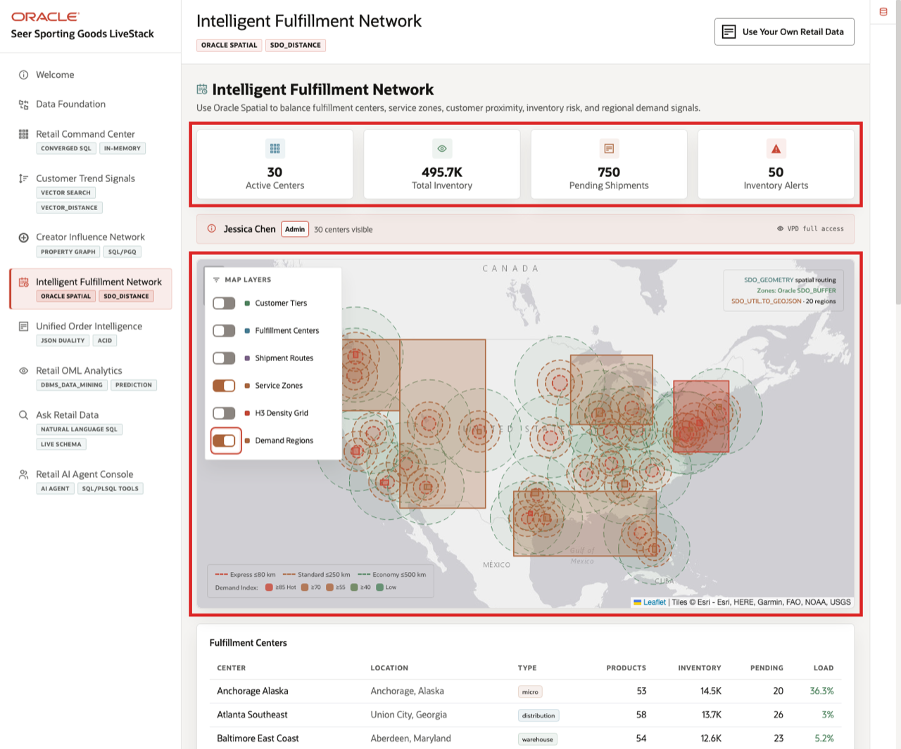

# Intelligent Fulfillment Network with Oracle Spatial

## Introduction

Fulfillment is where customer experience and operating cost meet. The best center is the one that balances speed, coverage, and available stock for the specific order.

**Oracle Spatial** keeps location-aware decisions inside Oracle AI Database next to orders, customers, and inventory. This reduces handoffs between mapping tools and operational systems when the business needs an answer quickly.

In this lab, you work through a practical fulfillment scenario for a Los Angeles customer ordering **AllTerrain Hiking Boots**. You inspect the spatial data behind the **Intelligent Fulfillment Network** page, then use SQL to move from map data to a shipping decision.

The business user sees a map and wants an answer: which center should ship this order? The technical challenge is that a useful answer needs more than a map. It needs customer location, fulfillment center location, delivery zones, service promises, product availability, and inventory thresholds in the same decision path.

The story builds one step at a time: understand the retail locations, produce map-ready data, find nearby centers, check delivery coverage, and finally combine distance with available inventory.

### Operating Story

| Step | Retail focus |
| --- | --- |
| Business Problem | The closest warehouse is not always the best fulfillment choice if delivery zones or product availability do not line up. |
| What You Will Prove | Location, service zones, and inventory can be queried together to explain which fulfillment centers are practical choices. |
| Database Capability | Oracle Spatial stores points and polygons, outputs GeoJSON, and calculates distance alongside relational inventory data. |
| Outcome | Fulfillment teams can choose faster and cheaper shipping options with evidence the business can inspect. |
{: title="Intelligent Fulfillment Story"}

**Persona focus:** Fulfillment planners want the best practical shipping choice. The technical team needs to combine customer location, delivery zones, fulfillment centers, and inventory in one queryable system.

Estimated Time: **10 minutes**

### Objectives

- Inspect retail location data stored as Oracle Spatial geometry.
- Convert database-managed geometry into map-ready GeoJSON.
- Find nearby fulfillment centers with Spatial distance filtering so the business can narrow the shortlist before comparing service levels and inventory.
- Use polygon service zones to understand which delivery promises actually cover the customer location.
- Combine distance and inventory availability so the final fulfillment choice reflects both geography and the stock position the business can act on.


## Task 1: Understand the retail spatial data model

Perform the following set of steps to see how the retail workshop stores locations and map areas as database data. This is the foundation for every routing, service-zone, and fulfillment decision later in the lab:

1. Review the related application screen before you run SQL.

    

    *Figure 1: Intelligent Fulfillment Network brings together inventory, centers, service areas, and demand geography.*

2. Start with the business model behind the map.

    Spatial data supports mapping, but it is more than a picture. Points and polygons are queryable database values. That means the same data can power a map, filter candidate locations, check delivery coverage, and join back to inventory and order tables.

    | Retail question | Table and column | Spatial shape |
    | --- | --- | --- |
    | Where are fulfillment centers located? | `FULFILLMENT_CENTERS.LOCATION` | Point |
    | Where are customers located? | `CUSTOMERS.LOCATION` | Point |
    | Which delivery areas can a center serve? | `FULFILLMENT_ZONES.ZONE_BOUNDARY` | Polygon |
    | Where is demand concentrated? | `DEMAND_REGIONS.BOUNDARY` | Polygon |
    {: title="Retail Spatial Model"}

    Points represent places such as customers or fulfillment centers, and polygons represent service areas or demand regions. Storing both shapes in the database lets the retailer answer coverage and routing questions from the same governed operational data.

3. Run this query.

    Oracle Spatial stores these shapes in `SDO_GEOMETRY` columns. This query displays a few fulfillment center coordinates and converts each point to Well-Known Text so you can read the geometry directly. The point uses longitude first, followed by latitude.

    ```sql
    <copy>
    SELECT center_name AS "Center",
           city AS "City",
           state_province AS "State",
           latitude AS "Latitude",
           longitude AS "Longitude",
           DBMS_LOB.SUBSTR(SDO_UTIL.TO_WKTGEOMETRY(location), 80, 1) AS "Geometry"
    FROM fulfillment_centers
    WHERE location IS NOT NULL
    ORDER BY center_id
    FETCH FIRST 5 ROWS ONLY;
    </copy>
    ```

    **Expected output:**

    | Center | City | State | Latitude | Longitude | Geometry |
    | --- | --- | --- | ---: | ---: | --- |
    | NYC Metro Hub | Edison | New Jersey | 40.5187 | -74.4121 | POINT (-74.4121 40.5187) |
    | LA Mega Center | Ontario | California | 34.0633 | -117.6509 | POINT (-117.6509 34.0633) |
    | Chicago Midwest Hub | Joliet | Illinois | 41.525 | -88.0817 | POINT (-88.0817 41.525) |
    | Dallas South Central | Lancaster | Texas | 32.5921 | -96.7561 | POINT (-96.7561 32.5921) |
    | Atlanta Southeast | Union City | Georgia | 33.5871 | -84.5421 | POINT (-84.5421 33.5871) |
    {: title="Fulfillment Center Geometry"}

4. The result shows that fulfillment centers are not just rows with city names. They have governed coordinates that SQL can use for maps, service areas, routing, and proximity analysis.

**Note:** Sample values may change after data refreshes or rebuilds. Focus on the expected result pattern and the business takeaway, not the exact values.

## Task 2: Produce map-ready GeoJSON

Perform the following set of steps to convert database geometry into a standard format that web maps can display. This is how the same governed data can support both SQL analysis and the map experience in the retail application:

1. Run this query.

    GeoJSON lets application maps display database-managed shapes. This block uses `SDO_UTIL.TO_GEOJSON` to convert `SDO_GEOMETRY` points into web-friendly JSON. The database still stores and manages the geometry, while the application receives standard map shapes with coordinates.

    ```sql
    <copy>
    SELECT center_name AS "Center",
           city AS "City",
           state_province AS "State",
           DBMS_LOB.SUBSTR(SDO_UTIL.TO_GEOJSON(location), 120, 1) AS "GeoJSON"
    FROM fulfillment_centers
    WHERE location IS NOT NULL
    ORDER BY center_id
    FETCH FIRST 5 ROWS ONLY;
    </copy>
    ```

    **Expected output:**

    | Center | City | State | GeoJSON |
    | --- | --- | --- | --- |
    | NYC Metro Hub | Edison | New Jersey | { "type": "Point", "coordinates": [-74.4121, 40.5187] } |
    | LA Mega Center | Ontario | California | { "type": "Point", "coordinates": [-117.6509, 34.0633] } |
    | Chicago Midwest Hub | Joliet | Illinois | { "type": "Point", "coordinates": [-88.0817, 41.525] } |
    | Dallas South Central | Lancaster | Texas | { "type": "Point", "coordinates": [-96.7561, 32.5921] } |
    | Atlanta Southeast | Union City | Georgia | { "type": "Point", "coordinates": [-84.5421, 33.5871] } |
    {: title="Fulfillment GeoJSON"}

2. Notice that the GeoJSON coordinates also use longitude first, then latitude. This is the format many map tools expect, so the database can supply map-ready shapes directly from the same trusted data used by the rest of the retail application.

**Note:** Sample values may change after data refreshes or rebuilds. Focus on the expected result pattern and the business takeaway, not the exact values.

## Task 3: Find nearby fulfillment centers

Perform the following set of steps to use location as a fulfillment filter. In the business scenario, the retailer first wants a short list of nearby centers before checking service levels or inventory:

1. Run this query.

    The closest facility is often the fastest or lowest-cost option. `SDO_WITHIN_DISTANCE` filters the result to centers within 350 miles of customer `1`, the Los Angeles customer in this scenario. `SDO_GEOM.SDO_DISTANCE` then calculates the mileage so the result can be sorted and explained to a business user.

    The tolerance value `0.005` controls the precision of the spatial calculation, and `unit=MILE` returns a distance that fulfillment planners can use directly.

    ```sql
    <copy>
    SELECT fc.center_name AS "Center",
           fc.city AS "City",
           fc.state_province AS "State",
           ROUND(SDO_GEOM.SDO_DISTANCE(c.location, fc.location, 0.005, 'unit=MILE'), 1) AS "Miles"
    FROM customers c
    JOIN fulfillment_centers fc
      ON SDO_WITHIN_DISTANCE(fc.location, c.location, 'distance=350 unit=MILE') = 'TRUE'
    WHERE c.customer_id = 1
      AND fc.is_active = 1
    ORDER BY SDO_GEOM.SDO_DISTANCE(c.location, fc.location, 0.005, 'unit=MILE')
    </copy>
    ```

    **Expected output:**

    | Center | City | State | Miles |
    | --- | --- | --- | ---: |
    | LA Mega Center | Ontario | California | 33.2 |
    | Las Vegas West | North Las Vegas | Nevada | 229 |
    | San Francisco Bay | Fremont | California | 319.1 |
    | Phoenix Desert Hub | Goodyear | Arizona | 340.9 |
    {: title="Nearby Fulfillment Centers"}

2. This is a typical Spatial pattern: first filter by geography, then calculate a business-friendly measure for ranking or display. The output gives the fulfillment team a practical shortlist instead of asking them to compare every center in the network.

**Note:** Sample values may change after data refreshes or rebuilds. Focus on the expected result pattern and the business takeaway, not the exact values.

## Task 4: Check delivery service zones

Perform the following set of steps to use polygons as delivery coverage areas. A nearby center may still have different service promises, so the next question is: which delivery zones actually cover the customer?

1. Run this query.

    A fulfillment zone is a polygon. A customer is a point. `SDO_RELATE` answers the spatial question, "which polygons contain this point?" In this retail example, that tells you which centers and delivery service levels cover the Los Angeles customer.

    ```sql
    <copy>
    SELECT c.customer_id AS "Customer",
           c.city AS "Customer City",
           c.state_province AS "Customer State",
           fc.center_name AS "Center",
           fz.zone_type AS "Service Level",
           fz.max_delivery_hrs AS "Max Hours"
    FROM customers c
    JOIN fulfillment_zones fz
      ON SDO_RELATE(fz.zone_boundary, c.location, 'mask=CONTAINS') = 'TRUE'
    JOIN fulfillment_centers fc
      ON fc.center_id = fz.center_id
    WHERE c.customer_id = 1
    ORDER BY fz.max_delivery_hrs, fc.center_name;
    </copy>
    ```

    **Expected output:**

    | Customer | Customer City | Customer State | Center | Service Level | Max Hours |
    | ---: | --- | --- | --- | --- | ---: |
    | 1 | Los Angeles | California | LA Mega Center | express | 8 |
    | 1 | Los Angeles | California | LA Mega Center | overnight | 16 |
    | 1 | Los Angeles | California | LA Mega Center | standard | 24 |
    | 1 | Los Angeles | California | LA Mega Center | economy | 72 |
    | 1 | Los Angeles | California | Las Vegas West | economy | 72 |
    {: title="Customer Service Zones"}

2. The result shows why polygons matter. The same customer may be eligible for multiple service levels from one center and a slower backup option from another center. That gives the business a way to balance speed, cost, and resiliency before committing to a shipment.

**Note:** Sample values may change after data refreshes or rebuilds. Focus on the expected result pattern and the business takeaway, not the exact values.

## Task 5: Combine distance with inventory availability

Perform the following set of steps to connect spatial proximity with the product stock needed to fulfill an order. This is where the map becomes an operational decision.

1. Run this query.

    Distance alone does not decide fulfillment. The best recommendation balances proximity with available stock, so the retailer can protect service levels without creating avoidable stockouts elsewhere.

    For example, this query ranks active fulfillment centers for customer `1`, but only for centers that have available units of `AllTerrain Hiking Boots`.

    ```sql
    <copy>
    SELECT fc.center_name AS "Center",
           fc.city AS "City",
           fc.state_province AS "State",
           p.product_name AS "Product",
           i.quantity_on_hand - i.quantity_reserved AS "Available",
           ROUND(SDO_GEOM.SDO_DISTANCE(c.location, fc.location, 0.005, 'unit=MILE'), 1) AS "Miles"
    FROM customers c
    CROSS JOIN fulfillment_centers fc
    JOIN inventory i
      ON i.center_id = fc.center_id
    JOIN products p
      ON p.product_id = i.product_id
    WHERE c.customer_id = 1
      AND fc.is_active = 1
      AND p.product_id = 37
      AND i.quantity_on_hand > i.quantity_reserved
    ORDER BY SDO_GEOM.SDO_DISTANCE(c.location, fc.location, 0.005, 'unit=MILE')
    FETCH FIRST 5 ROWS ONLY;
    </copy>
    ```

    **Expected output:**

    | Center | City | State | Product | Available | Miles |
    | --- | --- | --- | --- | ---: | ---: |
    | LA Mega Center | Ontario | California | AllTerrain Hiking Boots | 234 | 33.2 |
    | Phoenix Desert Hub | Goodyear | Arizona | AllTerrain Hiking Boots | 169 | 340.9 |
    | Salt Lake Mountain | West Jordan | Utah | AllTerrain Hiking Boots | 236 | 567.9 |
    | Denver Mountain West | Aurora | Colorado | AllTerrain Hiking Boots | 94 | 836.8 |
    | Houston Gulf Coast | Missouri City | Texas | AllTerrain Hiking Boots | 262 | 1366.3 |
    {: title="Distance and Available Inventory"}

2. This is the converged database value: location, product, inventory, and customer data can be queried together. The result shows that `LA Mega Center` is both close and stocked, making it the strongest fulfillment choice for this order. The other rows provide backup options if the business wants to protect capacity, reduce regional risk, or route around operational constraints.

3. A fulfillment application can now explain the recommendation in business terms: ship from the closest stocked center, keep alternate centers visible, and use the same governed data for the map, the SQL analysis, and the operational decision.

**Note:** Sample values may change after data refreshes or rebuilds. Focus on the expected result pattern and the business takeaway, not the exact values.

## Learn more

This lab gives you a short retail-focused sample of Oracle Spatial in Oracle AI Database. For a deeper hands-on Spatial workshop, see [Oracle LiveLabs: Spatial Workshop](https://livelabs.oracle.com/ords/r/dbpm/livelabs/preview-sandbox-instructions?p202_voucher_id=&p202_workshop_id=736). For reference documentation, see [Oracle Spatial Developer's Guide](https://docs.oracle.com/en/database/oracle/oracle-database/26/spatl/).

## Acknowledgements

* **Author** - Pat Shepherd, Senior Principal Database Product Manager
* **Contributor** - Linda Foinding, Principal Database Product Manager
* **Last Updated By/Date** - Oracle Database Product Management, May 2026
