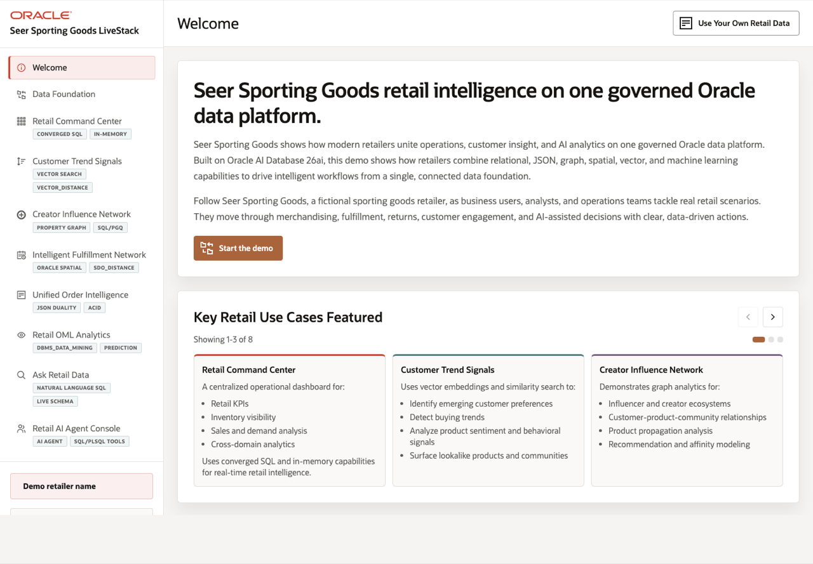

# Build Retail Intelligence with Oracle Database 26ai

## Introduction

Retailers are under pressure to make faster decisions while data is spread across commerce systems, fulfillment networks, customer engagement platforms, social channels, analytics tools, and AI experiments. Seer Sporting Goods uses Oracle AI Database 26ai to bring those workloads together on one governed data foundation.

In this workshop, you run hands-on exercises in an Autonomous Database 26ai instance. The LiveStack application provides the visible retail scenes: Data Foundation, Retail Command Center, Customer Trend Signals, Creator Influence Network, Intelligent Fulfillment Network, Unified Order Intelligence, Retail OML Analytics, Ask Retail Data, and Retail AI Agent Console. The core learning happens in Database Actions SQL Worksheet, where you inspect the database objects that power those scenes.

Oracle Database 26ai acts as the governed converged data platform. The same database stores relational rows, JSON Duality documents, vector embeddings, graph relationships, spatial locations, OML models, semantic comments, PL/SQL tools, and audit records. That lets a retail team move through a single decision loop instead of copying evidence into disconnected specialty systems.

### Prerequisites

- Access to the LiveLabs environment for this workshop.
- Access to Database Actions and SQL Worksheet for the provisioned Autonomous Database 26ai instance.
- The retail workshop schema created by the backend provisioning bundle. LiveLabs Sandbox reservations use the main workshop user, usually `LLUSER`. In SQL Worksheet, select that main user from the dropdown menu at the top of the page; do not select `RETAILDB`.
- Basic familiarity with SQL and retail operations concepts.

### Objectives

In this workshop, you will:

- Query the database foundation behind the Seer Sporting Goods Retail LiveStack.
- Connect common retail challenges such as fragmented data, fast-changing demand, inventory risk, fulfillment complexity, limited self-service analytics, and governed AI adoption to database-backed evidence.
- Inspect Retail Command Center metrics that combine orders, revenue, social momentum, returns exposure, inventory, and agent activity.
- Use JSON Relational Duality and VPD to inspect governed order intelligence.
- Use `ALL_MINILM_L12_V2`, `VECTOR_EMBEDDING`, and `VECTOR_DISTANCE` for semantic product and signal matching.
- Traverse creator, brand, product, and post relationships with Property Graph and `GRAPH_TABLE`.
- Use Oracle Spatial for fulfillment-center and demand-region decisions.
- Inspect OML feature views and in-database mining models.
- Ground Ask Retail Data and agent workflows in semantic views, PL/SQL tools, and audit records.

Estimated Workshop Time: 90 minutes

## Application Screens

These screenshots come from the running Seer Sporting Goods Retail LiveStack and show the application flow that the SQL labs explain.

*Figure 1: The welcome page frames the retail story and previews the application flow.*

## Acknowledgements

* **Author** - Pat Shepherd, Senior Principal Database Product Manager
* **Last Updated By/Date** - Oracle Database Product Management, May 2026
