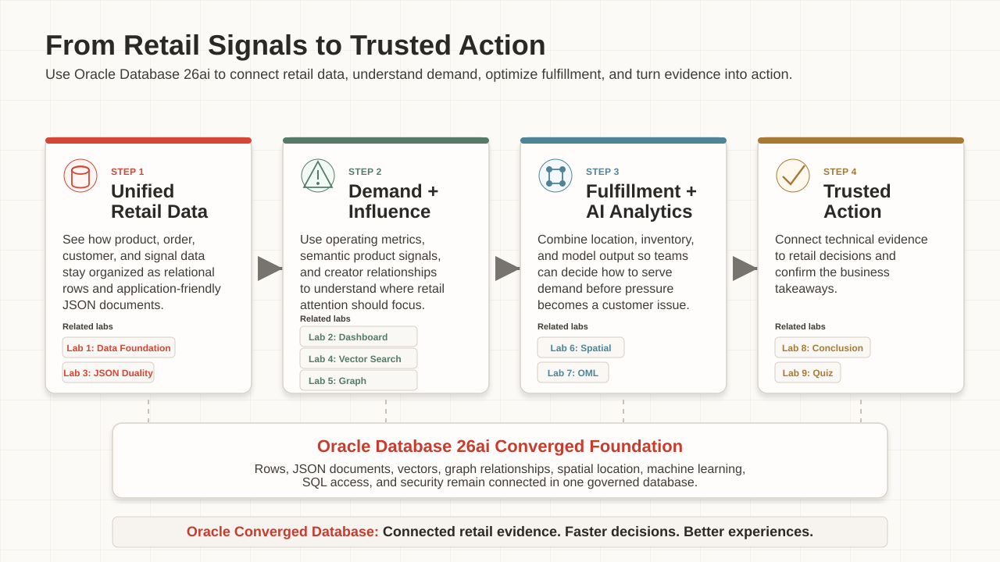
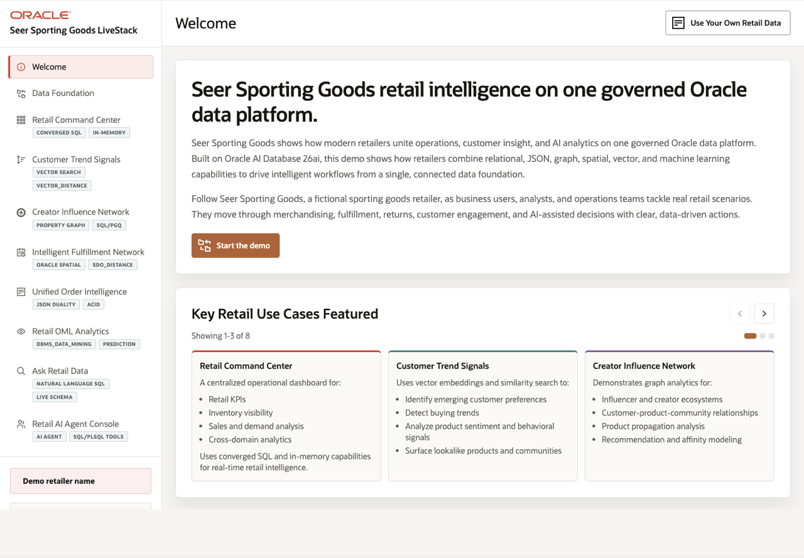

# Build Retail Intelligence with Oracle AI Database 26ai

## Introduction

Monday morning starts with a demand spike at **Seer Sporting Goods**. Trail-running products are trending, customers expect fast fulfillment, and merchandising, operations, and analytics teams need the same answer before the day gets away from them. In this workshop, you follow the evidence in SQL: confirm the data foundation, inspect the command center, open the order record, interpret demand signals, follow creator influence, choose fulfillment options, and prioritize action with model output.

The business pressure is familiar: demand changes quickly, customers expect fast service, and different teams need the same answer without reconciling separate systems. **Oracle AI Database 26ai** and **Autonomous Database** keep relational rows, JSON documents, vectors, graph relationships, spatial data, and in-database analytics connected in one governed environment. The companion Retail LiveStack demo shows the application experience; each lab shows how Oracle AI Database 26ai produces the underlying result from the same governed demo data.

You will also complete short interactive investigations. After you run a baseline query, you will change one business question, compare the evidence, and make a review recommendation. Complete solutions stay inside collapsed **Challenge answer** sections so you can try each change first. Each feature lab ends with a **Next Steps** link to a capability-specific LiveLabs workshop when you want a deeper technical exercise.

Throughout the workshop, you will see small arrows next to expandable sections. Select the arrow when you want extra context about a term, concept, or Oracle Database capability. These sections are closed by default so the main lab stays focused, but you can expand them whenever you want more explanation.

The example below shows an expandable section before and after it is opened.

<strong>Learn more: What does "converged database" mean?</strong>

> A converged database lets you work with several kinds of data and workloads in one database: rows and columns, JSON documents, vectors for AI search, graphs for relationships, spatial data for location, and machine learning models.
>
> In a fractured environment, each capability often lives in a different store or service. That can force teams to copy data, rebuild security rules, reconcile conflicting results, and explain why two systems disagree. Oracle Database is well suited for this retail scenario because the evidence, security model, SQL access, and application data stay connected.

### Objectives

In this workshop, you will:

- Inspect the retail schema objects that support the application workflow.
- Trace command-center metrics to orders, products, and categories.
- Create and update an order through JSON Relational Duality, then verify the same relational rows.
- Use AI Vector Search to match natural-language demand signals to products.
- Use Property Graph to follow creator and brand relationships.
- Use Oracle Spatial to combine location and inventory for fulfillment decisions.
- Use Oracle Machine Learning model outputs from SQL.
- Change selected business questions and use the resulting evidence to make review decisions.

Estimated Workshop Time: **95 minutes**

### Business Scenario

| Step | Retail focus |
| --- | --- |
| Business Problem | Retail teams need faster decisions without spreading product, order, signal, fulfillment, and analytics evidence across disconnected systems. |
| Technical Challenge | Each workflow needs a different data shape, but the evidence must remain governed and traceable. |
| Persona Focus | A retail operations leader wants one trusted decision path, while the application and database team must make it explainable. |
| Database Capability | Relational SQL, JSON Relational Duality, vectors, property graph, spatial, and Oracle Machine Learning work together in Oracle Database 26ai. |
| Outcome | You can explain how one governed database foundation supports a retail decision loop from signal to action. |

*Figure 1: The welcome page frames the retail workflow that the SQL labs explain.*

## Acknowledgements

* **Author** - Pat Shepherd, Senior Principal Database Product Manager
* **Last Updated By/Date** - Oracle Database Product Management, July 2026
