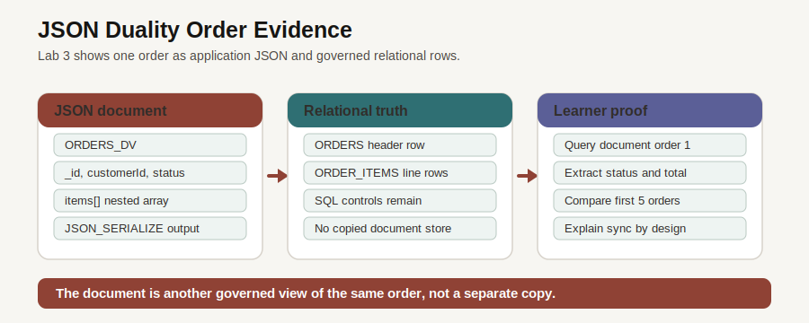

# Unified Order Intelligence with JSON Relational Duality

## Introduction

After you trace dashboard metrics to orders, the next question is how applications should use those orders. Application teams want compact order documents, operations teams want relational detail, and business teams want one governed source of truth. JSON Relational Duality lets Oracle Database support those shapes without splitting the order record.

### Objectives

- Inspect the `ORDERS\_DV` duality view.
- Query order documents as JSON.
- Compare the same order through relational SQL.

Estimated Time: **15 minutes**

### Business Scenario

| Step | Retail focus |
| --- | --- |
| Business Problem | Applications need order documents, while operations still need relational rows and SQL controls. |
| Technical Challenge | Copying order documents to a separate store creates synchronization and governance work. |
| Persona Focus | An application developer wants JSON access; the database team needs transactional truth. |
| Database Capability | JSON Relational Duality maps document-shaped JSON to relational tables. |
| Outcome | One order can serve application APIs and SQL analysis from the same database foundation. |

<details>
<summary><strong>Key terms: JSON Relational Duality</strong></summary>

> - **Duality view**: A database view that exposes relational rows as JSON documents.
> - **Projection**: Selected JSON fields can be read in SQL with functions such as `JSON_VALUE`.
> - **Governed document access**: Applications get document-shaped data without creating an unmanaged copy.

</details>



*Figure 1: `ORDERS\_DV` presents order data as a JSON document while the business data remains in relational order tables.*

## Task 1: Inspect the duality view

1. Review the order application screen.

    

    *Figure 2: The application works with order detail as a business object. The SQL in this lab shows how the same shape is exposed from Oracle Database.*

2. Query the duality view catalog.

    > **SQL Worksheet reminder:** Need a reminder on how to open and use the SQL Worksheet? Return to [Getting Started Task 2: Open SQL Worksheet](/workshops/sandbox/index.html?lab=getting-started#Task2:OpenSQLWorksheet) for the step-by-step graphic showing where to paste and run SQL statements.

    Use `USER_JSON_DUALITY_VIEWS` to confirm that the order document view exists in the schema. This is safer than assuming the object from application code.

    `USER_JSON_DUALITY_VIEWS` is a data dictionary view. It lists JSON Relational Duality views that the current database user can see. In this workshop you expect only one row because the lab uses one order document view, `ORDERS_DV`. The point is not to discover a long list. The point is to prove that you are connected as the right user and that the database object the application depends on is present before you query it.

    This is a useful pattern for your own applications. Before an API, service, or dashboard reads from a database object, a setup check can query the catalog to confirm that required views exist. If this query returns no rows, the next task will fail for a clear reason: the duality view is missing, you are in the wrong schema, or your user cannot see the object.

    ```sql
    <copy>
    SELECT view_name AS "Duality View",
           'Ready for document queries' AS "Status",
           'Order JSON is backed by relational tables' AS "Why It Matters"
    FROM user_json_duality_views
    WHERE view_name = 'ORDERS_DV';
    </copy>
    ```

    **Expected output: Duality View Readiness Check**

    | Duality View | Status | Why It Matters |
    | --- | --- | --- |
    | ORDERS\_DV | Ready for document queries | Order JSON is backed by relational tables |

## Task 2: Read an order as a JSON document

1. Query order `1` from `ORDERS_DV`.

    `JSON_SERIALIZE` displays the JSON document returned by the duality view as readable text. The `_id`, customer, status, total, and nested `items` array look like document fields, but the values remain backed by relational order tables.

    The `WHERE` clause uses `JSON_VALUE` to read the `_id` field inside the JSON document, convert it to a number, and return one order. That keeps the example focused on a single document.

    ```sql
    <copy>
    SELECT JSON_SERIALIZE(data RETURNING VARCHAR2(1000)) AS "Order Document"
    FROM orders_dv
    WHERE JSON_VALUE(data, '$._id' RETURNING NUMBER) = 1;
    </copy>
    ```

    **Expected output excerpt: Order Document**

    | Order Document |
    | --- |
    | `{"_id":1,"_metadata":{...},"customerId":470,"status":"confirmed","total":967.92,...}` |

2. The document is useful for application access because one query returns the order header and line items together. The app gets a document shape, while SQL still protects the governed source rows.

## Task 3: Project the same order into relational columns

1. Query document fields as SQL columns.

    This query uses `JSON_VALUE` to project fields from the JSON document into ordinary SQL columns. Projection means pulling selected document fields into a table-shaped result, which is useful when a business user wants to sort, filter, or compare document values with SQL.

    Each `JSON_VALUE` expression points to one JSON path, such as `$._id` or `$.total`. `ORDER BY "Order"` makes the sample stable, and `FETCH FIRST 5 ROWS ONLY` keeps the output short enough to inspect.

    ```sql
    <copy>
    SELECT JSON_VALUE(data, '$._id' RETURNING NUMBER) AS "Order",
           JSON_VALUE(data, '$.customerId' RETURNING NUMBER) AS "Customer",
           JSON_VALUE(data, '$.status') AS "Status",
           JSON_VALUE(data, '$.total' RETURNING NUMBER) AS "Total"
    FROM orders_dv
    ORDER BY "Order"
    FETCH FIRST 5 ROWS ONLY;
    </copy>
    ```

    **Expected output: Order Document Projection**

    | Order | Customer | Status | Total |
    | ---: | ---: | --- | ---: |
    | 1 | 470 | confirmed | 967.92 |
    | 2 | 478 | processing | 829.9 |
    | 3 | 1367 | shipped | 44.99 |
    | 4 | 446 | delivered | 6869.92 |
    | 5 | 1021 | delivered | 1929.94 |

2. The result shows the practical value of duality. The application can use a JSON document, and analysts can still use SQL over the same governed order data. Next, you use customer and creator language to find demand signals that may not match catalog keywords exactly.

## Acknowledgements

* **Author** - Pat Shepherd, Senior Principal Database Product Manager
* **Last Updated By/Date** - Oracle Database Product Management, July 2026
