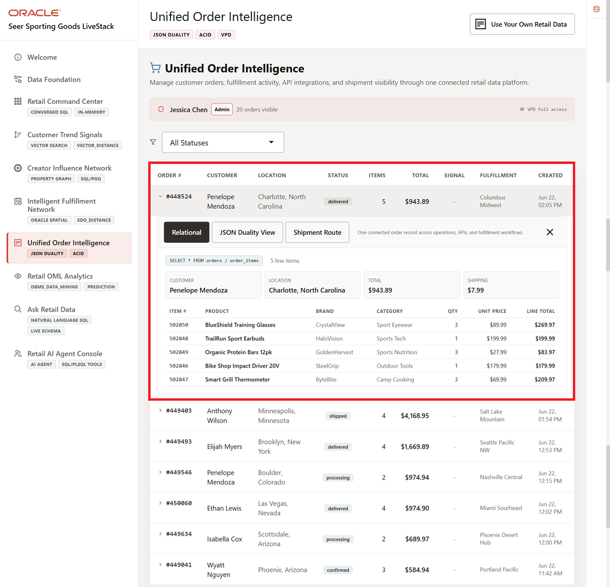
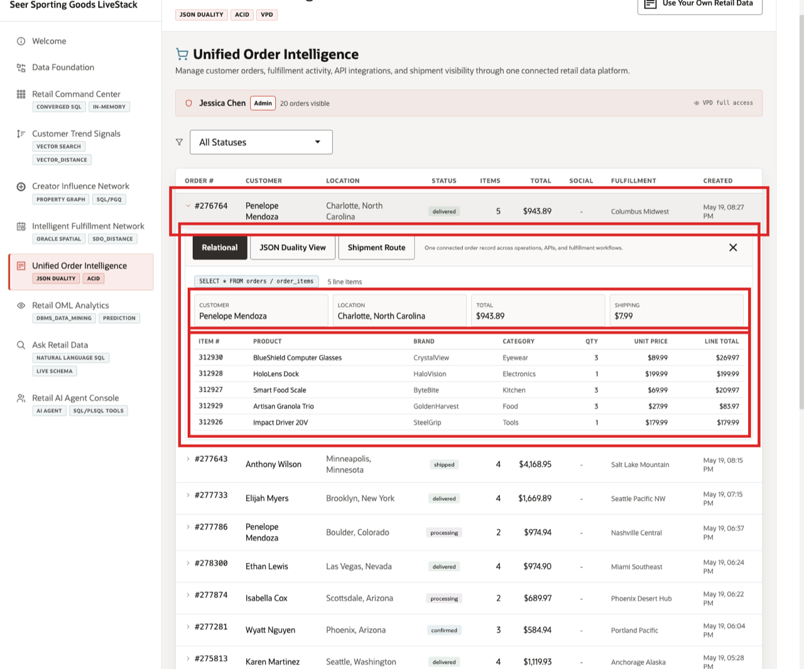

# Unified Order Intelligence with JSON Relational Duality

## Introduction

Order data serves multiple retail audiences at once. Application teams want a compact order object, operations teams want relational detail, and business teams want one governed source of truth. **JSON Relational Duality** lets **Oracle AI Database** support all three without duplicating the order record.

In this lab, learners move from relational order tables to document-style access, then prove that inserts and updates still land in the same governed business transaction. The point is not just technical flexibility; it is operational consistency.

The application value is API-friendly access. An order detail screen or service call often wants one order document with header fields and line items together. The database value is that the document is not a disconnected copy. Oracle still stores and protects the order in relational tables that SQL, constraints, transactions, and analytics can use.

### Operating Story

| Step | Retail focus |
| --- | --- |
| Business Problem | Seer Sporting Goods needs application-friendly order documents without losing relational truth, transactions, or SQL access. |
| What You Will Prove | The same order can be read and changed as JSON while Oracle stores and protects the underlying relational rows. |
| Database Capability | JSON Relational Duality maps document-shaped JSON to relational `ORDERS` and `ORDER_ITEMS` tables. |
| Outcome | Application teams get document APIs while operations and analytics teams keep one governed source of order truth. |
{: title="Unified Order Intelligence Story"}

**Persona focus:** Application developers want API-friendly order documents. Database and operations teams need those documents to stay transactional, queryable, and tied to relational order evidence.

Estimated Time: **15 minutes**

### Objectives

- Inspect the relational order tables that support one governed order record for applications, operations, reporting, and audit needs.
- Recreate `ORDERS_DV` so learners can see how one governed order record can support document-style insert, update, and delete operations.
- Query retail orders as JSON documents.
- Insert a retail order through `ORDERS_DV` and verify that the business transaction is stored correctly in the mapped relational tables.
- Update order data through both the duality view and the relational tables to show that every team is still working from the same governed order record.


## Task 1: Start with relational order tables

JSON Relational Duality starts with relational tables. In this retail workshop, `ORDERS` stores the order header and `ORDER_ITEMS` stores the line items. The duality view presents those rows as one order document.



*Figure 1: `ORDERS_DV` presents the `ORDERS` header row and related `ORDER_ITEMS` rows as one JSON order document.*

Perform the following set of steps to start with the relational order tables that support a document-style order experience for the business:

1. Review the order detail screen before you run the SQL.

    

    *Figure 2: The application works with an order as a business object: one order header with related line items. JSON Relational Duality lets the database expose that same shape as a JSON document while still storing the data in relational `ORDERS` and `ORDER_ITEMS` rows.*

2. Inspect the core relational columns used by the order document.

    Before you query the JSON document, look at the relational columns that make up the document. The order header fields come from `ORDERS`; the nested `items` array comes from `ORDER_ITEMS`. This is the key duality concept for the rest of the lab: the document shape is built from relational tables.

    ```sql
    <copy>
    SELECT table_name AS "Table",
           column_name AS "Column",
           data_type AS "Type"
    FROM user_tab_columns
    WHERE table_name IN ('ORDERS','ORDER_ITEMS')
      AND column_name IN (
        'ORDER_ID','CUSTOMER_ID','ORDER_STATUS','ORDER_TOTAL',
        'SHIPPING_COST','DEMAND_SCORE','CREATED_AT',
        'ITEM_ID','PRODUCT_ID','QUANTITY','UNIT_PRICE','LINE_TOTAL'
      )
    ORDER BY table_name, column_id;
    </copy>
    ```

    **Expected output excerpt:**

    | Table | Column | Type |
    | --- | --- | --- |
    | ORDERS | ORDER_ID | NUMBER |
    | ORDERS | CUSTOMER_ID | NUMBER |
    | ORDERS | ORDER_STATUS | VARCHAR2 |
    | ORDER_ITEMS | ITEM_ID | NUMBER |
    | ORDER_ITEMS | PRODUCT_ID | NUMBER |
    | ORDER_ITEMS | QUANTITY | NUMBER |
    {: title="Order Relational Columns"}

3. The data is still relational: primary keys, foreign keys, data types, SQL joins, and analytics all continue to work.

**Note:** Sample values may change after data refreshes or rebuilds. Focus on the expected result pattern and the business takeaway, not the exact values.

## Task 2: Add INSERT, UPDATE, and DELETE to a read-only duality view

A JSON Relational Duality view is more than a read-only JSON projection. It defines the document shape that applications see and the operations they are allowed to perform. As the database user who owns the view, you can decide whether the view should only support reads or whether applications should also be able to insert, update, and delete order documents.

In this task, you recreate the existing retail `ORDERS_DV` view with those operations enabled. The important point is how small and declarative the change is: the following SQL adds the document operations while Oracle Database still maps the work back to the relational `ORDERS` and `ORDER_ITEMS` tables.

Perform the following set of steps to define which document-style order actions the business can allow through `ORDERS_DV` while keeping relational storage and control in place:


1. Read the write permissions in the view definition.

    The `WITH INSERT UPDATE DELETE` clauses are the key syntax in this task. They tell Oracle Database that document-style inserts, updates, and deletes are allowed through this duality view and through the nested `items` array. Without those clauses, the view can still be useful for reading order documents, but it will not support the write operations you use later in the lab.

    In this view, `FROM orders o WITH INSERT UPDATE DELETE` enables writes for the order header, and `FROM order_items oi WITH INSERT UPDATE DELETE` enables writes for the nested line items.

2. Run this block as a script because it contains DDL.

    In Database Actions SQL Worksheet, use the **Run Script** button for this block. It is the script execution control, not the single-statement green Run Statement control. Run Script is the right choice when a block contains DDL such as `CREATE OR REPLACE`.

    ```sql
    <copy>
    CREATE OR REPLACE JSON RELATIONAL DUALITY VIEW orders_dv AS
      SELECT JSON {
        '_id'         : o.order_id,
        'customerId'  : o.customer_id,
        'status'      : o.order_status,
        'total'       : o.order_total,
        'shippingCost': o.shipping_cost,
        'demandScore' : o.demand_score,
        'createdAt'   : o.created_at,
        'items' : [
          SELECT JSON {
            'itemId'    : oi.item_id,
            'productId' : oi.product_id,
            'quantity'  : oi.quantity,
            'unitPrice' : oi.unit_price
          }
          FROM order_items oi WITH INSERT UPDATE DELETE
          WHERE oi.order_id = o.order_id
        ]
      }
      FROM orders o WITH INSERT UPDATE DELETE;
    </copy>
    ```

3. The view now defines both the document shape and the allowed document operations. The relational tables are still the storage and SQL foundation.

## Task 3: Query retail orders as JSON and SQL

Now query the same retail order two ways. First, read it as the JSON document an application might use. Then read the same fields from the relational `ORDERS` and `ORDER_ITEMS` tables. The important learning point is simple: both queries return the same order data. Only the representation changes.

Perform the following set of steps to compare the same retail order in JSON and relational form so learners can see how one governed transaction supports different business uses:

1. Read order `1` as a JSON document.

    **Important:** Because this query asks for a `PRETTY` JSON document, select **Run Script** in SQL Worksheet. In Database Actions, this is the script execution button. It displays the formatted JSON document more reliably than running the statement as a single grid query.

    ```sql
    <copy>
    SELECT JSON_SERIALIZE(data RETURNING VARCHAR2(4000) PRETTY) AS "Order JSON"
    FROM orders_dv
    WHERE JSON_VALUE(data, '$._id' RETURNING NUMBER) = 1;
    </copy>
    ```

    **Expected output excerpt:**

    ```json
    {
      "_id" : 1,
      "_metadata" : { ... },
      "customerId" : 1668,
      "status" : "confirmed",
      "total" : 1139.93,
      "items" : [
        {
          "itemId" : 1,
          "productId" : 173,
          "quantity" : 1,
          "unitPrice" : 69.99
        },
        { ... }
      ]
    }
    ```

2. Read the same order from relational tables.

    This query returns the same order evidence in rows and columns. Relational results are easier for joins, reporting, controls, and operational detail, while the JSON document is easier for application-style order retrieval.

    ```sql
    <copy>
    SELECT o.order_id AS "Order",
           o.customer_id AS "Customer",
           o.order_status AS "Status",
           o.order_total AS "Order Total",
           oi.item_id AS "Item",
           oi.product_id AS "Product",
           oi.quantity AS "Qty",
           oi.unit_price AS "Unit Price"
    FROM orders o
    JOIN order_items oi ON oi.order_id = o.order_id
    WHERE o.order_id = 1
    ORDER BY oi.item_id;
    </copy>
    ```

    **Expected output:**

    | Order | Customer | Status | Order Total | Item | Product | Qty | Unit Price |
    | ---: | ---: | --- | ---: | ---: | ---: | ---: | ---: |
    | 1 | 1668 | confirmed | 1139.93 | 1 | 173 | 1 | 69.99 |
    | 1 | 1668 | confirmed | 1139.93 | 2 | 59 | 1 | 599.99 |
    | 1 | 1668 | confirmed | 1139.93 | 3 | 5 | 3 | 129.99 |
    | 1 | 1668 | confirmed | 1139.93 | 4 | 182 | 2 | 39.99 |
    {: title="Relational Order Rows"}

3. You just saw the same order fields in two useful shapes. The JSON view is convenient for applications that want one order document. The relational tables are convenient for SQL, reporting, joins, constraints, and operational detail. The `_metadata` field in the JSON output is generated by the duality view; the business data comes from the relational rows.

**Note:** Sample values may change after data refreshes or rebuilds. Focus on the expected result pattern and the business takeaway, not the exact values.

## Task 4: Insert a JSON order document

Working through a duality view feels like working with JSON documents, but the database stores the values in the mapped relational tables.

In this task, you use the existing retail `ORDERS_DV` view to delete a previous copy of one workshop order, insert it again as a JSON document, and then query both the document view and the relational tables to prove they represent the same underlying data.

In the next task, you update that same order through the JSON duality view and then directly through the relational table. Same data, different views, different access patterns.

Perform the following set of steps to insert a document-style retail order and confirm that Oracle still stores the transaction in the governed relational tables:

You will use order `900001` for the rest of the lab. The flow is:

```text
Delete existing order 900001, if present
        |
        v
Insert order 900001 through ORDERS_DV with status pending
        |
        v
Update order 900001 through ORDERS_DV to status processing
        |
        v
Update ORDERS directly to status confirmed
```

The status changes are intentional because they show one retail order moving through both document-style writes and relational writes. That is the business value of duality: different teams can work in different shapes without splitting the source of truth.

1. Delete any previous copy of the workshop order.

    This makes the task safe to rerun in the same workshop session. Run each SQL block in this task separately so you can see each result before moving to the next step.

    ```sql
    <copy>
    DELETE FROM orders_dv dv
    WHERE JSON_VALUE(dv.data, '$._id' RETURNING NUMBER) = 900001;
    </copy>
    ```

    **Expected output:**

    | Check | Result |
    | --- | --- |
    | Rerun guard | 0 or 1 row deleted. |
    {: title="Delete Previous Workshop Order"}

2. Insert a workshop order document through `ORDERS_DV`.

    The insert writes a JSON document, and Oracle stores the order header in `ORDERS` and the line item in `ORDER_ITEMS`.

    ```sql
    <copy>
    INSERT INTO orders_dv dv VALUES (
      '{
         "_id"          : 900001,
         "customerId"   : 1668,
         "status"       : "pending",
         "total"        : 149.99,
         "shippingCost" : 0,
         "demandScore"  : 42.5,
         "items" : [
           {
             "itemId"    : 900001,
             "productId" : 1,
             "quantity"  : 1,
             "unitPrice" : 149.99
           }
         ]
       }'
    );
    </copy>
    ```

    **Expected output:**

    | Check | Result |
    | --- | --- |
    | JSON document insert | 1 row inserted. |
    {: title="JSON Document Insert"}

3. Commit the insert.

    ```sql
    <copy>
    COMMIT;
    </copy>
    ```

    **Expected output:**

    | Check | Result |
    | --- | --- |
    | Commit | Commit complete. |
    {: title="Commit Inserted Order"}

4. Query `ORDERS_DV` for the inserted document.

    **Important:** Because this query asks for a `PRETTY` JSON document, select **Run Script** in SQL Worksheet. In Database Actions, this is the script execution button. It displays the formatted JSON document more reliably than running the statement as a single grid query.

    ```sql
    <copy>
    SELECT JSON_SERIALIZE(data RETURNING VARCHAR2(4000) PRETTY) AS "Inserted Order JSON"
    FROM orders_dv
    WHERE JSON_VALUE(data, '$._id' RETURNING NUMBER) = 900001;
    </copy>
    ```

    **Expected output excerpt:**

    ```json
    {
      "_id" : 900001,
      "_metadata" : { ... },
      "customerId" : 1668,
      "status" : "pending",
      "total" : 149.99,
      "items" : [
        {
          "itemId" : 900001,
          "productId" : 1,
          "quantity" : 1,
          "unitPrice" : 149.99
        }
      ]
    }
    ```

5. Query the relational tables.

    ```sql
    <copy>
    SELECT o.order_id AS "Order",
           o.customer_id AS "Customer",
           o.order_status AS "Status",
           o.order_total AS "Total",
           COUNT(oi.item_id) AS "Lines",
           ROUND(SUM(oi.line_total), 2) AS "Line Total"
    FROM orders o
    JOIN order_items oi ON oi.order_id = o.order_id
    WHERE o.order_id = 900001
    GROUP BY o.order_id, o.customer_id, o.order_status, o.order_total;
    </copy>
    ```

    **Expected output:**

    | Order | Customer | Status | Total | Lines | Line Total |
    | ---: | ---: | --- | ---: | ---: | ---: |
    | 900001 | 1668 | pending | 149.99 | 1 | 149.99 |
    {: title="Relational Storage"}

6. The insert went through the document view, but the data is stored relationally.

**Note:** Sample values may change after data refreshes or rebuilds. Focus on the expected result pattern and the business takeaway, not the exact values.

## Task 5: Update both representations

Updates work in both directions. When you update the retail document, the relational row reflects it. When you update the relational row, the JSON document reflects it. That is the duality: one governed set of data, two useful access patterns.

Perform the following set of steps to update the same retail order through both representations and prove that the governed data stays synchronized.

1. Update the order document with `JSON_TRANSFORM`.

    This changes the document status from `pending` to `processing` through `ORDERS_DV`.

    ```sql
    <copy>
    UPDATE orders_dv dv
    SET data = JSON_TRANSFORM(data, SET '$.status' = 'processing')
    WHERE JSON_VALUE(data, '$._id' RETURNING NUMBER) = 900001;
    </copy>
    ```

2. Commit the document update.

    ```sql
    <copy>
    COMMIT;
    </copy>
    ```

3. Verify the relational row changed.

    ```sql
    <copy>
    SELECT order_id AS "Order",
           order_status AS "Relational Status"
    FROM orders
    WHERE order_id = 900001;
    </copy>
    ```

    **Expected output:**

    | Order | Relational Status |
    | ---: | --- |
    | 900001 | processing |
    {: title="Document Update Reflected Relationally"}

4. Update the relational table.

    This changes `ORDERS.ORDER_STATUS` directly.

    ```sql
    <copy>
    UPDATE orders
    SET order_status = 'confirmed'
    WHERE order_id = 900001;
    </copy>
    ```

5. Commit the relational update.

    ```sql
    <copy>
    COMMIT;
    </copy>
    ```

6. Read the JSON document again.

    The query shows the JSON document changed too.

    **Important:** Because this query asks for a `PRETTY` JSON document, select **Run Script** in SQL Worksheet. In Database Actions, this is the script execution button. It displays the formatted JSON document more reliably than running the statement as a single grid query.

    ```sql
    <copy>
    SELECT JSON_SERIALIZE(data RETURNING VARCHAR2(4000) PRETTY) AS "Updated Order JSON"
    FROM orders_dv
    WHERE JSON_VALUE(data, '$._id' RETURNING NUMBER) = 900001;
    </copy>
    ```

    **Expected output excerpt:**

    ```json
    {
      "_id" : 900001,
      "_metadata" : { ... },
      "customerId" : 1668,
      "status" : "confirmed",
      "total" : 149.99,
      "items" : [ ... ]
    }
    ```

7. You used both sides of JSON Relational Duality. A document insert created relational rows. A document update changed a relational row. A relational update changed the document result. The application gets JSON flexibility while Oracle Database keeps the data relational, consistent, and available to SQL.

**Note:** Sample values may change after data refreshes or rebuilds. Focus on the expected result pattern and the business takeaway, not the exact values.

## More JSON Relational Duality labs

This lab is meant to give you a sample of the power of Oracle AI Database's JSON capabilities. For a more full-featured hands-on lab on JSON Relational Duality, go to:

[JSON Relational Duality LiveLab](https://livelabs.oracle.com/ords/r/dbpm/livelabs/view-workshop?clear=RR,180&wid=3635&session=108731215528653)

## Acknowledgements

* **Author** - Pat Shepherd, Senior Principal Database Product Manager
* **Contributor** - Linda Foinding, Principal Database Product Manager
* **Last Updated By/Date** - Oracle Database Product Management, May 2026
