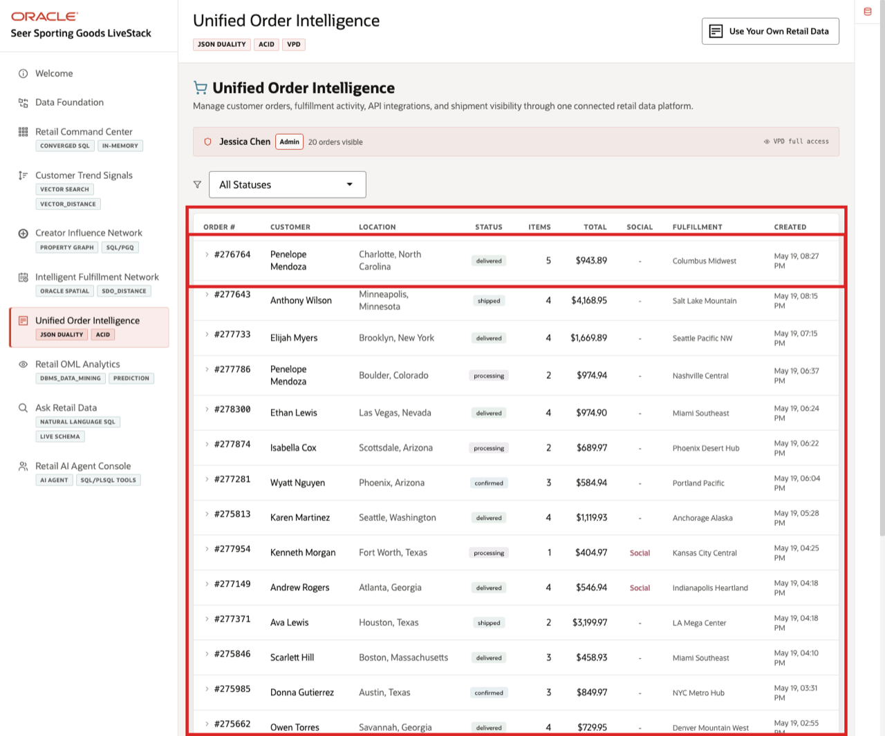
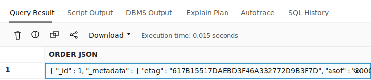

# Unified Order Intelligence with JSON Duality and VPD

## Introduction

An ecommerce operations manager, customer service lead, order platform owner, or partner integration architect needs to understand an order from multiple angles. Retail teams often duplicate order headers, line items, customer data, fulfillment centers, shipment records, and API payloads across separate systems.

Oracle AI Database keeps the order record in one governed data platform while exposing it through the shape each workflow needs. Relational tables provide ACID transactions and operational SQL. JSON Relational Duality exposes the same order as an application-friendly document. In SQL Worksheet, you compare the JSON document view with relational rows and confirm that VPD access policy logic stays in the database.

Estimated Time: 10 minutes

### Objectives

- Query a JSON Relational Duality view.
- Use SQL/JSON to extract fields from the document view.
- Compare the document view with relational order tables.
- Verify VPD policies for orders and fulfillment centers.


## Task 1: Read an order as a JSON document
1. Review the related application screen before you run the SQL.

    

    *Figure 1: Unified Order Intelligence gives order operations a governed workspace for order, customer, and fulfillment context.*

2. Run this query.

    Application teams often want an order as a JSON document, while database teams need governed relational data. This query shows JSON Relational Duality exposing an application-ready document from the same trusted order data.

    ```sql
    <copy>
    SELECT JSON_SERIALIZE(data RETURNING VARCHAR2(4000) PRETTY) AS "Order JSON"
    FROM orders_dv
    ORDER BY JSON_VALUE(data, '$._id' RETURNING NUMBER)
    FETCH FIRST 1 ROW ONLY;
    </copy>
    ```

3. SQL Worksheet may truncate the JSON value in the result grid. Click the eyeball icon at the right edge of the `ORDER JSON` cell to expand the value and inspect the full payload before you compare it with the excerpt.

    

    *Figure 2: Use the eyeball icon in Query Result to open the full JSON document returned by the duality view.*

4. Confirm that the expanded payload starts with the deterministic order document shown here. Seeing the full payload helps you connect the document shape to what an application would receive from the same governed order data.

    Expected output excerpt:

    ```json
    {
      "_id" : 1,
      "_metadata" : { ... },
      "customerId" : 360,
      "status" : "confirmed",
      "total" : 917.93,
      "shippingCost" : 0,
      "demandScore" : 34.89,
      "createdAt" : "2026-05-08T04:42:31.703065",
      "items" : [ ... ]
    }
    ```
    {: title="Sample Order JSON Document Excerpt"}

## Task 2: Extract document fields with SQL/JSON

1. Run this query against the same duality view.

    JSON does not have to be a black box. SQL/JSON lets you extract specific fields from the document so analysts and applications can use document-shaped data while keeping SQL visibility. The query uses a fixed order ID so your result matches the worksheet output shown here.

    ```sql
    <copy>
    SELECT jt.order_id AS "Order",
           jt.status AS "Status",
           jt.order_total AS "Total",
           jt.item_count AS "Items"
    FROM orders_dv ov,
         JSON_TABLE(ov.data, '$'
           COLUMNS (
             order_id NUMBER PATH '$._id',
             status VARCHAR2(30) PATH '$.status',
             order_total NUMBER PATH '$.total',
             item_count NUMBER PATH '$.items.size()'
           )
         ) jt
    WHERE jt.order_id = 138;
    </copy>
    ```

    Expected output:

    | Order | Status | Total | Items |
    | ---: | --- | ---: | ---: |
    | 138 | processing | 719.95 | 2 |
    {: title="Order Fields from JSON Duality"}

2. JSON Duality helps application developers read order detail as a document without giving up SQL, constraints, and ACID transactions.

## Task 3: Compare the document with relational rows
1. Use the live Unified Order Intelligence context from Figure 1 before you run the SQL.

2. Run this relational query for order 1, the same deterministic order used in the document example.

    Comparing the relational rows with the document output proves that both views describe the same business order. That is the key value of duality: app-friendly JSON without losing relational correctness.

    ```sql
    <copy>
    SELECT o.order_id AS "Order",
           o.order_status AS "Status",
           COUNT(oi.item_id) AS "Lines",
           ROUND(SUM(oi.line_total), 2) AS "Line Total",
           ROUND(MAX(o.order_total), 2) AS "Order Total"
    FROM orders o
    JOIN order_items oi ON oi.order_id = o.order_id
    WHERE o.order_id = 1
    GROUP BY o.order_id, o.order_status;
    </copy>
    ```

    Expected output:

    | Order | Status | Lines | Line Total | Order Total |
    | ---: | --- | ---: | ---: | ---: |
    | 1 | confirmed | 4 | 917.93 | 917.93 |
    {: title="Order Line Totals"}

3. The document view and relational tables describe the same kind of business event. Retail teams get API-friendly JSON and database teams retain trustworthy relational evidence.

## Task 4: Verify governed access policies

1. Run this VPD policy component check.

    Order and fulfillment data can be region-sensitive. This query starts from the two policies the workshop expects, then checks the database catalog and policy functions. Because the expected list drives the result, the worksheet will show a useful `Ready` or `Check setup` status instead of an empty result grid.

    ```sql
    <copy>
    WITH expected_policies AS (
      SELECT 'FULFILLMENT_CENTERS' AS table_name,
             'VPD_FC_REGION' AS policy_name,
             'VPD_FULFILLMENT_REGION' AS policy_function
      FROM dual
      UNION ALL
      SELECT 'ORDERS',
             'VPD_ORDERS_REGION',
             'VPD_ORDERS_REGION'
      FROM dual
    )
    SELECT e.table_name AS "Table",
           e.policy_name AS "Policy",
           SYS_CONTEXT('USERENV','CURRENT_SCHEMA') || '.' || e.policy_function AS "Policy Function",
           CASE
             WHEN p.policy_name IS NOT NULL AND f.status = 'VALID' THEN 'Ready'
             ELSE 'Check setup'
           END AS "Status"
    FROM expected_policies e
    LEFT JOIN all_policies p
      ON p.object_owner = SYS_CONTEXT('USERENV','CURRENT_SCHEMA')
     AND p.object_name = e.table_name
     AND p.policy_name = e.policy_name
     AND p.pf_owner = SYS_CONTEXT('USERENV','CURRENT_SCHEMA')
     AND p.function = e.policy_function
    LEFT JOIN user_objects f
      ON f.object_name = e.policy_function
     AND f.object_type = 'FUNCTION'
    ORDER BY e.policy_name;
    </copy>
    ```

    Expected output:

    | Table | Policy | Policy Function | Status |
    | --- | --- | --- | --- |
    | `FULFILLMENT_CENTERS` | `VPD_FC_REGION` | `LLUSER.VPD_FULFILLMENT_REGION` | Ready |
    | `ORDERS` | `VPD_ORDERS_REGION` | `LLUSER.VPD_ORDERS_REGION` | Ready |
    {: title="VPD Policy Components for Retail Data"}

2. VPD keeps regional order and fulfillment data governed in the database. The application can switch users, but the policy logic remains close to the protected data.

3. Optional: if the workshop user owns the package, set a seeded admin context value.

    VPD policies often depend on session context, such as the current user role or region. This optional call shows how the database can set that context before policy-protected queries run.

    ```sql
    <copy>
    BEGIN
      sc_security_ctx.set_user_context('admin_jess');
    END;
    /
    </copy>
    ```

    Expected output:

    | Check | Result |
    | --- | --- |
    | Security context call | PL/SQL procedure successfully completed. |
    {: title="Security Context Procedure Result"}

## Acknowledgements

* **Author** - Pat Shepherd, Senior Principal Database Product Manager
* **Last Updated By/Date** - Oracle Database Product Management, May 2026
