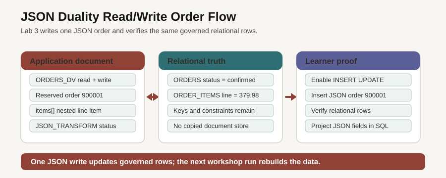
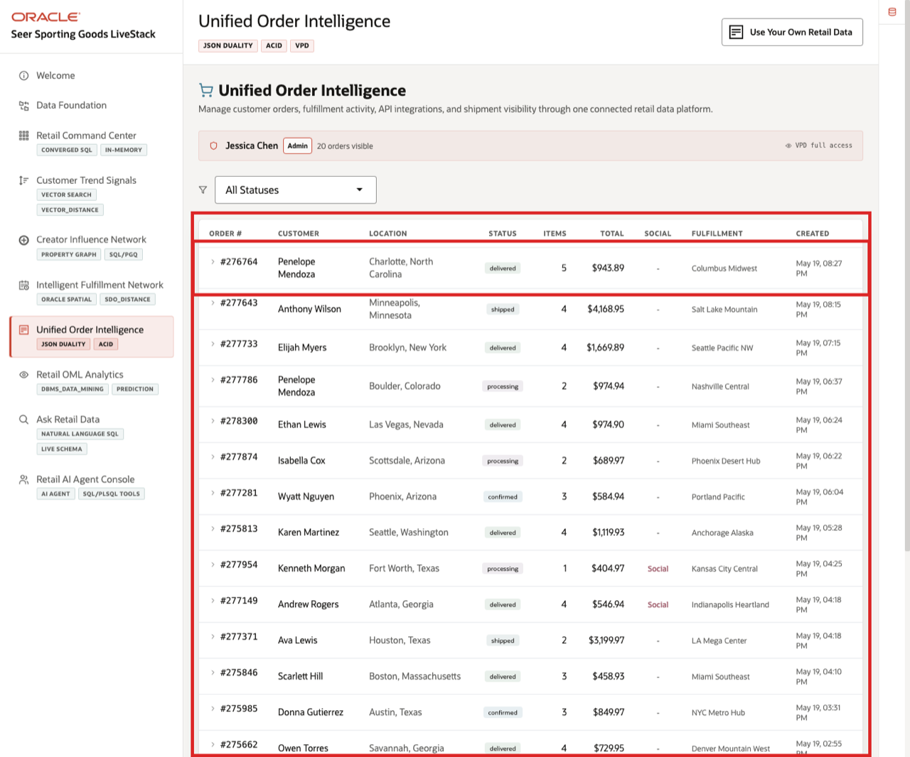

# Unified Order Intelligence with JSON Relational Duality

## Introduction

After you trace dashboard metrics to orders, the next question is how applications should use those orders. Application developers often prefer JSON because it matches the shape of an API response: one order can include customer fields, status, totals, and line items in a single document. That shape is convenient for application code, but it creates synchronization and governance work when JSON becomes a separate copy of the business record.

**JSON Relational Duality** in **Oracle AI Database 26ai** gives applications document-shaped JSON while relational tables remain the governed source of truth. In this lab, you first read an order document. You then enable document inserts and updates, create and update a reserved test order through JSON, and verify the same changes in relational rows.

### Objectives

- Read application-friendly order documents from `ORDERS\_DV`.
- Enable insert and update operations for the order document and its line items.
- Create and update a JSON order, then inspect the corresponding relational rows.
- Project JSON fields into SQL columns for investigation.

Estimated Time: **20 minutes**

### Business Scenario

| Step | Retail focus |
| --- | --- |
| Business Problem | Applications need order documents, while operations still need relational rows and SQL controls. |
| Technical Challenge | Developers need API-friendly JSON without copying orders into a separate document store. |
| Persona Focus | An application developer serves document payloads while the database developer preserves relational governance. |
| What You Will Do | Enable a writable document contract, create and update a test order through JSON, and verify relational evidence. |
| Database Capability | JSON Relational Duality exposes read and write access over the same relational order data. |
| Outcome | Application and analytics teams use one governed order record through the access shape each team needs. |

<details>
<summary><strong>Key terms: JSON Relational Duality, duality view, projection, and transaction</strong></summary>

> - **JSON Relational Duality** exposes relational data as JSON documents without copying it into a separate document database. The application gets the document shape developers want, while analysts retain SQL access to governed rows.
>
> - **Duality view**, often shortened to **DV**, maps relational tables and columns into a JSON document shape. In this lab, `ORDERS\_DV` maps one `ORDERS` row and its related `ORDER_ITEMS` rows into one order document.
>
> - **Projection** means returning selected JSON fields as ordinary SQL columns. `JSON_VALUE` lets analysts filter, sort, and join document fields with relational data.
>
> - **Transaction** is a logical unit of database work. `COMMIT` makes the test insert and update visible as part of the current workshop session. The workshop environment is deleted and rebuilt for each run, so the reserved test document does not carry into a future workshop.

</details>



*Figure 1: `ORDERS\_DV` presents order data as a JSON document while reads and permitted writes remain connected to relational order tables.*

## Task 1: Inspect a document-shaped order

Start by connecting the application order screen to the JSON document returned by Oracle Database.

1. Review the order application screen.

    

    *Figure 2: The application works with order detail as one business object. The SQL in this lab shows how Oracle Database exposes and updates that shape without creating a second order copy.*

2. Query order `1` from `ORDERS_DV`.

    > **SQL Worksheet reminder:** Need a reminder on how to open and use the SQL Worksheet? Return to [Getting Started Task 2: Open SQL Worksheet](https://oracle-livelabs.github.io/database/livestack-workshop-retail/workshops/tenancy/index.html?lab=getting-started#Task2:OpenSQLWorksheet) for the step-by-step graphic showing where to paste and run SQL statements.

    `JSON_SERIALIZE` displays the JSON document as readable text. The `_id`, customer, status, total, and nested `items` array look like document fields, but their values come from the relational `ORDERS` and `ORDER_ITEMS` tables.

    ```sql
    <copy>
    SELECT JSON_SERIALIZE(data RETURNING CLOB PRETTY) AS "Order Document"
    FROM orders_dv
    WHERE JSON_VALUE(data, '$._id' RETURNING NUMBER) = 1;
    </copy>
    ```

    **Expected output excerpt: Order Document**

    | Order Document |
    | --- |
    | `{"_id":1,"_metadata":{...},"customerId":1668,"status":"confirmed","total":1139.93,...}` |

3. Review the document shape.

    One query returns the order header and its line items together. An application can consume that API-friendly structure while SQL constraints, keys, and joins continue to govern the underlying rows.

## Task 2: Enable document inserts and updates

The loaded `ORDERS_DV` already permits updates to existing documents. In this task, you extend that contract so an application can also create a complete order document with nested line items.

1. Check the current document-write capabilities.

    `USER_JSON_DUALITY_VIEWS` reports which document operations the duality-view definition permits. Reading is inherent. The three flags show whether the view also accepts inserts, updates, or deletes.

    ```sql
    <copy>
    SELECT view_name AS "View Name",
           allow_insert AS "Allow Insert",
           allow_update AS "Allow Update",
           allow_delete AS "Allow Delete"
    FROM user_json_duality_views
    WHERE view_name = 'ORDERS_DV';
    </copy>
    ```

    **Expected output: Current Document Capabilities**

    | View Name | Allow Insert | Allow Update | Allow Delete |
    | --- | --- | --- | --- |
    | ORDERS\_DV | false | true | false |

    A fresh workshop begins with update access enabled. If you already completed this task, `Allow Insert` remains `true` because replacing a database view is a data definition language operation that commits automatically.

2. Enable insert and update operations for the order document and its line items.

    You are changing the duality-view contract, not creating another data store. The two `WITH INSERT UPDATE` clauses let Oracle Database map permitted JSON writes to the relational order and line-item tables while still enforcing their keys, data types, and constraints.

    ```sql
    <copy>
    CREATE OR REPLACE JSON RELATIONAL DUALITY VIEW orders_dv AS
    SELECT JSON {
        '_id'         : o.order_id,
        'customerId'  : o.customer_id,
        'status'      : o.order_status,
        'total'       : o.order_total,
        'shippingCost': o.shipping_cost,
        'demandScore' : o.demand_score,
        'createdAt'   : o.created_at,
        'items' : [
            SELECT JSON {
                'itemId'    : oi.item_id,
                'productId' : oi.product_id,
                'quantity'  : oi.quantity,
                'unitPrice' : oi.unit_price
            }
            FROM order_items oi WITH INSERT UPDATE
            WHERE oi.order_id = o.order_id
        ]
    }
    FROM orders o WITH INSERT UPDATE;
    </copy>
    ```

    **Expected output: View Definition Updated**

    Oracle confirms that view `ORDERS_DV` was created or replaced.

    Run the complete code block, including its final semicolon. Do not attempt the document insert until the next capability check shows `true`, `true`, and `false`. If Oracle reports an error while replacing the view, stop and capture the complete `ORA-` message rather than continuing to Task 3.

3. Run the capability query again.

    ```sql
    <copy>
    SELECT view_name AS "View Name",
           allow_insert AS "Allow Insert",
           allow_update AS "Allow Update",
           allow_delete AS "Allow Delete"
    FROM user_json_duality_views
    WHERE view_name = 'ORDERS_DV';
    </copy>
    ```

    **Expected output: Document Capabilities Enabled**

    | View Name | Allow Insert | Allow Update | Allow Delete |
    | --- | --- | --- | --- |
    | ORDERS\_DV | true | true | false |

    The application can now read, create, and update an order document. Delete remains disabled. The next task uses reserved workshop identifiers so you can test the contract without changing an existing customer order.

## Task 3: Create and update a JSON order

Now act as an application developer. You will create one nested JSON document, inspect the relational rows Oracle Database creates, and update the document status through the same duality view.

> **Workshop data boundary:** The statements in this task commit reserved order `900001` and item `990001` for the current workshop session. The workshop environment is deleted and rebuilt for each run, so these test rows are removed with the rest of the workshop schema before the next run.

1. Insert the reserved Retail order document.

    The document uses customer `1` and product `1`, `StormRunner Trail Shell`. One nested line item has quantity `2` at `189.99`, producing a relational line total of `379.98`.

    The `SELECT ... FROM dual` form generates one candidate JSON document without reading an application table: `DUAL` is Oracle's conventional one-row helper table. Keep `FROM dual` because the following `WHERE NOT EXISTS` check is evaluated for that one candidate row. It prevents a duplicate insert if you rerun the task after order `900001` has already been created in this workshop session.

    ```sql
    <copy>
    INSERT INTO orders_dv (data)
    SELECT JSON(
      '{
        "_id": 900001,
        "customerId": 1,
        "status": "pending",
        "total": 379.98,
        "shippingCost": 0,
        "items": [
          {
            "itemId": 990001,
            "productId": 1,
            "quantity": 2,
            "unitPrice": 189.99
          }
        ]
      }'
    )
    FROM dual
    WHERE NOT EXISTS (
      SELECT 1
      FROM orders
      WHERE order_id = 900001
    );

    </copy>
    ```

    **Expected output: Order Document Inserted**

    Oracle inserts one document. If the reserved order already exists in the current workshop schema, the `NOT EXISTS` check safely inserts zero rows.

2. Commit the insert as its own SQL Worksheet action.

    In Database Actions SQL Worksheet, highlight this command and run it explicitly. `COMMIT` makes the new order visible to subsequent statements and other worksheet connections.

    ```sql
    <copy>
    COMMIT;
    </copy>
    ```

    **Expected output: Commit Complete**

    Oracle reports `Commit complete.`

3. Verify that the JSON document created relational rows.

    ```sql
    <copy>
    SELECT o.order_id AS "Order",
           o.order_status AS "Status",
           c.email AS "Customer Email",
           oi.item_id AS "Item",
           p.product_name AS "Product",
           oi.quantity AS "Quantity",
           oi.unit_price AS "Unit Price",
           oi.line_total AS "Line Total"
    FROM orders o
    JOIN customers c
      ON c.customer_id = o.customer_id
    JOIN order_items oi
      ON oi.order_id = o.order_id
    JOIN products p
      ON p.product_id = oi.product_id
    WHERE o.order_id = 900001;
    </copy>
    ```

    **Expected output: Inserted Order Verified as Relational Rows**

    The committed JSON document now returns one relational order row and one related line item.

    | Order | Status | Customer Email | Item | Product | Quantity | Unit Price | Line Total |
    | ---: | --- | --- | ---: | --- | ---: | ---: | ---: |
    | 900001 | pending | mary.smith1@example.com | 990001 | StormRunner Trail Shell | 2 | 189.99 | 379.98 |

4. Update the document status through `ORDERS_DV`.

    `JSON_TRANSFORM` changes only the document's `status` field. Oracle Database maps that field to `ORDERS.ORDER_STATUS`; no application-side JSON parsing, second order copy, or synchronization job is required.

    ```sql
    <copy>
    UPDATE orders_dv
    SET data = JSON_TRANSFORM(data, SET '$.status' = 'confirmed')
    WHERE JSON_VALUE(data, '$._id' RETURNING NUMBER) = 900001;

    </copy>
    ```

    **Expected output: Order Status Updated**

    Oracle updates one document.

5. Commit the status update as its own SQL Worksheet action.

    Highlight and run this command explicitly before you verify the update.

    ```sql
    <copy>
    COMMIT;
    </copy>
    ```

    **Expected output: Commit Complete**

    Oracle reports `Commit complete.`

6. 🎯 **Interactive challenge: predict the relational change.**

    Before you run the next query, decide which relational column should now contain `confirmed`. Should the line-item quantity, unit price, or calculated line total change when the JSON update targets only `$.status`?

    <details>
    <summary><strong>Challenge answer: one document, one governed order</strong></summary>

    **Expected output: One Header Change, Stable Line Item**

    The relational order status changes. The line-item values remain `2`, `189.99`, and `379.98` because the JSON update did not change the nested `items` array.

    > `ORDERS.ORDER_STATUS` changes from `pending` to `confirmed`. The `ORDER_ITEMS` row remains unchanged. The application and the analyst are using two access shapes over the same live Retail data, so Oracle Database does not need to reconcile a document copy with a relational copy.

    ```sql
    <copy>
    SELECT o.order_id AS "Order",
           o.order_status AS "Status",
           oi.item_id AS "Item",
           p.product_name AS "Product",
           oi.quantity AS "Quantity",
           oi.line_total AS "Line Total"
    FROM orders o
    JOIN order_items oi
      ON oi.order_id = o.order_id
    JOIN products p
      ON p.product_id = oi.product_id
    WHERE o.order_id = 900001;
    </copy>
    ```

    **Step 7 expected output: Updated Relational Order Rows**

    | Order | Status | Item | Product | Quantity | Line Total |
    | ---: | --- | ---: | --- | ---: | ---: |
    | 900001 | confirmed | 990001 | StormRunner Trail Shell | 2 | 379.98 |

    </details>

## Task 4: Project document fields into SQL columns

Now use SQL to project selected fields from the updated JSON document and join them to relational customer data.

1. Run the projection query.

    `JSON_VALUE` pulls the order ID, status, and customer ID out of the application-facing document. The customer ID then participates in a normal relational join to `CUSTOMERS`.

    ```sql
    <copy>
    SELECT JSON_VALUE(od.data, '$._id' RETURNING NUMBER) AS "Order",
           JSON_VALUE(od.data, '$.status') AS "Status",
           c.email AS "Customer Email"
    FROM orders_dv od
    JOIN customers c
      ON c.customer_id = JSON_VALUE(od.data, '$.customerId' RETURNING NUMBER)
    WHERE JSON_VALUE(od.data, '$._id' RETURNING NUMBER) = 900001;
    </copy>
    ```

    **Expected output: JSON Fields Projected as SQL**

    | Order | Status | Customer Email |
    | ---: | --- | --- |
    | 900001 | confirmed | mary.smith1@example.com |

2. Review the two access paths.

    The application can read and write the order as a document. An analyst can immediately return selected JSON fields as SQL columns and join them to relational customer, product, inventory, fulfillment, or shipment evidence. Both paths use the same governed database record. The reserved order remains available for the rest of this workshop session and is removed when the workshop environment is deleted and rebuilt.

## Next Steps

Congratulations on completing the JSON duality lab. You enabled a read/write document contract, created and updated a Retail order through JSON, inspected the matching relational rows, and projected document fields into SQL. For a deeper hands-on workshop focused on JSON in Oracle Database, open the [JSON Relational Duality LiveLabs workshop](https://livelabs.oracle.com/ords/r/dbpm/livelabs/view-workshop?clear=RR,180&wid=3797).

## Acknowledgements

* **Author** - Pat Shepherd, Senior Principal Database Product Manager
* **Last Updated By/Date** - Oracle Database Product Management, August 2026
