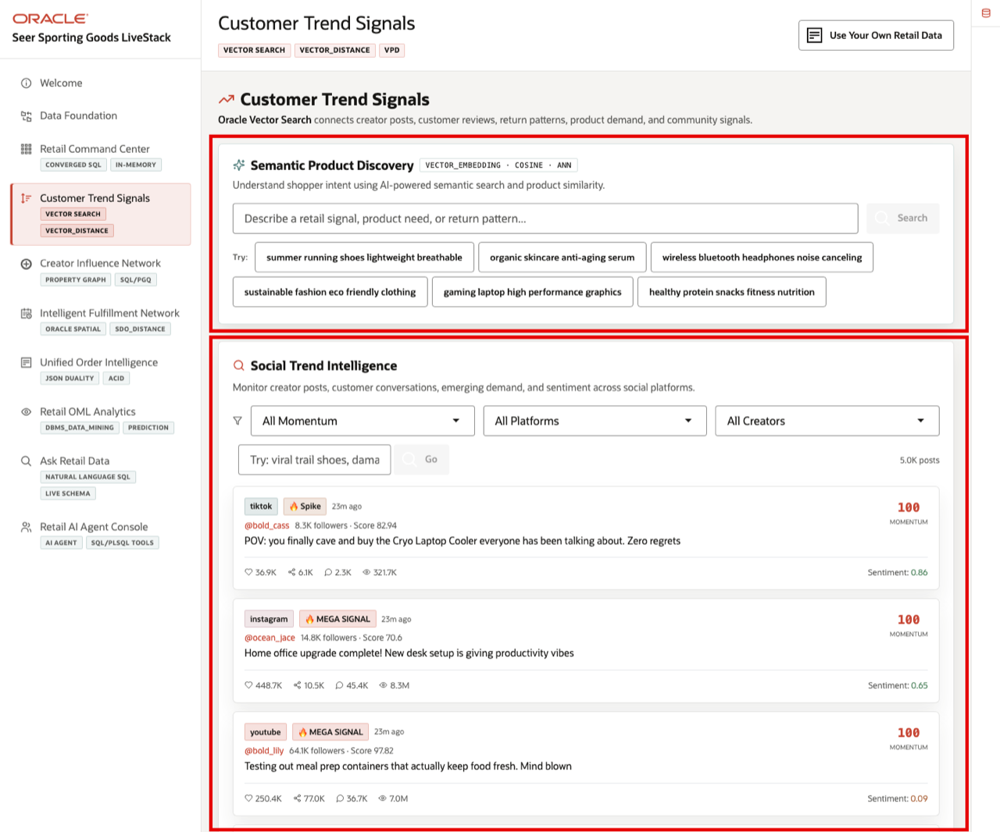

# Customer Trend Signals with AI Vector Search

## Introduction

**Customer Trend Signals** helps retail teams search by shopper intent instead of exact catalog terms. In this lab, you use Oracle AI Vector Search to create a fresh embedding from natural language, compare that vector to stored product vectors, and connect the same idea to social trend signals.

Oracle AI Database keeps vector search, SQL, security, and operational retail data together. The product catalog and creator posts are still relational retail data, but the database can also store embeddings in `VECTOR` columns and calculate semantic distance with SQL.

### Operating Story

| Step | Retail focus |
| --- | --- |
| Business Problem | Shoppers and creators describe products in natural language that rarely matches exact catalog terms. |
| What You Will Prove | A shopper phrase can match relevant products and social posts by meaning, not just keywords. |
| Database Capability | Oracle AI Vector Search stores embeddings and compares vectors with SQL distance functions. |
| Business Takeaway | Merchandising teams can detect demand and product fit from language signals while the evidence stays in the retail database. |
{: title="Customer Trend Signals Story"}

Estimated Time: **10 minutes**

### Objectives

- Review the MiniLM embedding model and the vector tables used by the retail application.
- Generate a fresh text embedding with `DBMS_VECTOR_CHAIN.UTL_TO_EMBEDDING`.
- Calculate cosine distance between a query vector and product vectors.
- Run semantic product search with `VECTOR_DISTANCE`.
- Connect semantic product matches to social posts, creators, and momentum.


## Task 1: Review Customer Trend Signals and vector artifacts

Perform the following set of steps to understand how natural language, product data, and social activity become searchable demand evidence.

1. Review the related application screen before you run the SQL.

    

    *Figure 1: Customer Trend Signals connects semantic product discovery with social trend intelligence.*

    The page shows two connected ideas. **Semantic Product Discovery** uses vector search to match natural language to catalog items. **Social Trend Intelligence** connects product demand to creator posts, platforms, and social momentum.

2. Understand why the workshop uses `ALL_MINILM_L12_V2`.

    The workshop seed loads Oracle's prebuilt, augmented ONNX version of Hugging Face's `all-MiniLM-L12-v2` model into the database as `ADMIN.ALL_MINILM_L12_V2`. Oracle provides this model in ONNX format so it can be loaded directly into Oracle AI Database and used for embedding generation without calling an external service.

    That makes it useful for demos and workshops. It is compact enough for quick hands-on labs, but still designed for sentence similarity and text classification scenarios. In this lab, you use it to turn natural language search phrases, product descriptions, and social post text into vectors that can be compared with SQL.

## Task 2: Create an embedding from natural language

Perform the following set of steps to see how Oracle AI Database turns natural language text into a vector embedding.

1. Generate a vector for a natural language phrase.

    Vector search starts by converting text into numbers. An embedding is a vector that captures the meaning of the text well enough that similar phrases end up close together in vector space. In this first step, you are not searching yet. You are just asking the database to show what it creates from one natural language phrase.

    `DBMS_VECTOR_CHAIN.UTL_TO_EMBEDDING` calls the embedding model stored in Oracle AI Database and returns a `VECTOR`. Here, the provider is `database` because the MiniLM ONNX model is already loaded in this workshop environment.

    `DUAL` is Oracle's built-in one-row table. In a demo like this, it acts like a temporary source row when you want to start with a literal value instead of data from an application table. Here it produces one row: the search phrase and its generated vector.

    ```sql
    <copy>
    SELECT 'summer running shoes lightweight breathable' AS "Search Text",
           DBMS_LOB.SUBSTR(
             VECTOR_SERIALIZE(
               DBMS_VECTOR_CHAIN.UTL_TO_EMBEDDING(
                 'summer running shoes lightweight breathable',
                 JSON('{"provider":"database","model":"ADMIN.ALL_MINILM_L12_V2"}')
               )
             ),
             80,
             1
           ) || ' ...' AS "Vector Preview"
    FROM dual;
    </copy>
    ```

    Expected output:

    | Search Text | Vector Preview |
    | --- | --- |
    | summer running shoes lightweight breathable | `[-2.49050539E-002,4.08752263E-002,-3.4535341E-002,-2.54850631E-004,7.1449 ...` |
    {: title="Generated Query Embedding"}

2. The preview is only the beginning of the vector. You do not interpret the individual numbers by eye. The important point is that the database generated a vector representation of the phrase, and the next tasks use `VECTOR_DISTANCE` to compare that vector with product vectors.


## Task 3: Calculate vector distance against known products

Perform the following set of steps to see how vector distance turns meaning into a ranked result.

1. Compare the query vector with a few known product vectors.

    `VECTOR_DISTANCE` calculates how far apart two vectors are. This lab uses cosine distance for text embeddings. Lower distance means the product vector is closer in meaning to the natural language phrase.

    The `CROSS JOIN` attaches one generated query vector to the product rows being compared. The inner `SELECT ... FROM dual` creates that single query-vector row from a natural language phrase at runtime.

    ```sql
    <copy>
    -- Pick a small set of known products so the distance calculation is easy to inspect.
    WITH candidates AS (
      SELECT p.product_id,
             p.product_name,
             p.category,
             pe.embedding
      FROM products p
      JOIN product_embeddings pe ON pe.product_id = p.product_id
      WHERE pe.embedding_model = 'ALL_MINILM_L12_V2'
        AND p.product_id IN (37, 39, 46, 132, 181)
    )
    SELECT c.product_name AS "Product",
           c.category AS "Category",
           -- Lower cosine distance means the product is closer in meaning to the phrase.
           ROUND(VECTOR_DISTANCE(c.embedding, q.query_vector, COSINE), 4) AS "Cosine Distance"
    FROM candidates c

    -- Create one query vector from the natural language phrase.
    CROSS JOIN (
      SELECT 'summer running shoes lightweight breathable' AS search_text,
             DBMS_VECTOR_CHAIN.UTL_TO_EMBEDDING(
               'summer running shoes lightweight breathable',
               JSON('{"provider":"database","model":"ADMIN.ALL_MINILM_L12_V2"}')
             ) AS query_vector
      FROM dual
    ) q

    -- Rank the known products from closest meaning to farthest meaning.
    ORDER BY VECTOR_DISTANCE(c.embedding, q.query_vector, COSINE), c.product_id;
    </copy>
    ```

    Expected output:

    | Product | Category | Cosine Distance |
    | --- | --- | ---: |
    | AirGlide Runner | Footwear | 0.3825 |
    | Marathon Elite Racer | Footwear | 0.4049 |
    | Barefoot Minimalist Shoe | Footwear | 0.4187 |
    | AllTerrain Hiking Boots | Outdoor | 0.5394 |
    | ThermoFlask 32oz | Outdoor | 0.6999 |
    {: title="Product Vector Distances"}

2. The first three results are all running or shoe products, even though the search phrase did not use the exact product names. That is the key learning point: vector search compares meaning, not just matching words.


## Task 4: Search products by meaning

Perform the following set of steps to turn the distance calculation into a semantic product search.

1. Search the full product embedding table.

    In this step, you turn a normal search phrase into a vector, which is a numeric representation of the phrase's meaning. Then you compare that search vector to the product vectors already stored in the database and return the closest matches.

    `DBMS_VECTOR_CHAIN.UTL_TO_EMBEDDING` converts the text you type, such as a shopper's search phrase, into a vector using the MiniLM embedding model. `VECTOR_DISTANCE` compares that new search vector to each stored product vector. A smaller distance means the product is more semantically similar to the search phrase.

    The query sorts by distance so the best matches appear first, even when the product description does not contain the exact same words as the search phrase.

    ```sql
    <copy>
    WITH search_vector AS (
      SELECT DBMS_VECTOR_CHAIN.UTL_TO_EMBEDDING(
               'comfortable shoes for walking all day',
               JSON('{"provider":"database", "model":"ADMIN.ALL_MINILM_L12_V2"}')
             ) AS query_vector
      FROM dual
    )
    SELECT p.product_name AS "Product",
           p.category AS "Category",
           ROUND(VECTOR_DISTANCE(pe.embedding, sv.query_vector, COSINE), 4) AS "Distance"
    FROM products p
    JOIN product_embeddings pe
      ON pe.product_id = p.product_id,
    search_vector sv
    WHERE pe.embedding_model = 'ALL_MINILM_L12_V2'
    ORDER BY "Distance",
             p.product_name
    FETCH FIRST 5 ROWS ONLY;
    </copy>
    ```

    Expected output:

    | Product | Category | Distance |
    | --- | --- | ---: |
    | Barefoot Minimalist Shoe | Footwear | 0.5258 |
    | SlipStream Slide | Footwear | 0.5599 |
    | StreetFlex Sneaker | Footwear | 0.5913 |
    | Cyber Mesh Sneakers | Footwear | 0.5919 |
    | WinterGrip Boot | Footwear | 0.6086 |
    {: title="Semantic Product Search"}

2. Try a different natural language phrase with the same pattern.

    This version changes the text to `sustainable fashion eco friendly clothing`, one of the other natural language search phrases shown in the application. The same vector-search pattern still works because the database generates a new query vector at runtime.

    Some catalog display names appear more than once. This version groups by product name and category and keeps the smallest distance for each displayed product, so the learner sees one clean row per product.

    ```sql
    <copy>
    WITH search_vector AS (
      SELECT DBMS_VECTOR_CHAIN.UTL_TO_EMBEDDING(
               'sustainable fashion eco friendly clothing',
               JSON('{"provider":"database", "model":"ADMIN.ALL_MINILM_L12_V2"}')
             ) AS query_vector
      FROM dual
    )
    SELECT p.product_name AS "Product",
           p.category AS "Category",
           ROUND(MIN(VECTOR_DISTANCE(pe.embedding, sv.query_vector, COSINE)), 4) AS "Distance"
    FROM products p
    JOIN product_embeddings pe
      ON pe.product_id = p.product_id,
    search_vector sv
    WHERE pe.embedding_model = 'ALL_MINILM_L12_V2'
    GROUP BY p.product_name,
             p.category
    ORDER BY "Distance",
             p.product_name
    FETCH FIRST 5 ROWS ONLY;
    </copy>
    ```

    Expected output:

    | Product | Category | Distance |
    | --- | --- | ---: |
    | RidgeLine Fleece Hoodie | Athletic Apparel | 0.6023 |
    | StormRunner Trail Shell | Athletic Apparel | 0.6142 |
    | Summit Graphic Training Tee | Athletic Apparel | 0.6288 |
    | Stadium Travel Blanket | Outdoor Lifestyle | 0.6365 |
    | Ultralight Rain Jacket | Outdoor | 0.6441 |
    {: title="Alternate Semantic Product Search"}

3. These rankings become useful merchandising evidence. A retail user can start with natural language, find nearby products, and then connect those products to inventory, orders, promotions, or social demand.


## Task 5: Inspect social trend matches

Perform the following set of steps to see which posts, creators, platforms, and products may deserve merchandising, inventory, or campaign follow-up.

1. Use the **Social Trend Intelligence** region in **Figure 1** before you run the SQL.

2. Read the matching pattern.

    The workshop seed already stores product and social post embeddings. To do this with your own data later, use the same four-part pattern:

    | Part | What it does in this query |
    | --- | --- |
    | Start with source rows | `SOCIAL_POSTS` provides the post, platform, and momentum context. |
    | Join to source vectors | `POST_EMBEDDINGS` provides the vector for each social post. |
    | Compare to candidate vectors | `PRODUCT_EMBEDDINGS` provides product vectors to compare against. |
    | Score and sort | `1 - VECTOR_DISTANCE(...)` turns distance into a similarity score, then the query sorts highest score first. |
    {: title="Vector Match Pattern"}

3. Run this query.

    The `SELECT` list returns two kinds of information. `Momentum`, `Platform`, `Creator`, and `Product` are business context columns that make the result readable. `Score` is the vector calculation. `VECTOR_DISTANCE` returns a distance where lower is closer, so the query uses `1 - VECTOR_DISTANCE(...)` to display it as a similarity score where higher is better.

    ```sql
    <copy>
    SELECT sp.momentum_flag AS "Momentum",
           sp.platform AS "Platform",
           NVL(i.handle, 'customer') AS "Creator",
           p.product_name AS "Product",
           ROUND(1 - VECTOR_DISTANCE(post_vec.embedding, prod_vec.embedding, COSINE), 5) AS "Score"
    FROM social_posts sp

    -- Get the vector for each social post.
    JOIN post_embeddings post_vec
      ON post_vec.post_id = sp.post_id
     AND post_vec.embedding_model = 'ALL_MINILM_L12_V2'

    -- Add human-readable context for the result.
    LEFT JOIN influencers i ON i.influencer_id = sp.influencer_id

    -- Compare each selected post vector with product vectors.
    CROSS JOIN product_embeddings prod_vec
    JOIN products p ON p.product_id = prod_vec.product_id

    WHERE prod_vec.embedding_model = 'ALL_MINILM_L12_V2'
      AND sp.momentum_flag IN ('viral', 'mega_viral')
    ORDER BY "Score" DESC,
             p.product_name,
             sp.post_id,
             p.product_id
    FETCH FIRST 10 ROWS ONLY;
    </copy>
    ```

    Expected output:

    | Momentum | Platform | Creator | Product | Score |
    | --- | --- | --- | --- | ---: |
    | viral | tiktok | `@summit_ruby_470` | Matcha Endurance Starter Kit | 0.83282 |
    | mega_viral | instagram | `@trail_maya_384` | Matcha Endurance Starter Kit | 0.83282 |
    | viral | tiktok | `@summit_ruby_470` | Matcha Endurance Starter Kit | 0.82424 |
    | mega_viral | instagram | `@trail_maya_384` | Matcha Endurance Starter Kit | 0.82424 |
    | viral | tiktok | `@route_gus_182` | Climbing Harness Pro | 0.82108 |
    | viral | tiktok | `@summit_ruby_470` | Matcha Endurance Starter Kit | 0.82011 |
    | mega_viral | instagram | `@trail_maya_384` | Matcha Endurance Starter Kit | 0.82011 |
    | mega_viral | tiktok | `@climb_lily_390` | ThermoFlask 32oz | 0.81822 |
    | mega_viral | tiktok | `@terrain_ruby_315` | ThermoFlask 32oz | 0.81822 |
    | viral | tiktok | `@summit_alex_260` | Adaptogen Recovery Powder | 0.80741 |
    {: title="Social Product Matches"}

4. Interpret the result.

    These rows came back because the text in viral or mega-viral social posts is semantically close to the product embedding. For example, several high-scoring posts match **Matcha Endurance Starter Kit**, which suggests that multiple creator conversations are using language close to that product's description. The query did not look for exact product names. It compared vectors, so it can find related demand signals even when the post uses different words.

    A business user would care because the result connects social momentum to products the retailer can act on. Merchandising teams can decide which products to feature, marketing teams can see which creators or platforms are driving relevant conversation, and inventory teams can watch products that may need replenishment if social demand keeps building. The database keeps the social signal, product catalog, embeddings, and SQL analysis together, so the result is explainable and tied back to operational data.


## More AI Vector Search labs

This lab is meant to give you a sample of the power of Oracle AI Database's vector capabilities in a retail scenario. For more information and hands-on labs, go to the full [Exploring AI Vector Search LiveLab](https://livelabs.oracle.com/ords/r/dbpm/livelabs/view-workshop?clear=RR,180&wid=4166&session=116494046566967). You can also learn more in the [Oracle AI Vector Search User's Guide](https://docs.oracle.com/en/database/oracle/oracle-database/26/vecse/).

## Acknowledgements

* **Author** - Pat Shepherd, Senior Principal Database Product Manager
* **Contributor** - Linda Foinding, Principal Database Product Manager
* **Last Updated By/Date** - Oracle Database Product Management, May 2026
