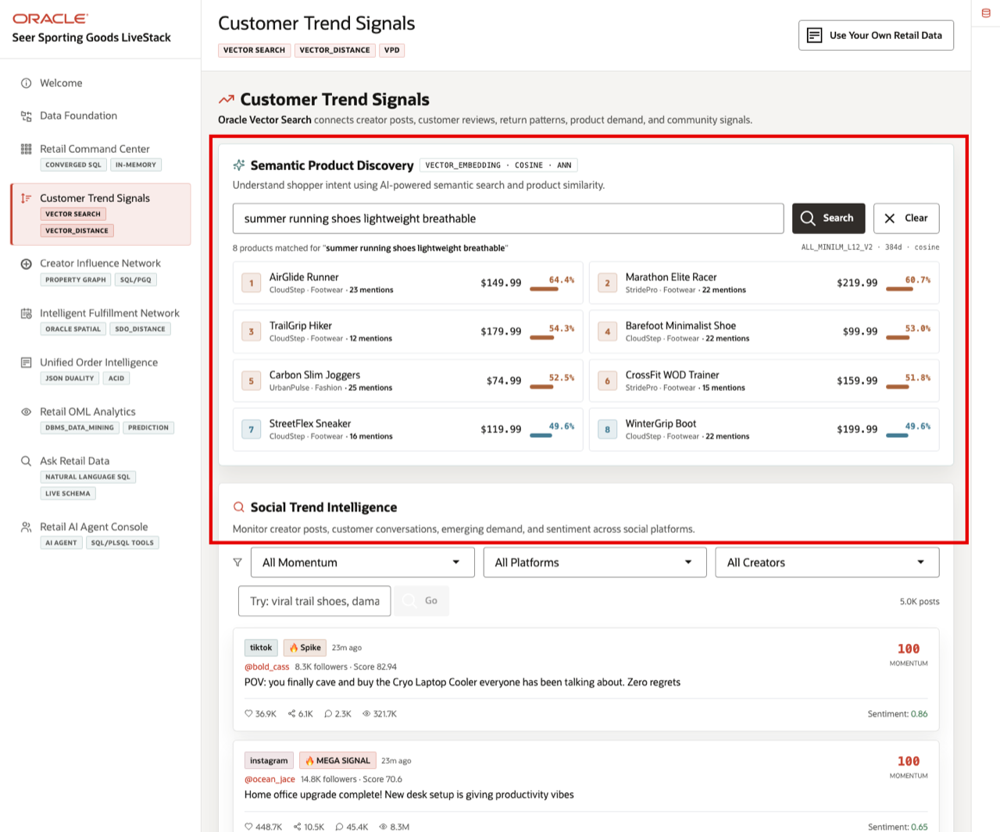

# Customer Trend Signals with AI Vector Search

## Introduction

**Customer Trend Signals** helps retail teams search by shopper intent instead of exact catalog terms. In this lab, learners generate embeddings, search products by meaning, and connect social trend matches to merchandising and demand-sensing decisions.

Oracle AI Database keeps vector search, SQL, row-level security, and operational retail data together. The LiveStack application connects product language, creator posts, reviews, returns, demand, and community signals. In SQL Worksheet, you verify the prebuilt vector artifacts, safely refresh product embeddings, and run dynamic semantic search against database-managed product vectors.

Estimated Time: **10 minutes**

### Objectives

- Connect Semantic Product Discovery to product embeddings stored in Oracle Database.
- Verify and safely refresh product embeddings with the MiniLM embedding model.
- Run dynamic semantic search with `VECTOR_EMBEDDING` and `VECTOR_DISTANCE`.
- Connect Social Trend Intelligence to cached creator-post and product matches.
- Explain how shopper language, social momentum, sentiment, and product demand become governed SQL evidence.


## Task 1: Review Customer Trend Signals

Perform the following set of steps to understand how shopper language, product data, and social activity become searchable demand evidence.

1. Review the related application screen before you run the SQL.

    

    *Figure 1: Customer Trend Signals connects semantic product discovery with social trend intelligence.*

    

    *Figure 2: The runbook calls out prebuilt product vectors, post vectors, semantic matches, and VPD-governed vector search.*

    The page shows two connected ideas.

    - **Semantic Product Discovery** uses vector search to match shopper language to catalog items.

    - **Social Trend Intelligence** connects product demand to creator posts, platforms, and social momentum. The compact loader now prepares the product vectors, post vectors, and semantic matches that the application uses. In the next task, you inspect and safely refresh the product embeddings so you understand how the semantic search portion works.

## Task 2: Verify and refresh product embeddings

Perform the following set of steps to allow products to be compared by meaning, not only by exact words in the catalog.

1. Use the live **Customer Trend Signals** context from **Figure 1** before you run the SQL.

2. Verify and refresh the product embeddings.

    An embedding is a list of numbers that represents meaning. Products with similar language produce vectors that are close to each other. This block uses `MERGE` to refresh `PRODUCT_EMBEDDINGS` from active products without dropping the table or leaving the application without vectors. It uses product name, category, subcategory, and tags as the source text. The `EMBED_RETAIL_TEXT` helper calls Oracle Database `VECTOR_EMBEDDING` with the MiniLM model, stores one vector per product, and confirms the row count.

    ```sql
    <copy>
    MERGE INTO product_embeddings pe
    USING (
      SELECT p.product_id,
             'ALL_MINILM_L12_V2' AS embedding_model,
             TO_CLOB(
               p.product_name || ' ' ||
               p.category || ' ' ||
               NVL(p.subcategory, '') || ' ' ||
               NVL(p.tags, '')
             ) AS embedding_text,
             embed_retail_text(
               p.product_name || ' ' ||
               p.category || ' ' ||
               NVL(p.subcategory, '') || ' ' ||
               NVL(p.tags, '')
             ) AS embedding
      FROM products p
      WHERE p.is_active = 1
    ) src
    ON (pe.product_id = src.product_id AND pe.embedding_model = src.embedding_model)
    WHEN MATCHED THEN UPDATE SET
      pe.embedding_text = src.embedding_text,
      pe.embedding = src.embedding,
      pe.created_at = SYSTIMESTAMP
    WHEN NOT MATCHED THEN INSERT (
      product_id,
      embedding_model,
      embedding_text,
      embedding
    ) VALUES (
      src.product_id,
      src.embedding_model,
      src.embedding_text,
      src.embedding
    );

    COMMIT;

    SELECT COUNT(*) AS "Product Embeddings"
    FROM product_embeddings
    WHERE embedding_model = 'ALL_MINILM_L12_V2';
    </copy>
    ```

    Expected output:

    | Product Embeddings |
    | ---: |
    | 187 |
    {: title="Product Embeddings"}

3. The product catalog now has vectors that the next query can compare with a shopper-style search phrase.

**Note:** These are sample values from the current workshop dataset and may change after a refresh, seed update, or schema rebuild. Treat these values as an example of the current workshop result. Verify the live output before presenting, then explain the business takeaway: what the values reveal about retail scale, demand, revenue, inventory, fulfillment, order governance, prediction, or agent activity.

## Task 3: Search products by meaning

Perform the following set of steps to show how a merchandising user can turn natural shopper language into relevant product matches.
1. Run this dynamic semantic search.

    Retail users often ask conceptual questions, such as "summer running shoes lightweight breathable." This block embeds that phrase at query time with `EMBED_RETAIL_TEXT`. It compares the query vector with the product vectors you generated. `VECTOR_DISTANCE` measures how far apart two vectors are; cosine distance is commonly used for text embeddings. Lower distance means the product is closer in meaning to the search phrase.

    ```sql
    <copy>
    WITH query_ctx AS (
      SELECT 'summer running shoes lightweight breathable' AS query_text,
             embed_retail_text('summer running shoes lightweight breathable') AS query_vector
      FROM dual
    )
    SELECT q.query_text AS "Search Phrase",
           p.product_name AS "Product",
           p.category AS "Category",
           ROUND(VECTOR_DISTANCE(pe.embedding, q.query_vector, COSINE), 4) AS "Distance"
    FROM product_embeddings pe
    JOIN products p ON p.product_id = pe.product_id
    CROSS JOIN query_ctx q
    WHERE pe.embedding_model = 'ALL_MINILM_L12_V2'
    ORDER BY VECTOR_DISTANCE(pe.embedding, q.query_vector, COSINE), p.product_id
    FETCH FIRST 5 ROWS ONLY;
    </copy>
    ```

    Expected output:

    | Search Phrase | Product | Category | Distance |
    | --- | --- | --- | ---: |
    | summer running shoes lightweight breathable | AirGlide Runner | Footwear | 0.3825 |
    | summer running shoes lightweight breathable | Marathon Elite Racer | Footwear | 0.4049 |
    | summer running shoes lightweight breathable | Barefoot Minimalist Shoe | Footwear | 0.4187 |
    | summer running shoes lightweight breathable | WinterGrip Boot | Footwear | 0.4545 |
    | summer running shoes lightweight breathable | StreetFlex Sneaker | Footwear | 0.473 |
    {: title="Semantic Search Results"}

2. Try a different shopper phrase.

    Change the search phrase in both places inside `query_ctx`: the displayed `query_text` value and the value passed into `embed_retail_text`. For example, replace `summer running shoes lightweight breathable` with `soft cotton shirts for travel`.

    ```sql
    <copy>
    WITH query_ctx AS (
      SELECT 'soft cotton shirts for travel' AS query_text,
             embed_retail_text('soft cotton shirts for travel') AS query_vector
      FROM dual
    )
    SELECT q.query_text AS "Search Phrase",
           p.product_name AS "Product",
           p.category AS "Category",
           ROUND(VECTOR_DISTANCE(pe.embedding, q.query_vector, COSINE), 4) AS "Distance"
    FROM product_embeddings pe
    JOIN products p ON p.product_id = pe.product_id
    CROSS JOIN query_ctx q
    WHERE pe.embedding_model = 'ALL_MINILM_L12_V2'
    ORDER BY VECTOR_DISTANCE(pe.embedding, q.query_vector, COSINE), p.product_id
    FETCH FIRST 5 ROWS ONLY;
    </copy>
    ```

3. The closest products show how shopper language becomes ranked product evidence for promotion, inventory, and trend analysis.

**Note:** These are sample values from the current workshop dataset and may change after a refresh, seed update, or schema rebuild. Treat these values as an example of the current workshop result. Verify the live output before presenting, then explain the business takeaway: what the values reveal about retail scale, demand, revenue, inventory, fulfillment, order governance, prediction, or agent activity.

## Task 4: Inspect social trend matches

Perform the following set of steps to see which posts, creators, platforms, and products may deserve merchandising, inventory, or campaign follow-up.

1. Use the **Social Trend Intelligence** region in **Figure 1** before you run the SQL.

2. Run this query.

    **Social Trend Intelligence** is the second half of the scene. It monitors creator posts, customer conversations, sentiment, and momentum. This block joins cached semantic matches to social posts, influencers, and products. The result explains which posts align to which products.

    ```sql
    <copy>
    SELECT sp.momentum_flag AS "Momentum",
           sp.platform AS "Platform",
           NVL(i.handle, 'customer') AS "Creator",
           p.product_name AS "Product",
           ROUND(sm.similarity_score, 5) AS "Score"
    FROM semantic_matches sm
    JOIN social_posts sp ON sp.post_id = sm.post_id
    LEFT JOIN influencers i ON i.influencer_id = sp.influencer_id
    JOIN products p ON p.product_id = sm.product_id
    ORDER BY ROUND(sm.similarity_score, 5) DESC,
             sm.match_rank,
             p.product_name,
             sm.post_id,
             sm.product_id
    FETCH FIRST 10 ROWS ONLY;
    </copy>
    ```

    Expected output:

    | Momentum | Platform | Creator | Product | Score |
    | --- | --- | --- | --- | ---: |
    | viral | tiktok | `@summit_ruby_470` | Matcha Endurance Starter Kit | 0.83282 |
    | mega_viral | instagram | `@trail_maya_384` | Matcha Endurance Starter Kit | 0.83282 |
    | viral | tiktok | `@summit_ruby_470` | Matcha Endurance Starter Kit | 0.82424 |
    | mega_viral | instagram | `@trail_maya_384` | Matcha Endurance Starter Kit | 0.82424 |
    | viral | tiktok | `@route_gus_182` | Climbing Harness Pro | 0.82108 |
    | viral | tiktok | `@summit_ruby_470` | Matcha Endurance Starter Kit | 0.82011 |
    | mega_viral | instagram | `@trail_maya_384` | Matcha Endurance Starter Kit | 0.82011 |
    | mega_viral | tiktok | `@climb_lily_390` | ThermoFlask 32oz | 0.81822 |
    | mega_viral | tiktok | `@terrain_ruby_315` | ThermoFlask 32oz | 0.81822 |
    | viral | tiktok | `@summit_alex_260` | Adaptogen Recovery Powder | 0.80741 |
    {: title="Social Product Matches"}

3. This result ties the page back to the runbook story. The application is not only searching a catalog. It connects demand to creator handles, platforms, momentum, and social posts. The next lab uses the creator network to show how those signals can spread through communities.

**Note:** These are sample values from the current workshop dataset and may change after a refresh, seed update, or schema rebuild. Treat these values as an example of the current workshop result. Verify the live output before presenting, then explain the business takeaway: what the values reveal about retail scale, demand, revenue, inventory, fulfillment, order governance, prediction, or agent activity.

## Acknowledgements

* **Author** - Pat Shepherd, Senior Principal Database Product Manager
* **Contributor** - Linda Foinding, Principal Database Product Manager
* **Last Updated By/Date** - Oracle Database Product Management, May 2026
