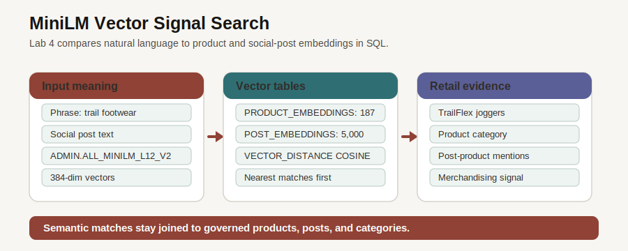

# Customer Trend Signals with AI Vector Search

## Introduction

After you inspect orders, you need to understand the demand language around them. Customers and creators rarely describe needs in the exact words used by a catalog. AI Vector Search helps teams compare meaning instead of only matching keywords. In this lab, you use the in-database MiniLM model and stored vectors to rank products and social signals.

### Objectives

- Confirm vector tables and embedding-model metadata.
- Search product vectors with a natural-language phrase.
- Join signal vectors back to posts, creators, and products.

Estimated Time: **10 minutes**

### Business Scenario

| Step | Retail focus |
| --- | --- |
| Business Problem | Search phrases and social posts often use language that does not match product names exactly. |
| Technical Challenge | External search indexes can separate meaning from governed product and signal rows. |
| Persona Focus | A merchandising analyst wants ranked matches they can trace back to products and posts. |
| Database Capability | Oracle AI Vector Search stores embeddings and compares them with SQL. |
| Outcome | Natural language demand can be connected to operational product evidence. |

<details>
<summary><strong>Key terms: vector search</strong></summary>

> - **Embedding**: A numeric vector that captures the meaning of text.
> - **Vector distance**: A score that compares two embeddings. Lower cosine distance means a closer semantic match.
> - **In-database model**: The embedding model runs inside Oracle Database, keeping source text close to governed data.
> - **Post embedding table**: `POST_EMBEDDINGS` is not a separate product feature name. It is the table that stores one vector row for each social post in `SOCIAL_POSTS`.

</details>



*Figure 1: A phrase becomes an embedding, the embedding is compared to stored vectors, and the ranked result remains tied to product and signal rows.*

## Task 1: Confirm vector artifacts

1. Review the Customer Trend Signals page.

    

    *Figure 2: The page combines semantic product discovery with social signal context. The SQL below shows the database evidence behind that workflow.*

2. Run the vector inventory query.

    > **SQL Worksheet reminder:** Need a reminder on how to open and use the SQL Worksheet? Return to [Getting Started Task 2: Open SQL Worksheet](/workshops/sandbox/index.html?lab=getting-started#Task2:OpenSQLWorksheet) for the step-by-step graphic showing where to paste and run SQL statements.

    This query checks the vector-bearing tables and compares them to the source rows they represent. `PRODUCT_EMBEDDINGS` stores vectors generated from product catalog text. `POST_EMBEDDINGS` stores vectors generated from social post text in `SOCIAL_POSTS`.

    The result has two rows because it is a summary: one row for the product-vector table and one row for the social-post-vector table. The important numbers are the counts inside those rows. A healthy load should show one product embedding for each product and one post embedding for each social post.

    `LEFT JOIN` keeps the source products or posts visible even if an embedding row is missing. `NULLIF(..., 0)` prevents a divide-by-zero error if a source table is empty. Together, those choices make the query useful as a coverage check, not just a count report.

    `UNION ALL` is useful here because the two branches answer the same question for two different source tables. The first branch checks product coverage. The second branch checks social-post coverage by joining `SOCIAL_POSTS` to `POST_EMBEDDINGS`. `UNION ALL` keeps both checklist rows visible in one result.

    ```sql
    <copy>
    SELECT 'PRODUCT_EMBEDDINGS' AS "Vector Table",
           COUNT(pe.embedding_id) AS "Embeddings",
           COUNT(DISTINCT p.product_id) AS "Source Rows",
           ROUND(100 * COUNT(pe.embedding_id) / NULLIF(COUNT(DISTINCT p.product_id), 0), 1) AS "Coverage Pct"
    FROM products p
    LEFT JOIN product_embeddings pe
      ON pe.product_id = p.product_id
    UNION ALL
    SELECT 'POST_EMBEDDINGS',
           COUNT(pe.embedding_id),
           COUNT(DISTINCT sp.post_id),
           ROUND(100 * COUNT(pe.embedding_id) / NULLIF(COUNT(DISTINCT sp.post_id), 0), 1)
    FROM social_posts sp
    LEFT JOIN post_embeddings pe
      ON pe.post_id = sp.post_id
    ORDER BY "Vector Table";
    </copy>
    ```

    **Expected output: Vector Coverage Check**

    | Vector Table | Embeddings | Source Rows | Coverage Pct |
    | --- | ---: | ---: | ---: |
    | POST\_EMBEDDINGS | 5000 | 5000 | 100 |
    | PRODUCT\_EMBEDDINGS | 187 | 187 | 100 |

## Task 2: Search products by meaning

1. Run the semantic product search query.

    This task asks a retail search question in normal business language: which products are closest in meaning to `customer demand digital service product`?

    Read that phrase as a signal, not as a set of exact keywords:

    - `customer demand` points the search toward products that shoppers may want or talk about.
    - `digital service` points the search toward technology-supported retail experiences, such as coaching, training, audio, displays, or connected devices.
    - `product` tells the search to look for catalog items, not only social posts or abstract topics.

    A keyword search would look for those exact words in product names or descriptions. That would miss useful matches if the catalog uses different wording, such as microphone, tablet, earbuds, power bank, or display. AI Vector Search works differently. `VECTOR_EMBEDDING` turns the full phrase into a numeric representation of its meaning by using `ADMIN.ALL_MINILM_L12_V2`. `VECTOR_DISTANCE` then compares that query vector to each stored product vector. The closest rows appear first because lower cosine distance means a closer semantic match.

    Read the query in four parts:

    1. `JOIN` adds product names and categories to the stored vectors.
    2. `VECTOR_EMBEDDING(... USING ... AS DATA)` creates a vector from the search phrase inside Oracle Database.
    3. `MIN(VECTOR_DISTANCE(..., COSINE))` keeps the closest distance when more than one vector row can describe a product.
    4. `GROUP BY` returns one readable row per product and category.

    Some applications display `1 - VECTOR_DISTANCE(...)` as a higher-is-better similarity score. This lab keeps the raw distance so you can see the database distance calculation directly.

    ```sql
    <copy>
    SELECT p.product_name AS "Product",
           p.category AS "Category",
           ROUND(MIN(VECTOR_DISTANCE(
             pe.embedding,
             VECTOR_EMBEDDING(
               ADMIN.ALL_MINILM_L12_V2
               USING 'customer demand digital service product' AS DATA
             ),
             COSINE
           )), 4) AS "Best Distance"
    FROM product_embeddings pe
    JOIN products p
      ON p.product_id = pe.product_id
    GROUP BY p.product_name,
             p.category
    ORDER BY "Best Distance",
             "Product"
    FETCH FIRST 5 ROWS ONLY;
    </copy>
    ```

    **Expected output: Product Matches**

    | Product | Category | Best Distance |
    | --- | --- | ---: |
    | CoachMic USB Microphone | Training Audio | 0.6852 |
    | Expedition Power Bank | Sports Tech | 0.7042 |
    | CoachView Curved Display | Training Tech | 0.7327 |
    | DewPoint Hydration Spray | Outdoor Care | 0.7356 |
    | Smart Grill Thermometer | Camp Cooking | 0.7401 |

2. The result matters because the match is not limited to exact words. The database compares meaning, then returns normal SQL rows that can be joined to categories, orders, and inventory.

    The query groups by product and category so you see distinct product choices, then keeps the best semantic distance for each choice.

## Task 3: Connect social signals to product matches

1. Run the signal search query.

    This query compares a natural-language phrase to social signal embeddings. In this lab, a social signal embedding is a vector stored in `POST_EMBEDDINGS` for a source row in `SOCIAL_POSTS`. The query then joins back to posts and product mentions, so the result includes product context instead of only a vector score.

    Read the query in three parts:

    1. `POST_EMBEDDINGS` supplies the stored vector for each social post in `SOCIAL_POSTS`.
    2. `POST_PRODUCT_MENTIONS` connects those posts to the products they mention, and `PRODUCTS` supplies the readable product name and category.
    3. `GROUP BY` keeps the output to one row per product, while `MIN(VECTOR_DISTANCE(...))` keeps the closest matching social-post signal.

    ```sql
    <copy>
    SELECT p.product_name AS "Product",
           p.category AS "Category",
           ROUND(MIN(VECTOR_DISTANCE(
             se.embedding,
             VECTOR_EMBEDDING(
               ADMIN.ALL_MINILM_L12_V2
               USING 'viral customer demand for trail running footwear' AS DATA
             ),
             COSINE
           )), 4) AS "Best Distance"
    FROM post_embeddings se
    JOIN social_posts sp
      ON sp.post_id = se.post_id
    JOIN post_product_mentions ppm
      ON ppm.post_id = sp.post_id
    JOIN products p
      ON p.product_id = ppm.product_id
    GROUP BY p.product_name,
             p.category
    ORDER BY "Best Distance",
             "Product"
    FETCH FIRST 5 ROWS ONLY;
    </copy>
    ```

    **Expected output: Signal Matches**

    | Product | Category | Best Distance |
    | --- | --- | ---: |
    | Marathon Elite Racer | Footwear | 0.347 |
    | Barefoot Minimalist Shoe | Footwear | 0.3488 |
    | Cyber Mesh Sneakers | Footwear | 0.3696 |
    | TrailFlex Training Joggers | Athletic Apparel | 0.3861 |
    | AllTerrain Hiking Boots | Outdoor | 0.3943 |

2. Vector search becomes useful when the score is tied back to governed product and signal rows. A merchandising or operations team can follow the match into orders, categories, creator activity, or fulfillment planning.

    Multiple rows in `POST_EMBEDDINGS` can point to social posts that mention the same product. Grouping keeps the result readable: one product row and the closest semantic distance from the social-post vectors.

    Next, you follow the creator relationships behind those signals to understand how campaign influence can move through a network.

## Acknowledgements

* **Author** - Pat Shepherd, Senior Principal Database Product Manager
* **Last Updated By/Date** - Oracle Database Product Management, July 2026
