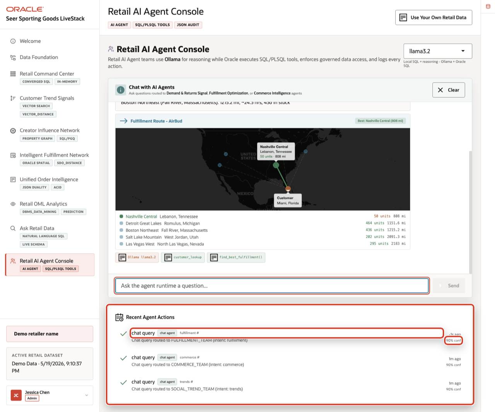

# Retail AI Agent Console

## Introduction

An AI agent answer is not enough if nobody can see what drove it. In retail, a useful agent needs trusted inventory, fulfillment, social signal, or product evidence. It also needs an audit trail, so a team can see what the agent proposed or did.

Oracle AI Database gives the agent a controlled action layer. The operational tables, SQL, PL/SQL tool functions, security policies, and audit rows stay in one database. The app can orchestrate the conversation, while important actions still run through controlled database APIs. In this lab, you inspect those APIs, call one directly, and verify the action history.

Estimated Time: 8 minutes

### Objectives

- Inspect the database functions that act as trusted tools for the retail agent.
- Call an inventory tool and see how the answer comes from governed operational data.
- Create and verify an agent audit row that captures action, entity type, status, and timing.
- Clean up the workshop test row when instructed.
- Explain how Oracle AI Database improves agent outcomes by grounding actions in data, policy, and observability.


## Task 1: Verify the agent tool functions
1. Review the related application screen before you run the SQL.

    

    *Figure 1: Retail AI Agent Console shows the runtime profile, example questions, database tool badges, and recent agent actions.*

    

    *Figure 2: Agent answers should expose route context, tool evidence, and audit history instead of behaving like black-box chat.*

2. Run this query.

    Start by checking the database tools the agent can use. A tool function is a controlled database API that the application or agent can call instead of generating unrestricted SQL. This block queries `ALL_OBJECTS` for the PL/SQL functions that form the agent tool contract. Each valid function represents a reviewed capability: trend detection, inventory lookup, fulfillment choice, network lookup, or decision logging.

    ```sql
    <copy>
    SELECT object_name AS "Tool", status AS "Status"
    FROM all_objects
    WHERE owner = SYS_CONTEXT('USERENV','CURRENT_SCHEMA')
      AND object_type = 'FUNCTION'
      AND object_name IN (
        'DETECT_TRENDING_PRODUCTS','CHECK_PRODUCT_INVENTORY',
        'FIND_BEST_FULFILLMENT','GET_INFLUENCER_NETWORK','LOG_AGENT_DECISION'
      )
    ORDER BY object_name;
    </copy>
    ```

    Expected output:

    | Tool | Status |
    | --- | --- |
    | `CHECK_PRODUCT_INVENTORY` | VALID |
    | `DETECT_TRENDING_PRODUCTS` | VALID |
    | `FIND_BEST_FULFILLMENT` | VALID |
    | `GET_INFLUENCER_NETWORK` | VALID |
    | `LOG_AGENT_DECISION` | VALID |
    {: title="Agent Tool Functions"}

3. These functions form the agent tool contract: the app can ask questions in natural language while the answers still come from reviewed database logic.

## Task 2: Call an inventory tool
1. Use the live Retail AI Agent Console context from Figure 1 before you run the SQL.

2. Call one inventory tool with a current Seer Sporting Goods product name.

    This step shows the bridge between a user question and a trusted database action. The query selects from `DUAL` because the function returns one answer, not a set of rows. `CHECK_PRODUCT_INVENTORY` reads current inventory records, formats the evidence, and returns a controlled response. That pattern grounds agent answers in data the business already governs.

    ```sql
    <copy>
    SELECT SUBSTR(check_product_inventory('AllTerrain Hiking Boots'), 1, 500) AS "Inventory"
    FROM dual;
    </copy>
    ```

    Expected output:

    | Inventory |
    | --- |
    | Inventory for "AllTerrain Hiking Boots" across 12 centers (3183 total units): Honolulu Pacific (Kapolei, Hawaii): 434 on hand, 10 reserved [OK]... |
    {: title="Inventory Tool Result"}

3. The same pattern can run behind the application. A user sees an agent answer. Oracle AI Database supplies the governed inventory evidence behind it.

## Task 3: Log and verify an audit action
1. Use the live Retail AI Agent Console context from Figure 1 before you run the SQL.

2. Run this controlled audit call.

    Enterprise agent workflows need durable observability. This block calls a database logging function that inserts an audit row for the agent action. The database captures who the agent is, what action it proposed or completed, which entity type it affected, when it ran, and what payload explains the decision. That record remains reviewable after the chat session ends.

    ```sql
    <copy>
    SELECT log_agent_decision(
             'workshop_validation_agent',
             'explain_retail_signal',
             'product',
             'Workshop test: verified database-grounded retail agent workflow.'
           ) AS "Result"
    FROM dual;
    </copy>
    ```

    Expected output:

    | Result |
    | --- |
    | Decision logged: `explain_retail_signal` by `workshop_validation_agent` |
    {: title="Agent Audit Insert"}

3. Verify the audit row.

    Logging only helps when someone can inspect the record afterward. This block uses two CTEs. `latest_row` looks for the most recent workshop validation action. `created_row` logs one only if none exists, which makes the step safe to rerun. The final query combines those possibilities and returns one row, showing that agent behavior becomes queryable data you can secure, report on, and review.

    ```sql
    <copy>
    WITH latest_row AS (
      SELECT agent_name,
             action_type,
             entity_type,
             execution_status,
             executed_at
      FROM agent_actions
      WHERE agent_name = 'workshop_validation_agent'
      ORDER BY executed_at DESC
      FETCH FIRST 1 ROW ONLY
    ),
    created_row AS (
      SELECT 'workshop_validation_agent' AS agent_name,
             'explain_retail_signal' AS action_type,
             'product' AS entity_type,
             'completed' AS execution_status,
             SYSTIMESTAMP AS executed_at,
             log_agent_decision(
               'workshop_validation_agent',
               'explain_retail_signal',
               'product',
               'Workshop test: verified database-grounded retail agent workflow.'
             ) AS log_result
      FROM dual
      WHERE NOT EXISTS (SELECT 1 FROM latest_row)
    )
    SELECT agent_name AS "Agent",
           action_type AS "Action",
           entity_type AS "Entity",
           execution_status AS "Status"
    FROM (
      SELECT agent_name,
             action_type,
             entity_type,
             execution_status,
             executed_at
      FROM latest_row
      UNION ALL
      SELECT agent_name,
             action_type,
             entity_type,
             execution_status,
             executed_at
      FROM created_row
      WHERE log_result IS NOT NULL
    )
    ORDER BY executed_at DESC
    FETCH FIRST 1 ROW ONLY;
    </copy>
    ```

    Expected output:

    | Agent | Action | Entity | Status |
    | --- | --- | --- | --- |
    | `workshop_validation_agent` | `explain_retail_signal` | product | completed |
    {: title="Latest Agent Action"}

4. The audit row makes the agent workflow observable. For production agents, this record supports debugging, approvals, compliance review, and improvement.

## Task 4: Clean up the validation row

1. Clean up the validation row if your instructor asks for a pristine audit table.

    The previous step intentionally added a workshop test row. This block deletes only the validation agent row and commits the change. In production, preserve real agent audit rows because they explain what the agent did, when it acted, and why the business can trust or challenge the outcome.

    ```sql
    <copy>
    DELETE FROM agent_actions
    WHERE agent_name = 'workshop_validation_agent';
    COMMIT;
    </copy>
    ```

    Expected output:

    | Check | Result |
    | --- | --- |
    | Agent audit cleanup | Rows deleted and committed. |
    {: title="Agent Audit Cleanup"}

2. The workshop test row is now gone. The larger lesson remains: better agent outcomes need more than model orchestration. They need database-grounded tools, governed data access, and durable action history.

## Acknowledgements

* **Author** - Pat Shepherd, Senior Principal Database Product Manager
* **Contributor** - Linda Foinding, Principal Database Product Manager
* **Last Updated By/Date** - Oracle Database Product Management, May 2026
