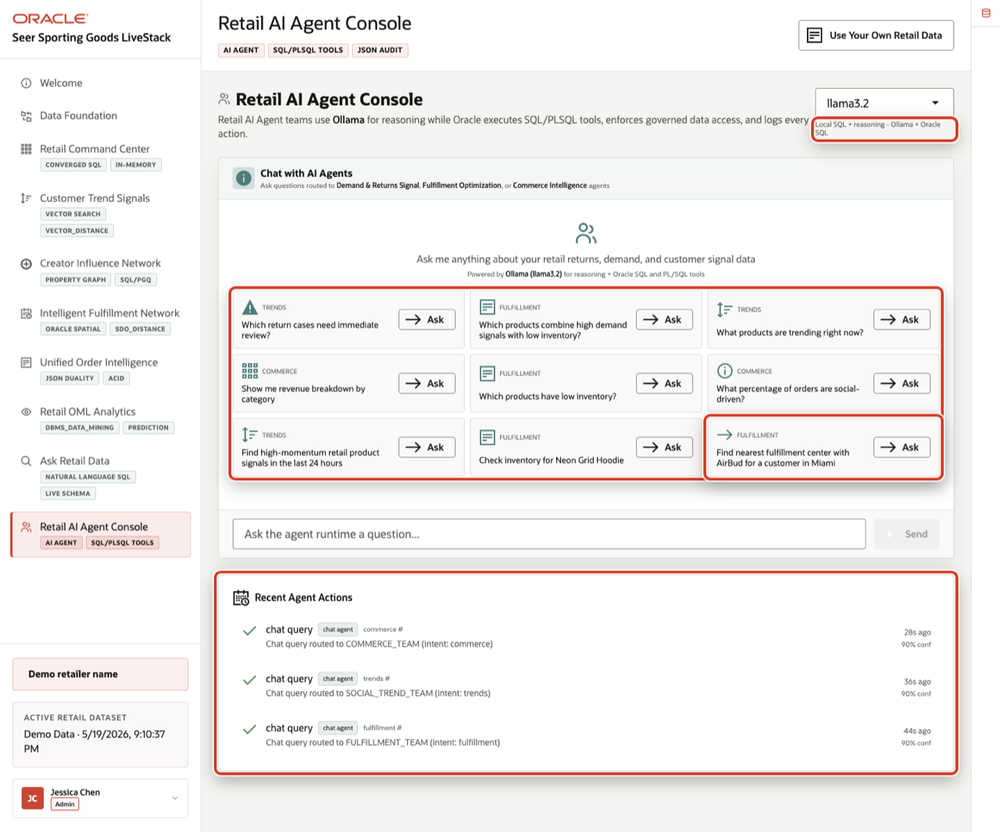

# Retail AI Agent Console: Trusted Agent Tools

## Introduction

Retail AI agents are valuable only when their answers and actions are grounded in trusted systems. This lab is about **trusted agent tools**. The learner takeaway is: *How does an AI agent safely use approved database tools, return grounded evidence, and leave an audit trail?*

This lab does not require a configured in-database agent framework. Instead, it teaches the database foundation that an agent should use: approved PL/SQL tool functions, governed operational data, and durable action history. Lab 8 focused on trusted answers; this lab focuses on trusted actions.

### Operating Story

| Step | Retail focus |
| --- | --- |
| Business Problem | AI agents can create risk if they answer from guesses, call unreviewed logic, or leave no record of what they did. |
| What You Will Prove | Agent-facing tools can be approved database functions, and agent activity can be inspected as durable database rows. |
| Database Capability | PL/SQL tool functions and `AGENT_ACTIONS` provide controlled actions and auditable history. |
| Outcome | Retail agents become enterprise-ready when actions are grounded, limited, and reviewable. |
{: title="Trusted Agent Tools Story"}

**Persona focus:** Business users want AI assistance they can trust. Application and database teams need agent actions to use approved tools, return grounded evidence, and leave durable history.

Estimated Time: **5 minutes**

### Objectives

- Inspect approved database functions that can act as agent tools.
- Call one inventory tool and verify that the answer comes from governed data.
- Inspect agent action history as the audit trail for agent workflows.


## Task 1: Verify approved agent tools

Perform the following set of steps to confirm that agent workflows can use reviewed database functions instead of unrestricted SQL.

1. Review the related application screen before you run SQL.

    

    *Figure 1: Retail AI Agent Console shows the runtime profile, example questions, database tool badges, and recent agent actions.*

2. Run this query.

    A tool function is a controlled database API that an application or agent can call. Each valid function represents a reviewed capability, such as inventory lookup, fulfillment choice, trend detection, network lookup, or decision logging.

    ```sql
    <copy>
    SELECT object_name AS "Tool",
           status AS "Status"
    FROM all_objects
    WHERE owner = SYS_CONTEXT('USERENV','CURRENT_SCHEMA')
      AND object_type = 'FUNCTION'
      AND object_name IN (
        'DETECT_TRENDING_PRODUCTS','CHECK_PRODUCT_INVENTORY',
        'FIND_BEST_FULFILLMENT','GET_INFLUENCER_NETWORK','LOG_AGENT_DECISION'
      )
    ORDER BY object_name;
    </copy>
    ```

    Expected output:

    | Tool | Status |
    | --- | --- |
    | `CHECK_PRODUCT_INVENTORY` | VALID |
    | `DETECT_TRENDING_PRODUCTS` | VALID |
    | `FIND_BEST_FULFILLMENT` | VALID |
    | `GET_INFLUENCER_NETWORK` | VALID |
    | `LOG_AGENT_DECISION` | VALID |
    {: title="Approved Agent Tools"}

3. These functions are the tool contract. The agent can ask for help, but the database controls the action.

## Task 2: Call a trusted inventory tool

Perform the following set of steps to call one approved tool directly.

1. Run this query.

    `CHECK_PRODUCT_INVENTORY` reads current inventory records and formats one response. You call the approved function directly, the same way an agent-facing application could call a reviewed database tool.

    ```sql
    <copy>
    SELECT SUBSTR(check_product_inventory('AllTerrain Hiking Boots'), 1, 500) AS "Inventory";
    </copy>
    ```

    Expected output:

    | Product | Inventory Summary |
    | --- | --- |
    | AllTerrain Hiking Boots | Inventory across 12 centers: 3183 total units. Honolulu Pacific has 434 on hand, Memphis Logistics has 386 on hand, Houston Gulf Coast has 289 on hand, and additional centers are listed in the tool response. |
    {: title="Inventory Tool Result"}

2. This is why database-backed tools matter. The agent-facing answer is grounded in operational inventory data, not a free-form guess.

## Task 3: Inspect the action history

Perform the following set of steps to see how agent workflows become reviewable data.

1. Run this query.

    Agent actions should not disappear when the chat ends. `AGENT_ACTIONS` stores action type, entity type, status, and timing so the business can inspect what happened later.

    ```sql
    <copy>
    SELECT agent_name AS "Agent",
           action_type AS "Action",
           entity_type AS "Entity",
           execution_status AS "Status"
    FROM agent_actions
    ORDER BY executed_at DESC
    FETCH FIRST 5 ROWS ONLY;
    </copy>
    ```

    Expected output:

    | Agent | Action | Entity | Status |
    | --- | --- | --- | --- |
    | `FULFILLMENT_OPTIMIZATION_AGENT` | `chat_query` | PRODUCT | completed |
    {: title="Agent Action History"}

2. The larger lesson is that enterprise agents need more than prompts. They need approved tools, governed data, and an audit trail that makes actions observable after the conversation ends.

## Learn More: In-Database Agents

This lab keeps the agent pattern intentionally small: approved PL/SQL tools, grounded evidence, and an action history that can be reviewed after the request completes.

For a deeper hands-on agentic workflow, including how database-managed agents use tasks and tools, continue with:

- [Build and run agentic workflows with Oracle Autonomous AI Database](https://livelabs.oracle.com/ords/r/dbpm/livelabs/view-workshop?wid=4229)
- [Build Your Agentic Solution using Oracle Autonomous AI Database Select AI Agent](https://blogs.oracle.com/machinelearning/build-your-agentic-solution-using-oracle-adb-select-ai-agent)
- [Announcing Oracle Select AI Pre-Built AI Agents](https://blogs.oracle.com/machinelearning/announcing-oracle-select-ai-pre-built-ai-agents)

## Acknowledgements

* **Author** - Pat Shepherd, Senior Principal Database Product Manager
* **Contributor** - Linda Foinding, Principal Database Product Manager
* **Last Updated By/Date** - Oracle Database Product Management, May 2026
