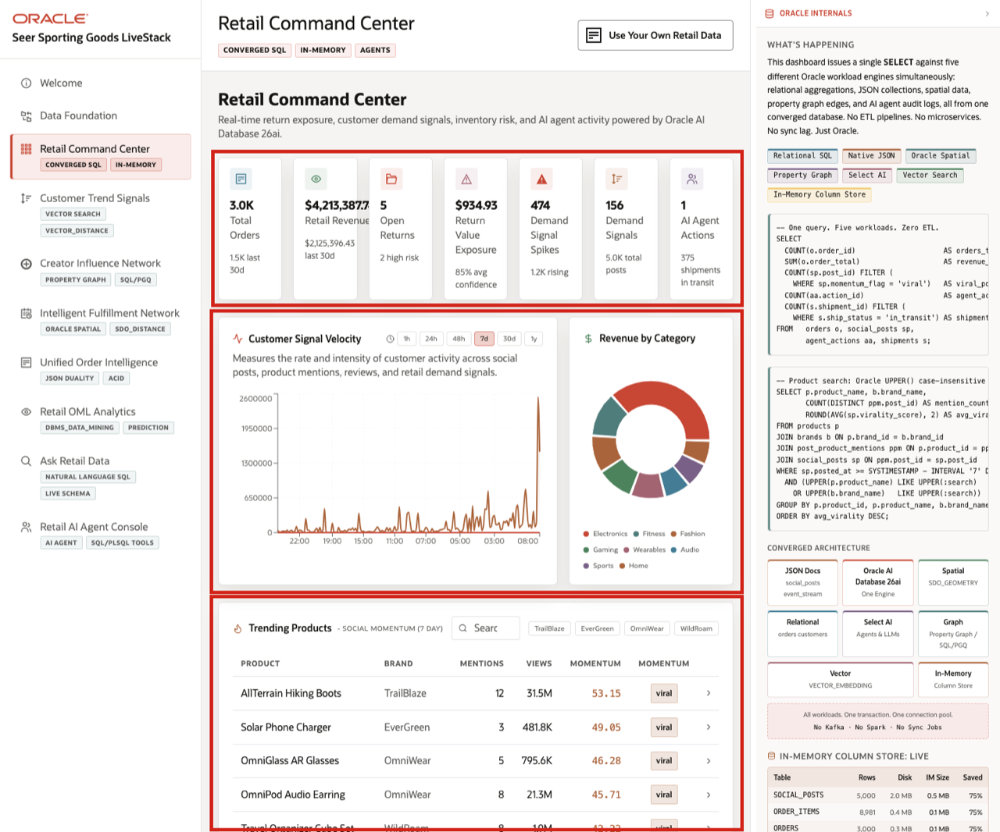
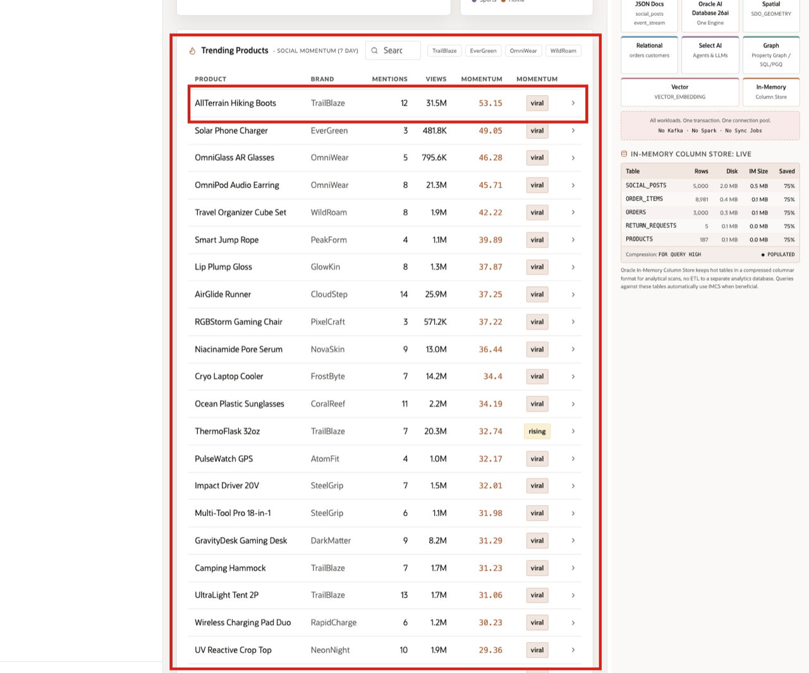
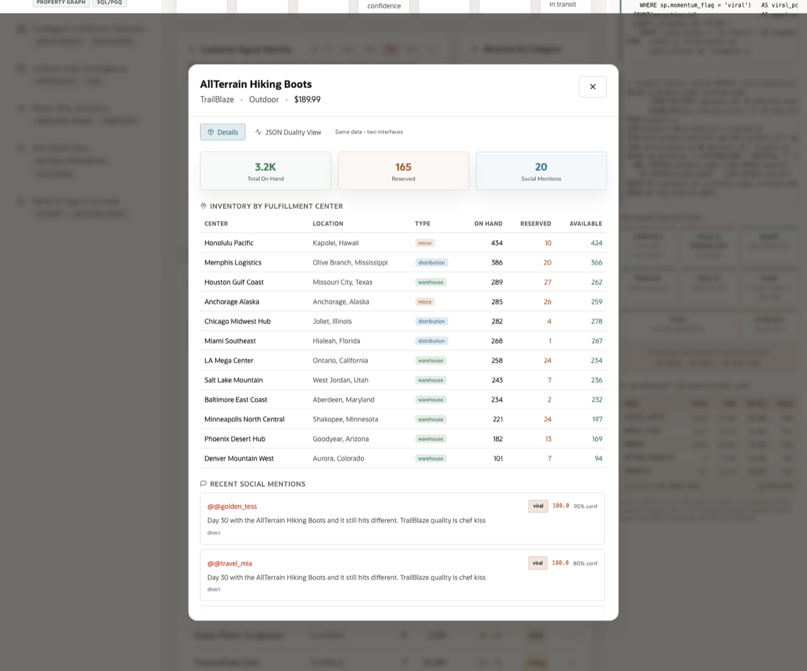
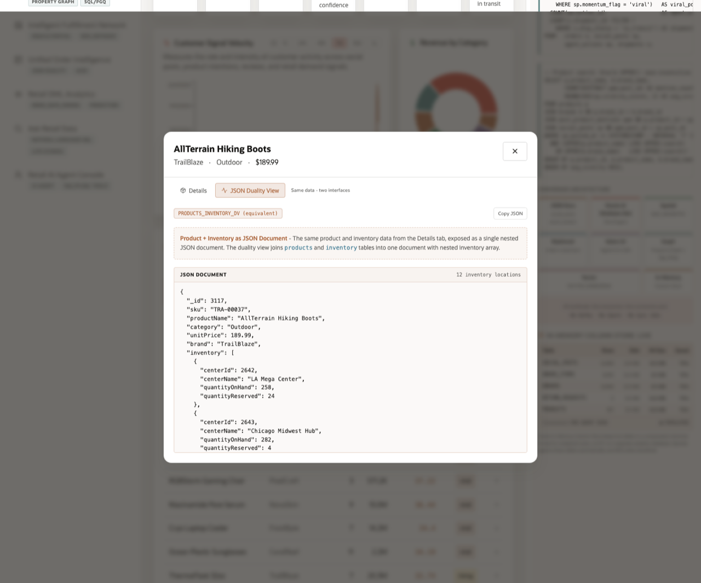

# Retail Command Center

## Introduction

**Retail Command Center** helps teams answer a daily operating question: *What needs attention right now, and what evidence supports that call?*

**Oracle AI Database** keeps operational, analytical, and AI-ready retail evidence close to the same schema. Frame this scene around the business user who needs one trusted view of revenue, demand signals, return exposure, and agent activity without stitching together separate systems.

The technical challenge is usually integration. A team can spend a lot of time moving data between specialized systems, writing pipelines, and reconciling results before a business user sees one dashboard. This lab shows the simpler pattern: use familiar SQL over one converged database foundation so the command center can combine different kinds of retail evidence without turning the application into an integration project.

### Operating Story

| Step | Retail focus |
| --- | --- |
| Business Problem | Seer Sporting Goods leaders need a daily triage view before demand spikes, returns, or inventory pressure become customer problems. |
| What You Will Prove | Dashboard metrics, trending products, product detail, and revenue categories can be traced back to governed database evidence. |
| Database Capability | SQL combines orders, order items, products, social posts, returns, inventory, and agent actions without moving data into a separate mart. |
| Outcome | The command center is not a static screen; it is a live operating picture the business can inspect and challenge. |
{: title="Retail Command Center Story"}

**Persona focus:** The operations leader wants one daily triage view. The application and database team needs to assemble that view without building fragile pipelines across separate systems for orders, returns, social demand, inventory, and agent activity.

Estimated Time: **10 minutes**

### Objectives

- Review dashboard KPIs as database-backed operating signals.
- Query trending products from social momentum and product data.
- Inspect revenue by category from orders and line items.
- Connect the command center to the downstream labs so learners see how one operating view expands into trend analysis, fulfillment choices, order intelligence, predictive analytics, trusted answers, and agent-assisted action.


## Task 1: Review dashboard operating metrics

Perform the following set of steps to connect command-center cards to the operational evidence behind daily retail triage, including revenue, demand spikes, return exposure, and agent activity.

1. Review the related application screen before you run the SQL.

    

    *Figure 1: Retail Command Center combines KPIs, customer signal velocity, revenue categories, and Oracle Internals.*

2. Run this KPI query.

    Use this query to connect each dashboard card to trusted operational data. Explain **scalar subqueries** as a practical way to return one business metric per card, such as orders, revenue, open returns, demand spikes, or agent actions.

    This block uses one scalar subquery per KPI. That works well for dashboard cards because each metric can come from the table that owns the evidence. Orders explain revenue, returns explain exposure, social posts explain demand spikes, and agent actions explain automation history.

    ```sql
    <copy>
    SELECT
      (SELECT COUNT(*) FROM orders) AS "Total Orders",
      (SELECT NVL(ROUND(SUM(order_total), 2), 0) FROM orders) AS "Retail Revenue",
      (SELECT COUNT(*) FROM return_requests WHERE status <> 'Closed') AS "Open Returns",
      (SELECT NVL(ROUND(SUM(return_value), 2), 0) FROM return_requests WHERE status <> 'Closed') AS "Return Exposure",
      (SELECT COUNT(*) FROM social_posts WHERE momentum_flag IN ('viral','mega_viral')) AS "Demand Spikes",
      (SELECT COUNT(*) FROM agent_actions) AS "Agent Actions";
    </copy>
    ```

    **Expected output:**

    | Total Orders | Retail Revenue | Open Returns | Return Exposure | Demand Spikes | Agent Actions |
    | ---: | ---: | ---: | ---: | ---: | ---: |
    | 3000 | 4213387.74 | 5 | 934.93 | 474 | 1 |
    {: title="Command Center KPIs"}

3. These metrics create the daily triage view. The user can see revenue, demand, return exposure, and agent activity without waiting for copied data or a separate dashboard mart.

**Note:** Sample values may change after data refreshes or rebuilds. Focus on the expected result pattern and the business takeaway, not the exact values.

## Task 2: Review trending products

Perform the following set of steps to identify where social momentum may point to a sales opportunity, inventory risk, merchandising action, or follow-up demand analysis.

1. Use the live **Retail Command Center** context from **Figure 1** before you run the SQL.

    

    *Figure 2: The runbook focuses the command center story on current Seer Sporting Goods product momentum.*

2. Run the database version of the command center trending-products query.

    Trending products sit at the intersection of merchandising, inventory, and social engagement. This block joins four related tables: products, brands, social posts, and the bridge table that records which posts mention which products. `COUNT(DISTINCT ...)` counts unique posts, `SUM` totals views, and `AVG` calculates average momentum. The date filter keeps the result focused on recent activity by comparing each post with the latest seeded post date.

    ```sql
    <copy>
    SELECT p.product_name AS "Product",
           b.brand_name AS "Brand",
           COUNT(DISTINCT ppm.post_id) AS "Mentions",
           SUM(sp.views_count) AS "Views",
           ROUND(AVG(sp.virality_score), 2) AS "Avg Momentum",
           MAX(sp.momentum_flag) AS "Peak Momentum"
    FROM products p
    JOIN brands b ON p.brand_id = b.brand_id
    JOIN post_product_mentions ppm ON p.product_id = ppm.product_id
    JOIN social_posts sp ON ppm.post_id = sp.post_id
    WHERE sp.posted_at >= (SELECT MAX(posted_at) FROM social_posts) - INTERVAL '7' DAY
    GROUP BY p.product_id, p.product_name, b.brand_name
    ORDER BY "Avg Momentum" DESC, "Views" DESC
    FETCH FIRST 10 ROWS ONLY;
    </copy>
    ```

    **Expected output:**

    | Product | Brand | Mentions | Views | Avg Momentum | Peak Momentum |
    | --- | --- | ---: | ---: | ---: | --- |
    | AllTerrain Hiking Boots | TrailBlaze | 12 | 31539321 | 53.15 | viral |
    | RaceDay Docking Hub | EverGreen | 3 | 481772 | 49.05 | viral |
    | RouteGuide AR Sport Glasses | OmniWear | 5 | 795617 | 46.28 | viral |
    | ClipCoach Audio Pod | OmniWear | 8 | 21264575 | 45.71 | viral |
    | Trail Organizer Cube Set | WildRoam | 8 | 1882282 | 42.22 | viral |
    | Smart Jump Rope | PeakForm | 4 | 1083691 | 39.89 | viral |
    | Vitamin Recovery Balm | GlowKin | 8 | 1309193 | 37.87 | viral |
    | AirGlide Runner | CloudStep | 14 | 25862011 | 37.25 | viral |
    | Recovery Command Chair | PixelCraft | 3 | 571187 | 37.22 | viral |
    | TrailGuard Anti-Chafe Balm | NovaSkin | 9 | 13039250 | 36.44 | viral |
    {: title="Trending Products"}

3. A high-ranking product may represent a sales opportunity, an inventory risk, a merchandising action, or a signal that deserves deeper analysis in the Customer Trend Signals lab.

**Note:** Sample values may change after data refreshes or rebuilds. Focus on the expected result pattern and the business takeaway, not the exact values.

## Task 3: Connect product detail screens to database evidence

Perform the following set of steps to show that a document-style product experience can still come from governed relational retail data.

1. Use the live **Retail Command Center** context from **Figure 1** as the visual anchor for product details and JSON Duality patterns.

    

    *Figure 3: Product detail connects the selected product to inventory and social evidence.*

    

    *Figure 4: The same product story can also be displayed as document-shaped JSON.*

    

    *Figure 3: Product detail connects the selected product to inventory and social evidence.*

    

    *Figure 4: The same product story can also be displayed as document-shaped JSON.*

 Product detail screens often look document-shaped because the business wants one compact product story: item, brand, category, inventory, demand, and signals in one place. Emphasize that the experience feels document-first, but the underlying evidence still comes from governed relational retail data.

## Task 4: Review revenue by category

Perform the following set of steps to review category revenue so learners can see where demand is converting into sales and where social-driven activity may be influencing performance.

1. Run the category revenue query.

    Category revenue shows where demand is turning into sales. This block joins order headers, order line items, and products. The line item table supplies quantity and price; the product table supplies category; the order table supplies date and social-source context. The `CASE WHEN` expression counts only orders with a social source, so the result compares total category revenue with orders influenced by social demand.

    ```sql
    <copy>
    SELECT p.category AS "Category",
           COUNT(DISTINCT o.order_id) AS "Orders",
           ROUND(SUM(oi.quantity * oi.unit_price), 2) AS "Revenue",
           COUNT(DISTINCT CASE WHEN o.social_source_id IS NOT NULL THEN o.order_id END) AS "Social-Driven Orders"
    FROM order_items oi
    JOIN products p ON oi.product_id = p.product_id
    JOIN orders o ON oi.order_id = o.order_id
    WHERE o.created_at >= (SELECT MAX(created_at) FROM orders) - INTERVAL '30' DAY
    GROUP BY p.category
    ORDER BY "Revenue" DESC;
    </copy>
    ```

    **Expected output:**

    | Category | Orders | Revenue | Social-Driven Orders |
    | --- | ---: | ---: | ---: |
    | Sports Tech | 545 | 676482.24 | 161 |
    | Fitness | 339 | 220292.71 | 89 |
    | Athletic Apparel | 417 | 181761.78 | 112 |
    | Training Tech | 261 | 178604.28 | 77 |
    | Sports Wearables | 163 | 168296.34 | 45 |
    | Training Audio | 253 | 124964.69 | 67 |
    | Sports | 38 | 118449.29 | 8 |
    | Outdoor Lifestyle | 375 | 113745.34 | 97 |
    | Outdoor | 263 | 107014.08 | 67 |
    | Footwear | 228 | 68850.03 | 63 |
    | Camp Cooking | 179 | 36016.14 | 43 |
    | Outdoor Care | 309 | 34006.78 | 86 |
    | Recovery | 187 | 32911.19 | 52 |
    | Sport Eyewear | 107 | 30358.33 | 31 |
    | Sports Nutrition | 243 | 19365.62 | 70 |
    | Outdoor Tools | 44 | 9639.19 | 15 |
    | Outdoor Travel | 76 | 4638.4 | 23 |
    {: title="Category Revenue"}

2. The command center shows why converged data matters. Operational orders, social demand signals, inventory context, and AI-assisted actions can start from one governed database foundation.

**Note:** Sample values may change after data refreshes or rebuilds. Focus on the expected result pattern and the business takeaway, not the exact values.

## Acknowledgements

* **Author** - Pat Shepherd, Senior Principal Database Product Manager
* **Contributor** - Linda Foinding, Principal Database Product Manager
* **Last Updated By/Date** - Oracle Database Product Management, May 2026
