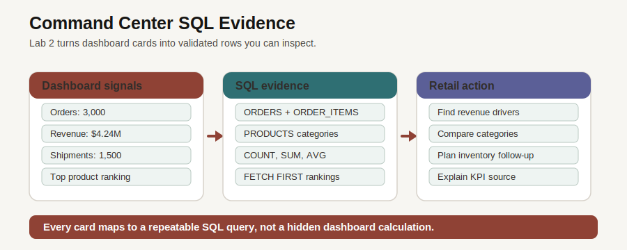

# Retail Command Center

## Introduction

With the retail foundation in place, the next decision is operational: what needs attention right now, and which database evidence supports that call? In this lab, you connect command-center metrics to orders, products, and categories so the dashboard becomes a starting point for investigation.

### Objectives

- Review operating KPIs as database-backed signals.
- Rank products by revenue and order-line activity.
- Review category revenue from order items.

Estimated Time: **10 minutes**

### Business Scenario

| Step | Retail focus |
| --- | --- |
| Business Problem | Leaders need one triage view before demand, revenue, or fulfillment pressure becomes a customer problem. |
| Technical Challenge | Dashboard cards often hide separate pipelines and reconciliation work. |
| Persona Focus | An operations leader wants metrics that can be challenged and explained with SQL. |
| Database Capability | SQL combines order, product, shipment, and customer evidence in one governed Autonomous Database environment. |
| Outcome | The dashboard becomes a reviewable operating picture instead of a static screen. |

<details>
<summary><strong>Key terms: dashboard SQL</strong></summary>

> - **Scalar subquery**: A query inside the `SELECT` list that returns one value, such as one dashboard card total.
> - **NVL**: A SQL function that replaces a null value with a reporting-friendly fallback, such as `Uncategorized`.
> - **TO_CHAR number format**: A SQL formatting pattern that turns a number into a readable display value, such as a dollar amount.

</details>


*Figure 1: The command center summarizes business conditions. The SQL in this lab shows the evidence behind the summary.*



*Figure 2: Each command-center measure can drill back to governed SQL rows.*

## Task 1: Review dashboard operating metrics

1. Run this KPI query.

    > **SQL Worksheet reminder:** Need a reminder on how to open and use the SQL Worksheet? Return to [Getting Started Task 2: Open SQL Worksheet](/workshops/sandbox/index.html?lab=getting-started#Task2:OpenSQLWorksheet) for the step-by-step graphic showing where to paste and run SQL statements.

    The query uses scalar subqueries because each dashboard card needs one value. A scalar subquery is a query inside the `SELECT` list that returns a single result, such as an order count or revenue total.

    Read the query in three parts:

    1. The `ORDERS` subqueries calculate order count, revenue, average order value, and active customers.
    2. The `SHIPMENTS` and `PRODUCTS` subqueries add fulfillment and catalog context from their owning tables.
    3. The outer `SELECT` has no table in its `FROM` clause because each scalar subquery already reads from the table it needs.

    In older Oracle SQL examples, you often see `FROM dual` when a query calculates values without reading from one main table. Oracle Database 26ai does not require that extra one-row table for this pattern. Leaving it out keeps the dashboard query focused on the useful idea: each scalar subquery returns one value, and Oracle combines those values into one compact KPI row.

    `TO_CHAR` formats revenue and average order value as dollar amounts. The underlying totals are still calculated from numeric columns; the format simply makes the result easier to read in a dashboard-style table.

    ```sql
    <copy>
    SELECT
      (SELECT COUNT(*) FROM orders) AS "Orders",
      (SELECT TO_CHAR(SUM(order_total), 'FM$999G999G999G990D00') FROM orders) AS "Revenue",
      (SELECT COUNT(*) FROM shipments) AS "Shipments",
      (SELECT TO_CHAR(AVG(order_total), 'FM$999G999G990D00') FROM orders) AS "Average Order",
      (SELECT COUNT(DISTINCT customer_id) FROM orders) AS "Active Customers",
      (SELECT COUNT(*) FROM products) AS "Products";
    </copy>
    ```

    **Expected output: KPI Summary**

    | Orders | Revenue | Shipments | Average Order | Active Customers | Products |
    | ---: | ---: | ---: | ---: | ---: | ---: |
    | 3000 | $4,213,387.74 | 1500 | $1,404.46 | 1536 | 187 |

2. The result is the first trust check for the command center. A business user sees the cards; you can show the SQL that produces them.

## Task 2: Review product performance

1. Review the product table in the application.

    

    *Figure 3: Product tables become more useful when the user can trace rankings back to orders and line items.*

2. Run the product performance query.

    This query joins `PRODUCTS` to `ORDER_ITEMS` so each ranked row has both product context and sales evidence. It also uses `NVL` to display `Uncategorized` if a product category is missing. That matters in reporting queries because a blank category can look like a broken result even when the row is valid.

    The important clauses are:

    1. `JOIN` connects each order line to its product.
    2. `GROUP BY` rolls many order lines into one row per product.
    3. `ORDER BY SUM(oi.line_total) DESC` puts the highest-revenue products first. The query orders by the numeric total, not the formatted display text.

    ```sql
    <copy>
    SELECT p.product_name AS "Product",
           NVL(p.category, 'Uncategorized') AS "Category",
           TO_CHAR(p.unit_price, 'FM$999G999G990D00') AS "Unit Price",
           COUNT(oi.item_id) AS "Order Lines",
           TO_CHAR(SUM(oi.line_total), 'FM$999G999G990D00') AS "Revenue"
    FROM products p
    JOIN order_items oi
      ON oi.product_id = p.product_id
    GROUP BY p.product_name,
             NVL(p.category, 'Uncategorized'),
             p.unit_price
    ORDER BY SUM(oi.line_total) DESC
    FETCH FIRST 8 ROWS ONLY;
    </copy>
    ```

    **Expected output: Product Ranking**

    | Product | Category | Unit Price | Order Lines | Revenue |
    | --- | --- | ---: | ---: | ---: |
    | SummitPulse GPS Watch | Sports Tech | $3,999.99 | 57 | $443,998.89 |
    | FieldCoach Training Tablet | Sports Tech | $2,499.99 | 51 | $254,998.98 |
    | Carbon Road Bike | Sports | $2,899.99 | 42 | $217,499.25 |
    | RouteGuide AR Sport Glasses | Sports Wearables | $1,499.99 | 51 | $169,498.87 |
    | PowerRack Home Gym | Fitness | $1,499.99 | 46 | $139,499.07 |
    | AeroSpin Cycle | Fitness | $1,299.99 | 48 | $126,099.03 |
    | StormRunner Trail Shell | Athletic Apparel | $895.00 | 55 | $98,450.00 |
    | RaceSim Performance GPU | Training Tech | $799.99 | 59 | $97,598.78 |

3. The ranking matters because it turns the dashboard from a summary into a drill-through path. You can inspect which products or service items drive the top-line number.

## Task 3: Review revenue by category

1. Run the category query.

    Category revenue gives the business a broader view than individual products. It helps a planner ask whether a product rank reflects a one-off item or a broader category signal.

    This query uses the same pattern as the product ranking, but it groups by `NVL(p.category, 'Uncategorized')` instead of product name. `COUNT(DISTINCT p.product_id)` counts how many products are represented in the category, while `TO_CHAR(SUM(oi.line_total), ...)` formats the category revenue as a dollar amount for the report.

    ```sql
    <copy>
    SELECT NVL(p.category, 'Uncategorized') AS "Category",
           COUNT(DISTINCT p.product_id) AS "Products",
           COUNT(oi.item_id) AS "Order Lines",
           TO_CHAR(SUM(oi.line_total), 'FM$999G999G990D00') AS "Revenue"
    FROM products p
    JOIN order_items oi
      ON oi.product_id = p.product_id
    GROUP BY NVL(p.category, 'Uncategorized')
    ORDER BY SUM(oi.line_total) DESC
    FETCH FIRST 5 ROWS ONLY;
    </copy>
    ```

    **Expected output: Category Revenue**

    | Category | Products | Order Lines | Revenue |
    | --- | ---: | ---: | ---: |
    | Sports Tech | 26 | 1317 | $1,232,589.02 |
    | Fitness | 17 | 797 | $445,224.69 |
    | Sports Wearables | 8 | 406 | $404,111.77 |
    | Athletic Apparel | 21 | 1030 | $397,143.41 |
    | Training Tech | 12 | 562 | $348,598.50 |

2. Command-center SQL shows why the converged foundation matters. Orders, products, categories, customers, and shipments remain queryable together, so the business can move from a card to evidence.

    A production dashboard may add indexes or materialized views when a metric becomes expensive to calculate repeatedly. This lab uses direct SQL so you can see the calculation before any performance layer hides it.

    Next, you inspect how the same order evidence can serve an application as JSON without creating a separate document store.

## Acknowledgements

* **Author** - Pat Shepherd, Senior Principal Database Product Manager
* **Last Updated By/Date** - Oracle Database Product Management, July 2026
