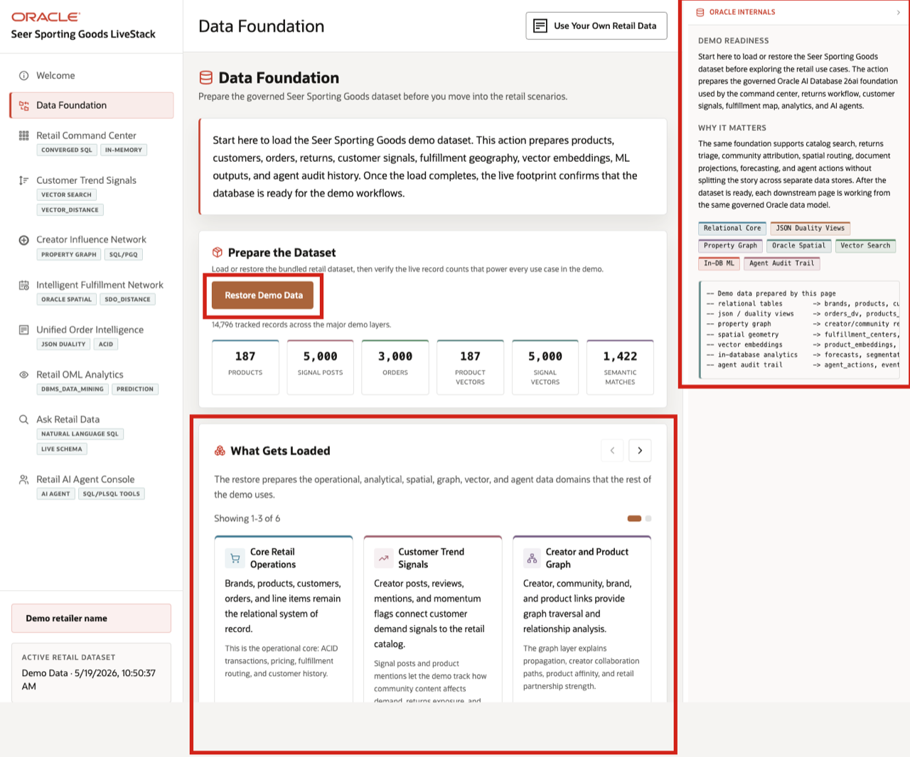

# Retail Data Foundation

## Introduction

This lab starts the hands-on database work by confirming that the retail foundation is present and ready. Learners inspect the objects, views, graph metadata, vector artifacts, OML models, and PL/SQL tools that support the Seer Sporting Goods workflow, so later results can be trusted as database-backed evidence.

The LiveStack Demo application shows what the Data Foundation page loads or restores. The updated runbook emphasizes that the load prepares products, customers, orders, returns, customer signals, fulfillment geography, vector embeddings, machine learning outputs, and agent audit history. In SQL Worksheet, you inspect the same foundation as database objects, views, graph metadata, vector artifacts, and PL/SQL tools.

### Operating Story

| Step | Retail focus |
| --- | --- |
| Business Problem | Seer Sporting Goods cannot trust later dashboards, predictions, or agent outputs unless the shared retail data foundation is complete. |
| What You Will Prove | The schema contains the tables, views, vector artifacts, graph objects, OML models, and PL/SQL tools used by the rest of the workshop. |
| Database Capability | Oracle catalog views expose the governed database objects that support the retail workflow. |
| Outcome | Every later retail decision is grounded in a known, queryable database foundation instead of hidden setup or copied demo data. |
{: title="Retail Data Foundation Story"}

**Persona focus:** The business user wants to know that later dashboards, predictions, and agent results are trustworthy. The technical user confirms that the shared schema contains the database objects the application depends on.

Estimated Time: **10 minutes**

### Objectives

- Confirm that the retail database objects are present.
- Inventory the object families used by later labs.
- Map the current retail application flow to Oracle Database 26ai capabilities.
- Query row counts to understand the size of the retail dataset.


## Task 1: Inventory the retail object families

Inventory the object families to confirm that the workshop is starting from a complete, governed retail foundation. This is not the business outcome by itself; it is the evidence check that makes the later labs credible.

1. Review the related application screen before you run the SQL.

    

    *Figure 1: Data Foundation prepares the shared dataset and shows the Oracle capabilities behind the demo.*

2. In SQL Worksheet, run this query.

    Before you analyze retail outcomes, get oriented to the shared data foundation. This query uses Oracle `USER_*` catalog views because you are connected as the workshop schema user. It inventories the object families that later labs use for dashboards, search, graph, spatial, OML, Ask Data, and agent workflows.

    ```sql
    <copy>
    SELECT 'Core retail tables' AS "Area", COUNT(*) AS "Count"
    FROM user_tables
    WHERE table_name IN (
        'BRANDS','PRODUCTS','FULFILLMENT_CENTERS','INVENTORY','CUSTOMERS',
        'ORDERS','ORDER_ITEMS','INFLUENCERS','SOCIAL_POSTS','POST_PRODUCT_MENTIONS',
        'DEMAND_FORECASTS','SHIPMENTS','AGENT_ACTIONS','APP_USERS','EVENT_STREAM',
        'PRODUCT_EMBEDDINGS','POST_EMBEDDINGS','SEMANTIC_MATCHES',
        'FULFILLMENT_ZONES','DEMAND_REGIONS','RETURN_REQUESTS','RETURN_DOCUMENTS'
      )
    UNION ALL
    SELECT 'Retail semantic views', COUNT(*)
    FROM user_views
    WHERE view_name IN (
        'RETAIL_RETURNS_WORKFLOW_V','RETAIL_SIGNAL_PRODUCT_V',
        'RETAIL_ORDER_RETURN_V','RETAIL_FULFILLMENT_RISK_V','RETAIL_RETURN_WORKBENCH_V'
      )
    UNION ALL
    SELECT 'Creator influence property graph', COUNT(*)
    FROM user_property_graphs
    WHERE graph_name = 'INFLUENCER_NETWORK'
    UNION ALL
    SELECT 'MiniLM vector artifacts', COUNT(*)
    FROM user_tab_cols
    WHERE data_type = 'VECTOR'
      AND table_name IN ('PRODUCT_EMBEDDINGS','POST_EMBEDDINGS')
      AND column_name = 'EMBEDDING'
    UNION ALL
    SELECT 'Agent tool functions', COUNT(*)
    FROM user_objects
    WHERE object_type = 'FUNCTION'
      AND object_name IN (
        'DETECT_TRENDING_PRODUCTS','CHECK_PRODUCT_INVENTORY',
        'FIND_BEST_FULFILLMENT','GET_INFLUENCER_NETWORK','LOG_AGENT_DECISION'
      );
    </copy>
    ```

    Expected output:

    | Area | Count |
    | --- | ---: |
    | Core retail tables | 22 |
    | Retail semantic views | 5 |
    | Creator influence property graph | 1 |
    | MiniLM vector artifacts | 2 |
    | Agent tool functions | 5 |
    {: title="Retail Object Inventory"}

3. This inventory shows the database foundation you will use throughout the workshop: retail tables for operational data, semantic views for business-friendly questions, a property graph for creator influence, vector columns for meaning-based search, and PL/SQL functions for trusted agent actions.

## Task 2: Map retail outcomes to database features

Use the capability map to connect each retail outcome to the database feature that supports it. This helps learners understand why each later SQL exercise exists.

1. Review this capability map.

    The table connects each retail business outcome to the Oracle Database feature that supports it, so each later lab has a clear technical purpose.

    | Outcome | DB Feature |
    | --- | --- |
    | Retail command center | Converged SQL over orders, inventory, returns, creators, and audit data |
    | Unified order intelligence | JSON Relational Duality and SQL/JSON |
    | Customer trend signals | AI Vector Search with MiniLM L12 v2 and `VECTOR_DISTANCE` |
    | Creator influence network | Property Graph and `GRAPH_TABLE` SQL/PGQ |
    | Intelligent fulfillment | Oracle Spatial `SDO_GEOMETRY`, GeoJSON, and distance analysis |
    | Retail OML analytics | `DBMS_DATA_MINING` models and SQL scoring functions |
    | Ask Retail Data | Semantic views and comments that expose governed business meaning |
    | Retail AI Agent Console | PL/SQL tools, JSON audit payloads, and agent action history |
    {: title="Retail Outcomes and Database Features"}

2. This map is the mental model for the workshop. Each later lab uses SQL to show how the database creates a visible retail outcome.

## Task 3: Count the retail data groups

Count the retail data groups to understand the scale of the seeded dataset and to give context for later dashboard, search, graph, spatial, OML, and agent results.

1. Run this row-count query.

    Row counts help you understand the shape and scale of the retail dataset. This block runs aggregate `COUNT(*)` checks across major retail domains and gives you a scale reference for later KPI, vector, graph, spatial, and OML results.

    ```sql
    <copy>
    SELECT 'Brands' AS "Data Group", COUNT(*) AS "Rows" FROM brands
    UNION ALL SELECT 'Products', COUNT(*) FROM products
    UNION ALL SELECT 'Customers', COUNT(*) FROM customers
    UNION ALL SELECT 'Orders', COUNT(*) FROM orders
    UNION ALL SELECT 'Social posts', COUNT(*) FROM social_posts
    UNION ALL SELECT 'Return requests', COUNT(*) FROM return_requests
    UNION ALL SELECT 'Return evidence documents', COUNT(*) FROM return_documents
    UNION ALL SELECT 'Agent audit actions', COUNT(*) FROM agent_actions;
    </copy>
    ```

    Expected output:

    | Data Group | Rows |
    | --- | ---: |
    | Brands | 50 |
    | Products | 187 |
    | Customers | 2000 |
    | Orders | 3000 |
    | Social posts | 5000 |
    | Return requests | 5 |
    | Return evidence documents | 7 |
    | Agent audit actions | 1 |
    {: title="Retail Data Row Counts"}


2. The counts show that the workshop schema is closely aligned with the data foundation used by the LiveStack demo application.

## Acknowledgements

* **Author** - Pat Shepherd, Senior Principal Database Product Manager
* **Contributor** - Linda Foinding, Principal Database Product Manager
* **Last Updated By/Date** - Oracle Database Product Management, May 2026
