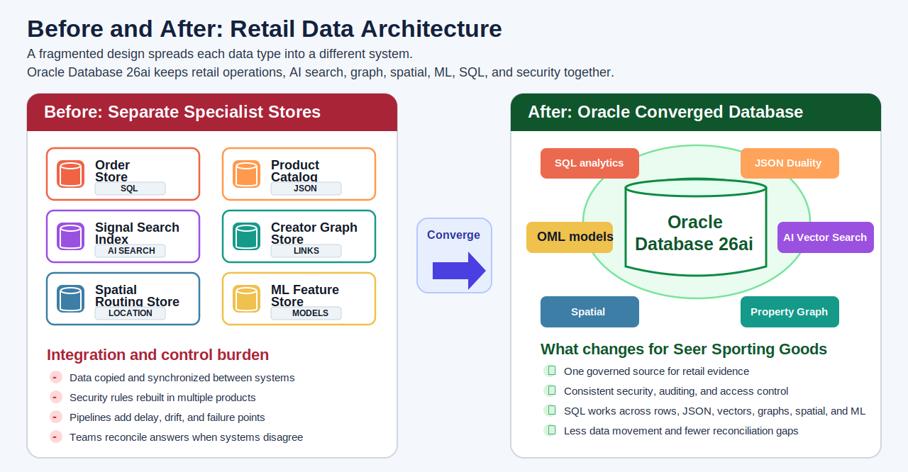

# Retail Data Foundation

## Introduction

Seer Sporting Goods builds stronger dashboards, predictions, and search results when the shared retail data foundation is complete. In this lab, you inspect database catalog views and row counts so later business results stay tied to visible, reviewable database objects. This is the foundation for the decision path you follow in the rest of the workshop.

### Objectives

- Inventory the object families used by later labs.
- Confirm the row counts for major retail data groups.
- Connect the active labs to Oracle Database capabilities.

Estimated Time: **10 minutes**

### Business Scenario

| Step | Retail focus |
| --- | --- |
| Business Problem | Retail teams need a complete shared data foundation before they act on dashboard, search, fulfillment, or model results. |
| Technical Challenge | The application uses tables, JSON duality views, vector columns, a property graph, spatial columns, and OML models. |
| Persona Focus | A database engineer confirms that each workflow has governed database evidence. |
| Database Capability | Oracle catalog views expose the objects that support the retail workflow. |
| Outcome | You know which objects support each later lab before you interpret business results. |

<details>
<summary><strong>Key terms: converged database foundation</strong></summary>

> - **Catalog view**: A database view such as `USER_TABLES` or `USER_MINING_MODELS` that describes objects in your schema.
> - **Converged database**: One Oracle Database foundation that stores relational rows, JSON documents, vectors, graphs, spatial data, and model artifacts together.
> - **Governed evidence**: Data that you can inspect with SQL instead of trusting a hidden application result.

</details>



*Figure 1: A fragmented retail architecture spreads operational, search, graph, spatial, and ML evidence across separate database platforms and vendors. Oracle Database 26ai keeps the same evidence connected for Seer Sporting Goods.*

## Task 1: Inventory the retail object families

1. Review the Data Foundation application screen.

    

    *Figure 2: The Data Foundation page shows the shared database capabilities that support the rest of the workshop.*

2. Run the object inventory query.

    > **SQL Worksheet reminder:** Need a reminder on how to open and use the SQL Worksheet? Return to [Getting Started Task 2: Open SQL Worksheet](/workshops/sandbox/index.html?lab=getting-started#Task2:OpenSQLWorksheet) for the step-by-step graphic showing where to paste and run SQL statements.

    This query uses Oracle catalog views. Catalog views are database-provided views that describe your schema; they let you inspect what exists without opening application code.

    Two table names matter later in the retail scenario. `SOCIAL_POSTS` stores creator and customer posts that mention products, demand, and service signals. `POST_EMBEDDINGS` stores the vector representation of those social posts so Oracle AI Vector Search can compare meaning instead of only matching keywords.

    Read the query as a checklist:

    1. Each `SELECT` counts one object family used later in the workshop. The OML row counts the retail model inventory; Lab 7 focuses on demand-surge scoring from that inventory.
    2. The `WHERE` clauses limit each count to the exact object names this workshop depends on.
    3. `UNION ALL` stacks those separate count rows into one readable inventory table.

    `UNION ALL` is useful here because the query is building a report, not searching for duplicate rows. Each `SELECT` already produces a different labeled result, such as `Core retail tables` or `JSON duality views`. A plain `UNION` would ask the database to compare the rows and remove duplicates. That extra duplicate-removal step is not needed, and it can hide your intent. `UNION ALL` says: keep every checklist row I wrote, in this combined result.

    You can use this same pattern in your own applications when you need a quick readiness or health-check query. For example, one `SELECT` can count required tables, another can count configuration rows, another can count loaded documents, and another can count generated embeddings. `UNION ALL` turns those separate checks into one small status table that an operator, developer, or automated test can read.

    ```sql
    <copy>
    SELECT 'Core retail tables' AS "Area", COUNT(*) AS "Count"
    FROM user_tables
    WHERE table_name IN (
      'BRANDS','PRODUCTS','FULFILLMENT_CENTERS','INVENTORY','CUSTOMERS',
      'ORDERS','ORDER_ITEMS','INFLUENCERS','SOCIAL_POSTS','POST_PRODUCT_MENTIONS',
      'DEMAND_FORECASTS','SHIPMENTS','PRODUCT_EMBEDDINGS','POST_EMBEDDINGS',
      'DEMAND_REGIONS'
    )
    UNION ALL
    SELECT 'JSON duality views', COUNT(*)
    FROM user_json_duality_views
    WHERE view_name IN ('ORDERS_DV','PRODUCTS_INVENTORY_DV')
    UNION ALL
    SELECT 'Creator influence property graph', COUNT(*)
    FROM user_property_graphs
    WHERE graph_name = 'INFLUENCER_NETWORK'
    UNION ALL
    SELECT 'MiniLM vector columns', COUNT(*)
    FROM user_tab_cols
    WHERE data_type = 'VECTOR'
      AND table_name IN ('PRODUCT_EMBEDDINGS','POST_EMBEDDINGS')
      AND column_name = 'EMBEDDING'
    UNION ALL
    SELECT 'OML models', COUNT(*)
    FROM user_mining_models
    WHERE model_name IN (
      'DEMAND_SURGE_MODEL','CUSTOMER_SEGMENT_MODEL',
      'REVENUE_PREDICT_MODEL','PRODUCT_CLUSTER_MODEL'
    );
    </copy>
    ```

    **Expected output: Object Inventory**

    | Area | Count |
    | --- | ---: |
    | Core retail tables | 15 |
    | JSON duality views | 2 |
    | Creator influence property graph | 1 |
    | MiniLM vector columns | 2 |
    | OML models | 4 |

3. The result shows that later labs are not isolated feature samples. They use one schema that stores operational rows, document views, vectors, graph paths, spatial data, and model artifacts together.

## Task 2: Count the major data groups

1. Run the row-count query.

    Row counts give you a scale reference before you interpret KPIs and ranked results. The counts also confirm that the major tables are populated.

    Read this query in three parts:

    1. Each `SELECT` names one business data group, such as `Brands`, `Products`, or `Orders`.
    2. `COUNT(*)` counts the rows in that table.
    3. `UNION ALL` stacks the separate counts into one result. It does not try to merge rows, which is exactly what you want for a simple inventory where each line should remain visible.

    This is a practical application pattern. When you build your own app, you often need to prove that several related data sets loaded correctly before you trust the screen or API that uses them. A row-count query like this can become a smoke test: if `Products`, `Orders`, or `Post embeddings` unexpectedly returns `0`, you know which part of the application foundation needs attention before users rely on downstream analytics.

    Use `UNION ALL` for this kind of checklist when each branch returns the same columns and every branch should appear in the final output. Use `UNION` only when you intentionally want the database to remove duplicate rows from two compatible result sets.

    ```sql
    <copy>
    SELECT 'Brands' AS "Data Group",
           COUNT(*) AS "Rows"
    FROM brands
    UNION ALL
    SELECT 'Products',
           COUNT(*)
    FROM products
    UNION ALL
    SELECT 'Customers',
           COUNT(*)
    FROM customers
    UNION ALL
    SELECT 'Orders',
           COUNT(*)
    FROM orders
    UNION ALL
    SELECT 'Order items',
           COUNT(*)
    FROM order_items
    UNION ALL
    SELECT 'Social posts',
           COUNT(*)
    FROM social_posts
    UNION ALL
    SELECT 'Influencers',
           COUNT(*)
    FROM influencers
    UNION ALL
    SELECT 'Fulfillment centers',
           COUNT(*)
    FROM fulfillment_centers
    UNION ALL
    SELECT 'Shipments',
           COUNT(*)
    FROM shipments
    UNION ALL
    SELECT 'Post embeddings',
           COUNT(*)
    FROM post_embeddings;
    </copy>
    ```

    **Expected output: Data Row Counts**

    | Data Group | Rows |
    | --- | ---: |
    | Brands | 50 |
    | Products | 187 |
    | Customers | 2000 |
    | Orders | 3000 |
    | Order items | 8981 |
    | Social posts | 5000 |
    | Influencers | 483 |
    | Fulfillment centers | 30 |
    | Shipments | 1500 |
    | Post embeddings | 5000 |

2. These counts are the baseline for the rest of the workshop. Later results should be read as drill-through evidence from this shared data foundation. Next, you use the foundation to explain the Retail Command Center metrics.

## Acknowledgements

* **Author** - Pat Shepherd, Senior Principal Database Product Manager
* **Last Updated By/Date** - Oracle Database Product Management, July 2026
