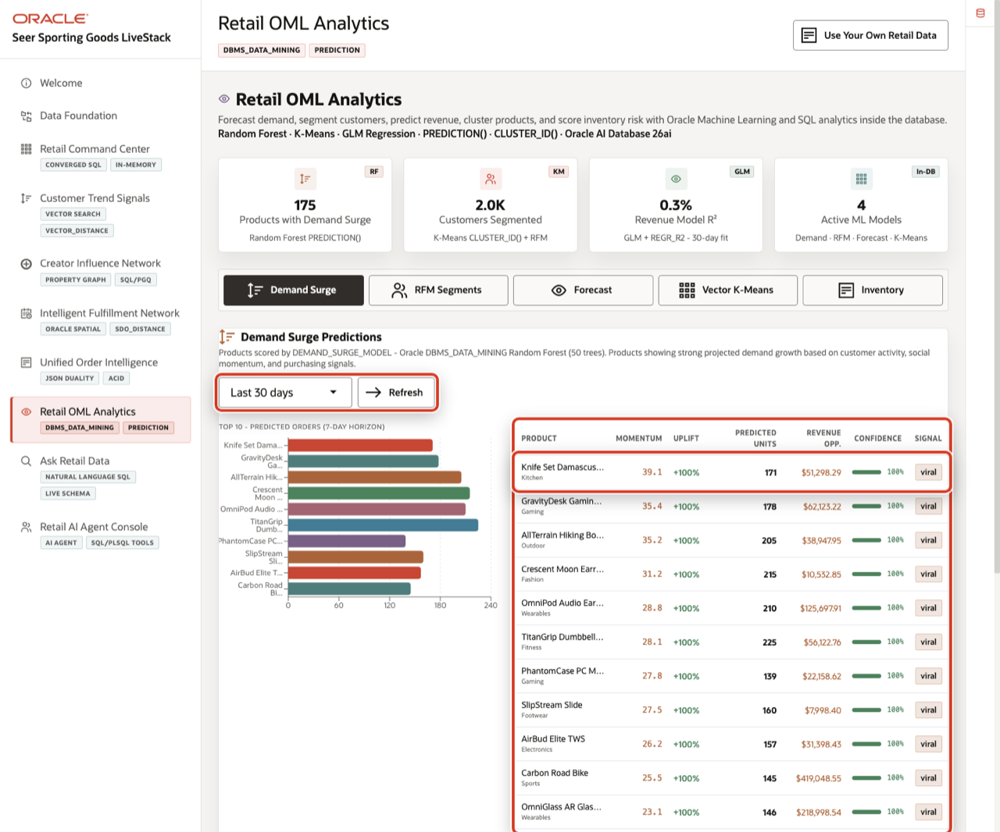

# Retail OML Analytics

## Introduction

**Retail OML Analytics** turns predictive output into operational evidence. In this lab, learners verify OML views and models, score demand surge risk, and inspect the inventory evidence behind replenishment decisions.

Oracle Machine Learning keeps models close to the retail data. The updated runbook frames this page as a business-facing analytics surface, not a separate notebook. Models can be trained, persisted, and scored in the database with `DBMS_DATA_MINING`, `PREDICTION`, `PREDICTION_PROBABILITY`, and `CLUSTER_ID`.

In SQL Worksheet, you inspect the feature views and model scoring patterns behind the Retail OML Analytics scene.

Estimated Time: **10 minutes**

### Objectives

- Verify OML feature views and mining models.
- Inspect demand, customer, revenue, and product-cluster features.
- Run repeatable model scoring when models are available.
- Connect OML outputs to inventory and merchandising action.


## Task 1: Verify OML training views and models

Perform the following set of steps to confirm that predictive analytics are built from governed retail data, not disconnected exports.
1. Review the related application screen before you run the SQL.

    

    *Figure 1: Retail OML Analytics summarizes in-database predictive signals and active models.*

    

    *Figure 2: Demand surge scoring turns product, social, and sales features into an action-oriented prediction.*

2. Run this view check.

    Machine learning starts with prepared features. A feature is a column or derived value that helps a model make a prediction, such as demand score, inventory quantity, or customer behavior. This block checks the curated OML feature views. Those views prepare model-ready rows while keeping retail data inside Oracle Database.

    ```sql
    <copy>
    SELECT owner AS "Owner", view_name AS "View"
    FROM all_views
    WHERE owner = SYS_CONTEXT('USERENV','CURRENT_SCHEMA')
      AND view_name IN (
        'OML_DEMAND_TRAINING_V','OML_CUSTOMER_RFM_V',
        'OML_REVENUE_TRAINING_V','OML_PRODUCT_CLUSTER_V'
      )
    ORDER BY view_name;
    </copy>
    ```

    Expected output:

    | Owner | View |
    | --- | --- |
    | LLUSER | `OML_CUSTOMER_RFM_V` |
    | LLUSER | `OML_DEMAND_TRAINING_V` |
    | LLUSER | `OML_PRODUCT_CLUSTER_V` |
    | LLUSER | `OML_REVENUE_TRAINING_V` |
    {: title="OML Feature Views"}

3. Run this model inventory.

    A model inventory tells you what the database can actually score. This block reads `ALL_MINING_MODELS` for model name, mining function, and algorithm. The mining function explains the type of problem, such as classification, regression, or clustering. The algorithm shows the method Oracle Machine Learning used to build the model.

    ```sql
    <copy>
    SELECT owner AS "Owner", model_name AS "Model", mining_function AS "Use", algorithm AS "Algorithm"
    FROM all_mining_models
    WHERE owner = SYS_CONTEXT('USERENV','CURRENT_SCHEMA')
      AND model_name IN (
        'DEMAND_SURGE_MODEL','CUSTOMER_SEGMENT_MODEL',
        'REVENUE_PREDICT_MODEL','PRODUCT_CLUSTER_MODEL'
      )
    ORDER BY model_name;
    </copy>
    ```

    Expected output:

    | Owner | Model | Use | Algorithm |
    | --- | --- | --- | --- |
    | LLUSER | `CUSTOMER_SEGMENT_MODEL` | CLUSTERING | KMEANS |
    | LLUSER | `DEMAND_SURGE_MODEL` | CLASSIFICATION | `RANDOM_FOREST` |
    | LLUSER | `PRODUCT_CLUSTER_MODEL` | CLUSTERING | KMEANS |
    | LLUSER | `REVENUE_PREDICT_MODEL` | REGRESSION | `GENERALIZED_LINEAR_MODEL` |
    {: title="OML Models"}

**Note:** These are sample values from the current workshop dataset and may change after a refresh, seed update, or schema rebuild. Treat these values as an example of the current workshop result. Verify the live output before presenting, then explain the business takeaway: what the values reveal about retail scale, demand, revenue, inventory, fulfillment, order governance, prediction, or agent activity.

## Task 2: Score demand surge risk

Perform the following set of steps to identify products where demand may require promotion, replenishment, or operational follow-up.

1. Use the live **Retail OML Analytics** context from **Figure 1** before you run the SQL.

2. Run this scoring query.

    Notice that the scoring happens in SQL, close to the data. `PREDICTION` returns the model's predicted label for each row. `PREDICTION_PROBABILITY` returns the confidence for a requested label, here `SURGE`. The `USING *` clause tells Oracle to use the feature columns from the view as model inputs, so scoring can run without exporting data to a separate tool.

    ```sql
    <copy>
    SELECT product_id AS "Product ID",
           category AS "Category",
           surge_label AS "Actual",
           PREDICTION(DEMAND_SURGE_MODEL USING *) AS "Predicted",
           ROUND(PREDICTION_PROBABILITY(DEMAND_SURGE_MODEL, 'SURGE' USING *), 4) AS "Surge Prob"
    FROM oml_demand_training_v
    ORDER BY product_id
    FETCH FIRST 10 ROWS ONLY;
    </copy>
    ```

    Expected output:

    | Product ID | Category | Actual | Predicted | Surge Prob |
    | ---: | --- | --- | --- | ---: |
    | 1 | Athletic Apparel | SURGE | SURGE | 1 |
    | 2 | Athletic Apparel | SURGE | SURGE | 0.8219 |
    | 3 | Athletic Apparel | SURGE | SURGE | 1 |
    | 4 | Athletic Apparel | SURGE | SURGE | 0.5786 |
    | 5 | Athletic Apparel | SURGE | SURGE | 1 |
    | 6 | Sports Tech | SURGE | SURGE | 0.9986 |
    | 7 | Sports Tech | SURGE | SURGE | 1 |
    | 8 | Sports Tech | SURGE | SURGE | 0.998 |
    | 9 | Sports Tech | SURGE | SURGE | 0.9946 |
    | 10 | Sports Tech | SURGE | SURGE | 0.998 |
    {: title="Demand Surge Predictions"}

3. The model score gives the merchandising team a database-grounded way to decide whether to promote, replenish, or watch a product.

**Note:** These are sample values from the current workshop dataset and may change after a refresh, seed update, or schema rebuild. Treat these values as an example of the current workshop result. Verify the live output before presenting, then explain the business takeaway: what the values reveal about retail scale, demand, revenue, inventory, fulfillment, order governance, prediction, or agent activity.

## Task 3: Inspect the operating evidence behind replenishment risk

Perform the following set of steps to show that model output should be reviewed alongside inventory, demand, and fulfillment data.

1. Use the live Retail OML Analytics context from Figure 1 before you run the SQL.

2. Run this query.

    The previous task produced demand surge predictions. This query does not score another model. It shows the operating evidence a planner needs before acting on a prediction: product, fulfillment center, quantity on hand, reorder point, and inventory risk. The link is practical: a surge prediction matters more when you can compare it with current stock and replenishment thresholds.

    ```sql
    <copy>
    SELECT product_name AS "Product",
           center_name AS "Center",
           quantity_on_hand AS "On Hand",
           reorder_point AS "Reorder At",
           inventory_risk AS "Risk"
    FROM retail_fulfillment_risk_v r
    ORDER BY r.inventory_risk DESC, r.quantity_on_hand ASC, r.product_name
    FETCH FIRST 10 ROWS ONLY;
    </copy>
    ```

    Expected output:

    | Product | Center | On Hand | Reorder At | Risk |
    | --- | --- | ---: | ---: | --- |
    | OmniRing Performance Tracker | Philadelphia Mid-Atlantic | 10 | 41 | `AT_RISK` |
    | DewPoint Hydration Spray | Charlotte Southeast | 11 | 27 | `AT_RISK` |
    | Matcha Endurance Starter Kit | Salt Lake Mountain | 11 | 76 | `AT_RISK` |
    | Recovery Cooling Gel | Honolulu Pacific | 11 | 53 | `AT_RISK` |
    | Trekking Backpack 45L | Baltimore East Coast | 11 | 70 | `AT_RISK` |
    | CoachMic USB Microphone | NYC Metro Hub | 12 | 86 | `AT_RISK` |
    | CoachView Curved Display | Memphis Logistics | 12 | 54 | `AT_RISK` |
    | DrillSwitch Training Controller | LA Mega Center | 12 | 44 | `AT_RISK` |
    | Expedition Power Bank | Detroit Great Lakes | 12 | 37 | `AT_RISK` |
    | RidgeLine Fleece Hoodie | LA Mega Center | 12 | 95 | `AT_RISK` |
    {: title="Inventory Risk Evidence"}

3. This result is the operational side of the OML story. A prediction can suggest where demand may rise, but the replenishment decision still needs inventory evidence from Oracle Database.

**Note:** These are sample values from the current workshop dataset and may change after a refresh, seed update, or schema rebuild. Treat these values as an example of the current workshop result. Verify the live output before presenting, then explain the business takeaway: what the values reveal about retail scale, demand, revenue, inventory, fulfillment, order governance, prediction, or agent activity.

## Acknowledgements

* **Author** - Pat Shepherd, Senior Principal Database Product Manager
* **Contributor** - Linda Foinding, Principal Database Product Manager
* **Last Updated By/Date** - Oracle Database Product Management, May 2026
