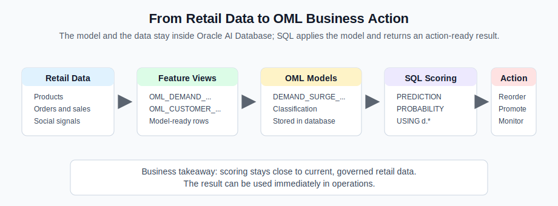
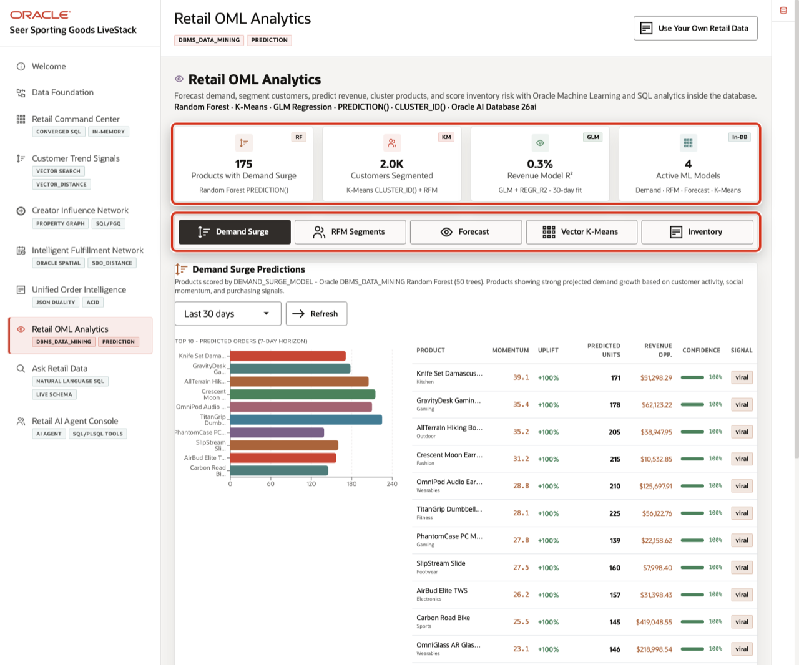
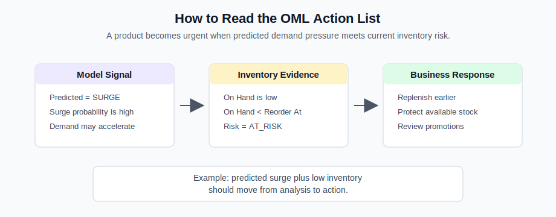

# Retail OML Analytics

## Introduction

Retail teams need to react before a demand surge turns into a stockout. This lab answers two practical questions: which products need attention now, and which locations are most exposed if demand keeps rising?

**Oracle Machine Learning** for SQL keeps machine learning close to the retail data. Predictions are easier to trust when the features, model objects, and operational evidence remain in one governed environment.

In this lab, learners move from model inventory to feature inspection, scoring, and action prioritization. The prediction becomes useful when it leads to a replenishment or protection decision.



*Figure 1: Retail data, feature views, OML models, SQL scoring, and business action stay connected inside Oracle AI Database.*

This lab starts from models that were already created by the workshop seed. That keeps the exercise focused on the operational workflow a planner cares about: inspect the model and feature views, score current retail rows, and connect the prediction to inventory action. In a longer OML workshop, you would also walk through model creation and training. Here, you use the trained model the way an application or analyst would use it after deployment.

### Operating Story

| Step | Retail focus |
| --- | --- |
| Business Problem | A demand surge can turn into a stockout if merchandising waits for lagging reports. |
| What You Will Prove | In-database models can score product surge risk and connect that prediction to current inventory pressure. |
| Database Capability | Oracle Machine Learning for SQL stores models in the database and scores feature views with SQL functions. |
| Outcome | Planners get a short action list: replenish, protect inventory, adjust promotions, or route demand away from constrained centers. |
{: title="Retail OML Story"}

**Persona focus:** The planner wants to act before a demand surge causes stockouts. The technical team needs model scoring to run close to governed feature views and current inventory data.

Estimated Time: **10 minutes**

### Objectives

- Confirm that the OML feature views and mining models needed for retail scoring are present and ready to support business decisions.
- Inspect the retail features used to score demand surge.
- Use SQL scoring functions to apply the in-database model and turn current retail signals into a demand-risk assessment.
- Connect model predictions to inventory evidence so merchandising teams can turn prediction into action.


## Task 1: Confirm OML models and feature views in the database

Perform the following set of steps to confirm that predictive analytics are built from governed retail data and persistent in-database model objects:

1. Review the related application screen before you run SQL.

    

    *Figure 2: Retail OML Analytics summarizes in-database predictive signals and active models.*

2. Run this model inventory.

    **Oracle Machine Learning** for SQL models are first-class database objects. This query shows which predictive capabilities are available to score the current retail workflow without exporting data to a separate environment.

    Think of this as the model catalog check. Before using a prediction in an operational workflow, confirm which models exist, what kind of question each model answers, and whether the model can be scored from SQL.

    ```sql
    <copy>
    SELECT owner AS "Owner",
           model_name AS "Model",
           mining_function AS "Use",
           algorithm AS "Algorithm"
    FROM all_mining_models
    WHERE owner = SYS_CONTEXT('USERENV','CURRENT_SCHEMA')
      AND model_name IN (
        'DEMAND_SURGE_MODEL','CUSTOMER_SEGMENT_MODEL',
        'REVENUE_PREDICT_MODEL','PRODUCT_CLUSTER_MODEL'
      )
    ORDER BY model_name;
    </copy>
    ```

    **Expected output:**

    | Owner | Model | Use | Algorithm |
    | --- | --- | --- | --- |
    | LLUSER | `CUSTOMER_SEGMENT_MODEL` | CLUSTERING | KMEANS |
    | LLUSER | `DEMAND_SURGE_MODEL` | CLASSIFICATION | `RANDOM_FOREST` |
    | LLUSER | `PRODUCT_CLUSTER_MODEL` | CLUSTERING | KMEANS |
    | LLUSER | `REVENUE_PREDICT_MODEL` | REGRESSION | `GENERALIZED_LINEAR_MODEL` |
    {: title="OML Models"}

    **How to read this result:**

    | Model | Business question |
    | --- | --- |
    | `DEMAND_SURGE_MODEL` | Is product demand likely to surge? |
    | `REVENUE_PREDICT_MODEL` | What revenue outcome should we expect? |
    | `CUSTOMER_SEGMENT_MODEL` | Which customer behavior group is this customer closest to? |
    | `PRODUCT_CLUSTER_MODEL` | Which product behavior group is this product closest to? |
    {: title="What the OML Models Mean"}

3. Run this feature view check.

    Machine learning starts with prepared features. These columns represent the demand, sentiment, engagement, sales, revenue, and inventory signals a planner would actually want the model to consider.

    ```sql
    <copy>
    SELECT owner AS "Owner",
           view_name AS "View"
    FROM all_views
    WHERE owner = SYS_CONTEXT('USERENV','CURRENT_SCHEMA')
      AND view_name IN (
        'OML_DEMAND_TRAINING_V','OML_CUSTOMER_RFM_V',
        'OML_REVENUE_TRAINING_V','OML_PRODUCT_CLUSTER_V'
      )
    ORDER BY view_name;
    </copy>
    ```

    **Expected output:**

    | Owner | View |
    | --- | --- |
    | LLUSER | `OML_CUSTOMER_RFM_V` |
    | LLUSER | `OML_DEMAND_TRAINING_V` |
    | LLUSER | `OML_PRODUCT_CLUSTER_V` |
    | LLUSER | `OML_REVENUE_TRAINING_V` |
    {: title="OML Feature Views"}

4. This is the first key lesson: the models and the feature views are in the database. The application can score current retail data without moving it into a separate machine learning runtime.

    In business terms, this means the prediction is closer to the truth of the operation. The same database holds the products, orders, social demand signals, inventory evidence, and model objects, so the workflow avoids stale exports and disconnected scoring pipelines.

**Note:** Sample values may change after data refreshes or rebuilds. Focus on the expected result pattern and the business takeaway, not the exact values.

## Task 2: Inspect demand surge features

Perform the following set of steps to inspect the feature rows used by the demand surge model. Before you trust a prediction, understand the signals the model is scoring.

1. Run this query.

    The demand training view combines product category, social activity, sentiment, engagement, sales, revenue, and the known surge label. In a real retail workflow, these are the kinds of signals a merchandising team would watch before changing promotions or replenishment plans.

    ```sql
    <copy>
    SELECT p.product_name AS "Product",
           d.category AS "Category",
           d.total_posts AS "Posts",
           ROUND(d.avg_sentiment, 3) AS "Avg Sentiment",
           d.rising_posts AS "Rising Posts",
           d.units_sold AS "Units Sold",
           ROUND(d.revenue, 2) AS "Revenue",
           d.surge_label AS "Known Label"
    FROM oml_demand_training_v d
    JOIN products p
      ON p.product_id = d.product_id
    ORDER BY d.product_id
    FETCH FIRST 8 ROWS ONLY;
    </copy>
    ```

    **Expected output:**

    | Product | Category | Posts | Avg Sentiment | Rising Posts | Units Sold | Revenue | Known Label |
    | --- | --- | ---: | ---: | ---: | ---: | ---: | --- |
    | StormRunner Trail Shell | Athletic Apparel | 22 | 0.568 | 3 | 103 | 19528.97 | SURGE |
    | RidgeLine Fleece Hoodie | Athletic Apparel | 21 | 0.56 | 4 | 66 | 5939.34 | SURGE |
    | TrailFlex Training Joggers | Athletic Apparel | 25 | 0.58 | 9 | 114 | 8548.86 | SURGE |
    | Summit Graphic Training Tee | Athletic Apparel | 19 | 0.509 | 3 | 104 | 4158.96 | SURGE |
    | Urban Trail Daypack | Athletic Apparel | 20 | 0.631 | 7 | 89 | 11569.11 | SURGE |
    | FieldCoach Training Tablet | Sports Tech | 21 | 0.642 | 4 | 67 | 60299.33 | SURGE |
    | TrailRun Sport Earbuds | Sports Tech | 20 | 0.567 | 4 | 94 | 18799.06 | SURGE |
    | RaceDay Docking Hub | Sports Tech | 19 | 0.515 | 5 | 87 | 13049.13 | SURGE |
    {: title="Demand Surge Features"}

2. This table makes the model inputs tangible. The model is not scoring abstract data; it is scoring retail signals that planners already care about.

    **How to read the feature columns:**

    | Column | What it tells the business |
    | --- | --- |
    | `Posts` and `Rising Posts` | Whether social conversation is active and accelerating. |
    | `Avg Sentiment` | Whether the conversation is favorable enough to support demand. |
    | `Units Sold` and `Revenue` | Whether interest is already turning into business activity. |
    | `Known Label` | The historical label used to train or evaluate the classification model. |
    {: title="Demand Feature Interpretation"}

**Note:** Sample values may change after data refreshes or rebuilds. Focus on the expected result pattern and the business takeaway, not the exact values.

## Task 3: Score demand surge risk with SQL

Perform the following set of steps to apply the in-database classification model to the demand feature rows.

1. Run this scoring query.

    `PREDICTION` returns the label and `PREDICTION_PROBABILITY` returns the confidence. The result helps planners separate products that merely look noisy from products that genuinely deserve immediate attention.

    **The query has three important parts:**

    | Query part | Purpose |
    | --- | --- |
    | `PREDICTION(DEMAND_SURGE_MODEL USING d.*)` | Ask the model for the predicted class for each product row. |
    | `PREDICTION_PROBABILITY(..., 'SURGE' USING d.*)` | Ask how confident the model is that the product belongs to the `SURGE` class. |
    | `JOIN products p` | Add the product name so the result is useful to a business user. |
    {: title="Scoring Query Breakdown"}

    ```sql
    <copy>
    SELECT p.product_name AS "Product",
           d.category AS "Category",
           d.surge_label AS "Actual",
           PREDICTION(DEMAND_SURGE_MODEL USING d.*) AS "Predicted",
           ROUND(PREDICTION_PROBABILITY(DEMAND_SURGE_MODEL, 'SURGE' USING d.*), 4) AS "Surge Prob",
           d.total_posts AS "Posts",
           d.rising_posts AS "Rising Posts",
           d.units_sold AS "Units Sold"
    FROM oml_demand_training_v d
    JOIN products p
      ON p.product_id = d.product_id
    ORDER BY d.product_id
    FETCH FIRST 10 ROWS ONLY;
    </copy>
    ```

    **Expected output (probability values can vary if the model is rebuilt):**

    | Product | Category | Actual | Predicted | Surge Prob | Posts | Rising Posts | Units Sold |
    | --- | --- | --- | --- | ---: | ---: | ---: | ---: |
    | StormRunner Trail Shell | Athletic Apparel | SURGE | SURGE | 1 | 22 | 3 | 103 |
    | RidgeLine Fleece Hoodie | Athletic Apparel | SURGE | SURGE | 0.8219 | 21 | 4 | 66 |
    | TrailFlex Training Joggers | Athletic Apparel | SURGE | SURGE | 1 | 25 | 9 | 114 |
    | Summit Graphic Training Tee | Athletic Apparel | SURGE | SURGE | 0.5786 | 19 | 3 | 104 |
    | Urban Trail Daypack | Athletic Apparel | SURGE | SURGE | 1 | 20 | 7 | 89 |
    | FieldCoach Training Tablet | Sports Tech | SURGE | SURGE | 0.9986 | 21 | 4 | 67 |
    | TrailRun Sport Earbuds | Sports Tech | SURGE | SURGE | 1 | 20 | 4 | 94 |
    | RaceDay Docking Hub | Sports Tech | SURGE | SURGE | 0.998 | 19 | 5 | 87 |
    | SummitPulse GPS Watch | Sports Tech | SURGE | SURGE | 0.9946 | 17 | 3 | 119 |
    | Expedition Power Bank | Sports Tech | SURGE | SURGE | 0.998 | 18 | 3 | 121 |
    {: title="Demand Surge Predictions"}

2. The model score gives the merchandising team a database-grounded way to decide whether to promote, replenish, or watch a product. The predicted labels are the main result. The probability values are confidence scores from the trained model, and they can differ slightly across workshop environments when the Random Forest model is rebuilt from the same feature data.

    For a business user, a row with `Predicted = SURGE` means "watch this product now." A high `Surge Prob` means the model is more confident. The next step is not to blindly reorder everything; it is to combine the prediction with current inventory and fulfillment evidence.

**Note:** Sample values may change after data refreshes or rebuilds. Focus on the expected result pattern and the business takeaway, not the exact values.

## Task 4: Turn prediction into a replenishment action list

Perform the following set of steps to combine model output with current inventory evidence. A surge prediction is useful only when the business can decide what to do next:



*Figure 3: A product becomes operationally urgent when predicted demand pressure meets current inventory risk.*

1. Run this query.

    The common table expression scores each product with `DEMAND_SURGE_MODEL`, and the outer query joins those predictions to fulfillment risk. The action list matters because it combines likely demand pressure with locations that are already exposed.

    **Read the query in two stages:**

    | Stage | What happens |
    | --- | --- |
    | `scored_products` | Scores each product and returns `predicted` plus `surge_prob`. |
    | Final `SELECT` | Joins scored products to inventory risk and keeps only `SURGE` products at `AT_RISK` centers. |
    {: title="Action Query Breakdown"}

    ```sql
    <copy>
    WITH scored_products AS (
      SELECT d.product_id,
             PREDICTION(DEMAND_SURGE_MODEL USING d.*) AS predicted,
             ROUND(PREDICTION_PROBABILITY(DEMAND_SURGE_MODEL, 'SURGE' USING d.*), 4) AS surge_prob
      FROM oml_demand_training_v d
    )
    SELECT p.product_name AS "Product",
           r.center_name AS "Center",
           r.quantity_on_hand AS "On Hand",
           r.reorder_point AS "Reorder At",
           r.inventory_risk AS "Risk",
           s.predicted AS "Predicted",
           s.surge_prob AS "Surge Prob"
    FROM scored_products s
    JOIN products p
      ON p.product_id = s.product_id
    JOIN retail_fulfillment_risk_v r
      ON r.product_id = s.product_id
    WHERE s.predicted = 'SURGE'
      AND r.inventory_risk = 'AT_RISK'
    ORDER BY s.surge_prob DESC,
             r.quantity_on_hand ASC,
             p.product_name,
             r.center_name
    FETCH FIRST 10 ROWS ONLY;
    </copy>
    ```

    Expected output from the current workshop dataset. Probability values and row order can vary if the model is rebuilt, but the important pattern is the same: the result combines `Predicted = SURGE` with `Risk = AT_RISK`.

    | Product | Center | On Hand | Reorder At | Risk | Predicted | Surge Prob |
    | --- | --- | ---: | ---: | --- | --- | ---: |
    | Recovery Cooling Gel | Honolulu Pacific | 11 | 53 | AT_RISK | SURGE | 1 |
    | CoachMic USB Microphone | NYC Metro Hub | 12 | 86 | AT_RISK | SURGE | 1 |
    | Battle Ropes 50ft | Baltimore East Coast | 13 | 57 | AT_RISK | SURGE | 1 |
    | Sport Wrap Polarized Shades | Denver Mountain West | 13 | 71 | AT_RISK | SURGE | 1 |
    | CoachMic USB Microphone | Anchorage Alaska | 16 | 73 | AT_RISK | SURGE | 1 |
    | CoachMic USB Microphone | Baltimore East Coast | 16 | 98 | AT_RISK | SURGE | 1 |
    | Recovery Cooling Gel | Memphis Logistics | 16 | 87 | AT_RISK | SURGE | 1 |
    | StudioRun Training Headphones | Detroit Great Lakes | 16 | 69 | AT_RISK | SURGE | 1 |
    | SlipStream Slide | Houston Gulf Coast | 17 | 36 | AT_RISK | SURGE | 1 |
    | Organic Protein Bars 12pk | Columbus Midwest | 19 | 91 | AT_RISK | SURGE | 1 |
    {: title="Prediction and Inventory Action List"}

2. This is the operating value of in-database machine learning. The model identifies likely demand pressure, and the same SQL statement connects that signal to fulfillment centers where inventory is already risky.

    **How to read the action list:**

    | Result pattern | Business meaning |
    | --- | --- |
    | `Predicted = SURGE` | Demand may rise for this product. |
    | `Risk = AT_RISK` | The center is already below its reorder threshold. |
    | `On Hand` far below `Reorder At` | The replenishment gap is urgent. |
    | High `Surge Prob` | The model is more confident in the surge signal. |
    {: title="Action List Interpretation"}

3. A planner now has a short action list: replenish, protect inventory, adjust promotion timing, or route demand away from constrained centers. The important point is that the prediction does not live on an island. It becomes useful because it is joined directly to the operational data that determines the next best action.

**Note:** Sample values may change after data refreshes or rebuilds. Focus on the expected result pattern and the business takeaway, not the exact values.

## Learn more

This lab gives you a retail-focused sample of Oracle Machine Learning for SQL. For more information, see [Introduction to Oracle Machine Learning for SQL](https://docs.oracle.com/en/database/oracle/machine-learning/oml4sql/23/dmcon/intro-oracle-machine-learning-SQL.html#GUID-CEDB0D5C-781F-42EF-BFD0-FBDCBC83D430).

## Acknowledgements

* **Author** - Pat Shepherd, Senior Principal Database Product Manager
* **Contributor** - Linda Foinding, Principal Database Product Manager
* **Last Updated By/Date** - Oracle Database Product Management, May 2026
