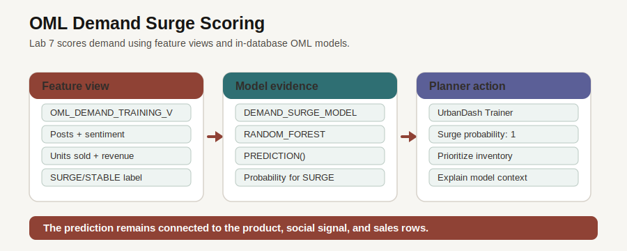

# Retail OML Analytics

## Introduction

After you review demand, influence, and fulfillment evidence, the final step is prioritization. Predictive analytics become useful when model output stays connected to operational data. In this lab, you inspect Oracle Machine Learning (OML) models, review the feature view behind demand scoring, and run an in-database prediction query.

### Objectives

- Inspect OML models in the schema.
- Review the demand feature view used for scoring.
- Score product rows with `DEMAND_SURGE_MODEL`.

Estimated Time: **10 minutes**

### Business Scenario

| Step | Retail focus |
| --- | --- |
| Business Problem | Planners need to prioritize products before demand pressure becomes operational pressure. |
| Technical Challenge | Model scores are hard to trust when they are separated from the rows that explain them. |
| Persona Focus | A merchandising planner wants model output with the product evidence beside it. |
| Database Capability | Oracle Machine Learning stores models and scores rows with SQL. |
| Outcome | Predictions can be inspected, joined, and acted on in the same database. |

<details>
<summary><strong>Key terms: Oracle Machine Learning</strong></summary>

> - **Feature view**: A repeatable SQL shape that packages model inputs, such as posts, sentiment, sales, and revenue.
> - **Prediction**: The predicted label or value that the model returns for a row. In this lab the label is `SURGE`.
> - **Probability**: A model confidence value for a class label; it is not a guarantee.

</details>



*Figure 1: OML scores demand rows where the product and signal evidence already lives.*

## Task 1: Inspect the model inventory

1. Review the Retail OML Analytics page.

    

    *Figure 2: The analytics page summarizes model-backed demand and product intelligence. The SQL below inspects the models directly.*

2. Run the model inventory query.

    > **SQL Worksheet reminder:** Need a reminder on how to open and use the SQL Worksheet? Return to [Getting Started Task 2: Open SQL Worksheet](/workshops/sandbox/index.html?lab=getting-started#Task2:OpenSQLWorksheet) for the step-by-step graphic showing where to paste and run SQL statements.

    `USER_MINING_MODELS` lists the in-database models available to the workshop schema. The retail schema includes four OML models, and this lab focuses on `DEMAND_SURGE_MODEL` for demand-prioritization scoring. `ORDER BY model_name` makes the inventory easy to compare with the expected output.

    ```sql
    <copy>
    SELECT model_name AS "Model",
           mining_function AS "Function",
           algorithm AS "Algorithm"
    FROM user_mining_models
    WHERE model_name IN (
      'DEMAND_SURGE_MODEL','CUSTOMER_SEGMENT_MODEL',
      'REVENUE_PREDICT_MODEL','PRODUCT_CLUSTER_MODEL'
    )
    ORDER BY model_name;
    </copy>
    ```

    **Expected output: Model Inventory**

    | Model | Function | Algorithm |
    | --- | --- | --- |
    | CUSTOMER\_SEGMENT\_MODEL | CLUSTERING | KMEANS |
    | DEMAND\_SURGE\_MODEL | CLASSIFICATION | RANDOM\_FOREST |
    | PRODUCT\_CLUSTER\_MODEL | CLUSTERING | KMEANS |
    | REVENUE\_PREDICT\_MODEL | REGRESSION | GENERALIZED\_LINEAR\_MODEL |

## Task 2: Review demand model features

1. Run the feature-view query.

    The feature view packages product category, posts, sentiment, sales, revenue, and training label into a repeatable SQL shape. That repeatability matters because scoring should use the same input meaning every time.

    The query joins the feature view to `PRODUCTS` so you see product names instead of only product IDs. The selected columns are the model inputs and label that make the demand row explainable.

    ```sql
    <copy>
    SELECT p.product_name AS "Product",
           d.category AS "Category",
           d.total_posts AS "Posts",
           ROUND(d.avg_sentiment, 3) AS "Avg Sentiment",
           d.units_sold AS "Units Sold",
           ROUND(d.revenue, 2) AS "Revenue",
           d.surge_label AS "Label"
    FROM oml_demand_training_v d
    JOIN products p
      ON p.product_id = d.product_id
    ORDER BY d.total_posts DESC
    FETCH FIRST 5 ROWS ONLY;
    </copy>
    ```

    **Expected output: Feature Rows**

    | Product | Category | Posts | Avg Sentiment | Units Sold | Revenue | Label |
    | --- | --- | ---: | ---: | ---: | ---: | --- |
    | UrbanDash Trainer | Footwear | 29 | 0.592 | 97 | 13094.03 | SURGE |
    | TrailRun Sport Earbuds | Sports Tech | 28 | 0.531 | 84 | 16799.16 | SURGE |
    | 4-Season Tent 3P | Outdoor | 27 | 0.552 | 112 | 61598.88 | SURGE |
    | AirGlide Runner | Footwear | 27 | 0.614 | 114 | 17098.86 | SURGE |
    | Trailhead Gear Clock | Outdoor Lifestyle | 27 | 0.546 | 91 | 1728.09 | SURGE |

## Task 3: Score demand surge rows

1. Run the prediction query.

    `PREDICTION` returns the predicted label. `PREDICTION_PROBABILITY` returns the model probability for the `SURGE` label. Read probability as model confidence, not certainty.

    Read the scoring query in three parts:

    1. `OML_DEMAND_TRAINING_V` supplies the same feature columns used to train and score demand rows.
    2. `PREDICTION(demand_surge_model USING *)` scores each row with the in-database model.
    3. The selected columns keep the actual label, predicted label, probability, posts, and units sold together so you can compare model output with business context.

    ```sql
    <copy>
    SELECT p.product_name AS "Product",
           d.category AS "Category",
           d.surge_label AS "Actual Label",
           PREDICTION(demand_surge_model USING *) AS "Predicted Label",
           ROUND(PREDICTION_PROBABILITY(demand_surge_model, 'SURGE' USING *), 4) AS "Surge Probability",
           d.total_posts AS "Posts",
           d.units_sold AS "Units Sold"
    FROM oml_demand_training_v d
    JOIN products p
      ON p.product_id = d.product_id
    ORDER BY "Surge Probability" DESC
    FETCH FIRST 5 ROWS ONLY;
    </copy>
    ```

    **Expected output: Demand Scoring**

    | Product | Category | Actual Label | Predicted Label | Surge Probability | Posts | Units Sold |
    | --- | --- | --- | --- | ---: | ---: | ---: |
    | UrbanDash Trainer | Footwear | SURGE | SURGE | 1 | 29 | 97 |
    | DewPoint Hydration Spray | Outdoor Care | SURGE | SURGE | 1 | 16 | 99 |
    | Titanium Trail Aviators | Sport Eyewear | SURGE | SURGE | 1 | 20 | 110 |
    | RouteGuide AR Sport Glasses | Sports Wearables | SURGE | SURGE | 1 | 20 | 85 |
    | RaceSim Performance GPU | Training Tech | SURGE | SURGE | 1 | 22 | 100 |

2. The model result is useful because it stays connected to product, signal, and sales context. A planner can inspect why a row was scored and decide what operational follow-up makes sense.

    This completes the retail decision path: you started with the data foundation, moved through operating evidence and customer signals, checked relationships and fulfillment options, then used model output to prioritize action.

## Acknowledgements

* **Author** - Pat Shepherd, Senior Principal Database Product Manager
* **Last Updated By/Date** - Oracle Database Product Management, July 2026
