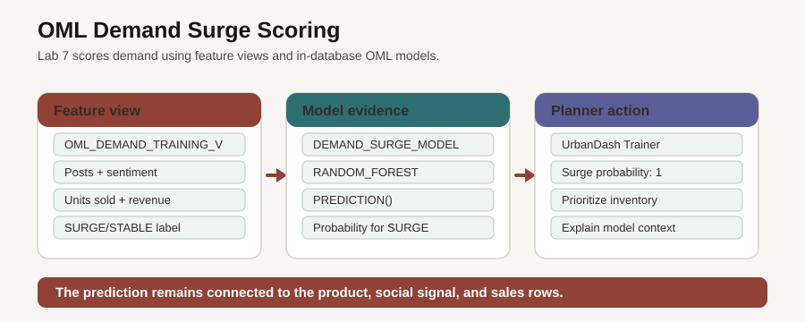
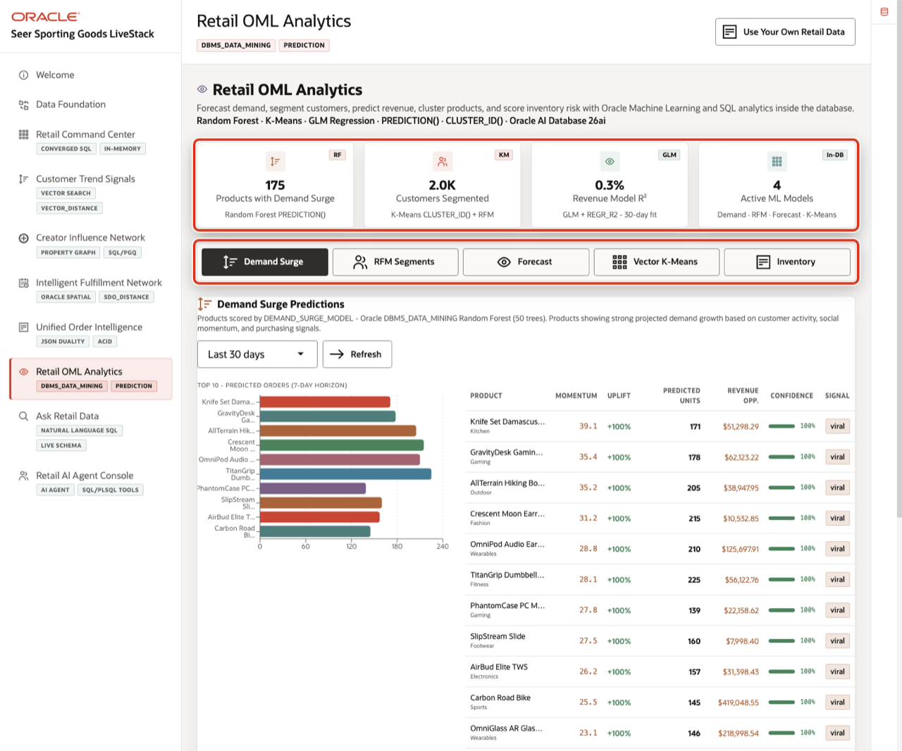

# Retail OML Analytics

## Introduction

After you review demand, influence, and fulfillment evidence, the final step is prioritization. Predictive analytics become useful when model output stays connected to operational data. In this lab, you inspect **Oracle Machine Learning** models, review the feature view behind demand scoring, and run an in-database prediction query that planners can compare with product, signal, and sales context.

### Objectives

- Inspect OML models in the schema.
- Review the demand feature view used for scoring.
- Score product rows with `DEMAND_SURGE_MODEL`.

Estimated Time: **10 minutes**

### Business Scenario

| Step | Retail focus |
| --- | --- |
| Business Problem | Planners need to prioritize products before demand pressure becomes operational pressure. |
| Technical Challenge | Model scores are hard to trust when they are separated from the rows that explain them. |
| Persona Focus | A merchandising planner wants model output with the product evidence beside it. |
| Database Capability | Oracle Machine Learning stores models and scores rows with SQL. |
| Outcome | Predictions can be inspected, joined, and acted on in the same database. |

<details>
<summary><strong>Key terms: Oracle Machine Learning</strong></summary>

> - **Feature view**: A repeatable SQL shape that packages model inputs, such as posts, sentiment, sales, and revenue.
> - **Prediction**: The predicted label or value that the model returns for a row. In this lab the label is `SURGE`.
> - **Probability**: A model confidence value for a class label; it is not a guarantee.

</details>



*Figure 1: OML scores demand rows where the product and signal evidence already lives.*

## Task 1: Inspect the model inventory

Start on the Retail OML Analytics page so the model inventory connects to the demand-prioritization view learners are about to inspect:

1. Review the Retail OML Analytics page.

    

    *Figure 2: The analytics page summarizes model-backed demand and product intelligence. The SQL below inspects the models directly.*

2. Run the model inventory query.

    > **SQL Worksheet reminder:** Need a reminder on how to open and use the SQL Worksheet? Return to [Getting Started Task 2: Open SQL Worksheet](https://oracle-livelabs.github.io/database/livestack-workshop-retail/workshops/tenancy/index.html?lab=getting-started#Task2:OpenSQLWorksheet) for the step-by-step graphic showing where to paste and run SQL statements.

    `USER_MINING_MODELS` lists the in-database models available to the workshop schema. The retail schema includes four OML models, and this lab focuses on `DEMAND_SURGE_MODEL` for demand-prioritization scoring. `ORDER BY model_name` makes the inventory easy to compare with the expected output.

    ```sql
    <copy>
    SELECT model_name AS "Model",
           mining_function AS "Function",
           algorithm AS "Algorithm"
    FROM user_mining_models
    WHERE model_name IN (
      'DEMAND_SURGE_MODEL','CUSTOMER_SEGMENT_MODEL',
      'REVENUE_PREDICT_MODEL','PRODUCT_CLUSTER_MODEL'
    )
    ORDER BY model_name;
    </copy>
    ```

    **Expected output: Model Inventory**

    | Model | Function | Algorithm |
    | --- | --- | --- |
    | CUSTOMER\_SEGMENT\_MODEL | CLUSTERING | KMEANS |
    | DEMAND\_SURGE\_MODEL | CLASSIFICATION | RANDOM\_FOREST |
    | PRODUCT\_CLUSTER\_MODEL | CLUSTERING | KMEANS |
    | REVENUE\_PREDICT\_MODEL | REGRESSION | GENERALIZED\_LINEAR\_MODEL |

**Note:** Sample values may change after data refreshes or rebuilds. Focus on the expected result pattern and the business takeaway, not the exact values.

## Task 2: Review demand model features

Now review the demand feature view so learners can see the product, signal, sales, and label inputs behind model scoring:

1. Run the feature-view query.

    The feature view packages product category, posts, sentiment, sales, revenue, and training label into a repeatable SQL shape. That repeatability matters because scoring should use the same input meaning every time.

    The query joins the feature view to `PRODUCTS` so you see product names instead of only product IDs. The selected columns are the model inputs and label that make the demand row explainable.

    ```sql
    <copy>
    SELECT p.product_name AS "Product",
           d.category AS "Category",
           d.total_posts AS "Posts",
           ROUND(d.avg_sentiment, 3) AS "Avg Sentiment",
           d.units_sold AS "Units Sold",
           ROUND(d.revenue, 2) AS "Revenue",
           d.surge_label AS "Label"
    FROM oml_demand_training_v d
    JOIN products p
      ON p.product_id = d.product_id
    ORDER BY d.total_posts DESC
    FETCH FIRST 5 ROWS ONLY;
    </copy>
    ```

    **Expected output: Feature Rows**

    | Product | Category | Posts | Avg Sentiment | Units Sold | Revenue | Label |
    | --- | --- | ---: | ---: | ---: | ---: | --- |
    | Locker Room Organizer Set | Outdoor Lifestyle | 33 | 0.528 | 92 | 3955.08 | SURGE |
    | Trailhead Gear Clock | Outdoor Lifestyle | 32 | 0.6 | 121 | 4233.79 | SURGE |
    | BlueShield Training Glasses | Sport Eyewear | 30 | 0.446 | 112 | 10078.88 | SURGE |
    | PracticeStream Capture Card | Training Tech | 28 | 0.58 | 101 | 20198.99 | SURGE |
    | Expedition Power Bank | Sports Tech | 27 | 0.567 | 95 | 17099.05 | SURGE |

**Note:** Sample values may change after data refreshes or rebuilds. Focus on the expected result pattern and the business takeaway, not the exact values.

## Task 3: Score demand surge rows

Next, score demand surge rows so planners can compare predicted labels, confidence, posts, and units sold in one reviewable result:

1. Run the prediction query.

    `PREDICTION` returns the predicted label. `PREDICTION_PROBABILITY` returns the model probability for the `SURGE` label. Read probability as model confidence, not certainty.

    Read the scoring query in three parts:

    1. `OML_DEMAND_TRAINING_V` supplies the same feature columns used to train and score demand rows.
    2. `PREDICTION(demand_surge_model USING *)` scores each row with the in-database model.
    3. The selected columns keep the actual label, predicted label, probability, posts, and units sold together so you can compare model output with business context.

    ```sql
    <copy>
    SELECT p.product_name AS "Product",
           d.category AS "Category",
           d.surge_label AS "Actual Label",
           PREDICTION(demand_surge_model USING *) AS "Predicted Label",
           ROUND(PREDICTION_PROBABILITY(demand_surge_model, 'SURGE' USING *), 4) AS "Surge Probability",
           d.total_posts AS "Posts",
           d.units_sold AS "Units Sold"
    FROM oml_demand_training_v d
    JOIN products p
      ON p.product_id = d.product_id
    ORDER BY "Surge Probability" DESC,
             p.product_name
    FETCH FIRST 5 ROWS ONLY;
    </copy>
    ```

    **Expected output: Demand Scoring**

    | Product | Category | Actual Label | Predicted Label | Surge Probability | Posts | Units Sold |
    | --- | --- | --- | --- | ---: | ---: | ---: |
    | 4-Season Tent 3P | Outdoor | SURGE | SURGE | 1 | 17 | 106 |
    | Adaptogen Recovery Powder | Recovery | SURGE | SURGE | 1 | 21 | 104 |
    | AirGlide Runner | Footwear | SURGE | SURGE | 1 | 23 | 89 |
    | AllTerrain Hiking Boots | Outdoor | SURGE | SURGE | 1 | 25 | 103 |
    | Camp Chef Knife Set | Camp Cooking | SURGE | SURGE | 1 | 20 | 85 |

    **Note:** Model probabilities can change when the workshop rebuilds the random-forest model. The product-name tie-breaker keeps rows with equal probabilities in a consistent order. The order committed in Lab 3 raises `StormRunner Trail Shell` from 102 to 104 units sold; if that product appears in your result, 104 is the expected current-run value.

2. The model result is useful because it stays connected to product, signal, and sales context. A planner can inspect why a row was scored and decide what operational follow-up makes sense.

3. 🎯 **Interactive challenge: surface model disagreements.**

    Starting with the scoring query above, add a `WHERE` clause after the product join that keeps rows where `d.surge_label` differs from `PREDICTION(demand_surge_model USING *)`. Run your revised query. Which disagreement would you review first, and what product, signal, sales, or inventory context is still missing?

    **Hint:** Start with the `SELECT` and `JOIN` from the scoring query above. A disagreement query generally selects the business columns and model result, filters to rows where two values differ, then sorts the results. In generic form, the pattern is:

    ```sql
    SELECT business_columns,
           actual_label,
           PREDICTION(model_name USING *) AS predicted_label,
           prediction_score
    FROM source_view
    JOIN related_table
      ON matching_key = matching_key
    WHERE actual_label <> PREDICTION(model_name USING *)
    ORDER BY prediction_score DESC
    FETCH FIRST 5 ROWS ONLY;
    ```

    <details>
    <summary><strong>Challenge answer: disagreement creates a review queue</strong></summary>

    **Expected output: Demand Prediction Disagreements**

    Every returned row has a different actual and predicted label. The specific products and probabilities can change when the model is rebuilt, so focus on the disagreement pattern and the evidence needed for review.

    > Start with the first returned disagreement as a review candidate, then inspect its feature values and current operating context before drawing a conclusion. The probability measures model support for the requested class; it is not business severity or certainty. Oracle Machine Learning keeps the prediction beside the governed feature, product, signal, sales, and inventory data needed for human review.

    If you need the runnable solution, use this query:

    ```sql
    <copy>
    SELECT p.product_name AS "Product",
           d.category AS "Category",
           d.surge_label AS "Actual Label",
           PREDICTION(demand_surge_model USING *) AS "Predicted Label",
           ROUND(PREDICTION_PROBABILITY(demand_surge_model, 'SURGE' USING *), 4) AS "Surge Probability",
           d.total_posts AS "Posts",
           d.units_sold AS "Units Sold"
    FROM oml_demand_training_v d
    JOIN products p
      ON p.product_id = d.product_id
    WHERE d.surge_label <> PREDICTION(demand_surge_model USING *)
    ORDER BY "Surge Probability" DESC,
             p.product_name
    FETCH FIRST 5 ROWS ONLY;
    </copy>
    ```

    </details>

    This completes the retail decision path: you started with the data foundation, moved through operating evidence and customer signals, checked relationships and fulfillment options, then used model output to prioritize action.

## Next Steps

Congratulations on completing the Oracle Machine Learning lab. You inspected models, generated model scores, and used demand predictions with product, signal, and sales context to prioritize follow-up. For a deeper hands-on workshop focused on Oracle Machine Learning, open the [Oracle Machine Learning LiveLabs workshop](https://livelabs.oracle.com/ords/r/dbpm/livelabs/view-workshop?clear=RR,180&wid=922).

## Acknowledgements

* **Author** - Pat Shepherd, Senior Principal Database Product Manager
* **Last Updated By/Date** - Oracle Database Product Management, July 2026
