# Trace Public-Service Partner Handoffs with Property Graph

## Introduction

Bob Green is a seasoned graph specialist on Jessica Chan's State and Local Government team. When Jessica needs to understand how public-service partners connect around resident services, Bob recommends a property graph.

Bob's starting point is simple: partner handoffs often hide in separate rows, not in one partner record. One organization may not reveal the full response network, but a chain of handoffs can connect a public-service program to partners that support residents.

In this lab, you will use SQL/PGQ to find direct connections, trace two-hop paths, and identify partners linked to the same public-service program. Then you will explore those relationships in Graph Studio. SQL provides repeatable coordination evidence; Graph Studio provides the interactive map.

Graph Studio shows programs, partners, and handoff paths as an interactive network backed by the same governed data. Use SQL/PGQ for precise results, then Graph Studio to explore and explain them.

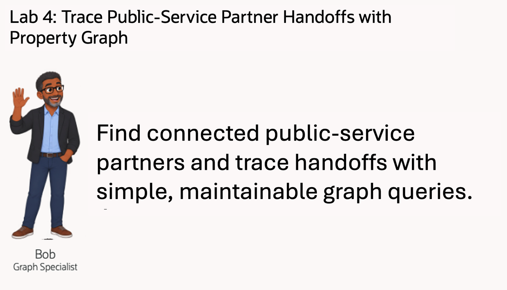

<details>
<summary><strong>Key terms: property graph, vertex, edge, and SQL Property Graph Queries (SQL/PGQ)</strong></summary>

> - A **property graph** represents things and how they are connected. In this lab, things include public programs, community partners, and their handoffs. A graph makes coordination patterns easier to see than they are in a flat table.
>
> - A **vertex** is a graph node that represents a program or partner. In this graph, vertices use the labels and properties defined by the workshop graph, such as a partner name or program name.
>
> - An **edge** is a connection between a public program and a community partner, or between partners that hand off service coordination. The edge carries the handoff type and strength used in the review.
>
> - A **hop** is one step across an edge from one vertex to another. Colorado Benefits Network to a partner is one hop. Following that partner to another partner is two hops. The hop count shows how far coordination travels from the starting partner; it does not describe physical distance or elapsed time.
>
> - **SQL Property Graph Queries (SQL/PGQ)** let you describe graph patterns in SQL, such as "start with this partner and follow handoffs." That lets public-service teams ask relationship questions without moving coordination data into a separate graph-only database.

</details>

### Objectives

- Identify vertices and edges in a property graph.
- Follow connections from a public-service partner.
- Find partner pairs that share a public-service program.
- Open Graph Studio from Database Actions.
- Import and run the State and Local Government partner-network notebook.
- Explain the result in terms a business user can act on.

Estimated Time: **10 minutes**

### Hands-on Scenario

| Step                | State and local government focus                                                                                  |
| ---------------------| ------------------------------------------------------------------------------------------------------------------|
| Business Problem    | Public-service response may require several organizations and handoffs.                                           |
| Technical Challenge | Bob needs to trace partner connections and handoffs without maintaining long chains of relational joins.           |
| Persona Focus       | Jessica keeps the partner relationships queryable, and Bob uses the graph to review coordination paths.            |
| What You Will See   | A property graph shows the partners connected to Benefits Eligibility and the handoffs between them.              |
| Database Capability | INFLUENCER\_NETWORK and GRAPH\_TABLE support SQL/PGQ relationship queries.                                         |
| Outcome             | Jessica and Bob can identify relevant partners and explain how coordination can continue through an intermediary. |

Persona focus: You join Jessica and Bob as they replace an unstructured organization list with queryable coordination paths.

> **SQL Worksheet reminder:** Need a reminder on how to open and use the SQL Worksheet? Return to [Getting Started Task 2: Open SQL Worksheet](?lab=getting-started#Task2:OpenSQLWorksheet) for the step-by-step graphic showing where to paste and run SQL statements.

## Task 1: Find partners connected to Colorado Benefits Network

Jessica's first question is direct: which public-service partners are connected to **Colorado Benefits Network**? Start with ordinary relational SQL so you can see how much join logic is needed before using a property graph.

1. Run Jessica's ordinary SQL query:

    ```sql
    <copy>
    SELECT source.display_name AS starting_partner,
           connected.display_name AS connected_partner,
           handoff.connection_type AS handoff_type,
           handoff.strength AS coordination_strength
    FROM influencers source
    JOIN influencer_connections handoff
      ON handoff.from_influencer = source.influencer_id
    JOIN influencers connected
      ON connected.influencer_id = handoff.to_influencer
    WHERE source.handle = '@co-benefits'
    ORDER BY coordination_strength DESC, connected_partner;
    </copy>
    ```

    The query joins the starting partner to the handoff table, then joins the connected partner. The result gives Jessica and Bob a direct view of the response network, but every relationship step must be spelled out with a separate join.

    **Expected output: Direct Colorado Benefits Network Connections**

    The result names the organization that starts the handoff, the organization that receives it, and the recorded coordination strength.

    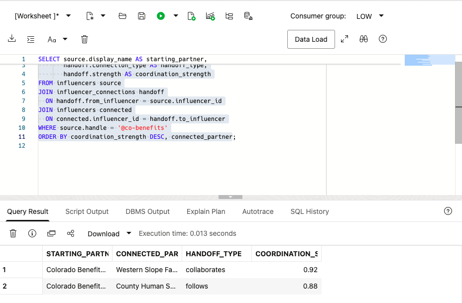

2. Extend Jessica's query to follow one through four handoffs without using a graph query:

    ```sql
    <copy>
    SELECT starting_partner,
           reached_partner,
           handoff_path,
           path_hops,
           weakest_handoff_strength
    FROM (
      SELECT source.display_name AS starting_partner,
             reached.display_name AS reached_partner,
             c1.connection_type AS handoff_path,
             1 AS path_hops,
             c1.strength AS weakest_handoff_strength
      FROM influencers source
      JOIN influencer_connections c1
        ON c1.from_influencer = source.influencer_id
      JOIN influencers reached
        ON reached.influencer_id = c1.to_influencer
      WHERE source.handle = '@co-benefits'

      UNION ALL

      SELECT source.display_name,
             reached.display_name,
             c1.connection_type || ' -> ' || c2.connection_type,
             2,
             LEAST(c1.strength, c2.strength)
      FROM influencers source
      JOIN influencer_connections c1
        ON c1.from_influencer = source.influencer_id
      JOIN influencers middle1
        ON middle1.influencer_id = c1.to_influencer
      JOIN influencer_connections c2
        ON c2.from_influencer = middle1.influencer_id
      JOIN influencers reached
        ON reached.influencer_id = c2.to_influencer
      WHERE source.handle = '@co-benefits'

      UNION ALL

      SELECT source.display_name,
             reached.display_name,
             c1.connection_type || ' -> ' ||
               c2.connection_type || ' -> ' ||
               c3.connection_type,
             3,
             LEAST(c1.strength, c2.strength, c3.strength)
      FROM influencers source
      JOIN influencer_connections c1
        ON c1.from_influencer = source.influencer_id
      JOIN influencers middle1
        ON middle1.influencer_id = c1.to_influencer
      JOIN influencer_connections c2
        ON c2.from_influencer = middle1.influencer_id
      JOIN influencers middle2
        ON middle2.influencer_id = c2.to_influencer
      JOIN influencer_connections c3
        ON c3.from_influencer = middle2.influencer_id
      JOIN influencers reached
        ON reached.influencer_id = c3.to_influencer
      WHERE source.handle = '@co-benefits'

      UNION ALL

      SELECT source.display_name,
             reached.display_name,
             c1.connection_type || ' -> ' ||
               c2.connection_type || ' -> ' ||
               c3.connection_type || ' -> ' ||
               c4.connection_type,
             4,
             LEAST(c1.strength, c2.strength, c3.strength, c4.strength)
      FROM influencers source
      JOIN influencer_connections c1
        ON c1.from_influencer = source.influencer_id
      JOIN influencers middle1
        ON middle1.influencer_id = c1.to_influencer
      JOIN influencer_connections c2
        ON c2.from_influencer = middle1.influencer_id
      JOIN influencers middle2
        ON middle2.influencer_id = c2.to_influencer
      JOIN influencer_connections c3
        ON c3.from_influencer = middle2.influencer_id
      JOIN influencers middle3
        ON middle3.influencer_id = c3.to_influencer
      JOIN influencer_connections c4
        ON c4.from_influencer = middle3.influencer_id
      JOIN influencers reached
        ON reached.influencer_id = c4.to_influencer
      WHERE source.handle = '@co-benefits'
    ) paths
    ORDER BY path_hops, weakest_handoff_strength DESC, reached_partner;
    </copy>
    ```

    Jessica now needs four separate query branches. The first branch follows one handoff, the second follows two, the third follows three, and the fourth follows four. Each additional hop adds another `INFLUENCER_CONNECTIONS` join and another `INFLUENCERS` join. `UNION ALL` combines the four path lengths, while the path expression and weakest-strength calculation must also be extended for every new hop.

    **Expected output: One-to-Four-Hop Coordination Paths**

    The result returns the partner paths that exist in the current data, with the hop count and weakest handoff strength shown for each path. The long relational query makes the graph query's compact path pattern easier to appreciate.

    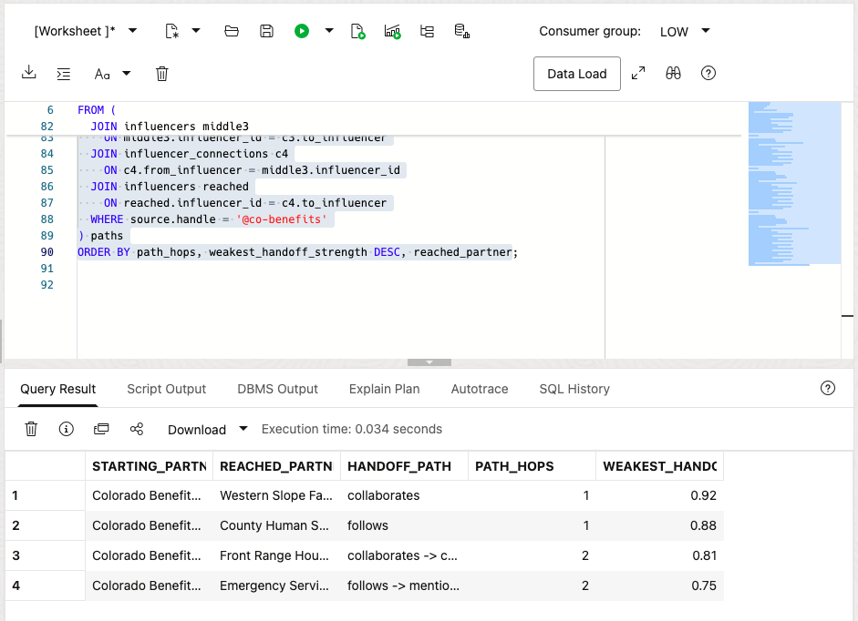

3. Review how the SQL grows more complex without a graph query.

    The relationships already exist in relational tables, but ordinary SQL makes Jessica repeat the same join pattern for every possible path length. Bob's graph approach is designed to express those paths directly.

## Task 2: Read the same partner connections as a graph

Bob has already created the `INFLUENCER_NETWORK` property graph for this lab. You do not need to create it before running the query. The graph definition uses the existing relational tables as its source; it does not create a second copy of the partner data.

In graph terms, the public program and partner organizations are **vertices**. The rows in `BRAND_INFLUENCER_LINKS` and `INFLUENCER_CONNECTIONS` become typed **edges**. `GRAPH_TABLE` lets Bob describe the program-to-partner and partner-to-partner paths directly while Oracle keeps the source data in the database.

1. Run the same business question with SQL/PGQ:

    Inside `GRAPH_TABLE`, the `MATCH` clause describes the direct handoff from Colorado Benefits Network to a connected partner. The `COLUMNS` clause returns graph properties as a normal SQL result.

    ```sql
    <copy>
    SELECT starting_partner,
           connected_partner,
           handoff_type,
           coordination_strength
    FROM GRAPH_TABLE (
      influencer_network
      MATCH (source IS influencer)
            -[handoff IS connects_to]->
            (partner IS influencer)
      WHERE source.handle = '@co-benefits'
      COLUMNS (
        source.display_name AS starting_partner,
        partner.display_name AS connected_partner,
        handoff.connection_type AS handoff_type,
        handoff.strength AS coordination_strength
      )
    )
    ORDER BY coordination_strength DESC, connected_partner;
    </copy>
    ```

    **Expected output: Direct Colorado Benefits Network Connections**

    The result has the same business meaning as Jessica's ordinary SQL query. The difference is how Bob describes the relationship: start at one partner, follow one `connects_to` edge, and return the connected partner.

    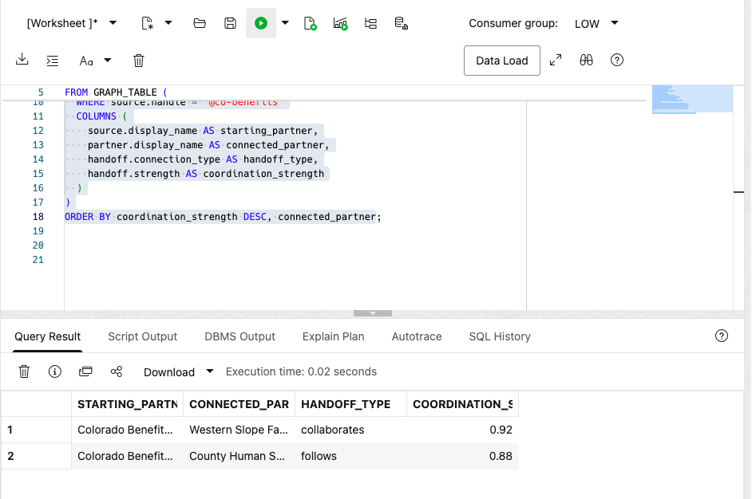

2. Filter the graph query to stronger coordination paths.

    Add `AND handoff.strength >= 0.90` to the `WHERE` clause and run the revised query. This keeps only the strongest direct handoff from Colorado Benefits Network in the result.

    ```sql
    <copy>
    SELECT starting_partner,
           connected_partner,
           handoff_type,
           coordination_strength
    FROM GRAPH_TABLE (
      influencer_network
      MATCH (source IS influencer)
            -[handoff IS connects_to]->
            (partner IS influencer)
      WHERE source.handle = '@co-benefits'
        AND handoff.strength >= 0.90
      COLUMNS (
        source.display_name AS starting_partner,
        partner.display_name AS connected_partner,
        handoff.connection_type AS handoff_type,
        handoff.strength AS coordination_strength
      )
    )
    ORDER BY coordination_strength DESC, connected_partner;
    </copy>
    ```

    **Expected output: Strongest Colorado Benefits Network Connection**

    One path should remain: Colorado Benefits Network to Western Slope Family Resource Alliance at `0.92`. The `0.88` path to County Human Services Collaborative should no longer appear.

    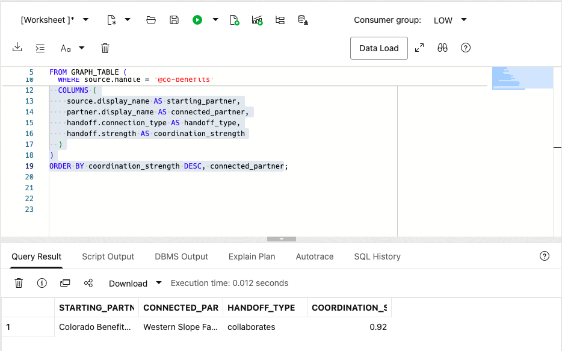

## Task 3: Trace two-hop coordination paths

Direct partner connections may not reveal the full response network. Trace a handoff through an intermediary and inspect the starting partner, intermediary, destination, and handoff types. The result gives Jessica and Bob a concrete coordination path to discuss, not an automatic referral decision.

1. Run the two-hop coordination query.

    The `MATCH` pattern names each step explicitly: the starting partner connects to an intermediary, and the intermediary connects to the destination partner. This is easier to review than a long chain of self-joins and makes the handoff path clear in the output.

    ```sql
    <copy>
    SELECT source_partner,
           first_handoff,
           intermediary_partner,
           second_handoff,
           destination_partner
    FROM GRAPH_TABLE (
      influencer_network
      MATCH (source IS influencer)
            -[first_edge IS connects_to]->
            (middle IS influencer)
            -[second_edge IS connects_to]->
            (destination IS influencer)
      WHERE source.handle = '@co-benefits'
      COLUMNS (
        source.display_name AS source_partner,
        first_edge.connection_type AS first_handoff,
        middle.display_name AS intermediary_partner,
        second_edge.connection_type AS second_handoff,
        destination.display_name AS destination_partner
      )
    )
    ORDER BY destination_partner;
    </copy>
    ```

    **Expected output: Two-Hop Coordination Paths**

    The result names the starting partner, the intermediary, the destination partner, and both handoff types. Jessica and Bob can use the intermediary and destination to focus a coordination conversation.

    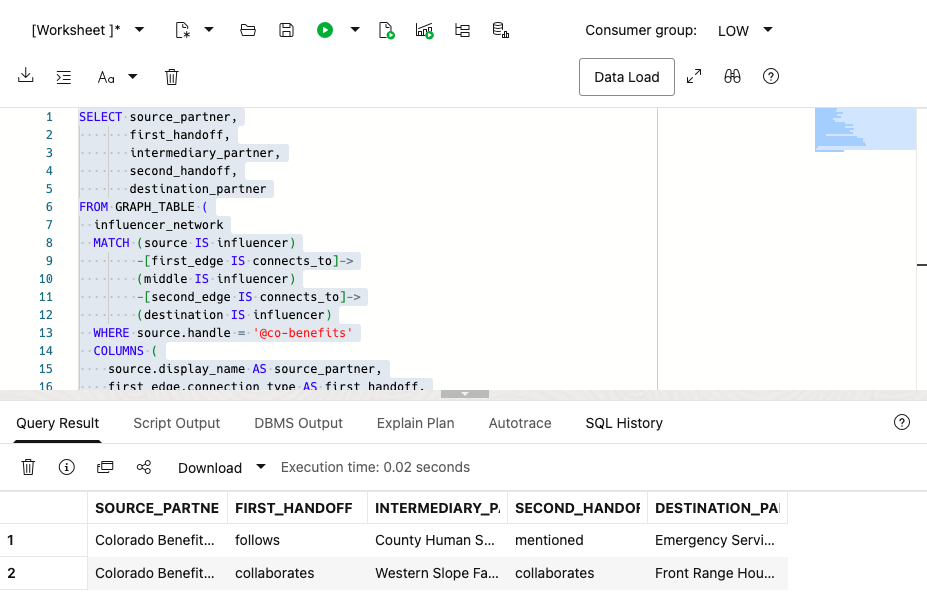

2. Use the path to support a coordination decision.

    A two-hop result does not authorize a referral. It identifies the organization that links Colorado Benefits Network to a broader response network. Jessica and Bob can use that path for a targeted conversation rather than a blanket outreach campaign.

## Task 4: Find partner pairs connected to the same public-service program

Bob now moves from one handoff path to a broader coordination question: **which partner pairs are connected to the same public-service program?** This relationship can reveal organizations that may need to align their outreach or coordinate a response.

1. Run Bob's shared-program query:

    ```sql
    <copy>
    SELECT partner_a,
           public_program,
           partner_b,
           partner_a_relationship,
           partner_b_relationship
    FROM GRAPH_TABLE (
      influencer_network
      MATCH (a IS influencer)
            -[e1 IS promotes]->
            (program IS brand)
            <-[e2 IS promotes]-
            (b IS influencer)
      WHERE a.influencer_id < b.influencer_id
      COLUMNS (
        a.display_name AS partner_a,
        program.brand_name AS public_program,
        b.display_name AS partner_b,
        e1.relationship_type AS partner_a_relationship,
        e2.relationship_type AS partner_b_relationship
      )
    )
    ORDER BY public_program, partner_a, partner_b;
    </copy>
    ```

    The pattern starts at partner `a`, follows a `promotes` edge to a public program, and follows another `promotes` edge back to partner `b`. The two partners therefore share a program connection. `a.influencer_id < b.influencer_id` keeps the result from returning the same pair twice in reverse order.

    **Expected output: Partners Sharing a Public-Service Program**

    The result shows the two partners, the public program they both promote, and the relationship type recorded for each partner. A shared program connection identifies a coordination opportunity, but it does not prove that the partners have an operating agreement or that a resident should be referred automatically.

    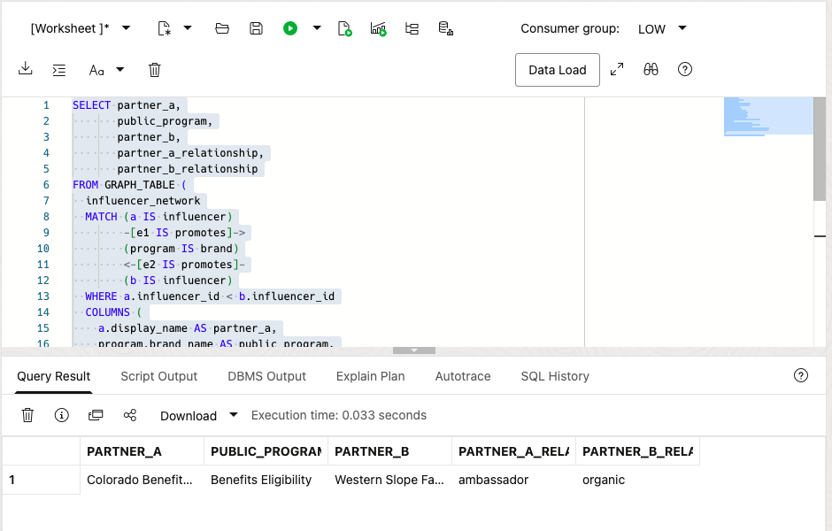

## Task 5: Open Graph Studio

The SQL/PGQ tasks returned repeatable rows. Now open Graph Studio to explore the same `INFLUENCER_NETWORK` relationships as an interactive map. SQL gives a precise result set, while Graph Studio makes the program, partner, and handoff paths easier to explore and explain.

1. From Database Actions, open **Development** > **Graph Studio**.

    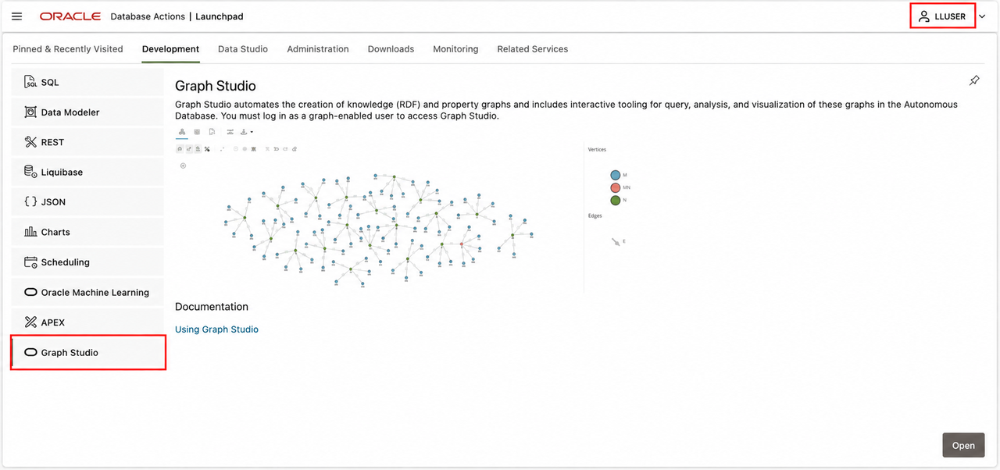

2. Confirm that the upper-right corner shows `LLUSER`. On the Graph Studio home page, locate **Graphs**, **Notebooks**, **Templates**, and **Jobs** in the left navigation.

    Graph Studio is the visual workspace for property graphs. Use SQL/PGQ when you need a precise, repeatable result set. Use Graph Studio to see connected paths and explain the relationship map to another reviewer.

## Task 6: Download and import the State and Local Government notebook

The supplied `.dsnb` file is a Graph Studio notebook with explanations, runnable graph paragraphs, and visualizations. It gives every learner the same documented State and Local Government graph.

1. Download [state-local-government-community-partner-graph.dsnb](files/state-local-government-community-partner-graph.dsnb).

    If the notebook opens in your browser instead of downloading, right-click the link and select **Save Link As**.

2. In Graph Studio, select **Notebooks** in the left navigation.

    

3. Select **Import** in the upper-right corner. Browse to the downloaded `state-local-government-community-partner-graph.dsnb` file, select it, and choose **Import**.

    

    

4. When the import completes, open **State and Local Government / Community Partner Network**.

    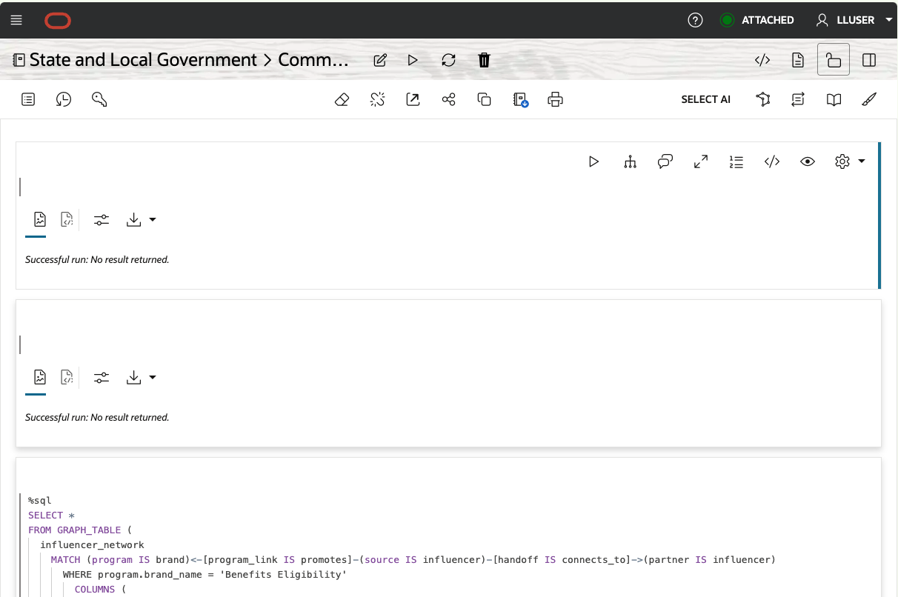

## Task 7: Run and interpret the Graph Studio notebook

The notebook uses the same `INFLUENCER_NETWORK` graph as the SQL exercises, but draws the connections as an interactive coordination map. A `brand` vertex represents a public-service program, and an `influencer` vertex represents a community partner. The visual result supports a coordination conversation; it does not authorize a referral.

1. Read the notebook introduction and **Visual exercise 1: direct partner handoffs**, then run the SQL paragraph below it with its play button. This exercise expands Task 4's shared-program query by starting at **Benefits Eligibility**, following a `promotes` relationship to a source partner, and then following a `connects_to` handoff to a connected partner. The `WHERE` clause anchors the search on one program, and `COLUMNS` supplies the vertex and edge identifiers that Graph Studio draws.

    **Expected result: Direct partner graph**

    The graph shows Benefits Eligibility, its starting community partners, and the `promotes` and `connects_to` relationships that join them. Look for the path from the program through the source partner to the connected partners. A graph layout can vary, but the same program, partners, and relationships should remain available.

    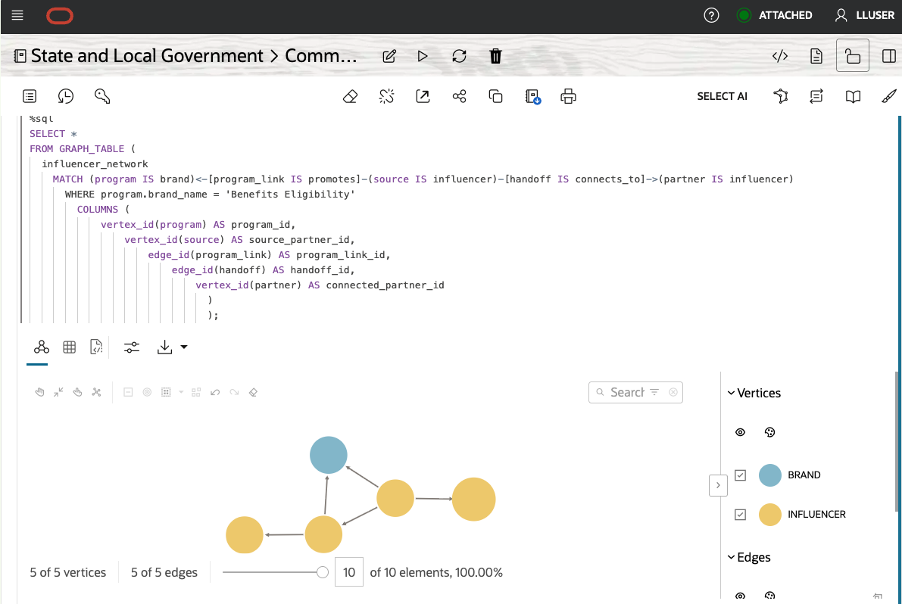

2. Continue to **Visual exercise 2: two-hop coordination path** and run its graph paragraph. It starts with **Colorado Benefits Network** (`@co-benefits`), follows two `connects_to` edges, and names the three roles in the path: `source`, `middle` (the intermediary), and `destination` (the partner reached through the second handoff). The `WHERE` clause focuses the query on one known partner, while `COLUMNS` returns both handoff identifiers for the visualization.

    **Expected result: Two-hop coordination graph**

    The graph shows the partner vertices and recorded `connects_to` edges. Use the intermediary and destination to focus a human coordination review, not as an automatic referral or eligibility decision.

    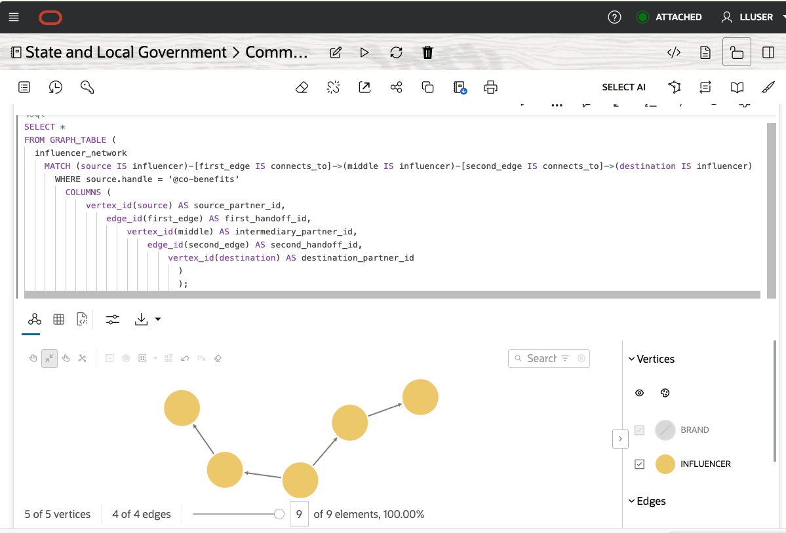

3. If Graph Studio first displays a table, select the **Graph** result tab. Select a vertex or edge to inspect its available properties, then compare the visual paths with the SQL results from Tasks 2, 3, and 4.

> **Generated result note:** Graph layouts and node positions can vary between runs. The graph entities, relationship types, and query results are the stable points to compare.

## Conclusion: Make Partner Relationships Easy to Review

Bob's graph queries show why a property graph fits public-service coordination. Bob can start with Colorado Benefits Network, follow direct and two-hop handoffs, and find partner pairs connected to the same public-service program. The queries stay readable as the network grows, while the results retain the relationship details Jessica needs for review.

The same relationships are shown visually in Graph Studio. The graphical interface turns programs, partners, and handoffs into an interactive network. Bob can compare the notebook results with the SQL Worksheet results from Tasks 2, 3, and 4. SQL provides the repeatable coordination evidence, while Graph Studio makes the same relationships easier to explore and explain.

## Acknowledgements

* **Author** - Pat Shepherd
* **Last Updated By/Date** - Pat Shepherd, September 2026
