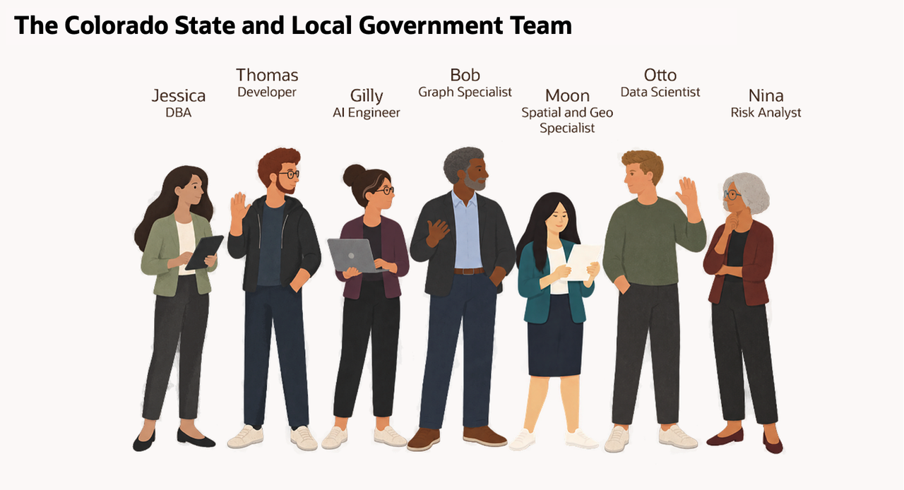

# Build Connected State and Local Government Solutions with Oracle AI Database

## Introduction

Jessica Chan is the database administrator for Colorado State and Local Government. Her teams are building new resident-service applications, improving service-request reviews, coordinating community response work, and adding AI to public-service dashboards.

The requests look different, but they share one problem. The data is already in Oracle AI Database, and each team wants to use it in a different way:

- Thomas needs service requests as JSON for a resident-service application.
- Gilly needs semantic search that can find public services and resident signals by meaning, not only by matching words.
- Bob needs to follow relationships between public programs, community partners, and other entities to coordinate a response.
- Moon needs to calculate distances between residents, service access centers, and demand regions.
- Otto needs to train and score a service-demand model.
- Nina needs to ask public-service questions in plain language and turn the answers into a useful review.

Jessica's job is to help each team meet its requirement without creating a new data copy or a separate security model for every feature. She uses Oracle AI Database as the shared foundation: relational tables remain the source for public-service and residential-customer records, while JSON, vectors, graphs, spatial data, machine learning, and AI services work with those same records.

This workshop follows Jessica and her colleagues as they address these challenges and help Colorado improve services for residential customers. Each lab focuses on one business requirement, but the database remains the common thread. You will see how the teams use different data types and database capabilities together, and how Jessica keeps access, SQL, and results visible.

### What the team builds

| Team member                   | Requirement                                                     | What you will see                                                                                                                          |
| -------------------------------| -----------------------------------------------------------------| --------------------------------------------------------------------------------------------------------------------------------------------|
| Jessica, DBA                  | Build the query behind a public-service operations dashboard.                  | One SQL result combines relational service data, semantic resident-signal matching, JSON service-request data, and location data.                  |
| Thomas, application developer | Give the application flexible service-request documents.                       | JSON columns, JSON collections, and JSON Relational Duality Views provide different ways to serve application data.                              |
| Gilly, AI engineer            | Find public services and resident signals related to a service question.        | Gilly creates vectors where the public-service and resident-signal data already lives, using an in-database embedding model.                    |
| Bob, graph specialist         | Find connected public programs and community partners in a service investigation. | A property graph uses the existing relational data to show coordination paths that become difficult to manage with repeated SQL joins.             |
| Moon, spatial expert          | Measure service access using resident, center, and region locations.             | The database calculates distance from geographic data that the application can also display.                                                  |
| Otto, data scientist          | Identify services that may face a demand surge.                                 | Oracle Machine Learning trains and scores a model inside the database, close to the service and request data.                                  |
| Nina, service-operations analyst | Ask public-service questions without writing every query from scratch.       | Select AI generates SQL that Nina can inspect, run, and refine. Select AI Agent adds a restricted tool and records the agent activity.          |

The point is not to use every capability in every query. The point is that Jessica does not have to move the data into a separate database whenever a requirement changes. The same connected residential-customer and public-service records can support:

- An application payload.
- A vector search.
- A graph investigation.
- A spatial calculation.
- A model score.
- A natural-language question.

<strong>Learn more: What does "converged database" mean?</strong>

> A converged database supports different data types and workloads on one database foundation. In this workshop, that includes relational rows, JSON documents, vectors, graphs, geographic data, machine learning models, and AI-assisted SQL.
>
> The advantage is practical. Teams can use the data in the form their application or analysis needs while keeping the records, privileges, and SQL access connected. They do not need to copy public-service data into a document store, vector service, graph database, mapping system, or separate scoring service for each requirement.

### Objectives

- Follow Jessica and her team as they solve different State and Local Government application and analysis requirements.
- Use relational SQL, JSON, vectors, graphs, spatial data, Oracle Machine Learning, Select AI, and Select AI Agent in practical tasks.
- See how one Oracle AI Database can support different data types without separate copies of the public-service records.
- Understand how database privileges, restricted AI profiles, approved tools, and execution history keep AI-assisted work visible and controlled.
- Connect the database work to the State and Local Government LiveStack demo.

Estimated Workshop Time: **90 minutes**

## Acknowledgements

* **Author** - Pat Shepherd
* **Last Updated By/Date** - Pat Shepherd, September 2026
