# Build a Public-Service Demand Watchlist with Oracle Machine Learning

## Introduction

Otto Spencer is the Data Scientist on Jessica Chan's State and Local Government team. His models help the team anticipate demand before it puts pressure on public-service capacity.

Jessica needs a demand watchlist. An operations user should be able to see which public services may need more capacity, what the model used, and which service-request signals support the result.

Otto has service-request, resident-signal, and service-activity data in Oracle AI Database. He could copy the data to a separate machine learning platform, train a model there, and copy the scores back. That would create another copy of public-service data and another process for keeping scores current.

Instead, Otto builds and scores the model in the database. The model uses service activity to classify services as `SURGE` or `STABLE`. SQL then joins the prediction to the service name and activity values that an operations review needs.

In this lab, you build Otto's demand-surge model and turn its output into a public-service review list.

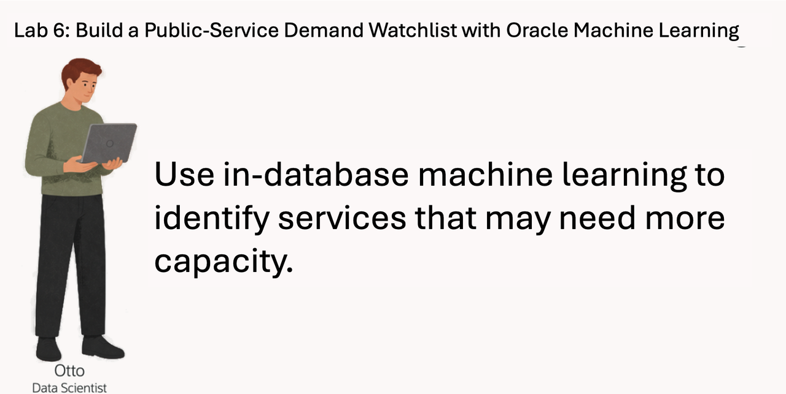

<details>
<summary><strong>Key terms: model, feature, classification, probability, and in-database machine learning</strong></summary>

> - A **model** is a set of learned rules that turns input data into a prediction.
>
> - A **feature** is an input value used by the model. In this lab, features include service category, request activity, public-attention measures, and resident-signal volume.
>
> - **Classification** predicts a label. Otto's model predicts either `SURGE` or `STABLE`.
>
> - A **probability** is the model's value for a class. In this lab, the value is displayed as a `DEMAND_SCORE` to rank services for review. It is not a guarantee.
>
> - **In-database machine learning** means the model is trained or scored where the source data already lives. The SQL result can include the prediction and the data used to explain it.

</details>


### Objectives

- Read the prepared public-service training data and identify the model target.
- Optionally use AutoML to compare classification models and inspect their predictions.
- Create the selected Support Vector Machine with a linear kernel inside Oracle AI Database.
- Score public services with `PREDICTION` and `PREDICTION_PROBABILITY`.
- Combine model output with service and request activity for an operations review.

Estimated Time: **25 minutes**

### Hands-on Scenario

| Step                | State and Local Government focus                                                                                         |
| --------------------| -------------------------------------------------------------------------------------------------------------------------|
| Business Problem    | Jessica needs a short list of public services that may require capacity review.                                          |
| Technical Challenge | Otto needs to train and score a model without copying public-service activity to another machine learning system.        |
| Persona Focus       | You follow Otto as he builds the model and checks the result before Jessica uses it for planning.                        |
| What You Will See   | Compare candidate models with AutoML, then use SQL Developer Web to create and score the selected model.                  |
| Database Capability | AutoML, `DBMS_DATA_MINING`, `PREDICTION`, and `PREDICTION_PROBABILITY` support machine learning inside the database.     |
| Outcome             | A demand watchlist combines model results with the service and operating data behind them.                               |

> **SQL Worksheet reminder:** Need a reminder on how to open and use the SQL Worksheet? Return to [Getting Started Task 2: Open SQL Worksheet](?lab=getting-started#Task2:OpenSQLWorksheet) for the step-by-step graphic showing where to paste and run SQL statements.

## Task 1: Read the training data

Before Otto creates a model, he checks the data that will teach it. The workshop provides `OML_DEMAND_TRAINING_V`, a view that combines public-service activity into one row per service and includes the known demand label.

1. Confirm the active public-service OML models:

    ```sql
    <copy>
    SELECT model_name,
           mining_function,
           algorithm
    FROM user_mining_models
    WHERE model_name IN (
      'SLED_SERVICE_DEMAND_MODEL',
      'SLED_RESIDENT_NEED_SEGMENT_MODEL',
      'SLED_SERVICE_VALUE_MODEL',
      'SLED_CASE_SIGNAL_CLUSTER_MODEL'
    )
    ORDER BY model_name;
    </copy>
    ```

    The catalog shows the persisted models available to the public-service workflow. The classification model predicts demand state, the regression model estimates service-request value, and the clustering models support segmentation. The next tasks focus on demand classification.

    **Expected output: Active Public-Service OML Models**

    

2. Run the training-data query:

    ```sql
    <copy>
    SELECT product_id,
           category AS service_category,
           unit_price AS service_unit_value,
           avg_virality AS public_attention_score,
           total_views AS resident_signal_views,
           units_requested,
           surge_flag
    FROM oml_demand_training_v
    ORDER BY product_id
    FETCH FIRST 10 ROWS ONLY;
    </copy>
    ```

3. Identify the parts of each row.

    The view keeps the model inputs in one row per public service. `CATEGORY` identifies the service category, `UNIT_PRICE` is the per-unit service value, `AVG_VIRALITY` and `TOTAL_VIEWS` represent public attention and resident-signal volume, and `UNITS_REQUESTED` represents request activity. `SURGE_FLAG` is the known demand state the model learns to predict. `PRODUCT_ID` remains the stable product and service identifier used by the source data model.

    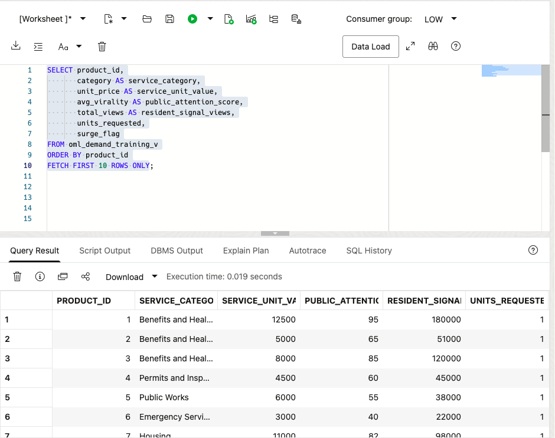

    Otto is checking that the training data already brings together the values he needs. He does not have to export service activity, resident signals, and request data into separate files before training.

## Task 2: Compare models with AutoML (optional)

Otto uses the Oracle Machine Learning AutoML interface to compare candidate models for the `SURGE` and `STABLE` demand labels. AutoML selects algorithms, tunes them, and shows how each candidate handles the public-service planning question.

This task is optional. AutoML can take several minutes to complete, so you can continue with Task 3 if you want to focus on creating and using the selected model in SQL Developer Web.

1. Open the AutoML workspace.

    From the Autonomous Database landing page, select **Database Actions**, then **View all database actions**. Under **Development**, select **Machine Learning**.

    

    Sign in with your workshop database credentials if prompted. On the OML home page, select **AutoML**.

    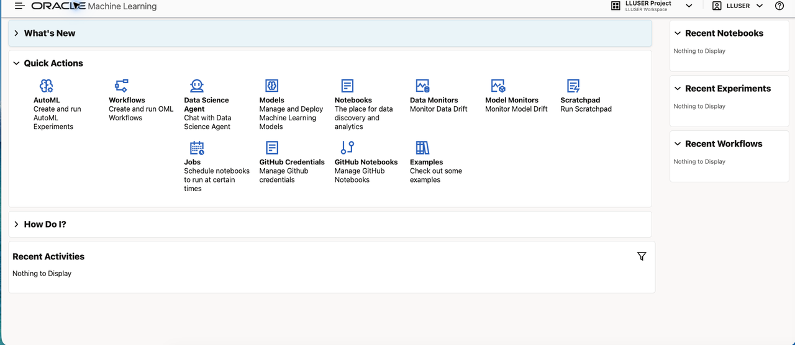

    On the **AutoML Experiments** page, select **Create**.

    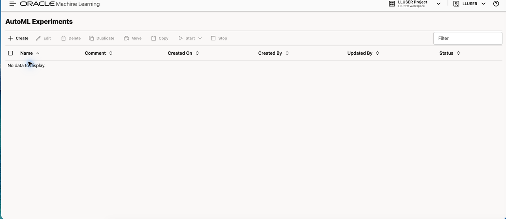

2. Create a State and Local Government demand-surge experiment.

    Use the following settings. Add your initials to the experiment name so it is easy to find in the experiment list.

    | Setting | Value |
    | --- | --- |
    | Name | `STATE_LOCAL_GOV_DEMAND_SURGE_AUTOML_<YOUR_INITIALS>` |
    | Data Source | Schema: `LLUSER`; View: `OML_DEMAND_TRAINING_V` |
    | Predict | `SURGE_FLAG` |
    | Prediction Type | `Classification` |
    | Case ID | `PRODUCT_ID` |

    `SURGE_FLAG` is the public-service demand label used in Task 1. `PRODUCT_ID` is the stable inherited service identifier used for the experiment's case ID.

    

    When choosing the data source, select the `LLUSER` schema and then `OML_DEMAND_TRAINING_V`.

    

3. Set a short comparison run and review the results.

    Expand **Additional Settings**. Set **Maximum Top Models** to `2`, set **Database Service Level** to **Low**, and keep **Balanced Accuracy** as the model metric. Open the arrow beside **Start**, then choose **Faster Results**.

    

    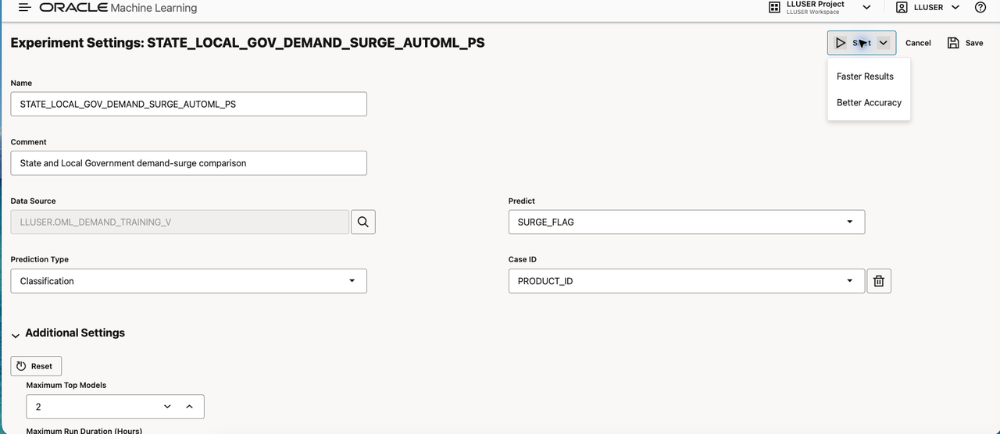

    Wait for the run to complete. The progress panel shows initialization, algorithm selection, adaptive sampling, feature selection, and model tuning.

    

4. Interpret the result for public-service planning.

    Wait for the status to show **Completed**. The leaderboard shows up to two ranked candidate models, and the **Features** grid shows relative feature importance. The winning algorithm, score, and importance ranking can change with the run, so use the result to guide review rather than as a fixed score target.

    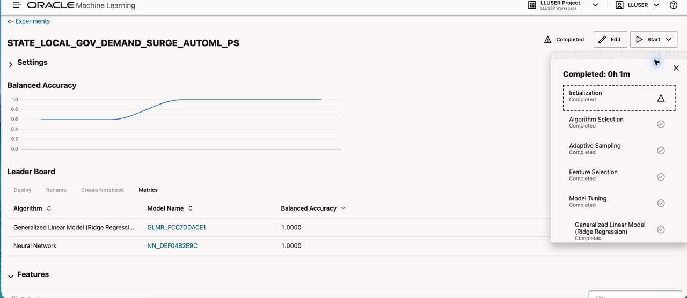

    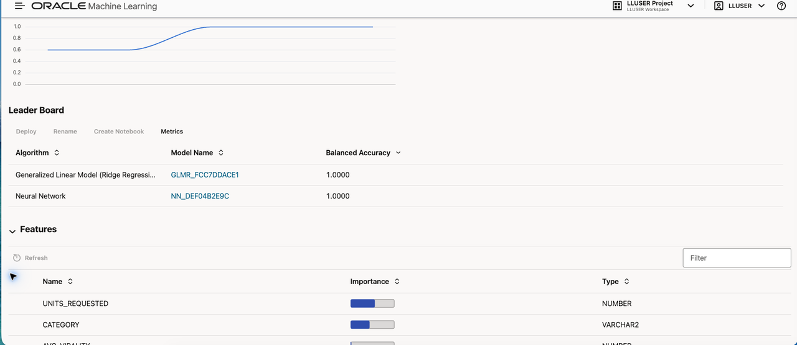

    Review the top-ranked candidate and feature list with Jessica. Feature importance indicates how the candidate used the supplied inputs; it does not prove that any input caused demand pressure. Before a candidate supports a real public-service decision, teams should evaluate it on newer, unseen data, assess error rates and drift, and agree on human review and accountability.

## Task 3: Create the selected model in SQL Developer Web

AutoML helped Otto compare models. The experiment selected **Support Vector Machine (Linear)**. Otto now moves to SQL Developer Web to create a stable named model that a SQL query can call repeatedly. The model is stored in Oracle AI Database under the name `OTTO_DEMAND_SURGE_MODEL`.

The AutoML experiment does not create the settings table used by the SQL API. This step creates `OTTO_DEMAND_SETTINGS` and records the selected algorithm and linear kernel for `DBMS_DATA_MINING.CREATE_MODEL`. `PREP_AUTO` lets the database handle standard preparation of the input columns.

If you skipped the optional AutoML task, use the Support Vector Machine with the linear kernel as the selected model for the workshop.

1. Create the settings table and train the model:

    ```sql
    <copy>
    
    DROP TABLE IF EXISTS otto_demand_settings;
    
    CREATE TABLE otto_demand_settings (
          setting_name  VARCHAR2(30),
          setting_value VARCHAR2(4000)
        );

    INSERT INTO otto_demand_settings (setting_name, setting_value)
    VALUES ('ALGO_NAME', 'ALGO_SUPPORT_VECTOR_MACHINES');

    INSERT INTO otto_demand_settings (setting_name, setting_value)
    VALUES ('SVMS_KERNEL_FUNCTION', 'SVMS_LINEAR');

    INSERT INTO otto_demand_settings (setting_name, setting_value)
    VALUES ('PREP_AUTO', 'ON');

    INSERT INTO otto_demand_settings (setting_name, setting_value)
    VALUES ('ODMS_RANDOM_SEED', '20260604');

    COMMIT;

    DECLARE
      l_model_count NUMBER;
    BEGIN
      SELECT COUNT(*)
      INTO l_model_count
      FROM user_mining_models
      WHERE model_name = 'OTTO_DEMAND_SURGE_MODEL';

      IF l_model_count > 0 THEN
        DBMS_DATA_MINING.DROP_MODEL('OTTO_DEMAND_SURGE_MODEL');
      END IF;
    END;
    /

    BEGIN
      DBMS_DATA_MINING.CREATE_MODEL(
        model_name           => 'OTTO_DEMAND_SURGE_MODEL',
        mining_function      => DBMS_DATA_MINING.CLASSIFICATION,
        data_table_name      => 'OML_DEMAND_TRAINING_V',
        case_id_column_name  => 'PRODUCT_ID',
        target_column_name   => 'SURGE_FLAG',
        settings_table_name  => 'OTTO_DEMAND_SETTINGS'
      );
    END;
    /
    </copy>
    ```

    The model reads the training view, learns the relationship between the features and `SURGE_FLAG`, and stores the trained model in the database. No public-service activity leaves Oracle Database during training.

2. Confirm that Oracle created the model:

    ```sql
    <copy>
    SELECT model_name,
           mining_function,
           algorithm
    FROM user_mining_models
    WHERE model_name = 'OTTO_DEMAND_SURGE_MODEL';
    </copy>
    ```

    The result should show `CLASSIFICATION` and `SUPPORT_VECTOR_MACHINES`. Otto now has a database model that SQL can call.

    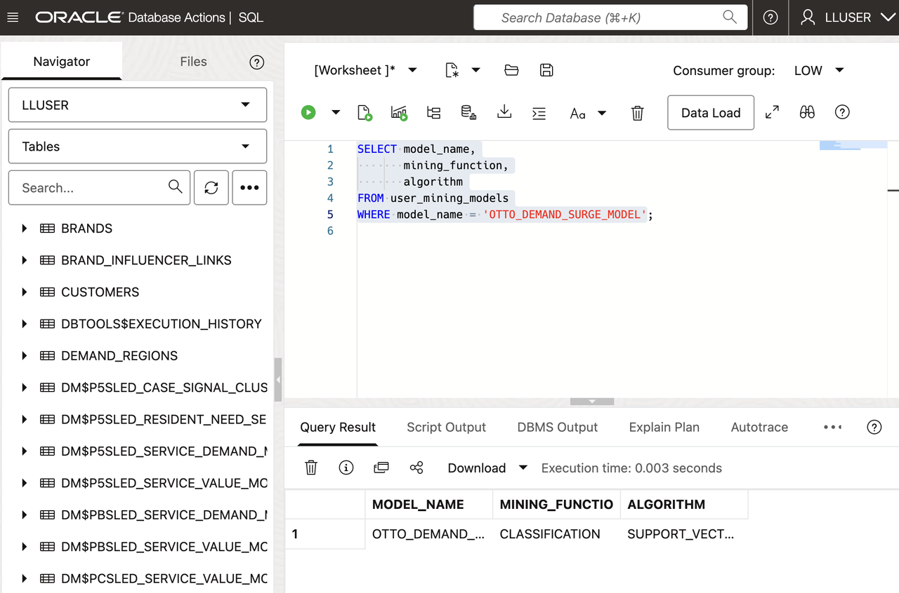

3. Confirm the selected algorithm settings:

    ```sql
    <copy>
    SELECT setting_name,
           setting_value
    FROM user_mining_model_settings
    WHERE model_name = 'OTTO_DEMAND_SURGE_MODEL'
    ORDER BY setting_name;
    </copy>
    ```

    Confirm that the model uses `ALGO_SUPPORT_VECTOR_MACHINES`, `SVMS_LINEAR`, and `PREP_AUTO`.

    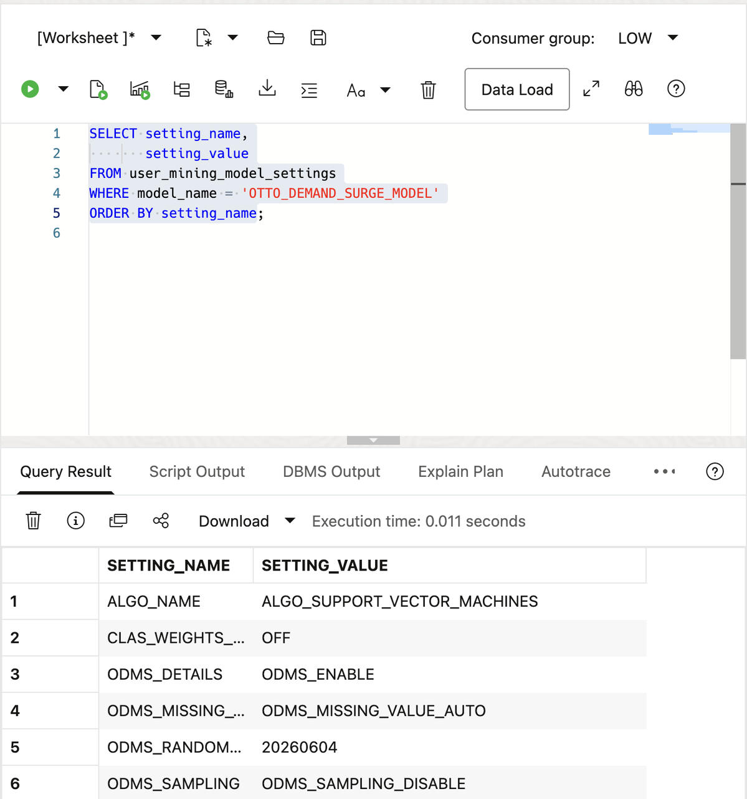

## Task 4: Score new public-service activity in SQL

Otto now receives a new public-service activity snapshot for the next reporting period. He stores it in a separate scoring table. The model was trained with historical rows from `OML_DEMAND_TRAINING_V`; it will now score rows it did not see during training.

1. Create the scoring table and add the new activity snapshot:

    ```sql
    <copy>
    
    DROP TABLE IF EXISTS otto_service_demand_scoring_data;

    CREATE TABLE otto_service_demand_scoring_data (
      product_id    NUMBER,
      category      VARCHAR2(100),
      unit_price    NUMBER,
      avg_virality  NUMBER,
      total_views   NUMBER,
      units_requested NUMBER
    );

    INSERT INTO otto_service_demand_scoring_data (
      product_id,
      category,
      unit_price,
      avg_virality,
      total_views,
      units_requested
    )
    SELECT product_id,
           category,
           unit_price,
           avg_virality + 0.05,
           total_views + 500,
           units_requested + 3
    FROM (
      SELECT product_id,
             category,
             unit_price,
             total_views,
             avg_virality,
             units_requested,
             ROW_NUMBER() OVER (ORDER BY product_id) AS row_num
      FROM oml_demand_training_v
    )
    WHERE row_num <= 12;

    COMMIT;
    </copy>
    ```

    This creates a small next-period snapshot from the workshop data.
    >Note: The table has the model inputs, but it does not contain `SURGE_FLAG`. That label belongs to the historical training data and must not be passed to the model as an input.

2. Run the scoring query:

    ```sql
    <copy>
    WITH scored_services AS (
      SELECT product_id,
             category,
             units_requested,
             total_views,
             avg_virality,
             PREDICTION(
               OTTO_DEMAND_SURGE_MODEL USING *
             ) AS predicted_demand_state,
             ROUND(
               PREDICTION_PROBABILITY(
                 OTTO_DEMAND_SURGE_MODEL,
                 'SURGE' USING *
               ), 8
             ) AS demand_score
      FROM otto_service_demand_scoring_data
    )
    SELECT services.service_id,
           services.service_name,
           services.service_category,
           ss.predicted_demand_state,
           ss.demand_score,
           ROUND(ss.demand_score * 100, 2) AS demand_score_pct,
           ss.units_requested,
           ss.total_views,
           ss.avg_virality
    FROM scored_services ss
    JOIN sled_public_services_v services
      ON services.service_id = ss.product_id
    ORDER BY ss.demand_score DESC,
             services.service_id;
    </copy>
    ```

3. Read the result as an operations user.

    `PREDICTED_DEMAND_STATE` tells the operations view which label the model selected. `DEMAND_SCORE` is the model value between 0 and 1, while `DEMAND_SCORE_PCT` presents the same value as a percentage for review. The service activity columns give Jessica something to examine alongside the prediction.

    The result keeps the prediction, public-service name, request activity, and demand signals together. Otto does not need to move public-service data to an external machine learning platform.

    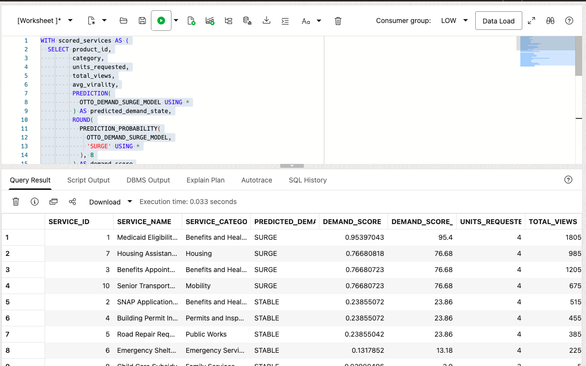

4. Compare service-request value.

    Demand state is one planning input. The prepared service-request view adds a second model result so Jessica can compare the relative scale of requests beside the demand watchlist.

    ```sql
    <copy>
    SELECT order_id AS service_request_id,
           customer_tier,
           service_count,
           target_commitment_value,
           ROUND(PREDICTION(
             SLED_SERVICE_VALUE_MODEL USING *
           ), 2) AS predicted_service_value
    FROM oml_commitment_value_training_v
    ORDER BY order_id;
    </copy>
    ```

    **Expected output: Service-Request Value Scores**

    The result gives Jessica a numeric service-request estimate beside the known target value. It supports comparison and review; it does not determine funding, eligibility, or a resident outcome.

    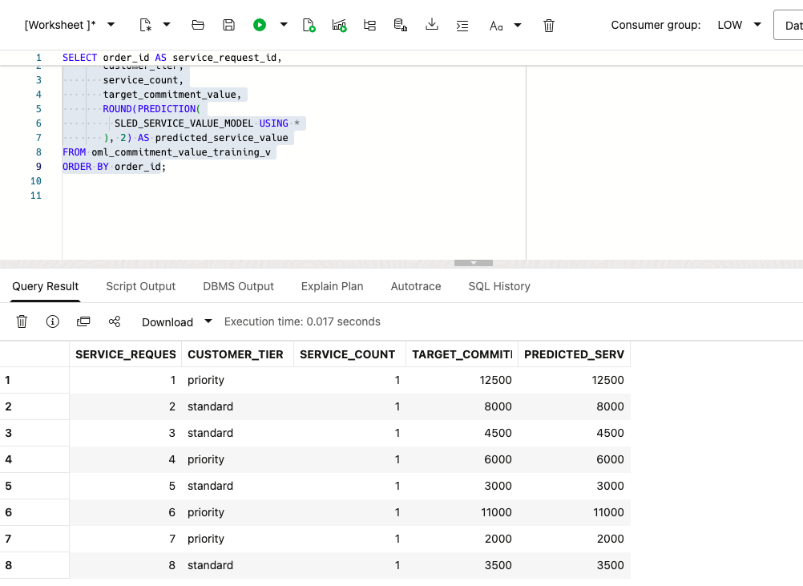

5. Check model agreement.

    Compare the known demand labels with the labels returned by the same SQL scoring path. Matching labels confirm the training exercise's scoring path; they are not a production accuracy measure.

    ```sql
    <copy>
    SELECT known_label,
           predicted_label,
           COUNT(*) AS service_count
    FROM (
      SELECT surge_flag AS known_label,
             PREDICTION(
               OTTO_DEMAND_SURGE_MODEL USING *
             ) AS predicted_label
      FROM oml_demand_training_v
    )
    GROUP BY known_label, predicted_label
    ORDER BY known_label, predicted_label;
    </copy>
    ```

    **Expected output: Demand Model Agreement**

    Agreement on the compact training rows confirms the SQL scoring path. A production review would also test newer unseen data, error rates, fairness, drift, and whether the features remain appropriate for the public-service decision.

    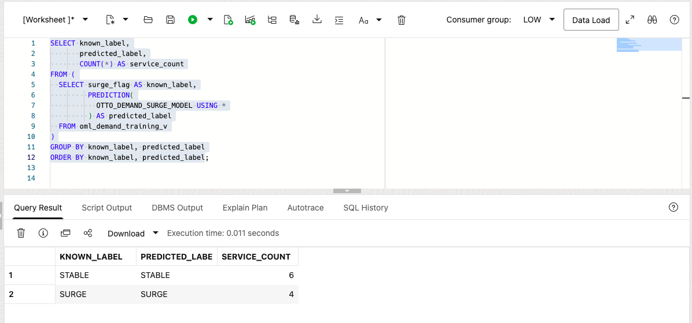

## Conclusion: Put the Prediction Beside the Business Data

Otto used AutoML to compare models, selected a Support Vector Machine with a linear kernel, recreated it in SQL Developer Web, and scored a new public-service activity snapshot. The query returns a watchlist that an operations view can show alongside the service activity behind each score.

The operational benefit is that the model, training data, prediction, and service details stay together. Otto does not have to copy governed public-service data to a separate machine learning platform, and the operations view does not have to combine scores from one system with service data from another.

Oracle AI Database makes the model part of the operations query. An operations user can read the watchlist, inspect the supporting values, and repeat the query using the same access controls that protect the source data.

## Acknowledgements

* **Author** - Pat Shepherd
* **Last Updated By/Date** - Pat Shepherd, September 2026
