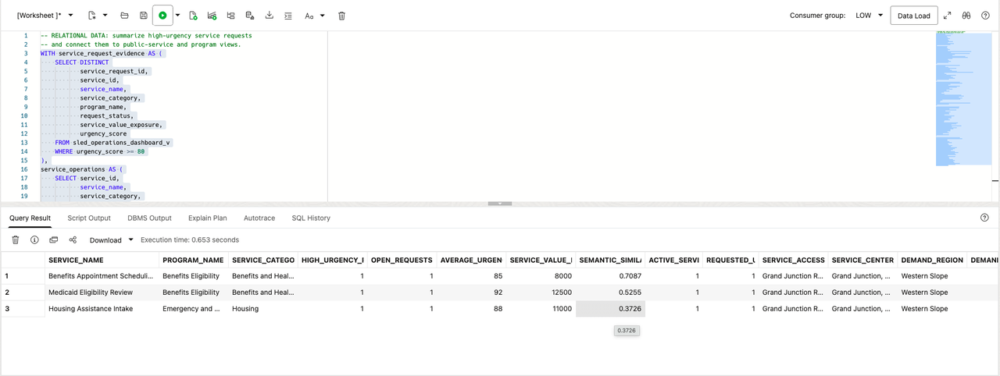
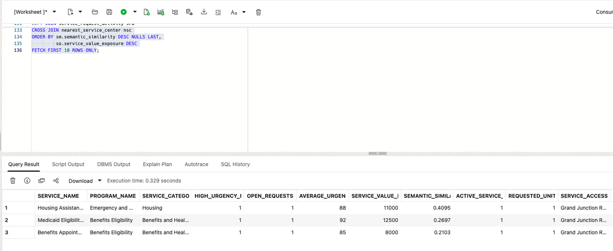

# Build a Converged Dashboard Query

## Introduction

Jessica Chan is the database administrator responsible for keeping Colorado's State and Local Government service data reliable and useful. Every morning, the public-service operations team asks her a familiar question: **which service needs attention first, and can Colorado respond if that pressure becomes operational work?**

Jessica can see an early warning in the Public Service Command Center, but the supporting data is available in different forms. Residential-customer service requests and operating measures are relational rows. Public-service descriptions and residential-customer concerns can be compared by meaning with vectors. Service-request activity is available as JSON documents, and location information for service access centers and demand regions is stored as spatial data. Although these records are connected by business meaning, they were fragmented across different databases and data types in the environment, making it difficult for Jessica to query the full investigation in one place.

In the past, Jessica might have had to maintain reporting extracts, coordinate a search index, ask an application team for service-request data, and reconcile a separate map or service-capacity system. That creates more copies of public-service data, more security boundaries, and more opportunities for the dashboard answer and the operational detail to disagree. Her challenge is not simply finding another database feature. It is giving the operations team one answer they can trace back to the same governed data.

Jessica sees an opportunity in Oracle AI Database's converged architecture. A converged database lets one governed database support different data models and workloads together. Relational tables and views remain the foundation, while JSON documents, vectors, spatial geometry, graphs, machine-learning, and graph results can be queried alongside them. This means Jessica can answer a question that crosses those data types without complex and expensive integration across separate systems.

In this lab, you take Jessica's role as the DBA. You will write the converged SQL query behind Jessica's new Public Service Command Center. It combines relational service data, vector search, JSON service-request data, and spatial service data in one Oracle AI Database, without separate systems or data copies.


### Objectives

- Explain what Oracle AI Database convergence means in a public-service operations workflow.
- Run one query that combines relational, vector, JSON, and spatial database capabilities.
- Modify the query to review a different service question and explain the change in results.

Estimated Time: **10 minutes**

### Hands-on Scenario

| Step                | State and Local Government focus                                                                        |
| ------------------- | ------------------------------------------------------------------------------------------------------- |
| Business Problem    | Public-service teams need a quick way to find service pressure, residential-customer activity, and access context. |
| Technical Challenge | The answer crosses service-request records, public-service meaning, JSON documents, and service geography. |
| Persona Focus       | Jessica Chan, the DBA, builds the query that gives public-service teams this command-center view.       |
| What You Will Do    | Use a single SQL statement that combines several data types.                                            |
| Database Capability | Relational SQL, AI Vector Search, JSON Relational Duality, and Oracle Spatial work together.            |
| Outcome             | The learner can explain convergence through a useful public-service result rather than a feature list.  |

**Persona focus:** You are Jessica Chan, the DBA. Your job is to build one governed query that gives public-service teams a connected view of service pressure, residential-customer requests, and service access.

> **SQL Worksheet reminder:** Need a reminder on how to open and use the SQL Worksheet? Return to [Getting Started Task 2: Open SQL Worksheet](?lab=getting-started#Task2:OpenSQLWorksheet) for the step-by-step guide showing how to run SQL statements.

## Task 1: Run a converged service review

The Public Service Command Center is a starting point for the decision, not the decision itself. Run the query below to produce a compact review view for high-urgency public services.

The query intentionally crosses four data models:

- **Relational:** `SLED_OPERATIONS_DASHBOARD_V` identifies high-urgency service requests and calculates service pressure, open requests, urgency, and service-value exposure.
- **Vector:** `PRODUCT_EMBEDDINGS`, `VECTOR_DISTANCE`, and `VECTOR_EMBEDDING` rank public services by meaning against the phrase `benefits eligibility appointment backlog`.
- **JSON:** `ORDERS_DV` is read as a service-request document, and `JSON_TABLE` projects nested service lines so active service requests and requested units can be counted.
- **Spatial:** `SDO_GEOM.SDO_DISTANCE` finds the service access center closest to the Western Slope demand region using `FULFILLMENT_CENTERS.LOCATION` and `DEMAND_REGIONS.BOUNDARY` spatial geometry.

    These are four operations in one review. Every row combines service pressure with request activity, semantic relevance, and service-access context.

1. Open SQL Worksheet as `LLUSER`. 

2. Run the query (note the comments that help to locate the specific use of different data types):

    ```sql
    <copy>
    -- RELATIONAL DATA: summarize high-urgency service requests
    -- and connect them to public-service and program views.
    WITH service_request_evidence AS (
        SELECT DISTINCT
               service_request_id,
               service_id,
               service_name,
               service_category,
               program_name,
               request_status,
               service_value_exposure,
               urgency_score
        FROM sled_operations_dashboard_v
        WHERE urgency_score >= 80
    ),
    service_operations AS (
        SELECT service_id,
               service_name,
               service_category,
               program_name,
               COUNT(DISTINCT service_request_id) AS high_urgency_requests,
               COUNT(DISTINCT CASE
                   WHEN request_status NOT IN ('completed', 'cancelled')
                   THEN service_request_id
               END) AS open_requests,
               ROUND(AVG(urgency_score), 1) AS average_urgency,
               SUM(service_value_exposure) AS service_value_exposure
        FROM service_request_evidence
        GROUP BY service_id,
                 service_name,
                 service_category,
                 program_name
    ),

    -- VECTOR DATA: rank public services by meaning.
    semantic_match AS (
        SELECT ps.service_id,
               MAX(ROUND(1 - VECTOR_DISTANCE(
                   pe.embedding,
                   VECTOR_EMBEDDING(
                       ADMIN.ALL_MINILM_L12_V2
                       USING 'benefits eligibility appointment backlog' AS DATA
                   ),
                   COSINE
               ), 4)) AS semantic_similarity
        FROM product_embeddings pe
        JOIN sled_public_services_v ps
          ON ps.service_id = pe.product_id
        GROUP BY ps.service_id
    ),

    -- JSON DATA: read service-request documents and
    -- project nested service lines into relational rows.
    service_request_activity AS (
        SELECT jt.service_id,
               COUNT(DISTINCT jt.service_request_id)
                   AS active_service_requests,
               SUM(jt.quantity)
                   AS requested_units
        FROM orders_dv od
        CROSS APPLY JSON_TABLE(
            od.data,
            '$'
            COLUMNS (
                service_request_id NUMBER PATH '$._id',
                request_status VARCHAR2(30) PATH '$.status',
                NESTED PATH '$.items[*]' COLUMNS (
                    service_id NUMBER PATH '$.productId',
                    quantity NUMBER PATH '$.quantity'
                )
            )
        ) jt
        WHERE jt.request_status IN ('pending', 'confirmed', 'processing')
        GROUP BY jt.service_id
    ),

    -- SPATIAL DATA: find the service access center
    -- nearest to the Western Slope demand region.
    nearest_service_center AS (
        SELECT sc.service_access_center_name,
               sc.city,
               sc.state_province,
               dr.region_name,
               dr.demand_index,
               ROUND(
                   SDO_GEOM.SDO_DISTANCE(
                       fc.location,
                       dr.boundary,
                       0.005,
                       'unit=KM'
                   ),
                   2
               ) AS distance_to_demand_region_km
        FROM sled_service_access_centers_v sc
        JOIN fulfillment_centers fc
          ON fc.center_id = sc.service_access_center_id
        CROSS JOIN demand_regions dr
        WHERE dr.region_name = 'Western Slope'
        ORDER BY SDO_GEOM.SDO_DISTANCE(
                     fc.location,
                     dr.boundary,
                     0.005,
                     'unit=KM'
                 )
        FETCH FIRST 1 ROW ONLY
    )

    -- CONVERGED RESULT: combine relational, vector,
    -- JSON, and spatial evidence into one review result.
    SELECT so.service_name,
           so.program_name,
           so.service_category,
           so.high_urgency_requests,
           so.open_requests,
           so.average_urgency,
           so.service_value_exposure,
           sm.semantic_similarity,
           NVL(sra.active_service_requests, 0)
               AS active_service_requests,
           NVL(sra.requested_units, 0)
               AS requested_units,
           nsc.service_access_center_name,
           nsc.city || ', ' || nsc.state_province
               AS service_center_location,
           nsc.region_name AS demand_region,
           nsc.demand_index,
           nsc.distance_to_demand_region_km
    FROM service_operations so
    LEFT JOIN semantic_match sm
      ON sm.service_id = so.service_id
    LEFT JOIN service_request_activity sra
      ON sra.service_id = so.service_id
    CROSS JOIN nearest_service_center nsc
    ORDER BY sm.semantic_similarity DESC NULLS LAST,
             so.service_value_exposure DESC
    FETCH FIRST 10 ROWS ONLY;
    </copy>
    ```

3. Review the result as the service-level data behind Jessica's Public Service Command Center. Each row combines high-urgency service requests, semantic service matching, JSON request activity, and service-access context. This gives the command center a ranked public-service review table and the details Jessica and the public-service team need when deciding what to examine.

    

    Your numbers may be different if the demo data has changed. Each row should include all four types of data.

Use the first row to read the public-service result: urgency, open requests, and service value show why the service deserves attention; semantic similarity shows its fit for the review question; JSON activity shows current request volume; and service-access location shows where planning can begin. Jessica now has a query behind the command center's ranked service table, combining relational service data, vector search, JSON request activity, and spatial distance for the public-service team to inspect.

With separate systems, Jessica would need complex and expensive integration across an operations database, search service, document store, and mapping system before the command center could show this view. Oracle AI Database keeps these data types together, so she can build the command center with SQL. KPI cards and other command-center components can use additional SQL over the same database.

## Task 2: Change the review question

Jessica meets with a risk analyst to review the results at the data level before she builds the dashboard. They start with services related to **benefits eligibility appointment backlog**. Change the embedded review phrase to:


```text
emergency shelter intake coordination
```




Run the query again and compare the top rows.

1. Which products moved into or out of the top ten?
2. Which products still have high relational exposure but a lower semantic similarity to the new question?
3. Does the service-request activity make you more or less concerned about the operational impact?

The result is ordered by semantic similarity first, so changing the question changes the review queue. Exposure breaks ties and keeps larger business impact near the top. The same governed query can answer a different business question without rebuilding a search index or moving the product data.


## Next Steps

Next, use JSON Relational Duality to expose the same service-request data as JSON for an application while keeping SQL access for the database team.

## Acknowledgements

* **Author** - Pat Shepherd
* **Last Updated By/Date** - Pat Shepherd, September 2026
